# VANA Agent Architecture - Current State

## System Overview

The VANA system uses a pure delegation pattern to work around ADK's limitation where "Tool use with function calling is unsupported". The orchestrator uses ONLY AgentTools for delegation, with no built-in tools.

## Architecture Diagram

```mermaid
graph TB
    %% Entry Points
    User[("👤 User Request")] --> API[FastAPI Server<br/>main.py:8081]
    API --> RootAgent[root_agent<br/>'vana_orchestrator']
    
    %% Core Orchestrator
    RootAgent --> |"Pure Delegation<br/>AgentTool Only"|Orchestrator{{"🎯 VANA Orchestrator<br/>orchestrator_pure_delegation.py<br/>gemini-2.5-flash"}}
    
    %% Specialist Agents
    Orchestrator --> |"AgentTool"|SimpleSearch["🔍 Simple Search<br/>simple_search_agent<br/>gemini-2.5-flash"]
    Orchestrator --> |"AgentTool"|Research["📚 Research Specialist<br/>research_specialist<br/>gemini-2.5-flash"]
    Orchestrator --> |"AgentTool"|Architecture["🏛️ Architecture Specialist<br/>architecture_specialist<br/>gemini-2.5-flash"]
    Orchestrator --> |"AgentTool"|DataScience["📊 Data Science Specialist<br/>data_science_specialist<br/>gemini-2.5-flash"]
    Orchestrator --> |"AgentTool"|DevOps["🚀 DevOps Specialist<br/>devops_specialist<br/>gemini-2.5-flash"]
    
    %% Tools for Specialists
    SimpleSearch --> GoogleSearch[google_search<br/>Built-in ADK Tool]
    
    Research --> GoogleSearch2[google_search<br/>Built-in ADK Tool]
    
    Architecture --> ArchTools[Architecture Tools<br/>• analyze_codebase_structure<br/>• detect_design_patterns<br/>• analyze_dependencies<br/>• evaluate_architecture_quality<br/>• adk_read_file<br/>• adk_list_directory]
    
    DataScience --> DataTools[Data Science Tools<br/>• analyze_data_simple<br/>• generate_data_insights<br/>• clean_data_basic<br/>• create_data_summary<br/>• adk_read_file<br/>• adk_search_knowledge]
    
    DevOps --> DevOpsTools[DevOps Tools<br/>• analyze_deployment_config<br/>• generate_cicd_pipeline<br/>• analyze_infrastructure_as_code<br/>• generate_monitoring_config<br/>• adk_read_file<br/>• adk_list_directory]
    
    %% Archived
    SecuritySpec["🔒 Security Specialist<br/>ARCHIVED FOR MVP"] -.-> |"Removed"|Orchestrator
    
    %% Styling
    classDef orchestrator fill:#4CAF50,stroke:#2E7D32,stroke-width:3px,color:#fff
    classDef specialist fill:#2196F3,stroke:#1565C0,stroke-width:2px,color:#fff
    classDef tool fill:#FFC107,stroke:#F57C00,stroke-width:1px,color:#000
    classDef archived fill:#9E9E9E,stroke:#616161,stroke-width:2px,color:#fff,stroke-dasharray: 5 5
    classDef entry fill:#9C27B0,stroke:#6A1B9A,stroke-width:2px,color:#fff
    
    class Orchestrator orchestrator
    class SimpleSearch,Research,Architecture,DataScience,DevOps specialist
    class GoogleSearch,GoogleSearch2,ArchTools,DataTools,DevOpsTools tool
    class SecuritySpec archived
    class User,API,RootAgent entry
```



## Key Design Decisions

### 1. Pure Delegation Pattern
- **Problem**: ADK limitation - "Tool use with function calling is unsupported"
- **Solution**: Orchestrator uses ONLY AgentTools, no built-in tools
- **Implementation**: All specialists wrapped with `agent_tool.AgentTool()`

### 2. Model Standardization
- **All agents**: `gemini-2.5-flash`
- **Reasoning**: Consistent performance, cost-effective for MVP
- **Future**: Can upgrade specific agents as needed

### 3. Simplified Instructions
- **Orchestrator**: 12 lines (from 92) - Clear routing rules only
- **Specialists**: ~8 lines each - Focus on core capabilities
- **Goal**: MVP simplicity, iterate over time

### 4. Agent Hierarchy

```
root_agent (alias) → orchestrator_pure → 5 specialists
                                      ↓
                              Each specialist has 1-6 tools
```

### 5. Routing Logic

```python
ROUTING RULES:
- Simple Search → Basic facts, time, weather, definitions  
- Research → Complex topics needing multiple sources
- Architecture → System design, code patterns, tech decisions
- Data Science → Data analysis, ML, statistics
- DevOps → Deployment, infrastructure, monitoring
```

## File Structure

```
/Users/nick/Development/vana/
├── agents/vana/
│   ├── agent.py                          # Exports root_agent
│   ├── orchestrator_pure_delegation.py   # Main orchestrator
│   └── simple_search_agent.py           # Basic search agent
├── lib/agents/specialists/
│   ├── research_specialist.py            # Research with google_search
│   ├── architecture_specialist.py        # Code analysis specialist
│   ├── data_science_specialist.py        # Data analysis specialist
│   └── devops_specialist.py             # Infrastructure specialist
├── main.py                               # FastAPI server with /health
└── .archive/
    ├── agents/vana/enhanced_orchestrator.py  # Old pattern
    └── lib/agents/specialists/security_specialist.py  # For later
```

## Cloud Run Deployment

```yaml
Service: vana-dev / vana-prod
Port: 8081
Model: gemini-2.5-flash (all agents)
Pattern: Pure delegation with AgentTools only
Health: GET /health endpoint
```

## Current Status

✅ **Working**
- Pure delegation pattern avoiding ADK limitation
- All agents on gemini-2.5-flash
- Simplified MVP instructions
- Health check endpoint
- Clean naming (no enhanced_orchestrator)

❌ **Archived**
- Security specialist (for post-MVP)
- Complex orchestration logic
- Verbose agent instructions
- Old enhanced_orchestrator pattern

## Next Steps

1. **Testing**: Implement tests for pure delegation pattern
2. **Memory**: Integrate ADK memory service
3. **Monitoring**: Add metrics and observability
4. **Security**: Re-introduce security specialist post-MVP
5. **Enhancement**: Gradually increase agent sophistication