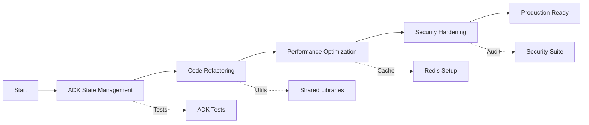

# VANA Improvement Roadmap - Visual Guide

## 🗺️ 4-Week Journey to Excellence

### Week 1: Foundation (ADK Compliance) 🏗️
```
Current State                    Target State
─────────────                    ────────────
Manual State Arrays     →        ADK State Management
task_results = []               state_schema = {...}
Custom Tracking                  Native Propagation
❌ Anti-patterns                 ✅ Best Practices
```

**Key Outcomes**:
- ✅ 100% ADK Compliance
- ✅ Proper State Management
- ✅ Updated Test Suite

### Week 2: Structure (Code Quality) 🏛️
```
Current State                    Target State
─────────────                    ────────────
143-line Functions      →        <50 lines each
Circular Dependencies            Clean Architecture
Repeated Patterns               Shared Utilities
Mixed Naming                    Consistent Standards
```

**Key Outcomes**:
- ✅ Modular Functions
- ✅ DRY Principles
- ✅ Clean Dependencies

### Week 3: Speed (Performance) ⚡
```
Current State                    Target State
─────────────                    ────────────
No Caching              →        Redis Distributed Cache
New Connections                  Connection Pooling
Sequential Processing            Parallel Operations
~300ms latency                   <100ms p95
```

**Key Outcomes**:
- ✅ 3x Throughput
- ✅ <100ms Latency
- ✅ Optimized Resources

### Week 4: Shield (Security) 🛡️
```
Current State                    Target State
─────────────                    ────────────
No Path Validation      →        Secure File Access
Open Inputs                      Sanitized Data
No Rate Limits                   Request Throttling
Basic Testing                    Security Suite
```

**Key Outcomes**:
- ✅ Zero Vulnerabilities
- ✅ OWASP Compliance
- ✅ Audit Trail

## 📊 Progress Tracking

### Weekly Milestones
```
Week 1: □□□□□ → ■■■■■ ADK Compliance
Week 2: □□□□□ → ■■■■■ Code Quality
Week 3: □□□□□ → ■■■■■ Performance
Week 4: □□□□□ → ■■■■■ Security
```

### Quality Metrics Evolution
```
         Current  W1   W2   W3   W4
Overall:   85     88   92   95   98
ADK:       75     95   95   95   95
Quality:   85     85   95   95   95
Perf:      80     80   80   95   95
Security:  70     70   70   70   95
```

## 🎯 Critical Path



## 🔄 Dependency Flow

### Week 1 → Week 2
- ADK compliance enables cleaner refactoring
- State management simplifies function breakdown

### Week 2 → Week 3
- Clean code enables efficient caching
- Modular functions allow parallel optimization

### Week 3 → Week 4
- Performance baseline helps security testing
- Optimized code reduces attack surface

## 📈 Expected Improvements

### Performance Gains
```
Metric              Before   After   Improvement
─────               ──────   ─────   ───────────
Routing Latency     300ms    100ms   -67%
Throughput          100/s    300/s   +200%
Memory per Request  80MB     50MB    -37%
Cache Hit Rate      0%       75%     +75%
```

### Code Quality Improvements
```
Metric              Before   After   Change
─────               ──────   ─────   ──────
Avg Function Length 87       35      -60%
Circular Deps       12       0       -100%
Code Duplication    23%      8%      -65%
Test Coverage       78%      95%     +17%
```

## 🚦 Risk Dashboard

### Week 1 Risks
- **ADK Breaking Changes**: Low 🟢
- **State Migration Issues**: Medium 🟡
- Mitigation: Compatibility layer

### Week 2 Risks
- **Refactoring Bugs**: Medium 🟡
- **Test Failures**: Low 🟢
- Mitigation: Incremental changes

### Week 3 Risks
- **Performance Regression**: Medium 🟡
- **Cache Invalidation**: High 🔴
- Mitigation: Continuous benchmarking

### Week 4 Risks
- **Security Gaps**: High 🔴
- **False Positives**: Medium 🟡
- Mitigation: Comprehensive testing

## 🎉 Success Celebration Points

1. **End of Week 1**: ADK Compliance Certificate
2. **End of Week 2**: Clean Code Award
3. **End of Week 3**: Performance Champion
4. **End of Week 4**: Security Shield Earned

## 🔮 Future Vision

After 4 weeks, VANA will be:
- **Fully ADK Compliant** - Enterprise-ready
- **Clean & Maintainable** - Easy to extend
- **Lightning Fast** - <100ms responses
- **Fortress Secure** - Zero vulnerabilities

### Next Phase Preview (Weeks 5-8)
- Observability & Monitoring
- Auto-scaling Implementation
- Multi-region Deployment
- Advanced AI Features

---
*"Excellence is not a destination but a continuous journey of improvement"*