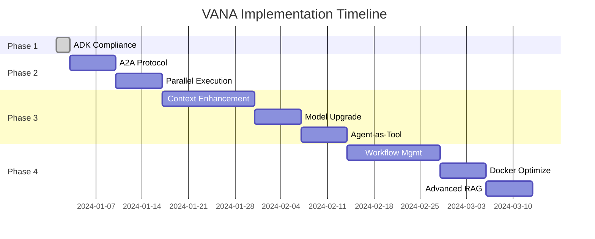

# 📅 VANA Phased Implementation Roadmap

**Timeline**: 12 Weeks  
**Start Date**: After Phase 1 Completion  
**Goal**: Transform VANA into enterprise-grade, high-performance multi-agent platform

## 🎯 Roadmap Overview



## 📋 Phase 2: A2A Protocol & Distributed Architecture
**Timeline**: Weeks 3-4  
**Risk**: MEDIUM | **Impact**: HIGH

### Week 3: A2A REST Protocol Implementation

#### 2.1 Agent-to-Agent Communication
**Files to Create/Modify**:
- `agents/protocols/a2a_protocol.py` (new)
- `agents/base_agent.py` - Add REST endpoint support
- `main_agentic.py` - Add specialist REST routes

**Implementation Tasks**:
```python
# New A2A Protocol Handler
class A2AProtocol:
    def __init__(self):
        self.registry = {}
        
    async def register_specialist(self, name: str, endpoint: str):
        self.registry[name] = endpoint
        
    async def call_specialist(self, name: str, request: dict):
        endpoint = self.registry.get(name)
        async with aiohttp.ClientSession() as session:
            async with session.post(endpoint, json=request) as resp:
                return await resp.json()
```

**REST Endpoints**:
```python
@app.post("/specialist/{specialist_name}/run")
async def run_specialist(specialist_name: str, request: AgentRequest):
    specialist = get_specialist(specialist_name)
    result = await specialist.execute_async(request.data)
    return {
        "response": result,
        "specialist": specialist_name,
        "execution_time": time.time() - start
    }
```

### Week 4: Parallel Execution Framework

#### 2.2 Async Orchestration
**Files to Modify**:
- `agents/vana/enhanced_orchestrator.py` - Add async methods
- `agents/specialists/*` - Add async execution support

**Key Implementation**:
```python
async def parallel_route(request: str, specialists: List[str]):
    tasks = []
    for specialist in specialists:
        task = asyncio.create_task(
            call_specialist_async(specialist, request)
        )
        tasks.append(task)
    
    results = await asyncio.gather(*tasks, return_exceptions=True)
    return aggregate_results(results)
```

**Testing Strategy**:
- Unit tests for A2A protocol
- Integration tests for parallel execution
- Performance benchmarks for speedup validation
- Fault injection testing

## 📋 Phase 3: Advanced Performance & Context
**Timeline**: Weeks 5-8  
**Risk**: MEDIUM | **Impact**: MEDIUM

### Week 5-6: Enhanced Context Management

#### 3.1 Rich Context Objects
**Files to Create/Modify**:
- `lib/context/specialist_context.py` (new)
- `agents/base_agent.py` - Support context passing

**Context Structure**:
```python
class SpecialistContext:
    def __init__(self, request: str, session_data: dict):
        self.request = request
        self.conversation_history = session_data.get("history", [])
        self.previous_analyses = {}
        self.user_preferences = session_data.get("preferences", {})
        self.security_level = session_data.get("security_level", "standard")
        self.execution_metadata = {
            "timestamp": datetime.now(),
            "request_id": str(uuid.uuid4()),
            "parent_agents": []
        }
```

### Week 7: Model Upgrade

#### 3.2 Gemini 2.5 Migration
**Files to Modify**:
- All agent configuration files
- Update model initialization

**Migration Checklist**:
- [ ] Update model references
- [ ] Test with new model capabilities
- [ ] Adjust token limits if needed
- [ ] Validate response quality

### Week 8: Agent-as-Tool Pattern

#### 3.3 Direct Tool Access
**Implementation**:
```python
# In orchestrator
def register_specialist_tools():
    tools = [
        FunctionTool(
            name="quick_security_scan",
            function=lambda code: security_specialist.quick_scan(code),
            description="Quick security vulnerability check"
        ),
        FunctionTool(
            name="data_stats",
            function=lambda data: data_specialist.basic_stats(data),
            description="Get basic statistics for data"
        )
    ]
    return tools
```

## 📋 Phase 4: Enterprise Features & Production
**Timeline**: Weeks 9-12  
**Risk**: LOW | **Impact**: MEDIUM

### Week 9-10: State-Driven Workflows

#### 4.1 Workflow State Management
**Files to Create**:
- `agents/workflows/state_manager.py`
- `agents/workflows/workflow_engine.py`

**State Machine Implementation**:
```python
class WorkflowState:
    def __init__(self):
        self.current_state = "initial"
        self.transitions = {}
        self.context = {}
        
    def add_transition(self, from_state: str, to_state: str, condition: callable):
        self.transitions[(from_state, to_state)] = condition
        
    def next_state(self) -> str:
        for (from_s, to_s), condition in self.transitions.items():
            if from_s == self.current_state and condition(self.context):
                return to_s
        return self.current_state
```

### Week 11: Production Optimization

#### 4.2 Docker & Deployment
**Files to Create/Modify**:
- `Dockerfile.production`
- `docker-compose.production.yml`
- `.github/workflows/deploy.yml`

**Production Dockerfile**:
```dockerfile
# Multi-stage build for optimization
FROM python:3.13-slim as builder
RUN pip install --no-cache-dir uv
COPY pyproject.toml ./
RUN uv pip compile pyproject.toml -o requirements.txt
RUN uv pip install -r requirements.txt

FROM python:3.13-slim
COPY --from=builder /usr/local/lib/python3.13/site-packages /usr/local/lib/python3.13/site-packages
COPY . .
EXPOSE 8080
HEALTHCHECK --interval=30s --timeout=3s --retries=3 \
  CMD curl -f http://localhost:8080/health || exit 1
CMD ["python", "main_agentic.py"]
```

### Week 12: Advanced RAG & Monitoring

#### 4.3 Enhanced Knowledge Retrieval
**Implementation**:
```python
class EnhancedRAG:
    def __init__(self):
        self.vector_store = ChromaDB()
        self.reranker = VertexAIRank()
        
    async def search(self, query: str, top_k: int = 10):
        # Step 1: Vector search
        candidates = await self.vector_store.search(query, top_k * 3)
        
        # Step 2: Re-ranking
        ranked = await self.reranker.rank(candidates, query)
        
        # Step 3: Context compression
        return self.compress_context(ranked[:top_k])
```

## 📊 Success Metrics by Phase

### Phase 2 Metrics
- Parallel execution speedup: 40-60%
- Specialist isolation: 100%
- Fault recovery time: <30s
- A2A protocol latency: <10ms

### Phase 3 Metrics
- Context accuracy: >95%
- Model upgrade performance: 20-30% improvement
- Direct tool access speedup: 50% for simple queries
- Token efficiency: Additional 30% reduction

### Phase 4 Metrics
- Workflow completion rate: >99%
- Docker build time: <2 minutes
- Production deployment time: <5 minutes
- RAG relevance score: >90%

## 🛡️ Risk Management

### Phase 2 Risks
- **Network Issues**: Implement circuit breakers
- **Specialist Failures**: Fallback to synchronous mode
- **Performance Degradation**: Monitor and optimize

### Phase 3 Risks
- **Model Compatibility**: Extensive testing before migration
- **Context Overhead**: Implement context pruning
- **Tool Conflicts**: Namespace separation

### Phase 4 Risks
- **State Complexity**: Comprehensive state testing
- **Deployment Issues**: Blue-green deployment strategy
- **Resource Usage**: Auto-scaling configuration

## 🚀 Implementation Guidelines

### Development Process
1. **Feature Branches**: One branch per phase
2. **Code Reviews**: Mandatory for all changes
3. **Testing**: Minimum 90% coverage
4. **Documentation**: Update with each phase

### Testing Strategy
```bash
# Phase 2 Tests
poetry run pytest tests/test_a2a_protocol.py
poetry run pytest tests/test_parallel_execution.py

# Phase 3 Tests
poetry run pytest tests/test_context_management.py
poetry run pytest tests/test_model_upgrade.py

# Phase 4 Tests
poetry run pytest tests/test_workflows.py
poetry run pytest tests/test_production.py
```

### Rollback Procedures
Each phase includes:
- Feature flags for enable/disable
- Automated rollback scripts
- Performance regression detection
- A/B testing capabilities

## 📈 Expected Outcomes

### After Phase 2
- **Performance**: 40-60% faster complex queries
- **Reliability**: Independent specialist scaling
- **Architecture**: True microservices pattern

### After Phase 3
- **Intelligence**: Better reasoning and context
- **Efficiency**: Reduced token usage
- **Quality**: Improved response accuracy

### After Phase 4
- **Production Ready**: Enterprise deployment
- **Observability**: Complete monitoring
- **Scalability**: Auto-scaling capabilities

## 🎯 Next Steps

1. **Complete Phase 1** (Today)
2. **Review this roadmap** with team
3. **Prioritize phases** based on business needs
4. **Allocate resources** for implementation
5. **Set up tracking** for metrics

---

**Note**: This roadmap is flexible and can be adjusted based on:
- Business priorities
- Resource availability
- Technical discoveries
- Performance results

Each phase builds on the previous, but phases can be reordered if needed (except Phase 1, which is foundational).