# ThinkingPanel Integration Guide

## Overview

The ThinkingPanel is VANA's innovative feature that provides real-time transparency into AI decision-making. It shows users exactly how their requests are processed, which specialists are involved, and what steps are taken to generate responses.

## Architecture

```mermaid
graph TD
    subgraph "User Interface"
        UI[Chat Interface]
        TP[ThinkingPanel Component]
    end
    
    subgraph "Frontend Services"
        API[API Service]
        SSE[SSE Handler]
    end
    
    subgraph "Backend Processing"
        Stream[Stream Handler]
        Orch[Orchestrator]
        Events[Event Emitter]
    end
    
    subgraph "Specialists"
        S1[🔒 Security]
        S2[📊 Data Science]
        S3[🏗️ Architecture]
    end
    
    UI --> API
    API --> Stream
    Stream --> Orch
    Orch --> Events
    Events --> SSE
    SSE --> TP
    
    Orch --> S1
    Orch --> S2  
    Orch --> S3
    
    style TP fill:#9f6,stroke:#333,stroke-width:2px
    style Events fill:#f96,stroke:#333,stroke-width:2px
```



## Component Structure

### Frontend Component

```typescript
// vana-ui/src/components/ThinkingPanel.tsx
export interface ThinkingStep {
  icon: string;              // Agent emoji icon
  summary: string;           // Step description
  detail?: string;           // Additional context
  status?: 'active' | 'complete' | 'pending';
  timing?: number;           // Execution time in ms
}

interface ThinkingPanelProps {
  steps: ThinkingStep[];     // Array of thinking steps
  isThinking: boolean;       // Current thinking state
  className?: string;        // Optional styling
}
```

### Key Features

1. **Collapsible Design**: Users can expand/collapse to control visibility
2. **Real-time Updates**: Steps appear as they happen
3. **Visual Indicators**: 
   - ⚡ Active step (yellow, pulsing)
   - ✅ Completed step (green)
   - 🕐 Pending step (gray)
4. **Agent Icons**: Each specialist has unique emoji for recognition

## Backend Integration

### Event Emission Flow

```python
# main.py - Streaming endpoint
async def stream_agent_response(user_input: str, session_id: str = None):
    # Initial thinking event
    yield f"data: {json.dumps({
        'type': 'thinking',
        'content': 'Analyzing your request...',
        'status': 'analyzing_request'
    })}\n\n"
    
    # Process with event tracking
    output_text, thinking_events = await process_vana_agent_with_events(
        user_input, session_id
    )
    
    # Stream thinking events
    for event in thinking_events:
        yield f"data: {json.dumps({'type': 'thinking', **event})}\n\n"
        await asyncio.sleep(0.3)  # Pacing for readability
```

### Event Types

#### 1. Routing Event
```json
{
  "type": "thinking",
  "content": "Analyzing query type and routing to appropriate specialists...",
  "status": "routing"
}
```

#### 2. Agent Activation Event
```json
{
  "type": "thinking", 
  "content": "Security analysis requested - routing to Security Specialist...",
  "agent": "security_specialist",
  "status": "active"
}
```

#### 3. Progress Event
```json
{
  "type": "thinking",
  "content": "Performing vulnerability scan...",
  "agent": "security_specialist", 
  "status": "active",
  "progress": 45
}
```

#### 4. Completion Event
```json
{
  "type": "thinking",
  "content": "Analysis complete, preparing response...",
  "status": "complete"
}
```

## Frontend Implementation

### Chat Component Integration

```typescript
// vana-ui/src/pages/Chat.tsx
const Chat = () => {
  const [thinkingSteps, setThinkingSteps] = useState<ThinkingStep[]>([]);
  const [showThinking, setShowThinking] = useState(true);
  
  // Handle streaming with thinking events
  await api.streamMessage(userInput, {
    onThinking: (data) => {
      const step: ThinkingStep = {
        icon: getAgentIcon(data.agent),
        summary: data.content,
        detail: data.agent ? `Agent: ${data.agent}` : undefined,
        status: 'active'
      };
      
      setThinkingSteps(prev => {
        // Mark previous steps as complete
        const updated = prev.map(s => ({ ...s, status: 'complete' }));
        return [...updated, step];
      });
    },
    onContent: (content) => {
      // Handle response content
    },
    onDone: () => {
      // Mark all steps complete
      setThinkingSteps(prev => 
        prev.map(s => ({ ...s, status: 'complete' }))
      );
    }
  });
```

### Agent Icon Mapping

```typescript
const getAgentIcon = (agent?: string): string => {
  switch(agent) {
    case 'master_orchestrator': return '🎯';
    case 'security_specialist': return '🔒';
    case 'data_science_specialist': return '📊';
    case 'architecture_specialist': return '🏗️';
    case 'devops_specialist': return '⚙️';
    case 'qa_specialist': return '🧪';
    case 'ui_specialist': return '🎨';
    default: return '🤖';
  }
};
```

## User Experience

### Visual Flow

```
User Query: "Check this code for security vulnerabilities"

ThinkingPanel Display:
┌─────────────────────────────────────────┐
│ 🧠 VANA is thinking...           [▼]   │
├─────────────────────────────────────────┤
│ ✅ 🎯 Analyzing your request...        │
│ ✅ 🔒 Security analysis requested -     │
│     routing to Security Specialist...   │
│ ⚡ 🔍 Performing vulnerability scan... │
│     [████████░░] 80%                   │
└─────────────────────────────────────────┘
```

### Interaction Patterns

1. **Default Visible**: Shows thinking by default for transparency
2. **Collapsible**: Users can minimize if preferred
3. **Persistent History**: Completed steps remain visible
4. **Performance Metrics**: Optional timing display

## Customization

### Styling

```css
/* Custom ThinkingPanel styles */
.thinking-panel {
  @apply border rounded-lg p-3 mb-4;
  @apply bg-gray-50 dark:bg-gray-900;
}

.thinking-step-active {
  @apply animate-pulse;
}

.thinking-step-complete {
  @apply opacity-80;
}
```

### Configuration

```typescript
// Configuration options
interface ThinkingPanelConfig {
  showByDefault: boolean;      // Auto-expand panel
  showTiming: boolean;         // Display execution times
  maxSteps: number;           // Limit displayed steps
  animationSpeed: number;     // Transition duration
}
```

## Testing

### Unit Tests

```typescript
// ThinkingPanel.test.tsx
describe('ThinkingPanel', () => {
  it('renders thinking steps', () => {
    const steps: ThinkingStep[] = [
      { icon: '🎯', summary: 'Analyzing request', status: 'complete' },
      { icon: '🔒', summary: 'Security scan', status: 'active' }
    ];
    
    render(<ThinkingPanel steps={steps} isThinking={true} />);
    
    expect(screen.getByText('Analyzing request')).toBeInTheDocument();
    expect(screen.getByText('Security scan')).toBeInTheDocument();
  });
  
  it('toggles expanded state', () => {
    // Test collapse/expand functionality
  });
});
```

### Integration Testing

```python
# test_thinking_panel.py
async def test_thinking_events():
    """Test thinking event emission"""
    events = []
    
    async for chunk in stream_agent_response("security check"):
        if chunk.startswith('data: '):
            data = json.loads(chunk[6:])
            if data['type'] == 'thinking':
                events.append(data)
    
    assert len(events) > 0
    assert any(e.get('agent') == 'security_specialist' for e in events)
```

## Performance Considerations

### Event Throttling

```python
# Prevent event flooding
class ThinkingEventThrottler:
    def __init__(self, min_interval_ms=100):
        self.min_interval = min_interval_ms / 1000
        self.last_emit = {}
    
    def should_emit(self, event_type: str) -> bool:
        now = time.time()
        last = self.last_emit.get(event_type, 0)
        
        if now - last > self.min_interval:
            self.last_emit[event_type] = now
            return True
        return False
```

### Frontend Optimization

```typescript
// Memoize ThinkingPanel for performance
export const ThinkingPanel = React.memo(({ steps, isThinking }: Props) => {
  // Component implementation
});

// Debounce rapid updates
const debouncedSetSteps = useMemo(
  () => debounce(setThinkingSteps, 50),
  []
);
```

## Troubleshooting

### Common Issues

1. **Steps Not Appearing**
   - Check SSE connection is established
   - Verify backend is emitting events
   - Check browser console for errors

2. **Duplicate Steps**
   - Ensure unique step IDs
   - Check event deduplication logic

3. **Performance Issues**
   - Limit number of displayed steps
   - Implement virtual scrolling for many steps
   - Throttle event updates

### Debug Mode

```typescript
// Enable debug logging
if (process.env.NODE_ENV === 'development') {
  window.THINKING_PANEL_DEBUG = true;
}

// In component
if (window.THINKING_PANEL_DEBUG) {
  console.log('Thinking event:', data);
}
```

## Future Enhancements

1. **Step Details**: Expandable details for each step
2. **Timeline View**: Visual timeline of execution
3. **Export**: Save thinking process for analysis
4. **Filters**: Show/hide specific agent types
5. **Metrics Dashboard**: Aggregate performance data

## Best Practices

1. **Clear Descriptions**: Use user-friendly language
2. **Appropriate Granularity**: Balance detail vs. clarity
3. **Error States**: Show when steps fail
4. **Loading States**: Indicate ongoing processing
5. **Accessibility**: Ensure screen reader compatibility

## Conclusion

The ThinkingPanel transforms VANA from a black-box AI into a transparent, understandable system. By showing the reasoning process, users gain confidence in the AI's decisions and developers can debug issues more effectively.