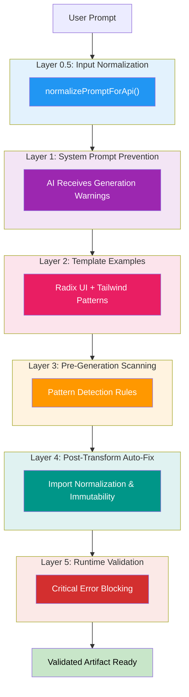

# Artifact System

## Overview

The Artifact System enables AI-generated interactive components (artifacts) to be rendered in real-time alongside chat conversations. Artifacts are self-contained applications that run in isolated iframes.

**Supported Types**: `code` | `html` | `react` | `svg` | `mermaid` | `markdown` | `image`

**Rendering Methods**:
- **Sucrase** (instant, default) — Client-side transpilation, 20x faster than Babel, "Ask AI to Fix" on errors
- **Server Bundling** (2-5s) — For artifacts with npm imports
- **Sandpack** (fallback) — CodeSandbox runtime for complex dependencies

## Component Architecture

### Frontend Components

- **ArtifactContainer.tsx** — Main wrapper with state management, validation, editing
- **ArtifactRenderer.tsx** — Rendering engine for all artifact types
- **ArtifactToolbar.tsx** — Export, edit, maximize, theme controls
- **ArtifactCard.tsx** — Preview cards for artifact selection
- **ArtifactErrorBoundary.tsx** — React error boundary for graceful degradation
- **ArtifactErrorRecovery.tsx** — Error display with "Ask AI to Fix" recovery
- **ArtifactCodeEditor.tsx** — Inline code editor with syntax highlighting
- **ArtifactTabs.tsx** — Tab navigation for multi-artifact workspace

### Backend Components

**Location**: `supabase/functions/_shared/`

- **artifact-executor.ts** — Server-side artifact generation orchestrator
- **artifact-validator.ts** — Multi-layer validation engine
- **artifact-rules/** — Validation rule modules:
  - `core-restrictions.ts` — Import restrictions and security rules
  - `react-patterns.ts` — React-specific validation patterns
  - `html-patterns.ts` — HTML artifact validation
  - `bundling-guidance.ts` — NPM bundling detection and guidance
  - `type-selection.ts` — Artifact type inference
  - `error-patterns.ts` — Common error pattern detection

### Utilities

**Location**: `src/utils/`

- **artifactParser.ts** — XML-tag artifact extraction from AI responses
- **artifactValidator.ts** — Frontend validation layer
- **artifactErrorRecovery.ts** — Error classification and recovery strategies
- **artifactBundler.ts** — Client-side bundling coordination
- **sucraseTranspiler.ts** — Sucrase transpiler integration

## Transpilation Strategy

### Primary: Sucrase (Default)

**Why Sucrase?**
- Used in production by Claude Artifacts (Anthropic), CodeSandbox, Expo
- ~2-10ms transpilation time (vs Babel's 150-500ms)
- ~20-50x faster than Babel Standalone
- ~100KB bundle size (vs Babel's ~700KB)
- 96% smaller download

**Configuration**:
```typescript
transform(code, {
  transforms: ['jsx', 'typescript'],  // Strip types, compile JSX
  production: true,
  disableESTransforms: true,          // Keep ES6+ syntax
  jsxPragma: 'React.createElement',
  jsxFragmentPragma: 'React.Fragment'
})
```

**Features**:
- Real-time performance logging to console
- Sentry integration for error tracking
- Detailed error reporting with line/column info

**Browser Compatibility** (ES6+ module support required):
- Chrome 61+
- Firefox 60+
- Safari 10.1+
- Edge 16+

### Error Recovery (Sucrase-Only Architecture)

> **Note**: Babel Standalone fallback was removed in December 2025. Errors now surface immediately with "Ask AI to Fix" for one-click recovery.

**When Sucrase Fails**:
1. **Error Toast** — Shows error with line/column information
2. **"Ask AI to Fix" Button** — One-click recovery sends code + error to AI
3. **Sentry Capture** — Error logged for monitoring
4. **No Silent Degradation** — Failures are immediately visible

**Template** (Pre-transpiled):
```html
<script type="module">
  // Code already transpiled to React.createElement() calls
  const App = () => React.createElement("div", null, "Hello");
  ReactDOM.createRoot(document.getElementById('root')).render(React.createElement(App));
</script>
```

### Server-Side Integration

**Location**: `supabase/functions/_shared/artifact-validator.ts`

Sucrase strips TypeScript before validation:
```typescript
import { transform } from 'npm:sucrase@3.35.0';

// Strip types for validation (keeps JSX intact)
const result = transform(code, {
  transforms: ['typescript'],
  disableESTransforms: true
});
```

**Fallback**: Regex-based TypeScript stripping if Sucrase fails

## Server Bundling

When artifacts contain npm imports, they're automatically bundled via the `bundle-artifact/` Edge Function:

**Process**:
1. AI generates artifact with npm imports
2. Backend detects imports, triggers bundling
3. Packages loaded from esm.sh with `?external=react,react-dom`
4. Import maps redirect bare specifiers to global `window.React`
5. Artifact renders with dependencies resolved

**Bundle Timeout**: 60 seconds for large dependency trees

### Export Transformation

**Function**: `normalizeDefaultExportToApp()` in `bundle-artifact/index.ts`

Replaces the previous fragile regex chain with structured pattern matching. Handles all 9 GLM-generated export patterns:

| Pattern | Input | Output |
|---------|-------|--------|
| 1 | `export default function App() {}` | `function App() {}` |
| 2 | `export default function Calculator() {}` | `function App() {}` |
| 3 | `export default function() {}` | `function App() {}` |
| 4 | `function App() {} export default App;` | `function App() {}` |
| 5 | `const X = () => {}; export default X;` | `const X = () => {}; const App = X;` |
| 6 | `export { X as default };` | `const App = X;` |
| 7 | `export default () => ...` | `const App = () => ...` |
| 8 | `export default memo(App)` | Removes export (App already exists) |
| 9 | `export default class ...` | `const App = class ...` |

**Key Improvement**: Pattern 4 (separate declaration + export) was the root cause of "const App = App" bugs—now handled correctly.

### Export Pattern Normalization Flow

The `normalizeDefaultExportToApp()` function maps all 9 GLM-generated export patterns to a consistent output:



```mermaid
flowchart LR
    subgraph Patterns["9 Export Patterns"]
        P1["1: export default function App()"]
        P2["2: export default function Other()"]
        P3["3: export default function()"]
        P4["4: function App() + export default App"]
        P5["5: const X + export default X"]
        P6["6: export { X as default }"]
        P7["7: export default () => ..."]
        P8["8: export default memo(App)"]
        P9["9: export default class"]
    end

    T["normalizeDefaultExportToApp()"]

    subgraph Result["Normalized Output"]
        R["function App() or const App = ..."]
    end

    Patterns --> T --> Result

    style T fill:#4caf50,color:#fff
    style Result fill:#c8e6c9
```

This transformation eliminates export statement fragility and prevents "const App = App" circular reference bugs.

### React Instance Unification

**Problem**: Multiple React instances cause "Invalid hook call" errors

**Solution**: Server-side externalization + import map shims

**Server** (`bundle-artifact/`):
```typescript
const url = `https://esm.sh/${pkg}@${version}?external=react,react-dom`;
```

**Import Map** (in bundled artifact):
```html
<script type="importmap">
{
  "imports": {
    "react": "data:text/javascript,export default window.React;...",
    "react-dom": "data:text/javascript,export default window.ReactDOM;...",
    "react/jsx-runtime": "data:text/javascript,export const jsx=window.React.createElement;..."
  }
}
</script>
```

**Key Files**:
- `supabase/functions/bundle-artifact/index.ts` — Server-side bundling
- `src/components/ArtifactRenderer.tsx` — Client-side rendering

**Special Package Handling**:
- **Framer Motion**: Both import transform and import map loops skip `framer-motion` (lines 566 and 662 in bundle-artifact/index.ts). This ensures the UMD shim (`FRAMER_MOTION_SHIM`) is used instead of ESM imports, avoiding Safari compatibility issues.

## Validation System

### 5-Layer Validation Architecture

The validation system uses five progressive layers to prevent invalid artifacts from reaching users:



**Layer Details**:

- **Layer 0.5**: Input Normalization via `normalizePromptForApi()` — Standardizes text before API transmission (normalize line endings, remove control characters, strip zero-width Unicode). Preserves all visible characters (slashes, quotes, angle brackets for JSX).
- **Layer 1**: System Prompt Prevention — AI receives explicit warnings during generation about restricted patterns
- **Layer 2**: Template Examples — All templates use Radix UI + Tailwind as reference
- **Layer 3**: Pre-Generation Validation — Scans prompts for dangerous patterns before artifact generation
- **Layer 4**: Post-Generation Transformation — Auto-fixes import statements & immutability violations
- **Layer 5**: Runtime Validation — Blocks artifacts with critical errors before rendering

### Error Code System

Uses **structured error codes** for type-safe error handling:

**Schema**: `CATEGORY_SPECIFIC_ISSUE`

**Categories**:
- `RESERVED_KEYWORD` — eval, Function, dangerouslySetInnerHTML
- `IMPORT` — Local imports, forbidden patterns
- `STORAGE` — localStorage, sessionStorage
- `IMMUTABILITY` — Direct mutations (non-blocking)

**Blocking vs Non-Blocking**:
- Immutability violations are **non-blocking** (only cause React warnings)
- All other errors **block rendering**

**Complete Reference**: See `docs/ERROR_CODES.md`

**Example**:
```typescript
// ✅ CORRECT - Type-safe filtering
const result = validateArtifactCode(code, 'react');
if (result.issues.some(e => e.code === VALIDATION_ERROR_CODES.IMPORT_LOCAL_PATH)) {
  // Handle forbidden import error
}

// ❌ WRONG - Fragile string matching
if (result.issues.some(e => e.message.includes('local import'))) {
  // Can match unrelated errors
}
```

### Import Restrictions

**Critical Security Rule**: Artifacts cannot use local imports from the Vana codebase

```tsx
// ❌ FORBIDDEN - Local imports never work
import { Button } from "@/components/ui/button"

// ✅ CORRECT - NPM packages (server-bundled)
import * as Dialog from '@radix-ui/react-dialog';
```

**Why**: Artifacts run in isolated iframes with different security origins. See [artifact-import-restrictions.md](./artifact-import-restrictions.md) for details.

## Immutability Enforcement

React artifacts must use immutable patterns:

```javascript
// ❌ WRONG - Causes runtime errors
board[i] = 'X';           // Direct assignment
board.push(value);        // Mutates array

// ✅ CORRECT - Immutable patterns
const newBoard = [...board];
newBoard[i] = 'X';

const newBoard = [...board, value];
```

**Auto-fix**: Validator transforms direct assignments into immutable patterns

**Error Codes**: All immutability violations use `IMMUTABILITY_*` codes and are **non-blocking**

## Error Recovery

**Location**: `src/utils/artifactErrorRecovery.ts`

Provides automatic recovery strategies with "Ask AI to Fix" one-click resolution.

### Defense-in-Depth for Duplicate Declarations

Duplicate imports/variables are a common AI generation bug. The system uses a 3-layer defense:

| Layer | Location | Mechanism |
|-------|----------|-----------|
| 1. Prompt | `core-restrictions.ts` Rule #5 | Explicitly forbids duplicate named imports |
| 2. Auto-Fix | `artifact-validator.ts` | `removeDuplicateImports()` silently fixes duplicates during validation |
| 3. Recovery | `artifactErrorRecovery.ts` | Detects duplicate declaration errors, provides "Ask AI to Fix" guidance |

**Layer 2 Details** (`removeDuplicateImports`):
```typescript
// Input:  import { Mail, User, Mail } from 'lucide-react'
// Output: import { Mail, User } from 'lucide-react'
```
- Handles aliased imports (`Original as Alias`)
- Logs fix count for monitoring
- Runs before transpilation to prevent SyntaxError

### Engine-Specific Error Detection

The error classifier handles JavaScript engine variations:

| Engine | Browser | Error Pattern |
|--------|---------|---------------|
| JavaScriptCore | Safari | `Cannot declare a lexical variable twice: 'X'` |
| V8 | Chrome | `Identifier 'X' has already been declared` |
| SpiderMonkey | Firefox | `redeclaration of let X` / `redeclaration of const X` |

### Recovery Modes

1. **Ask AI to Fix** — Primary recovery for auto-fixable errors
2. **Fallback Renderer** — Sandpack for import/bundling errors
3. **Error Display** — User-friendly message with recovery button

### Error Classification

**Rule Order**: Specific rules before generic (first match wins)

| Error Type | Patterns | Recovery |
|------------|----------|----------|
| `syntax` (duplicate) | `has already been declared`, `lexical variable twice`, `redeclaration` | AI Fix |
| `syntax` (general) | `syntaxerror`, `unexpected token` | AI Fix |
| `import` | `failed to resolve`, `module not found` | Sandpack fallback |
| `react` | `invalid hook call`, `hooks can only be called` | AI Fix |
| `runtime` | `typeerror`, `referenceerror`, `is not defined` | AI Fix |
| `timeout` | `timeout`, `bundle timeout` | Sandpack fallback |
| `bundling` | `bundling failed`, `bundle error` | Sandpack fallback |

### Architecture: Sucrase-Only

> **Note**: Babel Standalone fallback was removed in December 2025. Errors surface immediately with "Ask AI to Fix" for one-click recovery instead of silent degradation.

## Performance Optimization

### Bundle Size Reduction

**Before Sucrase**:
- 2.6MB Babel CDN download on every artifact render

**After Sucrase**:
- ~100KB in main bundle (one-time download)
- **96% reduction** in transpiler download size

### Transpilation Speed

**Before**: 150-500ms (blocking)
**After**: 2-12ms (non-blocking)
**Improvement**: 20-50x faster

### Real-World Impact

- Artifacts appear instantly (sub-10ms transpilation)
- No CDN dependency for transpilation
- Better offline experience
- Reduced bandwidth usage by 2.5MB per artifact

## Limitations & Known Issues

### What Sucrase Does NOT Support

- Legacy decorators (use modern decorators)
- TypeScript namespaces (use ES modules instead)
- Certain edge-case TypeScript syntax
- Babel plugins/presets (by design)

**When Unsupported Syntax Detected**: Error shown with "Ask AI to Fix" button for one-click resolution

## Error Handling & Monitoring

### Sentry Integration

**Success Path**:
```typescript
Sentry.addBreadcrumb({
  category: 'transpiler.sucrase',
  message: 'Sucrase transpilation successful',
  level: 'info',
  data: { elapsed, codeLength, outputLength }
});
```

**Failure Path**:
```typescript
Sentry.captureException(new Error(`Sucrase failed: ${error}`), {
  tags: { component: 'ArtifactRenderer', transpiler: 'sucrase' },
  extra: { error, details, line, column }
});
```

### User Notifications

- **Success**: Silent (logged to console only)
- **Error**: Error toast with "Ask AI to Fix" button
- **Critical failure**: Error toast with refresh option

## Best Practices

1. **Always use npm packages** — Never local imports
2. **Inline simple components** — For basic UI
3. **Use Radix UI for complex UI** — Pre-bundled, well-tested
4. **Tailwind for styling** — Already included
5. **Test in isolation** — Verify artifacts work without parent context
6. **Validate early** — Catch errors before generation

## References

- **Artifact Import Guide**: [artifact-import-restrictions.md](./artifact-import-restrictions.md)
- **Error Codes**: `docs/ERROR_CODES.md`
- **Validation Rules**: `supabase/functions/_shared/artifact-rules/`
- **Bundling System**: `supabase/functions/bundle-artifact/index.ts`
- **Radix UI Docs**: https://www.radix-ui.com/primitives
