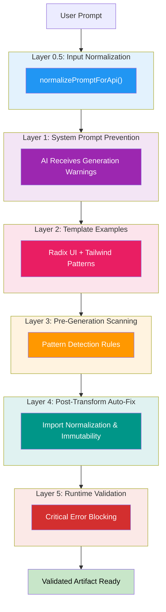

# Artifact System

## Overview

The Artifact System enables AI-generated interactive components (artifacts) to be rendered in real-time alongside chat conversations. Artifacts are self-contained applications that run in isolated iframes.

**Supported Types**: `code` | `html` | `react` | `svg` | `mermaid` | `markdown` | `image`

**Rendering Methods**:
- **Sucrase** (instant, default) — Client-side transpilation, 20x faster than Babel, "Ask AI to Fix" on errors
- **Server Bundling** (2-5s) — For artifacts with npm imports
- **Sandpack** (fallback) — CodeSandbox runtime for complex dependencies

## Recent Enhancements (January 2026)

The artifact generation system has been significantly enhanced with new rule modules that improve reliability and quality:

### 🎯 Template Matching System
- **Confidence scoring** with 5 weighted criteria (70% threshold for high-quality matches)
- **Structured error returns** with `TemplateMatchOutput` interface (no more silent failures)
- **Quality thresholds**: 70% for high-quality, 30% minimum acceptable

### 📚 Canonical Examples
- **5 complete working examples** (Contact Form, Dashboard, Tic-Tac-Toe, Data Table, Settings)
- **Copy-paste ready** code following "show, don't tell" philosophy
- **Best practices baked in** (dark mode, validation, loading states, immutability)

### ✅ Mandatory Patterns
- **React boilerplate requirements** enforced for all artifacts
- **Package version locking** with exact import patterns
- **Validation checks** with structured violations/warnings

### 🌟 Golden Patterns
- **Immutability enforcement** patterns to prevent React strict mode crashes
- **Sample data requirements** (never show empty states)
- **Event handler standards** (forms, clicks, toggles)
- **Pattern checklist** for pre-generation verification

### 🎨 Design Tokens System
- **Light/dark theme tokens** with semantic naming
- **8px spacing grid** for layout consistency
- **Typography, motion, and shadow scales**
- **5 design directions** to prevent "AI slop"
- **Anti-patterns** (banned fonts, colors, layouts)

### 🔍 Pattern Learning Cache
- **In-memory LRU cache** for request→template mappings
- **40+ predefined patterns** from Z.ai research and production testing
- **Fuzzy matching** with partial word overlap detection
- **Performance tracking** with hit rate metrics

### ✓ Verification Checklist
- **80+ verification points** across 10 categories
- **Priority levels**: Critical (MUST verify), Important, Nice-to-have
- **Categories**: Design Tokens, Interactive States, Application States, Accessibility, Responsive, Code Quality, Performance, UX, Content, Security

### 📊 Task Complexity Analysis
- **3-tier classification**: Simple, Moderate, Complex
- **Multi-template detection** for complex requests
- **Template combination suggestions** for full-stack artifacts

### 📦 Module Architecture
- **Barrel exports** through `index.ts` for clean imports
- **Type safety**: All interfaces use `readonly` modifiers
- **Non-empty arrays**: `readonly [string, ...string[]]` type enforcement
- **Structured returns**: No more silent empty string failures

## Component Architecture

### Frontend Components

- **ArtifactContainer.tsx** — Main wrapper with state management, validation, editing
- **ArtifactRenderer.tsx** — Rendering engine for all artifact types
- **ArtifactToolbar.tsx** — Export, edit, maximize, theme controls
- **ArtifactCard.tsx** — Preview cards for artifact selection
- **ArtifactErrorBoundary.tsx** — React error boundary for graceful degradation
- **ArtifactErrorRecovery.tsx** — Error display with "Ask AI to Fix" recovery
- **ArtifactCodeEditor.tsx** — Inline code editor with syntax highlighting
- **ArtifactTabs.tsx** — Tab navigation for multi-artifact workspace

### Backend Components

**Location**: `supabase/functions/_shared/`

- **artifact-executor.ts** — Server-side artifact generation orchestrator
- **artifact-validator.ts** — Multi-layer validation engine
- **artifact-rules/** — Validation and generation rule modules:
  - `core-restrictions.ts` — Import restrictions and security rules
  - `react-patterns.ts` — React-specific validation patterns
  - `html-patterns.ts` — HTML artifact validation
  - `bundling-guidance.ts` — NPM bundling detection and guidance
  - `type-selection.ts` — Artifact type inference
  - `error-patterns.ts` — Common error pattern detection
  - `template-matcher.ts` — **NEW**: Confidence-based template matching
  - `canonical-examples.ts` — **NEW**: Full working reference examples
  - `mandatory-patterns.ts` — **NEW**: React boilerplate requirements
  - `golden-patterns.ts` — **NEW**: Success patterns and anti-patterns
  - `design-tokens.ts` — **NEW**: Design system tokens (colors, typography, spacing)
  - `index.ts` — **NEW**: Barrel exports for all artifact rules

### Utilities

**Location**: `src/utils/`

- **artifactParser.ts** — XML-tag artifact extraction from AI responses
- **artifactValidator.ts** — Frontend validation layer
- **artifactErrorRecovery.ts** — Error classification and recovery strategies
- **artifactBundler.ts** — Client-side bundling coordination
- **sucraseTranspiler.ts** — Sucrase transpiler integration

## Transpilation Strategy

### Primary: Sucrase (Default)

**Why Sucrase?**
- Used in production by Claude Artifacts (Anthropic), CodeSandbox, Expo
- ~2-10ms transpilation time (vs Babel's 150-500ms)
- ~20-50x faster than Babel Standalone
- ~100KB bundle size (vs Babel's ~700KB)
- 96% smaller download

**Configuration**:
```typescript
transform(code, {
  transforms: ['jsx', 'typescript'],  // Strip types, compile JSX
  production: true,
  disableESTransforms: true,          // Keep ES6+ syntax
  jsxPragma: 'React.createElement',
  jsxFragmentPragma: 'React.Fragment'
})
```

**Features**:
- Real-time performance logging to console
- Sentry integration for error tracking
- Detailed error reporting with line/column info

**Browser Compatibility** (ES6+ module support required):
- Chrome 61+
- Firefox 60+
- Safari 10.1+
- Edge 16+

### Error Recovery (Sucrase-Only Architecture)

> **Note**: Babel Standalone fallback was removed in December 2025. Errors now surface immediately with "Ask AI to Fix" for one-click recovery.

**When Sucrase Fails**:
1. **Error Toast** — Shows error with line/column information
2. **"Ask AI to Fix" Button** — One-click recovery sends code + error to AI
3. **Sentry Capture** — Error logged for monitoring
4. **No Silent Degradation** — Failures are immediately visible

**Template** (Pre-transpiled):
```html
<script type="module">
  // Code already transpiled to React.createElement() calls
  const App = () => React.createElement("div", null, "Hello");
  ReactDOM.createRoot(document.getElementById('root')).render(React.createElement(App));
</script>
```

### Server-Side Integration

**Location**: `supabase/functions/_shared/artifact-validator.ts`

Sucrase strips TypeScript before validation:
```typescript
import { transform } from 'npm:sucrase@3.35.0';

// Strip types for validation (keeps JSX intact)
const result = transform(code, {
  transforms: ['typescript'],
  disableESTransforms: true
});
```

**Fallback**: Regex-based TypeScript stripping if Sucrase fails

## Server Bundling

When artifacts contain npm imports, they're automatically bundled via the `bundle-artifact/` Edge Function:

**Process**:
1. AI generates artifact with npm imports
2. Backend detects imports, triggers bundling
3. Packages loaded from esm.sh with `?external=react,react-dom`
4. Import maps redirect bare specifiers to global `window.React`
5. Artifact renders with dependencies resolved

**Bundle Timeout**: 60 seconds for large dependency trees

### Export Transformation

**Function**: `normalizeDefaultExportToApp()` in `bundle-artifact/index.ts`

Replaces the previous fragile regex chain with structured pattern matching. Handles all 9 AI-generated export patterns:

| Pattern | Input | Output |
|---------|-------|--------|
| 1 | `export default function App() {}` | `function App() {}` |
| 2 | `export default function Calculator() {}` | `function App() {}` |
| 3 | `export default function() {}` | `function App() {}` |
| 4 | `function App() {} export default App;` | `function App() {}` |
| 5 | `const X = () => {}; export default X;` | `const X = () => {}; const App = X;` |
| 6 | `export { X as default };` | `const App = X;` |
| 7 | `export default () => ...` | `const App = () => ...` |
| 8 | `export default memo(App)` | Removes export (App already exists) |
| 9 | `export default class ...` | `const App = class ...` |

**Key Improvement**: Pattern 4 (separate declaration + export) was the root cause of "const App = App" bugs—now handled correctly.

### Export Pattern Normalization Flow

The `normalizeDefaultExportToApp()` function maps all 9 AI-generated export patterns to a consistent output:

```mermaid
flowchart LR
    subgraph Patterns["9 Export Patterns"]
        P1["1: export default function App()"]
        P2["2: export default function Other()"]
        P3["3: export default function()"]
        P4["4: function App() + export default App"]
        P5["5: const X + export default X"]
        P6["6: export { X as default }"]
        P7["7: export default () => ..."]
        P8["8: export default memo(App)"]
        P9["9: export default class"]
    end

    T["normalizeDefaultExportToApp()"]

    subgraph Result["Normalized Output"]
        R["function App() or const App = ..."]
    end

    Patterns --> T --> Result

    style T fill:#4caf50,color:#fff
    style Result fill:#c8e6c9
```



This transformation eliminates export statement fragility and prevents "const App = App" circular reference bugs.

### React Instance Unification

**Problem**: Multiple React instances cause "Invalid hook call" errors

**Solution**: Server-side externalization + import map shims

**Server** (`bundle-artifact/`):
```typescript
const url = `https://esm.sh/${pkg}@${version}?external=react,react-dom`;
```

**Import Map** (in bundled artifact):
```html
<script type="importmap">
{
  "imports": {
    "react": "data:text/javascript,export default window.React;...",
    "react-dom": "data:text/javascript,export default window.ReactDOM;...",
    "react/jsx-runtime": "data:text/javascript,export const jsx=window.React.createElement;..."
  }
}
</script>
```

**Key Files**:
- `supabase/functions/bundle-artifact/index.ts` — Server-side bundling
- `src/components/ArtifactRenderer.tsx` — Client-side rendering

**Special Package Handling**:
- **Framer Motion**: Both import transform and import map loops skip `framer-motion` (lines 566 and 662 in bundle-artifact/index.ts). This ensures the UMD shim (`FRAMER_MOTION_SHIM`) is used instead of ESM imports, avoiding Safari compatibility issues.

## Validation System

### 5-Layer Validation Architecture

The validation system uses five progressive layers to prevent invalid artifacts from reaching users. **New modules** (`template-matcher.ts`, `canonical-examples.ts`, `mandatory-patterns.ts`, `golden-patterns.ts`) enhance Layers 1-4 with confidence scoring and prescriptive patterns.



**Layer Details**:

- **Layer 0.5**: Input Normalization via `normalizePromptForApi()` — Standardizes text before API transmission (normalize line endings, remove control characters, strip zero-width Unicode). Preserves all visible characters (slashes, quotes, angle brackets for JSX).
- **Layer 1**: System Prompt Prevention — AI receives explicit warnings during generation about restricted patterns. **Enhanced by**: `MANDATORY_REACT_BOILERPLATE`, `GOLDEN_PATTERNS` (prescriptive patterns injected into system prompt)
- **Layer 2**: Template Examples — All templates use Radix UI + Tailwind as reference. **Enhanced by**: `template-matcher.ts` (confidence scoring), `canonical-examples.ts` (full working examples), `design-tokens.ts` (consistent styling)
- **Layer 3**: Pre-Generation Validation — Scans prompts for dangerous patterns before artifact generation. Uses `CORE_RESTRICTIONS` and template matching to guide generation
- **Layer 4**: Post-Generation Transformation — Auto-fixes import statements & immutability violations. **Enhanced by**: `mandatory-patterns.ts` validation checks
- **Layer 5**: Runtime Validation — Blocks artifacts with critical errors before rendering

### Error Code System

Uses **structured error codes** for type-safe error handling:

**Schema**: `CATEGORY_SPECIFIC_ISSUE`

**Categories**:
- `RESERVED_KEYWORD` — eval, Function, dangerouslySetInnerHTML
- `IMPORT` — Local imports, forbidden patterns
- `STORAGE` — localStorage, sessionStorage
- `IMMUTABILITY` — Direct mutations (non-blocking)

**Blocking vs Non-Blocking**:
- Immutability violations are **non-blocking** (only cause React warnings)
- All other errors **block rendering**

**Complete Reference**: See `docs/ERROR_CODES.md`

**Example**:
```typescript
// ✅ CORRECT - Type-safe filtering
const result = validateArtifactCode(code, 'react');
if (result.issues.some(e => e.code === VALIDATION_ERROR_CODES.IMPORT_LOCAL_PATH)) {
  // Handle forbidden import error
}

// ❌ WRONG - Fragile string matching
if (result.issues.some(e => e.message.includes('local import'))) {
  // Can match unrelated errors
}
```

### Import Restrictions

**Critical Security Rule**: Artifacts cannot use local imports from the Vana codebase

```tsx
// ❌ FORBIDDEN - Local imports never work
import { Button } from "@/components/ui/button"

// ✅ CORRECT - NPM packages (server-bundled)
import * as Dialog from '@radix-ui/react-dialog';
```

**Why**: Artifacts run in isolated iframes with different security origins. See [artifact-import-restrictions.md](./artifact-import-restrictions.md) for details.

## Template Matching System

**Location**: `supabase/functions/_shared/artifact-rules/template-matcher.ts`

The template matching system uses a sophisticated confidence scoring algorithm to match user requests to predefined artifact templates. This ensures consistent, high-quality artifact generation by providing the AI with proven patterns.

### Confidence Scoring Algorithm

Inspired by Z.ai's 5-criterion confidence scoring approach, the system evaluates template matches using weighted criteria:

| Criterion | Weight | Description |
|-----------|--------|-------------|
| **Keyword Density** | 30% | Ratio of matched keywords to total template keywords |
| **Word Boundary** | 25% | Exact word matches (not substring matches) |
| **Specificity** | 20% | How specific the match is (more keywords = higher bar) |
| **Template Relevance** | 15% | How well the template description matches the request |
| **Intent Clarity** | 10% | Presence of artifact-building intent words |

**Quality Threshold**: 70% confidence (high-quality match)
**Minimum Threshold**: 30% confidence (acceptable match)

### TemplateMatchOutput Interface

```typescript
interface TemplateMatchOutput {
  readonly template: string;      // Formatted template guidance or empty
  readonly matched: boolean;      // Whether a template was matched
  readonly reason: 'invalid_input' | 'no_matches' | 'low_confidence' | 'matched';
  readonly confidence?: number;   // Confidence score (0-100)
  readonly templateId?: string;   // Template ID if matched
}
```

**Key Improvement**: Returns structured error information instead of silent empty strings, enabling better debugging and error handling.

### Usage

```typescript
const result = getMatchingTemplate("create a landing page");

if (result.matched) {
  console.log(result.template);    // Formatted template guidance
  console.log(result.confidence);  // 85
  console.log(result.templateId);  // "landing-page"
} else {
  console.log(result.reason);      // "no_matches" | "low_confidence" | "invalid_input"
}
```

### Template Selection Logic

1. Find all templates with confidence ≥ 25%
2. Prefer high-quality matches (confidence ≥ 70%)
3. Fall back to best match if ≥ 30% confidence
4. Return structured error if no acceptable match

**Type Safety**: All interfaces use `readonly` modifiers and non-empty array types for keywords.

## Canonical Examples System

**Location**: `supabase/functions/_shared/artifact-rules/canonical-examples.ts`

Following Z.ai's philosophy of "show, don't tell," this module provides complete, working examples that the AI can copy as templates.

### Available Examples

1. **Interactive Contact Form** — Form validation, loading states, success feedback
2. **Analytics Dashboard** — Charts (recharts), tabs (@radix-ui), metric cards
3. **Tic-Tac-Toe Game** — Game logic, winner detection, immutable state updates
4. **Data Table** — Search, sort, filtering, action buttons
5. **Settings Page** — Tabs, toggles (@radix-ui/react-switch), form inputs

### Design Philosophy

- **Copy-paste ready**: AI can use these as starting points
- **Best practices baked in**: Dark mode, validation, loading states, accessibility
- **Real-world scenarios**: Common use cases developers request
- **Never empty state**: All examples include sample data

### Example Structure

```typescript
interface CanonicalExample {
  readonly id: string;
  readonly name: string;
  readonly description: string;
  readonly keywords: readonly [string, ...string[]]; // Non-empty array
  readonly fullCode: string; // Complete working example
}
```

### Keyword Matching

The `findRelevantExample()` function matches user requests to examples:

```typescript
const result = findRelevantExample("create a contact form");

if (result.example) {
  console.log(`Matched ${result.matchedKeywords.length} keywords`);
  console.log(result.example.fullCode); // Full working code
} else {
  console.log(`No match found (searched ${result.debugInfo.totalExamples} examples)`);
}
```

## Mandatory Patterns System

**Location**: `supabase/functions/_shared/artifact-rules/mandatory-patterns.ts`

Provides prescriptive patterns (not restrictive rules) for artifact generation.

### MANDATORY_REACT_BOILERPLATE

Every React artifact **must** use this exact structure:

```jsx
// Step 1: React Globals (MANDATORY)
const { useState, useEffect, useCallback, useMemo, useRef } = React;

// Step 2: Export Default App (MANDATORY)
export default function App() {
  return (
    <div className="min-h-screen bg-gray-50 dark:bg-gray-900 p-4">
      {/* Your component content */}
    </div>
  );
}
```

### PACKAGE_VERSIONS

Version-locked packages with exact import patterns:

| Package | Import Pattern | Use For |
|---------|----------------|---------|
| lucide-react | `import { Icon } from "lucide-react"` | Icons |
| recharts | `import { LineChart, ... } from "recharts"` | Charts |
| @radix-ui/react-dialog | `import * as Dialog from "@radix-ui/react-dialog"` | Modals |
| @radix-ui/react-tabs | `import * as Tabs from "@radix-ui/react-tabs"` | Tab navigation |
| @radix-ui/react-switch | `import * as Switch from "@radix-ui/react-switch"` | Toggles |

**Import Rules**:
1. ALWAYS use namespace imports (`import * as X`) for Radix UI
2. NEVER import React or ReactDOM - they are globals
3. framer-motion is auto-injected - do NOT import it

### Validation

```typescript
const result = validateReactBoilerplate(artifactCode);

if (!result.valid) {
  console.error('Violations:', result.violations);
  console.warn('Warnings:', result.warnings);
}
```

## Golden Patterns System

**Location**: `supabase/functions/_shared/artifact-rules/golden-patterns.ts`

Addresses the most common runtime failures with prescriptive patterns that apply to **all artifacts** regardless of template matching.

### Critical Pattern: Immutable State Updates

React strict mode crashes artifacts that mutate state directly:

```jsx
// ✅ CORRECT - Create new array
setItems([...items, newItem]);
setItems(prev => [...prev, newItem]);

// ❌ WRONG - Mutates state (WILL CRASH)
items.push(newItem);  // NEVER DO THIS
setItems(items);
```

**Arrays - Updating by index** (games, grids):
```jsx
// ✅ CORRECT - Copy array, then update copy
const handleClick = (index) => {
  const newBoard = [...board];  // Create copy FIRST
  newBoard[index] = 'X';        // Update copy
  setBoard(newBoard);           // Set new array
};

// ❌ WRONG - Direct index assignment (WILL CRASH)
board[index] = 'X';  // NEVER DO THIS
```

### Other Golden Patterns

1. **ALWAYS Include Sample Data** — Never show empty states on first load
2. **Standard Event Handlers** — Prescriptive patterns for forms, clicks, toggles
3. **Component Structure** — Consistent organization of hooks, imports, handlers
4. **Sorting and Filtering** — Always copy before sort: `[...array].sort()`
5. **Unique Keys in Lists** — Use stable IDs, not array indices
6. **Conditional Rendering** — Safe patterns that avoid rendering "0"

### Pattern Checklist

```
✓ All state updates use immutable patterns (spread operator, map, filter)
✓ Arrays copied before sort/reverse: [...array].sort()
✓ Sample data included (never empty initial state)
✓ Event handlers use arrow functions: onClick={() => handle(id)}
✓ Forms use e.preventDefault()
✓ List items have unique keys (prefer id over index)
✓ Conditional rendering uses ternary or .length > 0 &&
```

## Design Tokens System

**Location**: `supabase/functions/_shared/artifact-rules/design-tokens.ts`

Based on Z.ai's tokens-first methodology for consistent design language across artifacts.

### Key Principles

1. **Never hardcode values** — Always reference tokens
2. **8px spacing system** — Layout consistency
3. **Semantic color names** — Describe purpose, not appearance
4. **Motion tokens** — Consistent animations

### Color Tokens

Dual theme system (light/dark) with semantic naming:

```typescript
interface ColorTokens {
  // Backgrounds
  readonly background: string;
  readonly surface: string;
  readonly surfaceSubtle: string;
  readonly surfaceHover: string;

  // Text
  readonly text: string;
  readonly textSecondary: string;
  readonly textMuted: string;

  // Primary (Brand)
  readonly primary: string;
  readonly primaryHover: string;
  readonly primaryForeground: string;

  // Semantic States
  readonly success: string;
  readonly warning: string;
  readonly danger: string;
  readonly info: string;
}
```

### Typography Tokens

```typescript
interface TypographyToken {
  readonly size: string;
  readonly lineHeight: number;
  readonly weight: FontWeight; // 100-900
  readonly letterSpacing?: string;
}
```

Available scales: `display`, `h1-h6`, `body`, `bodySmall`, `caption`, `overline`

**Fluid Typography**: Uses `clamp()` for responsive scaling

### Spacing Tokens (8px Grid)

```typescript
const SPACING = {
  0: '0px',
  1: '4px',    // 0.5 * 8
  2: '8px',    // 1 * 8
  4: '16px',   // 2 * 8
  6: '24px',   // 3 * 8
  8: '32px',   // 4 * 8
  // ... up to 24: '96px'
}
```

### Motion Tokens

```typescript
const MOTION = {
  fast: { duration: '150ms', easing: 'cubic-bezier(0.4, 0, 0.2, 1)' },
  base: { duration: '220ms', easing: 'cubic-bezier(0.4, 0, 0.2, 1)' },
  slow: { duration: '300ms', easing: 'cubic-bezier(0.4, 0, 0.2, 1)' },
  spring: { duration: '500ms', easing: 'cubic-bezier(0.34, 1.56, 0.64, 1)' },
}
```

### Design Directions

5 predefined style templates to prevent "AI slop":

1. **Minimal Premium SaaS** — Clean, generous whitespace
2. **Bold Editorial** — High contrast, dramatic typography
3. **Soft & Organic** — Rounded, friendly aesthetic
4. **Dark Neon** (Restrained) — Developer-focused dark theme
5. **Playful & Colorful** — Vibrant and engaging

### Anti-Patterns (AI Slop Prevention)

**Banned Defaults**:
- Fonts: Inter, Roboto, system-ui, Arial, Helvetica
- Colors: #3b82f6, #8b5cf6, purple gradient on white
- Layouts: Pure symmetric card-grid-card-grid

**Required Differentiators**:
- Custom color palette (not Tailwind defaults)
- Distinctive fonts (Google Fonts, Adobe, custom)
- Unique layouts (asymmetry, overlap, grid-breaking)
- Personality elements (illustrations, icons, textures)

### CSS Variable Generation

```typescript
// Generate CSS custom properties
const cssVars = generateCSSVariables(LIGHT_COLORS);
const themeCSS = generateThemeCSS(); // Complete theme with light/dark modes
```

## Immutability Enforcement

React artifacts must use immutable patterns:

```javascript
// ❌ WRONG - Causes runtime errors
board[i] = 'X';           // Direct assignment
board.push(value);        // Mutates array

// ✅ CORRECT - Immutable patterns
const newBoard = [...board];
newBoard[i] = 'X';

const newBoard = [...board, value];
```

**Auto-fix**: Validator transforms direct assignments into immutable patterns

**Error Codes**: All immutability violations use `IMMUTABILITY_*` codes and are **non-blocking**

## Error Recovery

**Location**: `src/utils/artifactErrorRecovery.ts`

Provides automatic recovery strategies with "Ask AI to Fix" one-click resolution.

### Defense-in-Depth for Duplicate Declarations

Duplicate imports/variables are a common AI generation bug. The system uses a 3-layer defense:

| Layer | Location | Mechanism |
|-------|----------|-----------|
| 1. Prompt | `core-restrictions.ts` Rule #5 | Explicitly forbids duplicate named imports |
| 2. Auto-Fix | `artifact-validator.ts` | `removeDuplicateImports()` silently fixes duplicates during validation |
| 3. Recovery | `artifactErrorRecovery.ts` | Detects duplicate declaration errors, provides "Ask AI to Fix" guidance |

**Layer 2 Details** (`removeDuplicateImports`):
```typescript
// Input:  import { Mail, User, Mail } from 'lucide-react'
// Output: import { Mail, User } from 'lucide-react'
```
- Handles aliased imports (`Original as Alias`)
- Logs fix count for monitoring
- Runs before transpilation to prevent SyntaxError

### Engine-Specific Error Detection

The error classifier handles JavaScript engine variations:

| Engine | Browser | Error Pattern |
|--------|---------|---------------|
| JavaScriptCore | Safari | `Cannot declare a lexical variable twice: 'X'` |
| V8 | Chrome | `Identifier 'X' has already been declared` |
| SpiderMonkey | Firefox | `redeclaration of let X` / `redeclaration of const X` |

### Recovery Modes

1. **Ask AI to Fix** — Primary recovery for auto-fixable errors
2. **Fallback Renderer** — Sandpack for import/bundling errors
3. **Error Display** — User-friendly message with recovery button

### Error Classification

**Rule Order**: Specific rules before generic (first match wins)

| Error Type | Patterns | Recovery |
|------------|----------|----------|
| `syntax` (duplicate) | `has already been declared`, `lexical variable twice`, `redeclaration` | AI Fix |
| `syntax` (general) | `syntaxerror`, `unexpected token` | AI Fix |
| `import` | `failed to resolve`, `module not found` | Sandpack fallback |
| `react` | `invalid hook call`, `hooks can only be called` | AI Fix |
| `runtime` | `typeerror`, `referenceerror`, `is not defined` | AI Fix |
| `timeout` | `timeout`, `bundle timeout` | Sandpack fallback |
| `bundling` | `bundling failed`, `bundle error` | Sandpack fallback |

### Architecture: Sucrase-Only

> **Note**: Babel Standalone fallback was removed in December 2025. Errors surface immediately with "Ask AI to Fix" for one-click recovery instead of silent degradation.

## Performance Optimization

### Bundle Size Reduction

**Before Sucrase**:
- 2.6MB Babel CDN download on every artifact render

**After Sucrase**:
- ~100KB in main bundle (one-time download)
- **96% reduction** in transpiler download size

### Transpilation Speed

**Before**: 150-500ms (blocking)
**After**: 2-12ms (non-blocking)
**Improvement**: 20-50x faster

### Real-World Impact

- Artifacts appear instantly (sub-10ms transpilation)
- No CDN dependency for transpilation
- Better offline experience
- Reduced bandwidth usage by 2.5MB per artifact

## Limitations & Known Issues

### What Sucrase Does NOT Support

- Legacy decorators (use modern decorators)
- TypeScript namespaces (use ES modules instead)
- Certain edge-case TypeScript syntax
- Babel plugins/presets (by design)

**When Unsupported Syntax Detected**: Error shown with "Ask AI to Fix" button for one-click resolution

## Error Handling & Monitoring

### Sentry Integration

**Success Path**:
```typescript
Sentry.addBreadcrumb({
  category: 'transpiler.sucrase',
  message: 'Sucrase transpilation successful',
  level: 'info',
  data: { elapsed, codeLength, outputLength }
});
```

**Failure Path**:
```typescript
Sentry.captureException(new Error(`Sucrase failed: ${error}`), {
  tags: { component: 'ArtifactRenderer', transpiler: 'sucrase' },
  extra: { error, details, line, column }
});
```

### User Notifications

- **Success**: Silent (logged to console only)
- **Error**: Error toast with "Ask AI to Fix" button
- **Critical failure**: Error toast with refresh option

## Best Practices

1. **Always use npm packages** — Never local imports
2. **Inline simple components** — For basic UI
3. **Use Radix UI for complex UI** — Pre-bundled, well-tested
4. **Tailwind for styling** — Already included
5. **Test in isolation** — Verify artifacts work without parent context
6. **Validate early** — Catch errors before generation

## Pattern Learning Cache

**Location**: `supabase/functions/_shared/artifact-rules/pattern-cache.ts`

The Pattern Learning Cache optimizes template matching by caching successful request→template mappings. Checked **before** full confidence scoring to reduce response time.

### Cache Architecture

- **In-memory LRU cache** — Fast lookups with automatic eviction when size exceeds 500 entries
- **Predefined patterns** — 40+ high-confidence patterns from Z.ai research
- **Runtime learning** — Caches successful matches with weighted confidence scoring

### Predefined Patterns

Common patterns with proven success rates:

| Pattern | Template IDs | Confidence |
|---------|--------------|------------|
| `dashboard` | dashboard, data-visualization | 0.95 |
| `todo list` | todo-list | 0.95 |
| `contact form` | form-builder | 0.95 |
| `landing page` | landing-page | 0.95 |
| `settings page` | settings-panel | 0.95 |

**Full coverage**: Search, analytics, task management, forms, e-commerce, authentication, calendars (40+ total patterns)

### Fuzzy Matching

Partial matches using word overlap detection:

```typescript
// Request: "create a todo"
// Matches: "todo list" pattern (50%+ word overlap)
// Result: { templateIds: ['todo-list'], confidence: 0.7 }
```

**Algorithm**: Requires ≥50% word overlap, reduces confidence by 20% for partial matches

### API

**Core Functions**:
```typescript
// Check cache before expensive template matching
getCachedMatch(request: string): CachedPattern | null

// Store successful match for future lookups
cacheSuccessfulMatch(request: string, templateIds: string[], confidence: number): void

// Monitor cache effectiveness
getCacheStats(): CacheStats
```

**Cache Statistics**:
```typescript
interface CacheStats {
  size: number;              // Current cache size
  hitRate: number;           // Percentage of cache hits
  totalHits: number;         // Total cache hits
  totalMisses: number;       // Total cache misses
  maxSize: number;           // Max size before LRU eviction
}
```

### LRU Eviction Strategy

When cache exceeds 500 entries:
1. Sort entries by `lastUsed` timestamp (oldest first)
2. Remove oldest 10% of entries
3. Avoids frequent small evictions

### Confidence Threshold

Minimum confidence: **0.7** (70%)

Only matches meeting this threshold are returned from cache.

## Verification Checklist

**Location**: `supabase/functions/_shared/artifact-rules/verification-checklist.ts`

Comprehensive 80+ point checklist for artifact quality assurance. Injected into system prompt to guide AI generation.

### 10 Verification Categories

1. **Design Tokens & Visual Consistency** (6 items)
   - All colors from semantic tokens (no hardcoded hex)
   - 8px spacing scale adherence
   - Border radius from scale (sm, md, lg, xl, 2xl, 3xl, full)
   - Minimal shadows with clear hierarchy
   - Typography hierarchy with 1.5+ line-height
   - Semantic font weights (400, 500, 600, 700)

2. **Interactive States** (7 items)
   - Default state with clear affordance
   - Hover state (cursor-pointer + visual feedback)
   - Active/pressed state
   - Focus state with visible indicator (ring-2)
   - Disabled state (opacity-50, cursor-not-allowed)
   - Selected/active state for toggles
   - Smooth transitions (150-300ms)

3. **Application States** (5 items)
   - Loading state (skeleton or spinner)
   - Empty state with CTA
   - Error state with recovery
   - Success state feedback
   - Partial/degraded state handling

4. **Accessibility (WCAG 2.1 AA)** (9 items)
   - WCAG AA contrast ratios (4.5:1 normal, 3:1 large)
   - Complete keyboard navigation
   - Visible focus indicators
   - Semantic HTML (nav, main, article, button)
   - ARIA labels where needed
   - Images with alt text
   - Form inputs with labels
   - Color not sole indicator
   - Skip to content link

5. **Responsive Design** (7 items)
   - Mobile layout (375px-767px)
   - Tablet layout (768px-1023px)
   - Desktop layout (1024px+)
   - Touch targets ≥44x44px
   - Text scaling (base-sm mobile, base desktop)
   - No horizontal scroll
   - Responsive images (max-w-full h-auto)

6. **Code Quality & Maintainability** (8 items)
   - No hardcoded color values
   - Reusable, composable components
   - Clear naming conventions
   - Sample data included
   - Proper TypeScript types (no `any`)
   - No console.log in production
   - Consistent formatting
   - No unused imports/variables

7. **Performance & Optimization** (4 items)
   - Avoid unnecessary re-renders (useMemo, useCallback)
   - Lazy load images (loading="lazy")
   - Debounce/throttle expensive operations
   - Avoid large bundle sizes

8. **User Experience** (7 items)
   - Clear visual hierarchy
   - Feedback for all actions
   - Sensible defaults
   - Helpful microcopy
   - Confirmation for destructive actions
   - Smooth animations (≤250ms)
   - Logical tab order

9. **Content & Copy** (4 items)
   - No placeholder text (Lorem ipsum)
   - Actionable error messages
   - Consistent tone
   - Proper capitalization

10. **Security & Data Handling** (3 items)
    - No hardcoded sensitive data
    - Input validation and sanitization
    - Safe rendering (avoid dangerouslySetInnerHTML)

### Priority Levels

- **Critical** (32 items) — MUST be verified before artifact delivery
- **Important** (24 items) — Should be implemented for production quality
- **Nice-to-have** (11 items) — Enhances polish but not required

### API

**Full Checklist**:
```typescript
getChecklistForPrompt(): string
// Returns markdown-formatted checklist for system prompt injection
```

**Filtered Views**:
```typescript
getChecklistByPriority('critical' | 'important' | 'nice-to-have'): ChecklistItem[]
getChecklistByCategory(categoryName: string): ChecklistItem[]
getCriticalChecklistSummary(): string  // 32 critical items only
```

**Statistics**:
```typescript
getChecklistStats(): {
  total: 67,
  critical: 32,
  important: 24,
  niceToHave: 11,
  categories: 10
}
```

### Example Output

```markdown
## Design Tokens & Visual Consistency
Ensure systematic use of design tokens and avoid arbitrary values

**CRITICAL:**
- [ ] All colors from semantic tokens (no hex/rgb hardcoded)
  - ❌ BAD: `bg-[#3b82f6]`
  - ✅ GOOD: `bg-blue-500 or bg-primary`
- [ ] All spacing from 8px scale (0, 0.5, 1, 2, 3, 4, 6, 8, 12, 16, 20, 24, 32, 40, 48, 64)
  - ❌ BAD: `padding: 13px`
  - ✅ GOOD: `p-3 (12px) or p-4 (16px)`
...
```

## Task Complexity Analysis

**Location**: `supabase/functions/_shared/artifact-rules/template-matcher.ts` (function: `analyzeTaskComplexity`)

Classifies user requests into complexity tiers **before** template matching. Enables appropriate template selection and multi-step generation planning.

### Complexity Tiers

**Simple** — Single artifact type with clear scope
- Examples: Logo, chart, single form, button, card
- Keywords: chart, graph, logo, icon, button, card, form, table, list, single
- Result: One template, no dependencies

**Moderate** — Single template with multiple features or customization
- Examples: Contact form with validation and success message
- Keywords: with, including, features, multiple, interactive, validation, animated, responsive, dynamic
- Result: One template with enhanced guidance

**Complex** — Multi-template needs
- Examples: Full website, dashboard with charts, multi-page app
- Keywords: website, app, application, platform, dashboard, portal, suite, multi-page
- Result: Multiple templates with dependency ordering

### Multi-Template Detection

Patterns that trigger complex classification:

```typescript
/landing\s+page.*and.*dashboard/i
/website.*with.*(chart|dashboard|form)/i
/app.*and.*(analytics|dashboard|chart)/i
/dashboard.*with.*(form|chart)/i
/(landing|homepage).*and.*(dashboard|chart|form)/i
```

### Analysis Output

```typescript
interface TaskAnalysis {
  readonly complexity: TaskComplexity;
  readonly suggestedTemplates: readonly string[];  // Template IDs
  readonly requiresMultiStep: boolean;
  readonly dependencies: readonly string[];  // Dependency order
  readonly reasoning: string;
}
```

**Example**:
```typescript
analyzeTaskComplexity("build a website with landing page, dashboard, and analytics charts")

// Returns:
{
  complexity: 'complex',
  suggestedTemplates: ['landing-page', 'dashboard', 'data-visualization'],
  requiresMultiStep: true,
  dependencies: ['landing-page', 'dashboard', 'data-visualization'],
  reasoning: 'Multiple artifact types detected with "and" conjunction. Requires multi-step generation.'
}
```

## Anti-Pattern Detection

**Location**: `supabase/functions/_shared/artifact-rules/design-tokens.ts` (functions: `detectAntiPatterns`, `validateQualityStandards`)

Detects "AI slop" patterns and enforces quality standards to prevent generic-looking artifacts.

### Banned Patterns

**Fonts** (ERROR level):
- Inter, Roboto, Arial, Helvetica, sans-serif, system-ui

**Colors** (ERROR level):
- `#3b82f6` (Tailwind blue-500)
- `#8b5cf6` (Tailwind purple-500)
- Purple gradients on white backgrounds

**Layouts** (WARNING level):
- Pure symmetric card-grid patterns
- No visual hierarchy or asymmetry

**Copy** (WARNING level):
- "Lorem ipsum", "Click here", "Read more", "Learn more", "Get started"

**Interactions** (WARNING level):
- Missing hover states on buttons

### Required Alternatives

**Fonts**:
```typescript
'Geist (Vercel)', 'Plus Jakarta Sans', 'DM Sans',
'Space Grotesk', 'Instrument Sans', 'Custom @font-face'
```

**Color Approach**:
"Use semantic tokens with intentional palette derived from brand/purpose, not default Tailwind values"

**Layout Approach**:
"Choose ONE design direction from DESIGN_DIRECTIONS and commit fully with distinctive personality"

### detectAntiPatterns API

```typescript
detectAntiPatterns(code: string): Array<{ issue: string; severity: 'error' | 'warning' }>

// Example output:
[
  {
    issue: "Banned font detected: Inter. Use alternatives: Geist, Plus Jakarta Sans, DM Sans...",
    severity: 'error'
  },
  {
    issue: "Missing loading state. Add skeleton loaders or spinner for async operations",
    severity: 'error'
  },
  {
    issue: "Generic copy detected: 'Learn more'. Use specific, contextual text instead",
    severity: 'warning'
  }
]
```

### validateQualityStandards API

```typescript
validateQualityStandards(code: string): {
  passes: boolean;
  failures: string[];
  score: number;  // 0-100
}

// Quality checklist (must satisfy ALL):
[
  'Has custom color palette (not Tailwind defaults)',
  'Uses distinctive typography (not Inter/Roboto)',
  'Implements unique layout (not pure card grid)',
  'Includes personality elements (custom icons, illustrations, or textures)',
  'Handles all component states (loading, empty, error)',
  'Has meaningful hover/focus states',
  'Uses intentional animation timing (not instant)',
  'Contains specific copy (not generic placeholders)',
]
```

**Example**:
```typescript
validateQualityStandards(artifactCode)

// Returns:
{
  passes: false,
  failures: [
    'Uses Tailwind default colors (blue-500, purple-500)',
    'Missing distinctive typography',
    'Generic "Learn more" copy detected'
  ],
  score: 62  // (5/8 checks passed)
}
```

### Integration with Validation System

Anti-pattern detection runs in **Layer 4: Post-Generation Transformation**:
1. Detect anti-patterns → Return structured errors
2. Block rendering if ERROR-level issues found
3. Warn user about WARNING-level issues
4. Suggest "Ask AI to Fix" for quality improvements

## Module Architecture Overview

The artifact generation system is organized into focused, composable modules:

```
artifact-rules/
├── index.ts                    # Barrel exports (single import point)
├── template-matcher.ts         # Confidence-based template matching + task complexity
├── canonical-examples.ts       # Full working reference examples
├── mandatory-patterns.ts       # React boilerplate requirements
├── golden-patterns.ts          # Success patterns (immutability, etc.)
├── design-tokens.ts           # Design system tokens + anti-pattern detection
├── pattern-cache.ts           # NEW: LRU cache for request→template mappings
├── verification-checklist.ts  # NEW: 80-point quality checklist
├── core-restrictions.ts       # Import restrictions and security
├── react-patterns.ts          # React-specific validation
├── html-patterns.ts           # HTML validation
├── bundling-guidance.ts       # NPM bundling detection
├── type-selection.ts          # Artifact type inference
└── error-patterns.ts          # Common error detection
```

### Import Strategy

All modules are exported through `index.ts` for clean imports:

```typescript
import {
  getMatchingTemplate,        // Template matching
  analyzeTaskComplexity,       // Task complexity classification
  getCachedMatch,              // Pattern cache lookup
  cacheSuccessfulMatch,        // Cache learning
  getChecklistForPrompt,       // Verification checklist
  getCriticalChecklistSummary, // Critical items only
  detectAntiPatterns,          // Anti-pattern detection
  validateQualityStandards,    // Quality validation
  CANONICAL_EXAMPLES,          // Working examples
  MANDATORY_REACT_BOILERPLATE, // Required patterns
  GOLDEN_PATTERNS,             // Best practices
  LIGHT_COLORS,                // Design tokens
  CORE_RESTRICTIONS,           // Validation rules
} from './artifact-rules/index.ts';
```

### Type Safety Improvements

All new modules use:
- `readonly` modifiers on all interfaces
- Non-empty array types: `readonly [string, ...string[]]`
- Discriminated unions for error handling
- Structured returns instead of silent failures

## References

### Core Documentation
- **Artifact Import Guide**: [artifact-import-restrictions.md](./artifact-import-restrictions.md)
- **Error Codes**: `docs/ERROR_CODES.md`
- **Bundling System**: `supabase/functions/bundle-artifact/index.ts`
- **Radix UI Docs**: https://www.radix-ui.com/primitives

### Z.ai Pattern Modules
- **Template Matcher**: `supabase/functions/_shared/artifact-rules/template-matcher.ts` — Confidence scoring + task complexity
- **Pattern Cache**: `supabase/functions/_shared/artifact-rules/pattern-cache.ts` — LRU cache with 40+ known patterns
- **Verification Checklist**: `supabase/functions/_shared/artifact-rules/verification-checklist.ts` — 80-point quality checklist
- **Canonical Examples**: `supabase/functions/_shared/artifact-rules/canonical-examples.ts` — Full working reference examples
- **Mandatory Patterns**: `supabase/functions/_shared/artifact-rules/mandatory-patterns.ts` — React boilerplate requirements
- **Golden Patterns**: `supabase/functions/_shared/artifact-rules/golden-patterns.ts` — Success patterns (immutability, etc.)
- **Design Tokens**: `supabase/functions/_shared/artifact-rules/design-tokens.ts` — Design system + anti-pattern detection

### Other Validation Rules
- **Core Restrictions**: `supabase/functions/_shared/artifact-rules/core-restrictions.ts`
- **React Patterns**: `supabase/functions/_shared/artifact-rules/react-patterns.ts`
- **HTML Patterns**: `supabase/functions/_shared/artifact-rules/html-patterns.ts`
- **Bundling Guidance**: `supabase/functions/_shared/artifact-rules/bundling-guidance.ts`
- **Type Selection**: `supabase/functions/_shared/artifact-rules/type-selection.ts`
- **Error Patterns**: `supabase/functions/_shared/artifact-rules/error-patterns.ts`
