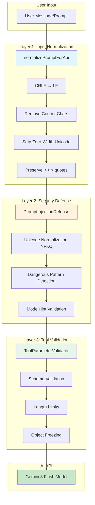
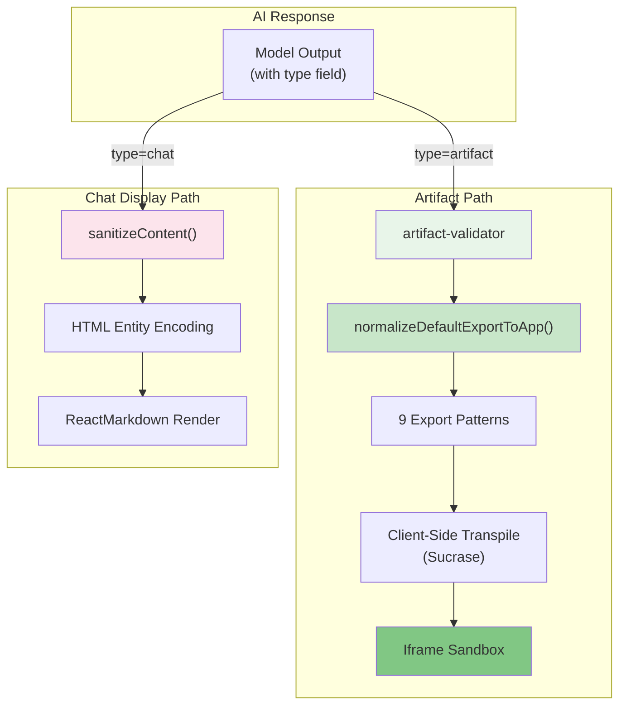
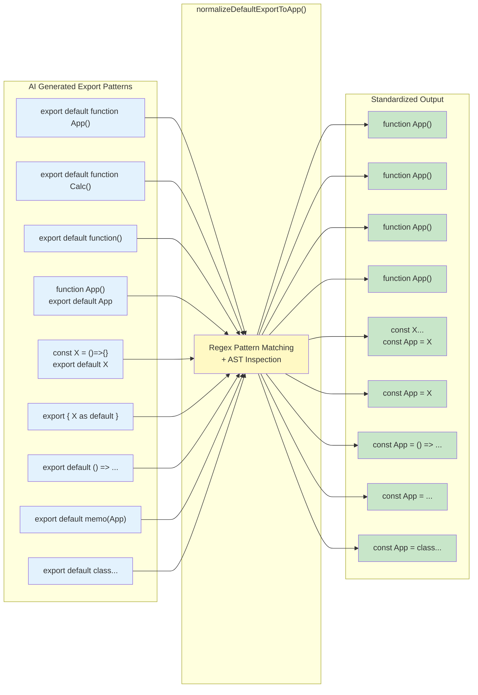
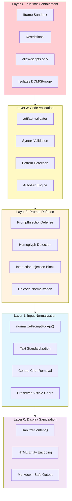
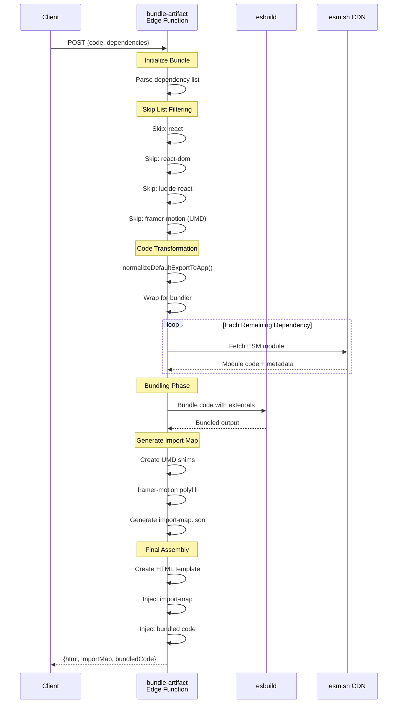

<!-- DIAGRAMS.md | Architecture Visualization Guide | Last updated: 2025-12-29 -->

# Architecture Diagrams

This document contains comprehensive Mermaid diagrams visualizing the Vana chat application architecture. These diagrams reflect the current architecture after the December 2024 refactoring that introduced `normalizePromptForApi()` and `normalizeDefaultExportToApp()` — two critical normalization layers that standardize inputs before processing and ensure consistent artifact code generation.

## Overview

The architecture is organized into five key visualization layers:

1. **Input Processing Pipeline** — User message handling through normalization and validation
2. **Output Processing & Display** — Response routing to artifact vs. chat display
3. **Export Transformation Patterns** — The 9 export patterns handled by `normalizeDefaultExportToApp()`
4. **Security Layer Stack** — Defense-in-depth from input to runtime
5. **Artifact Bundling Pipeline** — ESM module bundling with import maps

---

## 1. Input Processing Pipeline

This diagram shows the complete flow from user input through three normalization/validation layers before reaching the AI API.

### Flow Description

- **User Input**: Raw message from chat interface
- **Layer 1 (Normalization)**: `normalizePromptForApi()` standardizes text format
  - Converts CRLF line endings to LF
  - Removes control characters (0x00-0x1F, 0x7F-0x9F)
  - Strips zero-width Unicode (ZWSP, ZWNJ, ZWJ)
  - Preserves important characters: `/`, `<`, `>`, quotes
- **Layer 2 (Security)**: `PromptInjectionDefense` detects malicious patterns
  - NFKC Unicode normalization
  - Homoglyph and instruction injection detection
  - Mode hint validation
- **Layer 3 (Validation)**: Tool parameter validation
  - JSON schema validation
  - Length limit enforcement
  - Object immutability (Object.freeze)
- **API**: Cleaned input sent to Gemini 3 Flash

---

## 2. Output Processing & Display

This diagram shows how AI responses branch into two distinct paths: artifact rendering or chat display.

### Path Descriptions

**Artifact Path** (Green):
1. Validate artifact structure and code safety
2. Transform default exports to standardized form
3. Handle 9 different export patterns
4. Transpile with Sucrase (20x faster than Babel)
5. Execute in isolated iframe sandbox

**Chat Path** (Pink):
1. Sanitize HTML entities
2. Encode special characters
3. Render with ReactMarkdown for formatting

---

## 3. Export Transformation Patterns

This diagram shows all 9 export patterns that `normalizeDefaultExportToApp()` handles, transforming them into a consistent format.

### Pattern Details

The function normalizes these patterns:

1. **Named function declaration**: `export default function App()` → `function App()`
2. **Different function name**: `export default function Calc()` → `function App()`
3. **Anonymous function**: `export default function()` → `function App()`
4. **Separate declaration**: `function App() ... export default App` → `function App()`
5. **Arrow function variable**: `const X = () => {} ... export default X` → `const App = X`
6. **Named export as default**: `export { X as default }` → `const App = X`
7. **Inline arrow**: `export default () => ...` → `const App = () => ...`
8. **HOC wrapped**: `export default memo(App)` → `const App = memo(...)`
9. **Class component**: `export default class ...` → `const App = class ...`

All patterns ensure the final code has a consistent entry point: either `function App()` or `const App = ...`

---

## 4. Security Layer Stack

This diagram visualizes the defense-in-depth security architecture, with 5 layers from input sanitization through runtime containment.

### Layer Details

- **Layer 0 (Sanitization)**: For chat display only. HTML entity encoding prevents XSS in rendered markdown.
- **Layer 1 (Normalization)**: First touchpoint for user input. Removes invisible characters that could hide malicious code.
- **Layer 2 (Prompt Defense)**: Detects injection patterns before they reach the model. Homoglyph detection prevents unicode-based evasion.
- **Layer 3 (Code Validation)**: Inspects generated artifact code for dangerous patterns. Auto-fix attempts safe corrections.
- **Layer 4 (Runtime)**: Ultimate containment. Iframe sandbox prevents network access, storage access, and other dangerous APIs.

---

## 5. Artifact Bundling Pipeline

This sequence diagram shows the complete flow of artifact bundling from client request through ESM module resolution and final HTML generation.

### Pipeline Stages

1. **Request Reception**: Client sends code and list of dependencies
2. **Skip List Filtering**: Remove standard library packages
   - `react`, `react-dom` (provided by runtime)
   - `lucide-react` (icon package)
   - `framer-motion` (UMD-only fallback)
3. **Code Transformation**: Apply `normalizeDefaultExportToApp()`
4. **Dependency Resolution**: Fetch ESM modules from esm.sh CDN
5. **Bundling**: esbuild combines code with external dependencies
6. **Import Map Generation**: Create UMD shims for incompatible packages
7. **HTML Assembly**: Generate final executable HTML

### Key Design Points

- **esm.sh CDN**: Provides ESM versions of npm packages
- **Import Map**: Enables module aliasing and polyfilling
- **UMD Shims**: Converts CommonJS modules to ESM compatibility
- **Skip List**: Prevents double-bundling of base libraries

---

## Related Documentation

- [ARTIFACT_SYSTEM.md](./ARTIFACT_SYSTEM.md) — Detailed artifact system architecture
- [ARCHITECTURE.md](./ARCHITECTURE.md) — Complete system design and components
- [DATABASE_SCHEMA.md](./DATABASE_SCHEMA.md) — Data model and RPC functions
- [COMMON_PATTERNS.md](./COMMON_PATTERNS.md) — Development recipes

---

## Diagram Usage Notes

These diagrams can be rendered in:

- GitHub Markdown (native Mermaid support)
- [mermaid.live](https://mermaid.live) for interactive editing
- Local Mermaid CLI: `npm install -g @mermaid-js/mermaid-cli && mmdc -i diagram.md -o output.html`
- Obsidian, Notion, and other tools with Mermaid support

For best results on GitHub, view this file directly in the repository.
