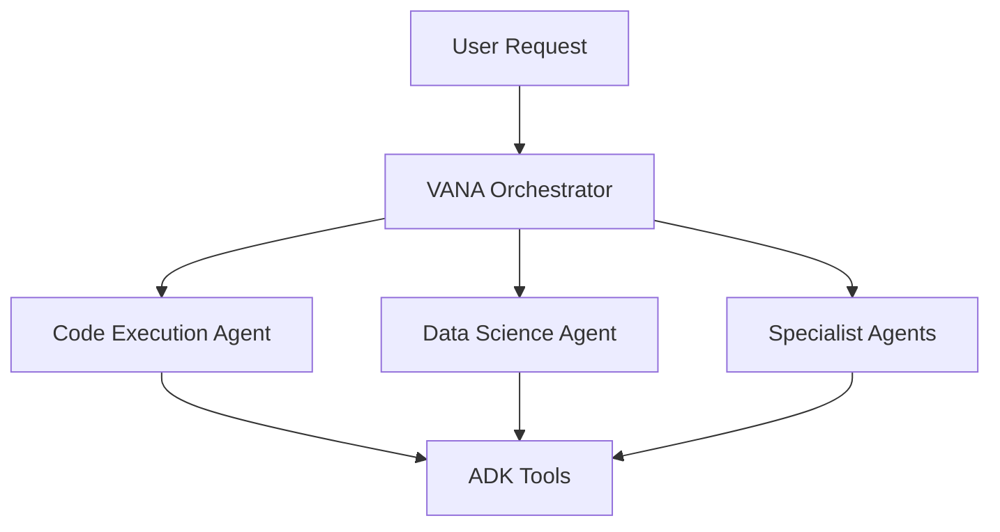

# VANA Development Guide

This guide provides comprehensive information for developers working on the VANA project.

## Table of Contents

- [Quick Start](#quick-start)
- [Architecture Overview](#architecture-overview)
- [Development Workflow](#development-workflow)
- [Common Tasks](#common-tasks)
- [Testing](#testing)
- [Debugging](#debugging)
- [Contributing](#contributing)

## Quick Start

### 🚀 One-Command Setup

```bash
make setup && make dev
```

This will:
1. Validate your environment
2. Install all dependencies
3. Setup configuration files
4. Start the development environment

### 📋 Prerequisites

- **Python 3.13+** - Required for modern async patterns and Google ADK
- **Node.js 18+** - For the React frontend
- **Poetry** - Python dependency management
- **Docker** (optional) - For containerized development

### 🔧 Environment Setup

1. **Clone the repository**:
   ```bash
   git clone https://github.com/yourusername/vana.git
   cd vana
   ```

2. **Run the setup**:
   ```bash
   make setup
   ```

3. **Configure API keys**:
   ```bash
   # Edit .env.local and add your keys
   GOOGLE_API_KEY=your-api-key-here
   ```

4. **Start development**:
   ```bash
   make dev
   ```

## Architecture Overview

### System Components

```
vana/
├── agents/               # Agent implementations
│   ├── vana/            # Main orchestrator agent
│   ├── code_execution/  # Code execution specialist
│   └── data_science/    # Data analysis specialist
├── lib/                 # Core libraries
│   ├── _tools/          # ADK tool implementations
│   ├── mcp/             # Model Context Protocol
│   └── sandbox/         # Secure execution environment
├── vana-ui/             # React frontend
└── main.py              # FastAPI backend entry
```

### Agent Hierarchy



## Development Workflow

### 1. Branch Strategy

```bash
# Create feature branch
git checkout -b feature/your-feature-name

# Create bugfix branch
git checkout -b fix/issue-description
```

### 2. Code Style

The project uses automated formatting and linting:

```bash
# Format code
make format

# Run linters
make lint

# Run security checks
make security
```

### 3. Pre-commit Hooks

Pre-commit hooks are automatically installed with `make setup`:

```bash
# Install manually
pre-commit install

# Run on all files
pre-commit run --all-files
```

## Common Tasks

### Starting Services

```bash
# Full stack (recommended)
make dev

# Backend only
make backend

# Frontend only
make frontend

# With Docker
make docker-up
```

### Running Tests

```bash
# All tests
make test

# Specific test types
make test-unit         # Unit tests only
make test-agent        # Agent tests
make test-integration  # Integration tests

# With coverage
poetry run pytest --cov=lib --cov=agents
```

### Adding Dependencies

```bash
# Python dependencies
poetry add package-name

# Development dependencies
poetry add --dev package-name

# Frontend dependencies
cd vana-ui && npm install package-name
```

### Working with Agents

1. **Creating a new agent**:
   ```python
   # agents/your_agent/team.py
   from lib._shared_libraries.base_agent import BaseAgent
   
   class YourAgent(BaseAgent):
       def __init__(self):
           super().__init__(
               name="your_agent",
               model="gemini-2.0-flash-thinking-exp-01-21",
               tools=[...]
           )
   ```

2. **Adding tools to an agent**:
   ```python
   from lib._tools import file_tool, search_tool
   
   tools = [
       file_tool.create_file,
       search_tool.search_files
   ]
   ```

### Database Operations

```bash
# Using PostgreSQL in Docker
docker-compose exec db psql -U vana

# Reset database
docker-compose down -v
docker-compose up -d
```

## Testing

### Test Structure

```
tests/
├── unit/           # Fast, isolated tests
├── integration/    # Multi-component tests
├── e2e/            # Full system tests
└── fixtures/       # Test data and mocks
```

### Writing Tests

```python
# tests/unit/test_your_feature.py
import pytest
from your_module import your_function

@pytest.mark.unit
def test_your_function():
    result = your_function("input")
    assert result == "expected"

@pytest.mark.asyncio
async def test_async_function():
    result = await async_function()
    assert result is not None
```

### Running Specific Tests

```bash
# Run a specific test file
poetry run pytest tests/unit/test_file.py

# Run tests matching a pattern
poetry run pytest -k "test_pattern"

# Run with verbose output
poetry run pytest -v
```

## Debugging

### VS Code Debugging

1. **Backend debugging**:
   - Press `F5` and select "Python: VANA Backend"
   - Set breakpoints in your code
   - Make requests to trigger breakpoints

2. **Frontend debugging**:
   - Press `F5` and select "Chrome: Launch Frontend"
   - Use Chrome DevTools for debugging

3. **Full stack debugging**:
   - Use the compound configuration "Full Stack: Backend + Frontend"

### Logging

```python
import logging
logger = logging.getLogger(__name__)

# In your code
logger.debug("Debug message")
logger.info("Info message")
logger.error("Error message", exc_info=True)
```

### Common Issues

1. **Port already in use**:
   ```bash
   # Find process using port
   lsof -i :8081
   # Kill process
   kill -9 <PID>
   ```

2. **Poetry environment issues**:
   ```bash
   # Reset environment
   poetry env remove python
   poetry install
   ```

3. **Docker issues**:
   ```bash
   # Clean restart
   docker-compose down -v
   docker system prune -f
   docker-compose up --build
   ```

## Contributing

### Code Review Checklist

- [ ] Tests added/updated
- [ ] Documentation updated
- [ ] Type hints added
- [ ] Linting passes
- [ ] Security scan passes
- [ ] Manual testing completed

### Commit Messages

Follow conventional commits:

```bash
feat: Add new agent capability
fix: Resolve memory leak in vector search
docs: Update API documentation
test: Add integration tests for orchestrator
refactor: Simplify task routing logic
```

### Pull Request Process

1. Create feature branch
2. Make changes with tests
3. Run `make format lint test`
4. Push and create PR
5. Address review feedback
6. Merge after approval

## Advanced Topics

### Performance Profiling

```python
# Use cProfile for performance analysis
python -m cProfile -o profile.stats main.py

# Analyze with snakeviz
pip install snakeviz
snakeviz profile.stats
```

### Memory Profiling

```python
# Use memory_profiler
from memory_profiler import profile

@profile
def memory_intensive_function():
    # Your code here
```

### Load Testing

```bash
# Use locust for load testing
pip install locust
locust -f tests/load/locustfile.py
```

## Resources

- [Google ADK Documentation](https://github.com/google/adk)
- [FastAPI Documentation](https://fastapi.tiangolo.com/)
- [React Documentation](https://react.dev/)
- [Poetry Documentation](https://python-poetry.org/docs/)

## Support

- **Issues**: [GitHub Issues](https://github.com/yourusername/vana/issues)
- **Discussions**: [GitHub Discussions](https://github.com/yourusername/vana/discussions)
- **Security**: security@vana.ai