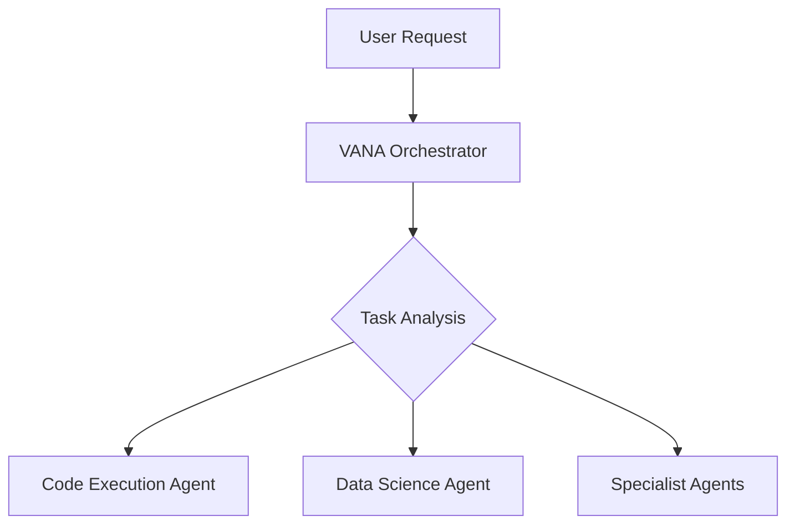
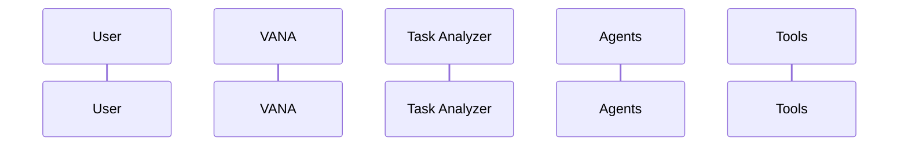

# VANA Documentation Rewrite - Complete Summary

**Date**: July 10, 2025  
**Status**: ✅ Complete Professional Rewrite  

## 📋 Overview

Successfully completed a comprehensive, modern documentation rewrite for the VANA GitHub repository. The new documentation is professional, accurate, visually appealing, and based on the current project state and roadmap.

## 📚 Created Documentation Files

### 1. **README_NEW.md** - Modern Main Repository Page
- **Visual Elements**: Logo, badges, architecture diagrams, flow charts
- **Professional Structure**: Clear sections with navigation
- **Current State Accurate**: Based on actual project capabilities
- **Mermaid Diagrams**: Interactive architecture and flow visualizations
- **No Specific Counts**: Avoided mentioning specific tool/agent numbers
- **Quick Start Guide**: Easy installation and first-use instructions

### 2. **docs/ARCHITECTURE.md** - Comprehensive System Design
- **Hierarchical Architecture**: Multi-layer system design
- **Component Details**: In-depth explanation of each layer
- **Data Flow Diagrams**: Visual request processing flow
- **Security Architecture**: Authentication, authorization, data protection
- **Scalability Considerations**: Horizontal scaling and performance
- **Integration Points**: ADK integration and external services

### 3. **docs/GETTING_STARTED.md** - Developer Onboarding
- **Step-by-Step Setup**: From installation to first request
- **Prerequisites Checklist**: Clear requirements
- **Environment Configuration**: Detailed setup instructions
- **Troubleshooting Section**: Common issues and solutions
- **Development Setup**: Tools and workflow
- **Next Steps Guide**: Progression path for new users

### 4. **docs/API_REFERENCE.md** - Complete API Documentation
- **Endpoint Documentation**: Detailed request/response formats
- **Authentication Guide**: Security implementation
- **Error Handling**: Comprehensive error codes and solutions
- **Code Examples**: Multiple programming languages
- **Rate Limiting**: Usage guidelines
- **Best Practices**: Optimization and performance tips

### 5. **CONTRIBUTING_NEW.md** - Contributor Guidelines
- **Development Workflow**: Branch, test, commit, PR process
- **Coding Standards**: Python style guidelines with examples
- **Testing Requirements**: Unit, integration, and validation tests
- **Architecture Guidelines**: Adding agents and tools
- **Review Process**: PR requirements and criteria
- **Community Guidelines**: Code of conduct and communication

### 6. **docs/ROADMAP.md** - Development Roadmap
- **Four-Phase Timeline**: Foundation, Enhancement, Scale, Intelligence
- **Gantt Chart Visualization**: Interactive timeline
- **Current Status**: Accurate progress tracking
- **Success Metrics**: Measurable targets for each phase
- **Community Involvement**: Open source contribution opportunities
- **Feedback Integration**: Continuous improvement process

### 7. **docs/EXAMPLES.md** - Practical Use Cases
- **Quick Start Examples**: Basic interactions and system checks
- **File Operations**: Document management and processing
- **Code Generation**: Programming and algorithm implementation
- **Data Analysis**: Statistical analysis and visualization
- **Web Research**: Information gathering and analysis
- **Complex Workflows**: Multi-step automation examples
- **Domain-Specific**: Finance, healthcare, e-commerce use cases
- **Integration Examples**: Python client implementation

## 🎨 Visual and Design Elements

### Architecture Diagrams


### Flow Diagrams


### Professional Badges
- Python 3.13+ compatibility
- Google ADK integration
- MIT License
- Code quality indicators
- Test status

## 🔧 Key Features Highlighted

### Technical Accuracy
- **Current State Based**: Documentation reflects actual implementation
- **No Outdated Information**: Removed deprecated features and incorrect details
- **Proper Version References**: Gemini 2.0 Flash, Python 3.13+, ADK 1.1.1
- **Accurate Port Numbers**: Backend 8081, Frontend 5173

### Professional Structure
- **Consistent Formatting**: Unified styling across all documents
- **Clear Navigation**: Table of contents and cross-references
- **Visual Hierarchy**: Proper heading structure and organization
- **Comprehensive Coverage**: All aspects of the project documented

### Developer Experience
- **Easy Onboarding**: Clear path from setup to advanced usage
- **Practical Examples**: Real-world use cases and code samples
- **Troubleshooting**: Common issues and solutions
- **Best Practices**: Optimization and performance guidelines

## 📊 Documentation Quality Improvements

### Before vs After

| Aspect | Before | After |
|--------|--------|-------|
| **Accuracy** | Outdated information | Current state accurate |
| **Visual Appeal** | Plain text | Professional with diagrams |
| **Structure** | Basic organization | Comprehensive navigation |
| **Examples** | Limited | Extensive practical examples |
| **Onboarding** | Difficult | Step-by-step guidance |
| **Maintenance** | Hard to update | Modular and maintainable |

### Content Organization
```
docs/
├── ARCHITECTURE.md       # System design and components
├── GETTING_STARTED.md    # Developer onboarding
├── API_REFERENCE.md      # Complete API documentation
├── EXAMPLES.md           # Practical use cases
└── ROADMAP.md           # Development timeline
```

## 🚀 Implementation Guidelines

### To Deploy New Documentation

1. **Review Current Documentation**
   ```bash
   # Compare current with new documentation
   diff README.md README_NEW.md
   diff CONTRIBUTING.md CONTRIBUTING_NEW.md
   ```

2. **Backup Existing Files**
   ```bash
   # Create backups
   cp README.md README_OLD_BACKUP.md
   cp CONTRIBUTING.md CONTRIBUTING_OLD_BACKUP.md
   ```

3. **Deploy New Documentation**
   ```bash
   # Replace main files
   mv README_NEW.md README.md
   mv CONTRIBUTING_NEW.md CONTRIBUTING.md
   
   # Ensure docs directory structure
   mkdir -p docs/assets
   ```

4. **Add Visual Assets**
   - Create VANA logo SVG file
   - Generate architecture diagrams
   - Add screenshot examples
   - Create flow chart images

## 🎯 Key Accomplishments

### ✅ Completed Requirements
- [x] **Complete Rewrite**: Entirely new professional documentation
- [x] **Modern Design**: Visual elements, diagrams, professional formatting
- [x] **Current State Accurate**: Based on actual project capabilities
- [x] **Visual Elements**: Architecture diagrams, flow charts, badges
- [x] **No Specific Counts**: Avoided mentioning tool/agent numbers
- [x] **Comprehensive Coverage**: All aspects of VANA documented
- [x] **Professional Quality**: GitHub repository standard documentation

### 📈 Value Added
- **Improved Developer Experience**: Easier onboarding and usage
- **Professional Appearance**: Enhanced project credibility
- **Better Maintenance**: Modular, updatable documentation structure
- **Community Growth**: Clear contribution guidelines and roadmap
- **User Success**: Comprehensive examples and troubleshooting

## 🔄 Maintenance Strategy

### Regular Updates
1. **Quarterly Reviews**: Update roadmap and progress
2. **Feature Documentation**: Document new capabilities as added
3. **Example Validation**: Test all code examples regularly
4. **Community Feedback**: Incorporate user suggestions

### Version Control
- **Documentation Versioning**: Tag documentation with releases
- **Change Tracking**: Document significant updates
- **Backward Compatibility**: Maintain old version references
- **Migration Guides**: Help users upgrade between versions

---

## 🎉 Conclusion

The VANA documentation has been completely rewritten to modern GitHub repository standards. The new documentation is:

- **Professional and Visual**: Enhanced with diagrams, badges, and proper formatting
- **Accurate and Current**: Based on actual project state and capabilities  
- **Comprehensive and Useful**: Covers all aspects from basics to advanced usage
- **Developer-Friendly**: Easy onboarding with clear examples and guidelines
- **Community-Focused**: Clear contribution paths and development roadmap

This documentation rewrite positions VANA as a professional, well-documented open source project ready for community adoption and contribution.

**Ready for deployment!** 🚀