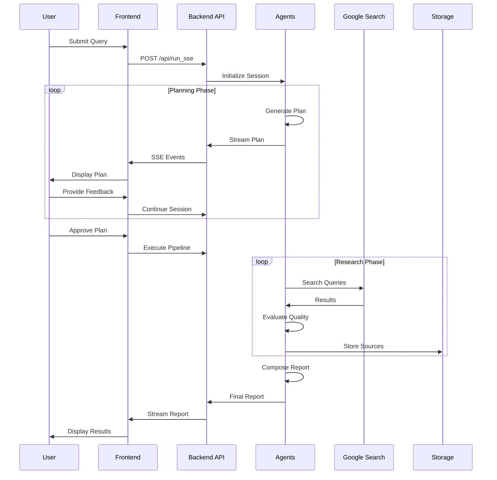
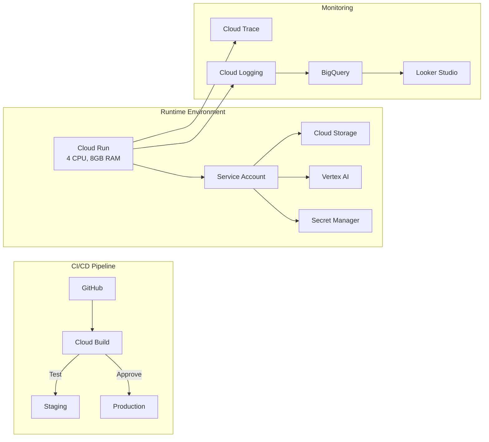

# Vana - Virtual Autonomous Network Agents

<div align="center">


**Production-Ready Multi-Agent AI Research System**

[Quick Start](#quick-start) • [Architecture](#system-architecture) • [Features](#core-features) • [Deployment](#deployment) • [Contributing](#contributing)

</div>

---

## 📋 Table of Contents

- [Overview](#overview)
- [Quick Start](#quick-start)
- [System Architecture](#system-architecture)
  - [Multi-Agent Workflow](#multi-agent-workflow)
  - [Component Architecture](#component-architecture)
  - [Data Flow](#data-flow)
- [Core Features](#core-features)
- [Agents & Capabilities](#agents--capabilities)
  - [Agent Hierarchy](#agent-hierarchy)
  - [Agent Descriptions](#agent-descriptions)
- [Tools & Integrations](#tools--integrations)
- [Development](#development)
  - [Prerequisites](#prerequisites)
  - [Local Development](#local-development)
  - [Testing](#testing)
- [Deployment](#deployment)
  - [Development Environment](#development-environment)
  - [Production CI/CD](#production-cicd)
- [API Documentation](#api-documentation)
- [Configuration](#configuration)
- [Monitoring & Observability](#monitoring--observability)
- [Contributing](#contributing)
- [License](#license)

---

## 🚀 Overview

Vana is a sophisticated multi-agent AI system built on Google's Agent Development Kit (ADK) that transforms any user request into comprehensive, well-researched reports. Using a two-phase workflow (Plan & Execute), Vana leverages multiple specialized Gemini agents working in concert to deliver production-quality research outputs with proper citations and iterative quality control.

### Key Highlights

- **🤖 Multi-Agent Architecture**: 8 specialized agents working together through orchestrated workflows
- **🔄 Two-Phase Process**: Interactive planning with human-in-the-loop followed by autonomous execution
- **📊 Quality Assurance**: Built-in research evaluation and iterative refinement loops
- **🌐 Production-Ready**: Full CI/CD pipeline, monitoring, and scalable Cloud Run deployment
- **💎 Powered by Gemini**: Leverages Gemini 2.5 Pro and Flash models for optimal performance
- **🔍 Smart Citations**: Automatic source tracking and inline citation generation

---

## ⚡ Quick Start

### Prerequisites

```bash
# Required tools
- Python 3.10+
- uv (Python package manager)
- Google Cloud SDK
- Terraform
- Node.js & npm
- make
```

### Installation

```bash
# Clone the repository
git clone https://github.com/vana-project/vana.git
cd vana

# Install dependencies
make install

# Set up Google Cloud authentication
gcloud auth application-default login
gcloud config set project analystai-454200
```

### Run Locally

```bash
# Option 1: Full development environment (backend + frontend)
make dev

# Option 2: ADK Playground (interactive testing)
make playground

# Option 3: Backend API only
make dev-backend
```

The application will be available at:
- Frontend: http://localhost:5173
- Backend API: http://localhost:8000
- API Docs: http://localhost:8000/docs

---

## 🏗️ System Architecture

### Multi-Agent Workflow


*Vana uses a two-phase approach: First, we work together to create the perfect research plan. Then, our AI agents automatically execute the research and deliver a comprehensive report.*

### Component Architecture


*A modern, cloud-native architecture built on Google Cloud Platform, featuring auto-scaling, comprehensive monitoring, and enterprise-grade security.*

### Data Flow



---

## ✨ Core Features

### 🎯 Intelligent Planning
- **Adaptive Plan Generation**: Converts any user request into structured research plans
- **Task Classification**: Automatically categorizes tasks as [RESEARCH] or [DELIVERABLE]
- **Human-in-the-Loop**: Interactive refinement ensures plans meet user expectations
- **Implied Deliverables**: Proactively suggests outputs based on research goals

### 🔍 Advanced Research Capabilities
- **Multi-Query Generation**: Each research goal spawns 4-5 targeted search queries
- **Source Tracking**: Automatic citation management with confidence scores
- **Iterative Refinement**: Quality evaluation with up to 5 refinement iterations
- **Enhanced Search**: Follow-up queries to address identified knowledge gaps

### 📝 Professional Output
- **Structured Reports**: Markdown-formatted with 4-6 logical sections
- **Inline Citations**: Automatic source attribution with clickable links
- **Quality Assurance**: Multi-model evaluation (Gemini Pro for critical tasks)
- **Custom Deliverables**: Tables, comparisons, summaries based on plan

### 🛠️ Production Infrastructure
- **Scalable Deployment**: Cloud Run with auto-scaling (1-10 instances)
- **Session Management**: In-memory or persistent (AlloyDB) options
- **Comprehensive Monitoring**: OpenTelemetry, Cloud Trace, BigQuery analytics
- **CI/CD Pipeline**: Automated testing, staging, and production deployments

---

## 🤖 Agents & Capabilities

### Agent Hierarchy


*Think of it as your personal research department: A team leader coordinates specialized agents who plan, research, quality-check, and write your reports.*

### Agent Descriptions

| Agent | Model | Purpose | Key Features |
|-------|-------|---------|--------------|
| **Interactive Planner** | Gemini 2.5 Flash | Primary user interface and orchestrator | • Converts requests to plans<br/>• Manages user interaction<br/>• Delegates to pipeline |
| **Plan Generator** | Gemini 2.5 Flash | Creates and refines research strategies | • 5-line action plans<br/>• Task classification<br/>• Minimal search usage |
| **Section Planner** | Gemini 2.5 Flash | Designs report structure | • 4-6 section outlines<br/>• Logical organization<br/>• Markdown formatting |
| **Section Researcher** | Gemini 2.5 Flash | Executes research plan | • Multi-query generation<br/>• Source collection<br/>• Synthesis of findings |
| **Research Evaluator** | Gemini 2.5 Pro | Quality assessment | • Critical evaluation<br/>• Gap identification<br/>• Follow-up queries |
| **Escalation Checker** | Custom Python | Loop control logic | • Pass/fail detection<br/>• Iteration management<br/>• Flow control |
| **Enhanced Search** | Gemini 2.5 Flash | Fills knowledge gaps | • Targeted searches<br/>• Integration with findings<br/>• Iterative improvement |
| **Report Composer** | Gemini 2.5 Pro | Final report generation | • Professional writing<br/>• Citation integration<br/>• Structured output |

---

## 🔧 Tools & Integrations

### Core Tools

| Tool | Purpose | Integration |
|------|---------|-------------|
| **Google Search** | Web research and information gathering | Native ADK integration |
| **Cloud Storage** | Artifact and large payload storage | GCS buckets |
| **Session Service** | Conversation state management | In-memory/AlloyDB |

### MCP Servers (Local Development Only)

```yaml
# These tools are available in local development via Model Context Protocol
# They are NOT part of the deployed Vana system
- chroma-vana: Document storage and retrieval
- memory-mcp: Graph-based knowledge management  
- firecrawl: Web scraping capabilities
- linear: Issue tracking integration
- kanban-board: Task management
```

---

## 💻 Development

### Prerequisites

1. **Install Required Tools**:
   ```bash
   # Install uv (Python package manager)
   curl -LsSf https://astral.sh/uv/install.sh | sh
   
   # Install other tools via package manager
   brew install google-cloud-sdk terraform node
   ```

2. **Google Cloud Setup**:
   ```bash
   gcloud auth application-default login
   gcloud config set project analystai-454200
   ```

### Local Development

```bash
# Install all dependencies
make install

# Run full stack locally
make dev
# Frontend: http://localhost:5173
# Backend: http://localhost:8000

# Run tests
make test

# Code quality checks
make lint
```

### Testing

```python
# Create test script: run_agent.py
import asyncio
from google.adk.runners import Runner
from google.adk.sessions import InMemorySessionService
from app.agent import root_agent
from google.genai import types as genai_types

async def main():
    session_service = InMemorySessionService()
    await session_service.create_session(
        app_name="app", user_id="test_user", session_id="test_session"
    )
    runner = Runner(
        agent=root_agent, app_name="app", session_service=session_service
    )
    
    query = "Create a comprehensive report on sustainable energy solutions"
    async for event in runner.run_async(
        user_id="test_user",
        session_id="test_session",
        new_message=genai_types.Content(
            role="user", 
            parts=[genai_types.Part.from_text(text=query)]
        ),
    ):
        if event.is_final_response():
            print(event.content.parts[0].text)

if __name__ == "__main__":
    asyncio.run(main())
```

Run with: `uv run python run_agent.py`

---

## 🚀 Deployment

### Development Environment

```bash
# Set up infrastructure
make setup-dev-env

# Deploy to Cloud Run
make backend

# Deploy with UI (Identity-Aware Proxy)
make backend IAP=true
```

### Production CI/CD

```bash
# One-command CI/CD setup
uvx agent-starter-pack setup-cicd \
  --staging-project analystai-staging \
  --prod-project analystai-454200 \
  --repository-name vana \
  --repository-owner vana-project \
  --git-provider github \
  --auto-approve
```

### Deployment Architecture



---

## 📚 API Documentation

### Core Endpoints

| Endpoint | Method | Description |
|----------|---------|-------------|
| `/api/apps/{app}/users/{user}/sessions` | POST | Create new session |
| `/api/run_sse` | POST | Execute agent with SSE streaming |
| `/api/apps` | GET | List available agents |
| `/feedback` | POST | Submit user feedback |
| `/docs` | GET | Interactive API documentation |

### Example Request

```bash
curl -X POST http://localhost:8000/api/run_sse \
  -H "Content-Type: application/json" \
  -d '{
    "appName": "app",
    "userId": "user123",
    "sessionId": "session456",
    "newMessage": {
      "parts": [{"text": "Research the latest AI trends"}],
      "role": "user"
    },
    "streaming": true
  }'
```

---

## ⚙️ Configuration

### Environment Variables

```bash
# Google Cloud
GOOGLE_CLOUD_PROJECT=your-project-id
GOOGLE_CLOUD_LOCATION=us-central1
GOOGLE_GENAI_USE_VERTEXAI=True

# API Keys (for AI Studio)
GOOGLE_API_KEY=your-api-key  # Optional, for AI Studio

# Session Management
SESSION_TYPE=in_memory  # or 'alloydb' for production

# Monitoring
ENABLE_TRACING=true
LOG_LEVEL=INFO
```

### Model Configuration

```python
# app/config.py
@dataclass
class ResearchConfiguration:
    critic_model: str = "gemini-2.5-pro"      # For evaluation tasks
    worker_model: str = "gemini-2.5-flash"    # For general tasks
    max_search_iterations: int = 5            # Quality refinement loops
```

---

## 📊 Monitoring & Observability

### Metrics Dashboard

Access the Looker Studio template: [Dashboard Template](https://lookerstudio.google.com/reporting/46b35167-b38b-4e44-bd37-701ef4307418/page/tEnnC)

### Key Metrics

- **Performance**: Request latency, token usage, agent execution time
- **Quality**: Research evaluation scores, iteration counts, source quality
- **Usage**: Active sessions, request volume, user engagement
- **Errors**: Failed searches, timeout rates, API errors

### Logging

```python
# Structured logging example
logger.log_struct({
    "event": "research_complete",
    "agent": "section_researcher",
    "sources_found": 12,
    "execution_time": 45.2,
    "quality_score": 0.92
}, severity="INFO")
```

---

## 🤝 Contributing

We welcome contributions! Please see our [Contributing Guidelines](CONTRIBUTING.md) for details.

### Development Process

1. Fork the repository
2. Create a feature branch (`git checkout -b feature/amazing-feature`)
3. Make your changes
4. Run tests (`make test`) and linting (`make lint`)
5. Commit your changes (`git commit -m 'Add amazing feature'`)
6. Push to the branch (`git push origin feature/amazing-feature`)
7. Open a Pull Request

### Code Style

- Python: Follow PEP 8, use type hints
- TypeScript: Use ESLint configuration
- Documentation: Update README and inline comments
- Testing: Maintain >80% coverage

---

## 📄 License

This project is licensed under the Apache License 2.0 - see the [LICENSE](LICENSE) file for details.

---

<div align="center">

[Report Issues](https://github.com/vana-project/vana/issues) • [Documentation](https://github.com/vana-project/vana/wiki) • [Discussions](https://github.com/vana-project/vana/discussions)

</div>