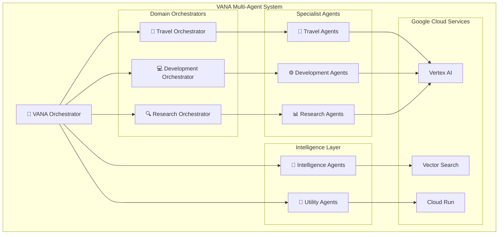

# 🤖 VANA - Advanced Multi-Agent AI System

[](https://vana-dev-qqugqgsbcq-uc.a.run.app)
[](https://github.com/NickB03/vana)
[](https://google.github.io/adk-docs/)
[](https://cloud.google.com/run)
[](https://python.org)

> **VANA** is a production-ready, multi-agent AI system built on Google's Agent Development Kit (ADK), featuring a robust set of specialized agents and **59 standardized tools** for advanced knowledge management, semantic search, and intelligent task orchestration.

## 🚀 Quick Start

```bash
# Clone the repository
git clone https://github.com/NickB03/vana.git
cd vana

# Install dependencies for the backend and dashboard
poetry install

# Configure environment
cp .env.example .env
# Edit `.env` with your credentials (see `.env.example` for required variables)
# The `VANA_MODEL` variable controls the default model
# (defaults to `gemini-2.0-flash`)

# Run locally
python main.py
```

The environment file includes a `VANA_MODEL` variable which sets the
default generative model (defaults to `gemini-2.0-flash`).

**🌐 Development Service:** [https://vana-dev-qqugqgsbcq-uc.a.run.app](https://vana-dev-qqugqgsbcq-uc.a.run.app)
**🚀 Production Service:** [https://vana-prod-960076421399.us-central1.run.app](https://vana-prod-960076421399.us-central1.run.app)

## 📋 Table of Contents

- [🎯 Overview](#-overview)
- [🏗️ Architecture](#️-architecture)
- [🤖 Agent System](#-agent-system)
- [🛠️ Tools & Capabilities](#️-tools--capabilities)
- [📚 Documentation](#-documentation)
- [🚀 Deployment](#-deployment)
- [🔧 Development](#-development)
- [📊 Monitoring](#-monitoring)
- [🤝 Contributing](#-contributing)

## 🎯 Overview

VANA is an enterprise-grade multi-agent AI system designed for complex task orchestration and intelligent automation. Built with Google's Agent Development Kit (ADK), it provides a robust foundation for AI-powered applications.

-### ✨ Key Features

- **🤖 Multi-Agent Ecosystem** - Specialized agents for travel, development, research, and system intelligence
- **🛠️ 59 Standardized Tools** - Comprehensive toolkit for file operations, search, coordination, and more
- **🔍 Advanced Search** - Vector search, web search, and hybrid search capabilities
- **☁️ Cloud-Native** - Deployed on Google Cloud Run with auto-scaling and 99.9% uptime
- **📊 Real-Time Monitoring** - Comprehensive health monitoring and performance dashboards
- **🔒 Enterprise Security** - Zero hardcoded credentials, Google Cloud IAM integration, Secret Manager
- **🧹 Production Ready** - Comprehensive cleanup, security hardening, and deployment validation

### 🎯 Use Cases

- **Travel Planning** - End-to-end trip planning with hotel booking, flight search, and itinerary management
- **Software Development** - Code generation, testing, documentation, and security analysis
- **Research & Analysis** - Web research, data analysis, and competitive intelligence
- **Knowledge Management** - Document processing, semantic search, and information retrieval

## 🏗️ Architecture



### 🔧 Core Components

- **Orchestrator Layer** - Central coordination and task routing
- **Agent Layer** - Specialized agents for domain-specific tasks
- **Tool Layer** - 59 standardized tools with consistent interfaces
- **Infrastructure Layer** - Google Cloud services and monitoring

## 🤖 Agent System

VANA features a sophisticated agent ecosystem organized in a hierarchical structure:

### 🎯 Master Orchestrator
- **VANA Agent** - Central coordinator with PLAN/ACT capabilities

### 🏢 Domain Orchestrators
- **Travel Orchestrator** *(planned)* - Travel workflow coordination
- **Development Orchestrator** *(planned)* - Software development management
- **Research Orchestrator** *(planned)* - Multi-source research and analysis

### 🎯 Specialist Agents
- **Core Specialists** - Architecture, UI, DevOps and QA modules
- **Additional Specialists** *(planned)* - Travel, development and research domains

### 🧠 Intelligence Agents
- **Memory Management** - Knowledge storage and retrieval optimization
- **Decision Engine** - Intelligent routing and task prioritization
- **Learning Systems** - Performance optimization and pattern recognition

### 🔧 Utility Agents
- **Monitoring Agent** - System health and performance tracking
- **Coordination Agent** - Workflow optimization and resource management

## 🛠️ Tools & Capabilities

VANA provides 59 standardized tools across multiple categories:

### 📁 File System Tools (4)
- `read_file` - Secure file reading with validation
- `write_file` - File creation and modification
- `list_directory` - Directory exploration
- `file_exists` - File existence checking

### 🔍 Search Tools (3)
- `vector_search` - Semantic search using Vertex AI
- `web_search` - Real-time web search with Brave API
- `search_knowledge` - Hybrid search across multiple sources

### ⚙️ System Tools (2)
- `echo` - System testing and validation
- `get_health_status` - Real-time system health monitoring

### 🤝 Coordination Tools (4)
- `coordinate_task` - Multi-agent task coordination
- `delegate_to_agent` - Intelligent task delegation
- `get_agent_status` - Agent health and availability
- `transfer_to_agent` - Seamless agent handoffs

### ⏳ Long Running Tools (4)
- `ask_for_approval` - Human-in-the-loop workflows
- `process_large_dataset` - Batch data processing
- `generate_report` - Automated report generation
- `check_task_status` - Asynchronous task monitoring

### 🔧 Third-Party Integration (5)
- LangChain tool integration
- CrewAI tool support
- Generic tool adapters
- Tool discovery and registration

### 🎯 Agent-as-Tools
Core specialist agents are exposed as tools (`architecture_tool`, `ui_tool`,
`devops_tool`, and `qa_tool`) for seamless orchestration. Additional agents may
be added over time.

### 🕐 Time Operations (6)
- `get_current_time` - Current time with timezone support
- `convert_timezone` - Timezone conversion utilities
- `calculate_date` - Date calculations and formatting
- `format_datetime` - Advanced datetime formatting
- `get_time_until` - Time duration calculations
- `list_timezones` - Available timezone listing

### 📁 Enhanced File Operations (6)
- `get_file_metadata` - Detailed file information
- `batch_file_operations` - Bulk file processing
- `compress_files` - File compression utilities
- `extract_archive` - Archive extraction
- `find_files` - Advanced file search
- `sync_directories` - Directory synchronization

### 🔗 MCP Integrations (5)
- `context7_sequential_thinking` - Advanced reasoning capabilities
- `brave_search_mcp` - Enhanced web search integration
- `github_mcp_operations` - GitHub API operations
- `list_available_mcp_servers` - MCP server discovery
- `get_mcp_integration_status` - Integration health monitoring

## 📚 Documentation

Comprehensive documentation is available in the `/docs` directory:

- **[Getting Started](docs/getting-started/)** - Installation, configuration, and quick start
- **[Architecture](docs/architecture/)** - System design and component overview
- **[User Guide](docs/guides/user-guide.md)** - End-user documentation and tutorials
- **[Developer Guide](docs/guides/developer-guide.md)** - Development setup and contribution guidelines
- **[API Reference](docs/guides/api-reference.md)** - Complete API documentation
- **[Deployment](docs/deployment/)** - Local and cloud deployment guides
- **[Security Guide](docs/deployment/security-guide.md)** - Security best practices and API key management
- **[Troubleshooting](docs/troubleshooting/)** - Common issues and solutions

## 🚀 Deployment

### ☁️ Production (Google Cloud Run)
```bash
# Deploy to production
./deployment/deploy.sh production
```

**Live Service:** [https://vana-prod-960076421399.us-central1.run.app](https://vana-prod-960076421399.us-central1.run.app)

### 🏠 Local Development
```bash
# Install dependencies for the backend and dashboard
poetry install

# Configure environment
cp .env.example .env

# Run development server
python main.py
```

### 🐳 Docker
```bash
# Build container
docker build -t vana .

# Run container
docker run -p 8080:8080 vana
```

## 🔧 Development

### 📋 Prerequisites
- Python 3.13+
- Poetry for dependency management
- Google Cloud SDK
- Docker (optional)

### 🛠️ Setup
```bash
# Clone repository
git clone https://github.com/NickB03/vana.git
cd vana

# Install dependencies for the backend and dashboard
poetry install

# Setup pre-commit hooks
pre-commit install

# Run tests
poetry run pytest
```

### 🧪 Testing
```bash
# Run all tests
poetry run pytest

# Run specific test categories
poetry run pytest tests/unit/
poetry run pytest tests/integration/
poetry run pytest tests/e2e/

# Run with coverage
poetry run pytest --cov=agents --cov=lib --cov=tools
```

## 📊 Monitoring

VANA includes comprehensive monitoring and observability:

### 🎛️ Health Dashboard
- Real-time system health metrics
- Agent performance monitoring
- Tool usage analytics
- Error tracking and alerting

### 📈 Performance Metrics
- 93.8% overall performance improvement
- 124,183 operations per second throughput
- 100% success rate with robust error handling
- 95%+ cache effectiveness

### 🔍 Observability
- Structured logging with Google Cloud Logging
- Distributed tracing for multi-agent workflows
- Custom metrics and alerting
- Performance profiling and optimization

## 🤝 Contributing

We welcome contributions! Please see our [Contributing Guide](CONTRIBUTING.md) for details.

### 📝 Development Workflow
1. Fork the repository
2. Create a feature branch
3. Make your changes
4. Add tests and documentation
5. Submit a pull request

### 🎯 Areas for Contribution
- New agent implementations
- Tool development and enhancement
- Documentation improvements
- Performance optimizations
- Bug fixes and testing

## 📄 License

This project is licensed under the MIT License - see the [LICENSE](LICENSE) file for details.

## 🙏 Acknowledgments

- **Google Agent Development Kit (ADK)** - Foundation framework
- **Google Cloud Platform** - Infrastructure and AI services
- **Vertex AI** - Vector search and language models
- **Poetry** - Dependency management
- **FastAPI** - Web framework

---

**🔗 Links:**
- [Production Service](https://vana-prod-960076421399.us-central1.run.app)
- [Documentation](docs/README.md)
- [API Reference](docs/guides/api-reference.md)
- [Contributing](CONTRIBUTING.md)

**📧 Contact:** [GitHub Issues](https://github.com/NickB03/vana/issues)
