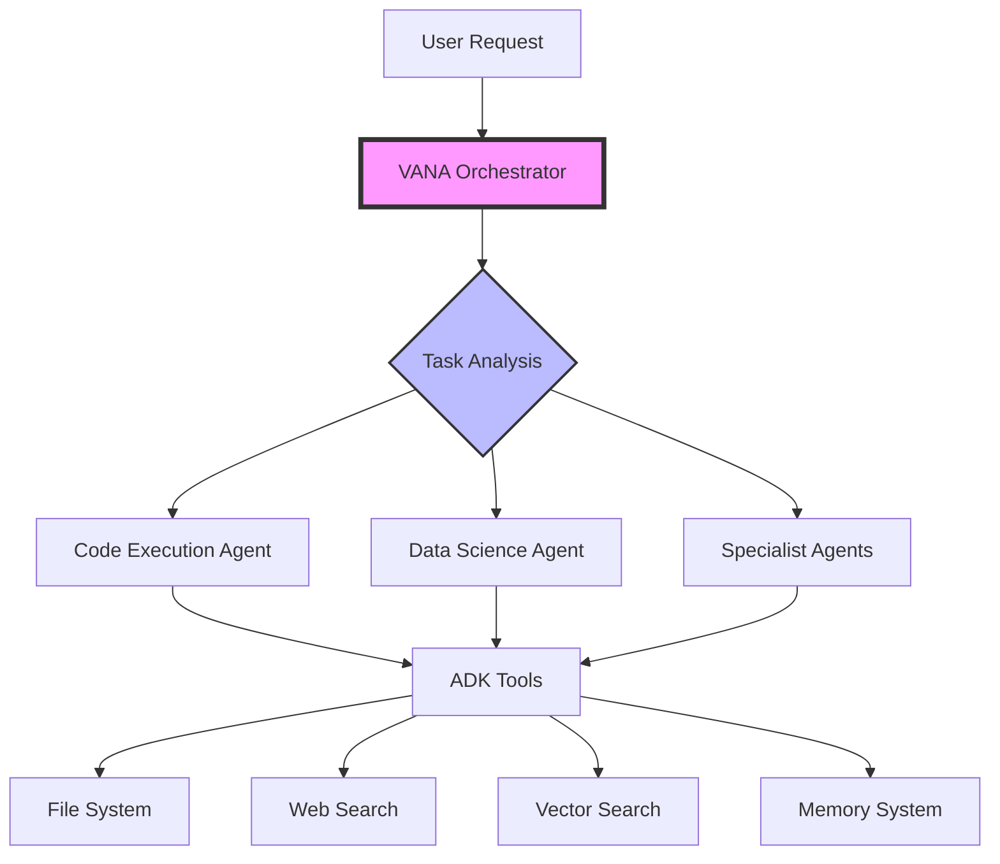
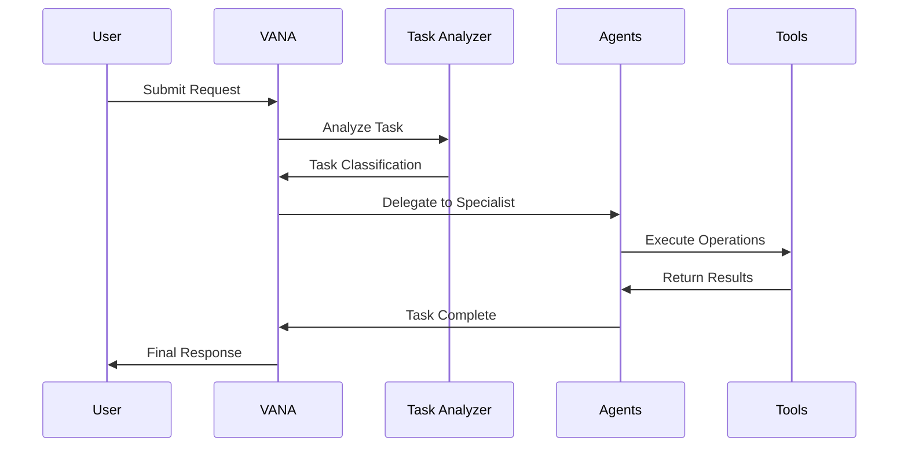

# VANA: Advanced Multi-Agent AI System 

<!-- TEST CHANGE - Updated Jul 10, 2025 at 11:54 AM -->

<div align="center">
  
  
  [](https://www.python.org/downloads/)
  [](https://github.com/google/adk)
  [](https://opensource.org/licenses/MIT)
  []()
  []()
  
  **Orchestrate specialized AI agents for complex task automation**
  
  [Features](#features) • [Quick Start](#quick-start) • [Architecture](#architecture) • [Documentation](#documentation) • [Contributing](#contributing)
</div>

---

## 🌟 Overview

VANA is a sophisticated multi-agent AI orchestration system built on Google's Agent Development Kit (ADK). It intelligently coordinates specialized agents to handle complex tasks through advanced task decomposition, parallel execution, and seamless tool integration.

### Key Capabilities

- **🤖 Intelligent Orchestration**: Dynamic agent selection based on task requirements
- **🔧 Extensible Tool Ecosystem**: Comprehensive toolkit for file operations, web search, data analysis, and more
- **🧠 Advanced Task Analysis**: NLP-powered task understanding and routing
- **⚡ Parallel Processing**: Efficient concurrent task execution
- **🔄 Workflow Management**: Complex multi-step workflow automation
- **🛡️ Enterprise Security**: Built-in security measures and audit logging

## 🚀 Quick Start

### Prerequisites

- Python 3.13+ (required for modern async patterns)
- Poetry for dependency management
- Google Cloud API key for Gemini models

### Installation

```bash
# Clone the repository
git clone https://github.com/yourusername/vana.git
cd vana

# Install dependencies
poetry install

# Set up environment
cp .env.example .env
# Add your GOOGLE_API_KEY to .env

# Start the backend
python main.py
```

The API will be available at `http://localhost:8081`

### Your First Request

```bash
curl -X POST http://localhost:8081/run \
  -H "Content-Type: application/json" \
  -d '{"input": "Analyze the sales data in reports/ and create visualizations"}'
```

## 🏗️ Architecture

<div align="center">
  
</div>

### System Components



### Agent Flow

<div align="center">
  
</div>



## 📚 Documentation

### Core Concepts

#### Multi-Agent Architecture
VANA employs a hierarchical agent structure where the orchestrator delegates tasks to specialized agents based on their capabilities and the task requirements.

#### Task Analysis Engine
Advanced NLP-powered analysis determines task type, complexity, required capabilities, and optimal execution strategy.

#### Tool Integration
Seamless integration with Google ADK provides a rich set of tools for file operations, web searching, data processing, and more.

### API Reference

#### POST /run
Execute a task through VANA orchestration.

**Request:**
```json
{
  "input": "Your task description here"
}
```

**Response:**
```json
{
  "result": {
    "output": "Task completed successfully...",
    "id": "session_uuid"
  }
}
```

#### GET /health
Check system health status.

**Response:**
```json
{
  "status": "healthy"
}
```

## 🛠️ Development

### Project Structure

```
vana/
├── agents/               # Agent implementations
│   ├── vana/            # Main orchestrator
│   ├── code_execution/  # Code execution specialist
│   └── data_science/    # Data analysis specialist
├── lib/                 # Core libraries
│   ├── _tools/          # ADK tool implementations
│   ├── _shared/         # Shared utilities
│   └── mcp/             # Model Context Protocol
├── tests/               # Test suites
├── docs/                # Documentation
└── main.py              # FastAPI application
```

### Running Tests

```bash
# Run unit tests
poetry run pytest tests/unit -v

# Run integration tests
poetry run pytest tests/integration -v

# Run validation scripts
python validate_workflow_engine.py
python validate_task_analyzer.py

# Run comprehensive test suite
./scripts/run_comprehensive_tests.sh
```

### Code Quality

```bash
# Format code
poetry run black .

# Sort imports
poetry run isort .

# Run linters
poetry run flake8
poetry run mypy .

# Security scan
poetry run bandit -r .
```

## 🗺️ Roadmap

### Phase 1: Foundation (Complete ✅)
- [x] Core orchestration system
- [x] ADK integration
- [x] Basic agent implementations
- [x] Tool ecosystem

### Phase 2: Enhancement (Current 🚧)
- [ ] Advanced workflow templates
- [ ] Real-time collaboration features
- [ ] Enhanced memory systems
- [ ] Performance optimizations

### Phase 3: Scale (Planned 📋)
- [ ] Distributed agent execution
- [ ] Enterprise integrations
- [ ] Advanced monitoring dashboard
- [ ] Custom agent SDK

### Phase 4: Intelligence (Future 🔮)
- [ ] Self-improving agents
- [ ] Automated workflow generation
- [ ] Cross-agent learning
- [ ] Predictive task optimization

## 🤝 Contributing

We welcome contributions! Please see our [Contributing Guide](CONTRIBUTING.md) for details.

### Development Setup

1. Fork the repository
2. Create a feature branch (`git checkout -b feature/amazing-feature`)
3. Make your changes
4. Run tests (`poetry run pytest`)
5. Commit your changes (`git commit -m 'Add amazing feature'`)
6. Push to the branch (`git push origin feature/amazing-feature`)
7. Open a Pull Request

### Code Standards

- Follow PEP 8 style guidelines
- Write comprehensive tests
- Document all public APIs
- Keep commits atomic and well-described

## 📄 License

This project is licensed under the MIT License - see the [LICENSE](LICENSE) file for details.

## 🙏 Acknowledgments

- Built on [Google's Agent Development Kit (ADK)](https://github.com/google/adk)
- Powered by Gemini AI models
- Inspired by modern orchestration patterns

---

<div align="center">
  <p>Built with ❤️ by the VANA Team</p>
  <p>
    <a href="https://github.com/yourusername/vana">GitHub</a> •
    <a href="https://vana-docs.com">Documentation</a> •
    <a href="https://discord.gg/vana">Community</a>
  </p>
</div>