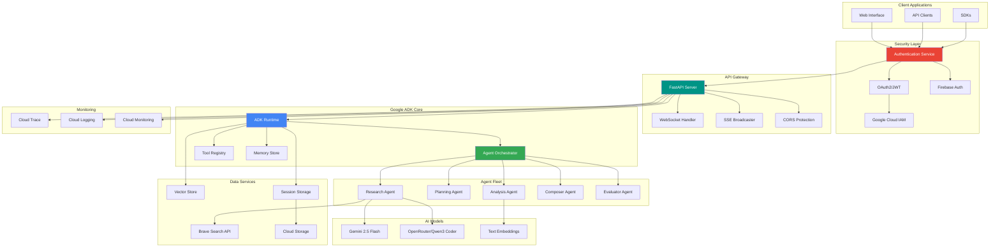
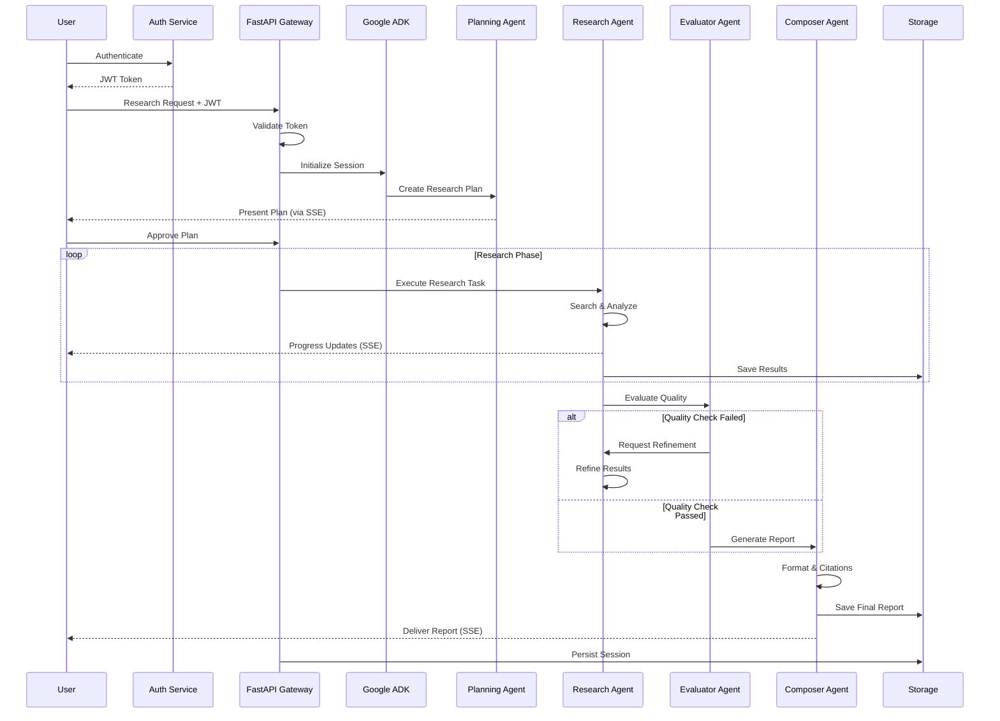
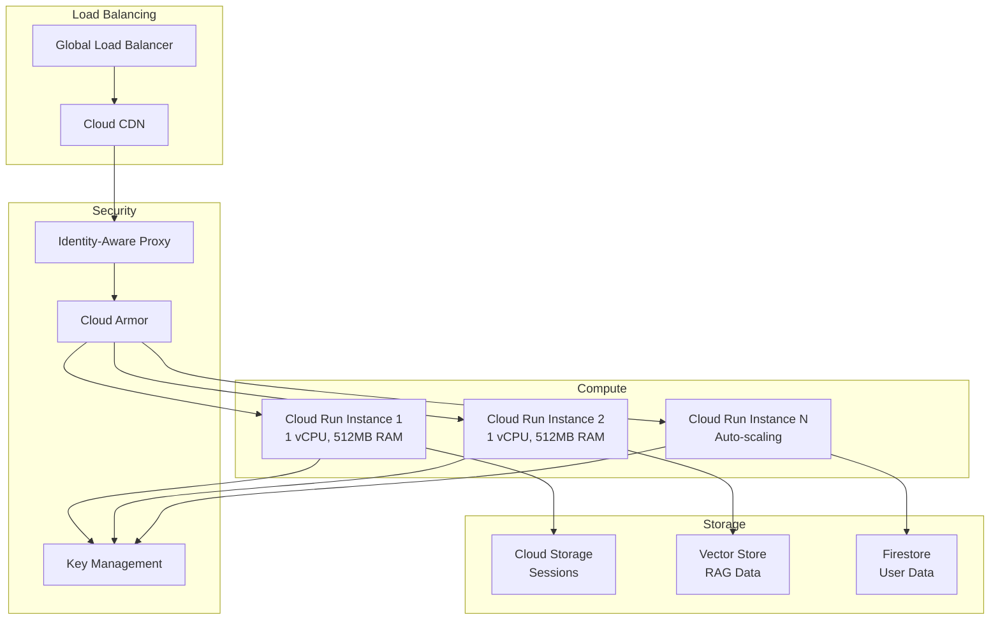

# 🚀 Vana - Virtual Autonomous Network Agents

<div align="center">

[](https://github.com/NickB03/vana/stargazers)
[](https://github.com/NickB03/vana/actions)
[](https://github.com/NickB03/vana/actions)
[](#-security-features)

[](https://www.python.org/downloads/)
[](https://cloud.google.com/products/ai)
[](https://fastapi.tiangolo.com/)
[](LICENSE)

**Multi-Agent AI Research System Built on Google's Agent Development Kit**

Transform complex research tasks into comprehensive reports with AI agents working collaboratively

[🚀 Quick Start](#-quick-start) • [🤖 How It Works](#-how-it-works) • [✨ Features](#-key-features) • [🏗️ Architecture](#️-architecture) • [📚 Documentation](#-documentation)

</div>

---

## 📑 Table of Contents

- [🎯 Overview](#-overview)
- [🤖 How It Works](#-how-it-works)
- [✨ Key Features](#-key-features)
- [🚀 Quick Start](#-quick-start)
- [🏗️ Architecture](#️-architecture)
- [🔐 Security Features](#-security-features)
- [📚 API Reference](#-api-reference)
- [💻 Development](#-development)
- [🧪 Testing](#-testing)
- [🚢 Deployment](#-deployment)
- [🛣️ Roadmap](#️-roadmap)
- [📚 Documentation](#-documentation)
- [🤝 Contributing](#-contributing)
- [📄 License](#-license)

---

## 🎯 Overview

**Vana** is a production-ready multi-agent AI research platform that transforms complex research questions into comprehensive, well-sourced reports. Built on Google's Agent Development Kit (ADK), Vana orchestrates 8 specialized AI agents that work collaboratively to deliver professional-grade research in minutes.

### 🌟 What Makes Vana Special?

<div align="center">


</div>

- **🧠 Google ADK Foundation**: Built on Google's enterprise-grade Agent Development Kit for reliability and scalability
- **🤖 8 Specialized AI Agents**: Each agent has specific expertise - from planning and research to quality assurance and report generation
- **⚡ Real-time Streaming**: Watch your research come together with live updates via Server-Sent Events (SSE)
- **🔐 Enterprise Security**: OAuth2/JWT authentication, role-based access, and secure session management
- **📊 Production Quality**: Comprehensive testing suite with 342+ tests ensuring reliability and performance

### 🎯 Perfect For

- **Researchers** who need comprehensive literature reviews and analysis
- **Analysts** requiring multi-source data synthesis and reporting  
- **Students** working on research papers and academic projects
- **Professionals** needing market research, competitive analysis, or technical documentation
- **Developers** building AI-powered research tools and applications

---

## 🤖 How It Works

Vana uses a two-phase approach that combines human oversight with AI automation for optimal results:

<div align="center">


</div>

### Phase 1: Interactive Planning (1-2 minutes)
1. **You describe** your research need in natural language
2. **AI creates a structured plan** breaking down your request into research sections
3. **You review and approve** the plan, making any adjustments needed
4. **Research begins** with your approval

### Phase 2: Autonomous Research (3-5 minutes)
1. **8 AI agents activate** - each with specialized roles and capabilities
2. **Parallel execution** - agents work simultaneously for maximum efficiency
3. **Quality assurance** - built-in evaluation and refinement processes
4. **Complete report delivered** - properly formatted with citations and sources

### Meet Your AI Research Team

<div align="center">


</div>

**🎯 Team Leader**: Coordinates the entire research process and manages task distribution

**📋 Planning Team**: Creates research strategies and organizes report structure
- Plan Generator: Develops comprehensive research strategies
- Section Planner: Structures and organizes content flow

**🔍 Research Team**: Executes the actual information gathering and analysis
- Section Researcher: Finds and processes relevant information
- Enhanced Search: Performs deep research using advanced search techniques

**✅ Quality Team**: Ensures accuracy and completeness of research
- Research Evaluator: Validates information quality and relevance
- Escalation Checker: Final quality control and consistency verification

**📝 Report Writer**: Synthesizes all findings into a professional, well-cited report

---

## ✨ Key Features

### 🧠 **Powered by Google ADK**
- **Enterprise-Grade Foundation**: Built on Google's Agent Development Kit for reliability and scale
- **Gemini AI Models**: Access to Google's most advanced language models (Gemini 2.5 Pro/Flash)
- **Cloud-Native Design**: Seamless integration with Google Cloud Platform services
- **Production Ready**: Comprehensive testing and monitoring for enterprise deployment

### 🤖 **Multi-Agent Intelligence**
- **8 Specialized AI Agents**: Each agent optimized for specific research tasks
- **Parallel Processing**: Agents work simultaneously for maximum efficiency
- **Quality Assurance**: Built-in evaluation, fact-checking, and refinement processes
- **Intelligent Coordination**: Advanced orchestration ensures optimal task distribution

### 🔐 **Enterprise Security**
- **Multiple Auth Methods**: OAuth2/JWT, Firebase Auth, API keys, or development mode
- **Role-Based Access**: Fine-grained permissions and user isolation
- **Data Protection**: End-to-end encryption, secure sessions, CORS protection
- **Audit Trail**: Complete logging and monitoring of all activities

### ⚡ **Real-Time Experience**
- **Live Updates**: Watch research progress with Server-Sent Events (SSE) streaming
- **Interactive Planning**: Review and approve research plans before execution
- **Session Persistence**: Resume work seamlessly across sessions and restarts
- **Zero Memory Leaks**: Optimized for long-running production deployments

### 📊 **Professional Output**
- **Comprehensive Reports**: Well-structured documents with proper citations
- **Multiple Formats**: Support for various output formats and styles
- **Source Tracking**: Full attribution and reference management
- **Quality Control**: Multi-stage validation ensures accuracy and completeness

---

## 🚀 Quick Start

Get Vana running locally in just a few minutes:

### Prerequisites

```bash
# Required tools (install these first)
- Python 3.10+
- uv (Python package manager)
- Google Cloud SDK
- make
```

### Installation

```bash
# 1. Clone the repository
git clone https://github.com/NickB03/vana.git
cd vana

# 2. Install all dependencies
make install

# 3. Set up Google Cloud authentication
gcloud auth application-default login
gcloud config set project your-project-id
```

### Configuration

Create `.env.local` in the root directory:

```bash
# Required API keys
BRAVE_API_KEY=your-brave-search-api-key
GOOGLE_CLOUD_PROJECT=your-project-id

# Authentication (choose one)
JWT_SECRET_KEY=your-jwt-secret-key    # For JWT auth
# OR set AUTH_REQUIRED=false for development

# Optional: Use OpenRouter for faster responses
OPENROUTER_API_KEY=your-openrouter-key
```

### Launch Vana

```bash
# Start the backend service
make dev-backend

# 🎉 Vana is now running!
# • API: http://localhost:8000
# • Interactive Docs: http://localhost:8000/docs
# • Health Check: http://localhost:8000/health

# Optional: Start ADK playground for testing
make playground  # http://localhost:8501
```

### Your First Research Request

```bash
# Test with curl
curl -X POST http://localhost:8000/api/run_sse \
  -H "Content-Type: application/json" \
  -d '{
    "appName": "app",
    "userId": "user123",
    "newMessage": {
      "parts": [{"text": "Research the latest trends in renewable energy"}],
      "role": "user"
    },
    "streaming": true
  }'
```

🚀 **That's it!** Your research request will be processed by 8 AI agents working in parallel.

---

## 🏗️ Architecture

### System Architecture



### Multi-Agent Workflow



---

## 🔐 Security Features

Vana implements enterprise-grade security to protect your research data and ensure safe operation:

### 🔑 **Multiple Authentication Options**
- **OAuth2/JWT**: Industry-standard token-based authentication
- **Firebase Auth**: Google's managed authentication service
- **API Keys**: Simple key-based access for API clients
- **Development Mode**: Optional auth bypass for local development

### 🛡️ **Data Protection**
- **End-to-End Encryption**: All data encrypted in transit and at rest
- **Session Security**: Secure session management with automatic cleanup
- **CORS Protection**: Cross-origin resource sharing controls
- **Rate Limiting**: Protection against abuse and DDoS attacks

### 👥 **Access Control**
- **Role-Based Permissions**: Fine-grained access control (RBAC)
- **User Isolation**: Complete separation of user data and sessions  
- **Audit Trail**: Comprehensive logging of all activities
- **Token Management**: Automatic refresh and secure token storage

---

## 📚 API Reference

### Core Endpoints

| Endpoint | Method | Auth | Description |
|----------|--------|------|-------------|
| `/health` | GET | ❌ | Health check and service status |
| `/api/run_sse` | POST | ✅ | Execute research tasks with real-time streaming |
| `/api/apps/{app}/users/{user}/sessions` | GET/POST | ✅ | Manage user sessions |
| `/auth/login` | POST | ❌ | Authenticate and receive JWT token |

### Quick Examples

**Health Check:**
```bash
curl http://localhost:8000/health
```

**Research Request:**
```bash
# With authentication
curl -X POST http://localhost:8000/api/run_sse \
  -H "Content-Type: application/json" \
  -H "Authorization: Bearer $YOUR_TOKEN" \
  -d '{
    "appName": "app",
    "userId": "user123",
    "newMessage": {
      "parts": [{"text": "Research the latest AI developments"}],
      "role": "user"
    },
    "streaming": true
  }'
```

**Python Client Example:**
```python
import httpx

# Simple research request
response = httpx.post("http://localhost:8000/api/run_sse", json={
    "appName": "app", 
    "userId": "user123",
    "newMessage": {"parts": [{"text": "Your research topic"}], "role": "user"},
    "streaming": True
})
```

📖 **Complete API documentation available at:** `http://localhost:8000/docs` when running locally

---

## 💻 Development

### Environment Setup

1. **Install Tools**:
   ```bash
   # Install uv (Python package manager)
   curl -LsSf https://astral.sh/uv/install.sh | sh
   
   # Install other tools
   brew install google-cloud-sdk node
   ```

2. **Google Cloud Setup**:
   ```bash
   gcloud auth application-default login
   gcloud config set project your-project-id
   ```

3. **Environment Configuration**:
   ```bash
   # Copy example environment file
   cp .env.example .env.local
   
   # Edit .env.local with your settings
   vim .env.local
   ```

### Local Development

```bash
# Install all dependencies
make install

# Run development server
make dev-backend    # Backend only
make dev-frontend   # Frontend only (when available)
make dev           # Full stack

# Development URLs
# Backend API: http://localhost:8000
# Frontend: http://localhost:5173 (when available)
# API Docs: http://localhost:8000/docs
# Health: http://localhost:8000/health
```

### Code Quality

```bash
# Run all tests
make test

# Code linting and formatting
make lint

# Type checking
make typecheck

# All quality checks
make test && make lint && make typecheck
```

---

## 🧪 Testing

### Comprehensive Test Suite

Vana includes a complete testing framework designed to ensure reliability and help developers understand the codebase:

#### Test Categories

| Category | Purpose | Location |
|----------|---------|----------|
| **Unit Tests** | Test individual components in isolation | `tests/unit/` |
| **Integration Tests** | Test component interactions and API endpoints | `tests/integration/` |
| **Performance Tests** | Benchmark performance and detect memory leaks | `tests/performance/` |
| **E2E Tests** | Full workflow testing from API to agent execution | `tests/e2e/` |

#### Running Tests

```bash
# Run all tests
make test

# Run specific test categories
uv run pytest tests/unit -v           # Unit tests only
uv run pytest tests/integration -v    # Integration tests only
uv run pytest tests/performance -v    # Performance tests only

# Run tests with coverage report
uv run pytest --cov=app --cov-report=html tests/
open htmlcov/index.html  # View coverage report
```

#### Key Test Files for Understanding the System

```bash
# Authentication system
tests/unit/test_auth.py              # JWT and OAuth2 logic
tests/integration/test_auth_api.py   # Authentication endpoints

# Agent system
tests/integration/test_adk_integration.py  # ADK agent tests
tests/integration/test_agent.py            # Agent orchestration

# Real-time streaming
tests/unit/test_sse_broadcaster.py         # SSE implementation
tests/integration/test_sse_connections.py  # SSE API tests

# Session management
tests/integration/test_session_management.py  # Session persistence

# Memory leak prevention
tests/unit/test_sse_memory_leak_fixes.py     # Memory management tests
```

#### Writing Your Own Tests

```python
# Example test structure
import pytest
from app.agent import ResearchAgent

@pytest.mark.asyncio
async def test_research_agent():
    """Test the research agent's ability to process queries."""
    agent = ResearchAgent()
    result = await agent.research("test query")
    assert result is not None
    assert "citations" in result
```

The test suite serves as living documentation - explore the tests to understand how each component works.

---

## 🚢 Deployment

### Quick Deployment

```bash
# Development
make dev                    # Full local stack
make dev-backend           # Backend only (port 8000)
make playground            # ADK playground (port 8501)

# Production
make backend               # Deploy to Cloud Run
make backend IAP=true      # Deploy with IAP authentication
```

### Production Architecture



### CI/CD Pipeline

```bash
# Automated setup
uvx agent-starter-pack setup-cicd \
  --staging-project your-staging \
  --prod-project your-prod \
  --repository-name vana \
  --repository-owner NickB03 \
  --git-provider github \
  --auto-approve
```

---

## 🛣️ Roadmap

### Current: Research Platform ✅
- **Multi-Agent Research System**: 8 specialized AI agents working collaboratively
- **Google ADK Integration**: Full compatibility with ADK 1.8.0 and Gemini models
- **Production Ready**: Comprehensive security, testing, and monitoring
- **Real-time Streaming**: Live updates with Server-Sent Events (SSE)

### Next: Enhanced Frontend 🚧
- **Phase 2: shadcn-based multi-agent frontend** - Modern, interactive interface for seamless research experiences

### Future Enhancements 🔮
- Additional agent specializations (code, data analysis, integration)
- Enterprise features (team workspaces, admin dashboard)
- Plugin ecosystem and custom agent development
- Mobile applications and multi-platform support

**Want to influence our roadmap?** [Open an issue](https://github.com/NickB03/vana/issues) or [start a discussion](https://github.com/NickB03/vana/discussions) to share your ideas!

---

## 📚 Documentation

### 🚀 Getting Started
- **[Quick Start Guide](#-quick-start)** - Get running in minutes
- **[How It Works](#-how-it-works)** - Understand the two-phase research process
- **[API Reference](#-api-reference)** - Essential endpoints and examples

### 🔧 For Developers
- **[Development Setup](#-development)** - Local development environment
- **[Testing Framework](#-testing)** - Comprehensive test suite and coverage
- **[Deployment Guide](#-deployment)** - Production deployment options
- **[Contributing Guidelines](CONTRIBUTING.md)** - How to contribute to Vana

### 🏗️ Architecture & Advanced Topics
- **[System Architecture](#️-architecture)** - Technical system design
- **[Security Implementation](#-security-features)** - Authentication and data protection
- **[Performance Details](CHANGELOG.md)** - Performance improvements and metrics

### 💬 Community & Support
- **[GitHub Issues](https://github.com/NickB03/vana/issues)** - Bug reports and feature requests
- **[Discussions](https://github.com/NickB03/vana/discussions)** - Community Q&A and ideas
- **[Interactive API Docs](http://localhost:8000/docs)** - Available when running locally

---

## 🤝 Contributing

We welcome contributions! Please see our [Contributing Guide](CONTRIBUTING.md) for details.

### Quick Contribution Steps

1. Fork the repository
2. Create a feature branch (`git checkout -b feature/amazing`)
3. Make your changes
4. Run tests (`make test`)
5. Submit a Pull Request

### Development Requirements

- Python 3.10+
- Google Cloud SDK
- Make
- UV package manager

```bash
# Setup development environment
make install
make dev-setup

# Run quality checks
make test          # Run tests
make lint          # Check code style
make typecheck     # Type checking
```

---

## 📄 License

This project is licensed under the MIT License - see the [LICENSE](LICENSE) file for details.

---

## 🙏 Acknowledgments

Vana is built on the shoulders of giants:

- **[Google Agent Development Kit (ADK)](https://cloud.google.com/products/ai)** - The foundation that makes multi-agent orchestration possible
- **[FastAPI](https://fastapi.tiangolo.com/)** - High-performance web framework powering our APIs
- **[Brave Search API](https://brave.com/search/api/)** - Privacy-focused search capabilities
- **[Google Cloud Platform](https://cloud.google.com/)** - Reliable, scalable infrastructure
- **Open Source Community** - The countless developers who make projects like this possible

---

<div align="center">

**🚀 Transform Your Research with AI Agents**

Vana makes comprehensive research accessible to everyone. Whether you're a student, researcher, analyst, or developer, our AI agents are ready to help you discover, analyze, and synthesize information like never before.

[](https://github.com/NickB03/vana/stargazers)
[](https://github.com/NickB03/vana/issues)
[](https://github.com/NickB03/vana/discussions)

**Ready to get started?** [Jump to Quick Start ⬆️](#-quick-start)

</div>