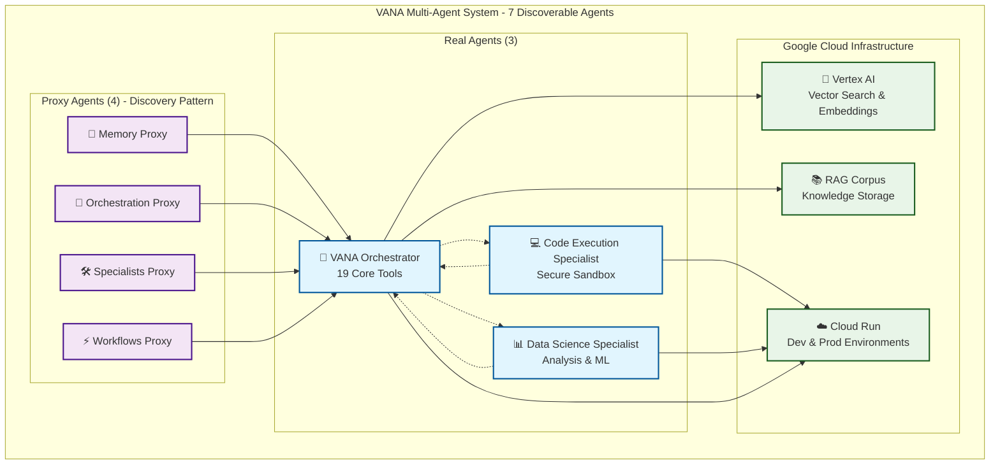

# 🤖 VANA - Advanced Multi-Agent AI System

[](https://vana-prod-960076421399.us-central1.run.app)
[](https://github.com/NickB03/vana)
[](https://google.github.io/adk-docs/)
[](https://cloud.google.com/run)
[](https://python.org)
[](docs/architecture/agents.md)
[](docs/architecture/tools.md)

> **VANA** is an advanced multi-agent AI system built on Google's Agent Development Kit (ADK), featuring **7 discoverable agents** (3 real + 4 proxy) with **19 core tools** and comprehensive infrastructure for intelligent task orchestration. The system uses a simplified multi-agent architecture with proxy pattern for optimal performance and maintainability.

## 🚀 Quick Start

```bash
# Clone the repository
git clone https://github.com/NickB03/vana.git
cd vana

# Install dependencies for the backend and dashboard
poetry install

# Configure environment
cp .env.template .env.local
# Edit `.env.local` with your configuration (see `.env.template` for required variables)
# API keys are automatically loaded from Google Secret Manager
# The `VANA_MODEL` variable controls the default model
# (defaults to `gemini-2.0-flash`)

# Run locally
python main.py
```

The environment file includes a `VANA_MODEL` variable which sets the
default generative model (defaults to `gemini-2.0-flash`).

**🌐 Development Service:** [https://vana-dev-960076421399.us-central1.run.app](https://vana-dev-960076421399.us-central1.run.app)
**🚀 Production Service:** [https://vana-prod-960076421399.us-central1.run.app](https://vana-prod-960076421399.us-central1.run.app)

## 📦 Optional Dependencies

VANA includes excellent **graceful degradation** for optional features. Core functionality works perfectly without additional dependencies.

### 📄 Document Processing Features

For enhanced document processing capabilities:

```bash
# PDF text extraction and metadata parsing
pip install PyPDF2>=3.0.0

# Image processing and OCR text extraction
pip install Pillow>=10.0.0 pytesseract>=0.3.10
```

### 🔧 System Requirements for OCR

OCR functionality requires system-level Tesseract installation:

```bash
# macOS
brew install tesseract

# Ubuntu/Debian
sudo apt-get install tesseract-ocr

# Windows
# Download from: https://github.com/UB-Mannheim/tesseract/wiki
```

### ✨ Feature Availability

| Feature | Without Dependencies | With Dependencies |
|---------|---------------------|-------------------|
| **Core VANA** | ✅ Full functionality | ✅ Full functionality |
| **PDF Processing** | ⚠️ Graceful error messages | ✅ Full text extraction & metadata |
| **Image Processing** | ⚠️ Graceful error messages | ✅ Image analysis & OCR |
| **Document Pipeline** | ✅ Text documents only | ✅ Multi-format support |

### 🎯 Installation Strategy

**Recommended**: Start with core installation, add optional dependencies as needed:

```bash
# Core installation (always works)
poetry install

# Add PDF support when needed
pip install PyPDF2>=3.0.0

# Add full document processing when needed
pip install Pillow>=10.0.0 pytesseract>=0.3.10
```

All optional features include **intelligent fallback mechanisms** with clear user feedback.

## 📋 Table of Contents

- [🎯 Overview](#-overview)
- [🏗️ Architecture](#️-architecture)
- [🤖 Agent System](#-agent-system)
- [🛠️ Tools & Capabilities](#️-tools--capabilities)
- [📚 Documentation](#-documentation)
- [🚀 Deployment](#-deployment)
- [🔧 Development](#-development)
- [📊 Monitoring](#-monitoring)
- [🤝 Contributing](#-contributing)

## 🎯 Overview

VANA is an enterprise-grade multi-agent AI system designed for complex task orchestration and intelligent automation. Built with Google's Agent Development Kit (ADK), it provides a robust foundation for AI-powered applications.

### ✨ Key Features

- **🤖 Multi-Agent System** - 7 discoverable agents (3 real + 4 proxy) with simplified architecture
- **🛠️ Comprehensive Toolset** - 19 core tools + conditional tools for diverse capabilities
- **🔍 Advanced Search** - Vector search via Vertex AI, web search, and knowledge base integration
- **☁️ Cloud-Native** - Deployed on Google Cloud Run with auto-scaling infrastructure
- **📊 Performance Monitoring** - Health monitoring, performance tracking, and system analytics
- **🔒 Enterprise Security** - Google Secret Manager integration, zero hardcoded credentials, Google Cloud IAM
- **🏗️ Production Ready** - Robust foundation with comprehensive testing and security hardening

### 🎯 Current Capabilities

- **Intelligent Orchestration** - VANA agent coordinates tasks with 19 core tools
- **Secure Code Execution** - Python, JavaScript, and Shell execution in sandboxed environment
- **Data Science Operations** - Data analysis, visualization, and machine learning workflows
- **Knowledge Management** - Semantic search, document processing, and information retrieval
- **Agent Coordination** - Seamless delegation between real agents and proxy pattern discovery
- **Production Deployment** - Operational on Google Cloud Run with dev/prod environments

## 🏗️ Architecture



### 🔧 Core Components

- **VANA Orchestrator** - Central coordination with 19 core tools + conditional tools
- **Specialist Agents** - Code execution and data science capabilities
- **Proxy Pattern** - 4 proxy agents for discovery compatibility
- **Google Cloud Services** - Vertex AI, Cloud Run, and RAG corpus integration

## 🤖 Agent System

VANA features **7 discoverable agents** using a simplified multi-agent architecture with proxy pattern:

### 🎯 Real Agents (3)

#### **VANA Orchestrator** (`agents/vana/team.py`)
- **Role**: Central coordinator and task router
- **Tools**: 19 core tools + conditional specialist/orchestration tools
- **Model**: gemini-2.0-flash-exp
- **Capabilities**: File operations, search, coordination, task analysis, workflow management

#### **Code Execution Specialist** (`agents/code_execution/specialist.py`)
- **Role**: Secure code execution across multiple programming languages
- **Languages**: Python, JavaScript, Shell with sandbox isolation
- **Security**: Resource monitoring, execution timeouts, security validation
- **Integration**: Coordinates with VANA for complex development tasks

#### **Data Science Specialist** (`agents/data_science/specialist.py`)
- **Role**: Data analysis, visualization, and machine learning capabilities
- **Integration**: Leverages Code Execution Specialist for secure Python execution
- **Capabilities**: Data processing, analysis, visualization, statistical computing

### 🔄 Proxy Agents (4) - Discovery Pattern

- **Memory Agent** - Delegates to VANA (`agents/memory/__init__.py`)
- **Orchestration Agent** - Delegates to VANA (`agents/orchestration/__init__.py`)
- **Specialists Agent** - Delegates to VANA (`agents/specialists/__init__.py`)
- **Workflows Agent** - Delegates to VANA (`agents/workflows/__init__.py`)

### 📊 Current System Status
- **Discoverable Agents**: 7 (3 real + 4 proxy)
- **Architecture**: Simplified multi-agent with proxy pattern (not complex orchestration)
- **Infrastructure**: Operational on Google Cloud Run with excellent performance
- **Coordination**: Real agent discovery and delegation working correctly

## 🛠️ Tools & Capabilities

VANA provides **19 core tools** always available in the VANA agent, plus conditional tools when dependencies are available:

### 🔧 Core Tools (19) - Always Available

#### 📁 File System Tools (4)
- `adk_read_file` - Secure file reading with validation
- `adk_write_file` - File creation and modification with proper permissions
- `adk_list_directory` - Directory exploration and listing
- `adk_file_exists` - File existence checking

#### 🔍 Search Tools (3)
- `adk_vector_search` - Semantic similarity search via Vertex AI
- `adk_web_search` - Real-time web search with Brave API
- `adk_search_knowledge` - RAG corpus knowledge search

#### ⚙️ System Tools (2)
- `adk_echo` - System testing and validation
- `adk_get_health_status` - Real-time system health monitoring

#### 🤝 Agent Coordination Tools (4)
- `adk_coordinate_task` - Multi-agent task coordination
- `adk_delegate_to_agent` - Direct agent delegation
- `adk_get_agent_status` - Agent discovery and status
- `adk_transfer_to_agent` - Agent transfer capabilities

#### 📊 Task Analysis Tools (3)
- `adk_analyze_task` - NLP-based task analysis
- `adk_match_capabilities` - Agent-task capability matching
- `adk_classify_task` - Task classification and routing

#### ⚡ Workflow Management Tools (8)
- `adk_create_workflow` - Create multi-step workflows
- `adk_start_workflow` - Initiate workflow execution
- `adk_get_workflow_status` - Monitor workflow progress
- `adk_list_workflows` - List active and completed workflows
- `adk_pause_workflow` - Pause workflow execution
- `adk_resume_workflow` - Resume paused workflows
- `adk_cancel_workflow` - Cancel workflow execution
- `adk_get_workflow_templates` - Access workflow templates

### 🔧 Conditional Tools (Variable Count)

#### 🛠️ Specialist Tools
- Available when `agents.specialists.agent_tools` imports successfully
- Provides additional specialist capabilities when available

#### 🎯 Orchestration Tools (6)
- Available when memory/orchestration modules import successfully
- `analyze_task_complexity` - Advanced task complexity analysis
- `route_to_specialist` - Intelligent specialist routing
- `coordinate_workflow` - Advanced workflow coordination
- `decompose_enterprise_task` - Enterprise task decomposition
- `save_specialist_knowledge_func` - Specialist knowledge storage
- `get_specialist_knowledge_func` - Specialist knowledge retrieval

### 🏗️ Tool Architecture

- **Standardized Interface** - All tools follow ADK FunctionTool pattern
- **Error Handling** - Consistent error responses and logging
- **Performance Monitoring** - Built-in execution timing and metrics
- **Security** - Input validation and secure execution patterns
- **Graceful Degradation** - System continues operation with tool failures

## 📚 Documentation

Comprehensive documentation is available in the `/docs` directory:

- **[Getting Started](docs/getting-started/)** - Installation, configuration, and quick start
- **[Architecture](docs/architecture/)** - System design and component overview
- **[User Guide](docs/guides/user-guide.md)** - End-user documentation and tutorials
- **[Developer Guide](docs/guides/developer-guide.md)** - Development setup and contribution guidelines
- **[API Reference](docs/guides/api-reference.md)** - Complete API documentation
- **[Deployment](docs/deployment/)** - Local and cloud deployment guides
- **[Security Guide](docs/deployment/security-guide.md)** - Security best practices and API key management
- **[Troubleshooting](docs/troubleshooting/)** - Common issues and solutions

## 🚀 Deployment

### ☁️ Production (Google Cloud Run)
```bash
# Deploy to production
./deployment/deploy.sh production
```

**Live Service:** [https://vana-prod-960076421399.us-central1.run.app](https://vana-prod-960076421399.us-central1.run.app)

### 🏠 Local Development
```bash
# Install dependencies for the backend and dashboard
poetry install

# Configure environment
cp .env.template .env.local
# API keys are automatically loaded from Google Secret Manager
# Ensure you have gcloud SDK authenticated

# Run development server
python main.py
```

### 🐳 Docker
```bash
# Build container
docker build -t vana .

# Run container
docker run -p 8080:8080 vana
```

## 🔧 Development

### 📋 Prerequisites
- Python 3.13+
- Poetry for dependency management
- Google Cloud SDK
- Docker (optional)

### 🛠️ Setup
```bash
# Clone repository
git clone https://github.com/NickB03/vana.git
cd vana

# Install dependencies for the backend and dashboard
poetry install

# Configure environment with Secret Manager
cp .env.template .env.local
# Authenticate with Google Cloud (required for Secret Manager)
gcloud auth application-default login

# Setup pre-commit hooks
pre-commit install

# Run tests
poetry run pytest
```

### 🧪 Testing
```bash
# Run all tests
poetry run pytest

# Run specific test categories
poetry run pytest tests/unit/
poetry run pytest tests/integration/
poetry run pytest tests/e2e/

# Run with coverage
poetry run pytest --cov=agents --cov=lib --cov=tools
```

## 📊 Monitoring

VANA includes comprehensive monitoring and observability:

### 🎛️ Health Dashboard
- Real-time system health metrics
- Agent performance monitoring
- Tool usage analytics
- Error tracking and alerting

### 📈 Performance Metrics
- **System Status**: ✅ Operational with 7 discoverable agents
- **Infrastructure Performance**: Excellent response times and reliability
- **Agent Discovery**: 100% success rate - all 7 agents discoverable with proper descriptions
- **Coordination Tools**: Fully operational - no fallback implementations
- **Cloud Deployment**: Stable on Google Cloud Run (dev and prod environments)
- **Tool Availability**: 19 core tools + conditional tools working correctly

### 🔍 Observability
- Structured logging with Google Cloud Logging
- Distributed tracing for multi-agent workflows
- Custom metrics and alerting
- Performance profiling and optimization

## 🤝 Contributing

We welcome contributions! Please see our [Contributing Guide](CONTRIBUTING.md) for details.

### 📝 Development Workflow
1. Fork the repository
2. Create a feature branch
3. Make your changes
4. Add tests and documentation
5. Submit a pull request

### 🎯 Areas for Contribution
- New agent implementations
- Tool development and enhancement
- Documentation improvements
- Performance optimizations
- Bug fixes and testing

## 📄 License

This project is licensed under the MIT License - see the [LICENSE](LICENSE) file for details.

## 🙏 Acknowledgments

- **Google Agent Development Kit (ADK)** - Foundation framework
- **Google Cloud Platform** - Infrastructure and AI services
- **Vertex AI** - Vector search and language models
- **Poetry** - Dependency management
- **FastAPI** - Web framework

---

**🔗 Links:**
- [Production Service](https://vana-prod-960076421399.us-central1.run.app)
- [Documentation](docs/README.md)
- [API Reference](docs/guides/api-reference.md)
- [Contributing](CONTRIBUTING.md)

**📧 Contact:** [GitHub Issues](https://github.com/NickB03/vana/issues)
