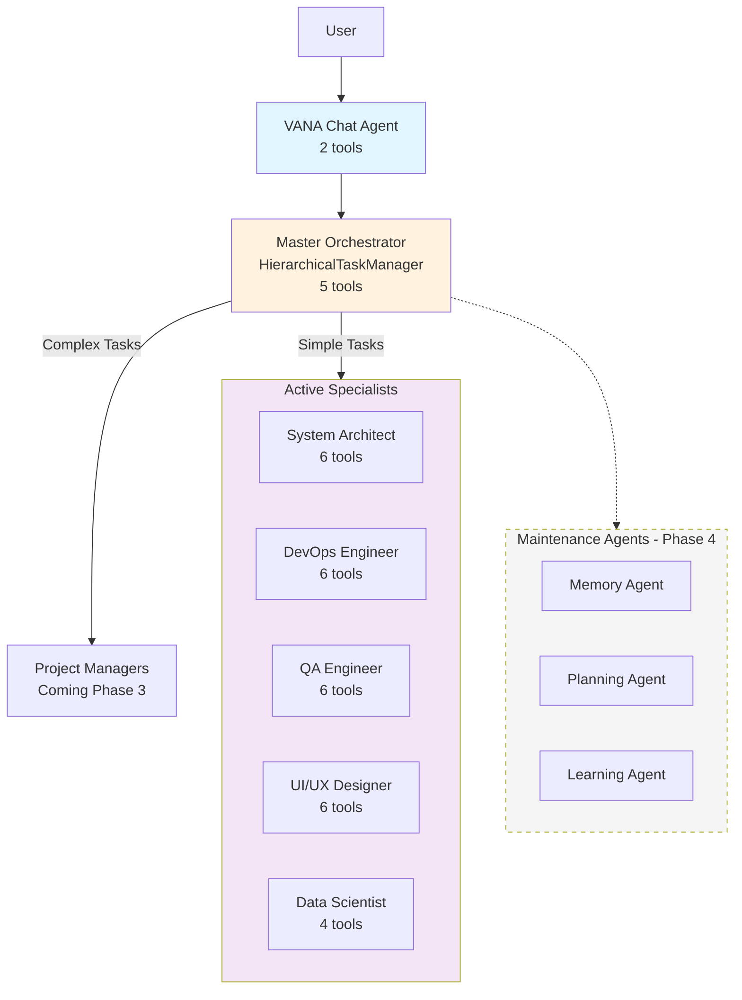
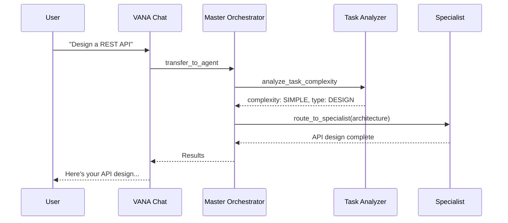
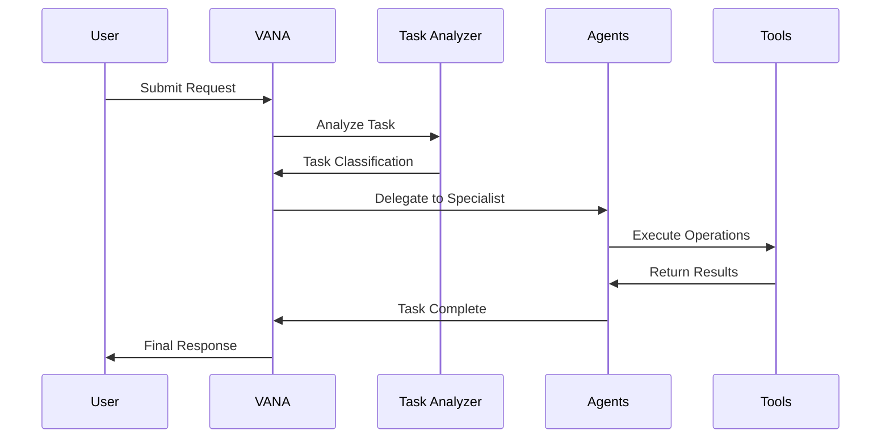

# VANA: Agentic AI System with Hierarchical Orchestration

<!-- Phase 1 Complete - Updated Jul 10, 2025 -->

<div align="center">
  
  
  [](https://www.python.org/downloads/)
  [](https://github.com/google/adk)
  [](https://opensource.org/licenses/MIT)
  []()
  []()
  
  **True Agentic AI: Hierarchical Multi-Agent System for Complex Task Automation**
  
  [Features](#features) • [Quick Start](#quick-start) • [Architecture](#architecture) • [Documentation](#documentation) • [Contributing](#contributing)
</div>

---

## 🌟 Overview

VANA is an advanced agentic AI system featuring hierarchical multi-agent orchestration built on Google's Agent Development Kit (ADK). With a 5-level agent hierarchy, VANA intelligently decomposes complex tasks, routes them to specialized agents, and coordinates sophisticated workflows through its Master Orchestrator.

### 🆕 Agentic AI Features (Phase 1)

- **🏗️ Hierarchical Architecture**: 5-level agent system (Chat → Orchestrator → Managers → Specialists → Sub-agents)
- **🧠 Master Orchestrator**: Intelligent task analysis and routing with complexity scoring
- **👥 Active Specialists**: Architecture, DevOps, QA, UI/UX, and Data Science agents
- **🔄 Smart Routing**: Automatic task delegation based on complexity and domain
- **🛡️ Fault Tolerance**: Circuit breakers and performance optimization

### Core Capabilities

- **🤖 Intelligent Orchestration**: Hierarchical task decomposition and agent coordination
- **🔧 Distributed Tools**: Each specialist has domain-specific tools (4-6 per agent)
- **🧠 Advanced Task Analysis**: Complexity scoring from Simple → Enterprise scale
- **⚡ Workflow Management**: Sequential, Parallel, and Loop execution patterns
- **🔄 Agent Communication**: Bidirectional agent-to-agent communication
- **🛡️ Enterprise Ready**: Production-grade with monitoring and fault tolerance

## 🚀 Quick Start

### Prerequisites

- Python 3.13+ (required for modern async patterns)
- Node.js 18+ (for frontend)
- Poetry for dependency management
- Google Cloud API key for Gemini models

### One-Command Setup

```bash
# Clone and setup everything
git clone https://github.com/yourusername/vana.git
cd vana
make setup && make dev
```

That's it! 🎉 The system will:
- Check all dependencies
- Install Python and Node packages
- Setup your environment
- Start both backend and frontend

### Alternative Setup Methods

#### Docker (Recommended)
```bash
# Using Docker Compose
docker-compose up

# Or with Make
make docker-up
```

#### Local Development
```bash
# Manual setup
./scripts/start-dev.sh  # Interactive setup with checks

# Or step by step
poetry install          # Python dependencies
cd vana-ui && npm install && cd ..  # Frontend dependencies
./start-vana-ui.sh     # Start everything
```

#### VS Code
Press `Cmd+Shift+B` (or `Ctrl+Shift+B` on Windows/Linux) to start the development environment directly from VS Code.

### Configuration

```bash
# Environment setup (auto-created by make setup)
cp .env.example .env.local
# Add your GOOGLE_API_KEY to .env.local
```

Get your API key from: [Google AI Studio](https://aistudio.google.com/apikey)

### Access Points

Once running, you can access:
- 🌐 **Frontend**: http://localhost:5173
- 🔧 **Backend API**: http://localhost:8081
- 📚 **API Docs**: http://localhost:8081/docs
- 🎯 **Health Check**: http://localhost:8081/health

### Your First Request

```bash
# Simple conversation (handled by VANA Chat)
curl -X POST http://localhost:8081/api/v1/chat \
  -H "Content-Type: application/json" \
  -d '{"query": "Hello, what can you help me with?", "session_id": "test-001"}'

# Complex task (routed to specialists)
curl -X POST http://localhost:8081/api/v1/chat \
  -H "Content-Type: application/json" \
  -d '{"query": "Design a microservices architecture for an e-commerce platform", "session_id": "test-002"}'

# Or use the web interface at http://localhost:5173
```

## 🛠️ Development Commands

```bash
# Common tasks
make help          # Show all available commands
make test          # Run all tests
make format        # Format code with black
make lint          # Run linting checks
make security      # Run security scan

# Docker operations
make docker-up     # Start with Docker
make docker-down   # Stop Docker services
make docker-logs   # View logs

# Environment
make clean         # Clean generated files
./scripts/validate-env.sh  # Check environment setup
```

## 🏗️ Architecture

<div align="center">
  
</div>

### Agentic AI Architecture (Phase 1)



### Task Routing Flow



### Agent Flow

<div align="center">
  
</div>



## 📚 Documentation

### Core Concepts

#### Multi-Agent Architecture
VANA employs a hierarchical agent structure where the orchestrator delegates tasks to specialized agents based on their capabilities and the task requirements.

#### Task Analysis Engine
Advanced NLP-powered analysis determines task type, complexity, required capabilities, and optimal execution strategy.

#### Tool Integration
Seamless integration with Google ADK provides a rich set of tools for file operations, web searching, data processing, and more.

### API Reference

#### POST /run
Execute a task through VANA orchestration.

**Request:**
```json
{
  "input": "Your task description here"
}
```

**Response:**
```json
{
  "result": {
    "output": "Task completed successfully...",
    "id": "session_uuid"
  }
}
```

#### GET /health
Check system health status.

**Response:**
```json
{
  "status": "healthy"
}
```

## 🛠️ Development

### Project Structure

```
vana/
├── agents/               # Agent implementations
│   ├── vana/            # Main orchestrator
│   ├── code_execution/  # Code execution specialist
│   └── data_science/    # Data analysis specialist
├── lib/                 # Core libraries
│   ├── _tools/          # ADK tool implementations
│   ├── _shared/         # Shared utilities
│   └── mcp/             # Model Context Protocol
├── tests/               # Test suites
├── docs/                # Documentation
└── main.py              # FastAPI application
```

### Running Tests

```bash
# Run unit tests
poetry run pytest tests/unit -v

# Run integration tests
poetry run pytest tests/integration -v

# Run validation scripts
python validate_workflow_engine.py
python validate_task_analyzer.py

# Run comprehensive test suite
./scripts/run_comprehensive_tests.sh
```

### Code Quality

```bash
# Format code
poetry run black .

# Sort imports
poetry run isort .

# Run linters
poetry run flake8
poetry run mypy .

# Security scan
poetry run bandit -r .
```

## 🗺️ Roadmap

### Phase 1: Foundation (Complete ✅)
- [x] Core orchestration system
- [x] ADK integration
- [x] Basic agent implementations
- [x] Tool ecosystem

### Phase 2: Enhancement (Current 🚧)
- [ ] Advanced workflow templates
- [ ] Real-time collaboration features
- [ ] Enhanced memory systems
- [ ] Performance optimizations

### Phase 3: Scale (Planned 📋)
- [ ] Distributed agent execution
- [ ] Enterprise integrations
- [ ] Advanced monitoring dashboard
- [ ] Custom agent SDK

### Phase 4: Intelligence (Future 🔮)
- [ ] Self-improving agents
- [ ] Automated workflow generation
- [ ] Cross-agent learning
- [ ] Predictive task optimization

## 🤝 Contributing

We welcome contributions! Please see our [Contributing Guide](CONTRIBUTING.md) for details.

### Development Setup

1. Fork the repository
2. Create a feature branch (`git checkout -b feature/amazing-feature`)
3. Make your changes
4. Run tests (`poetry run pytest`)
5. Commit your changes (`git commit -m 'Add amazing feature'`)
6. Push to the branch (`git push origin feature/amazing-feature`)
7. Open a Pull Request

### Code Standards

- Follow PEP 8 style guidelines
- Write comprehensive tests
- Document all public APIs
- Keep commits atomic and well-described

## 📄 License

This project is licensed under the MIT License - see the [LICENSE](LICENSE) file for details.

## 🙏 Acknowledgments

- Built on [Google's Agent Development Kit (ADK)](https://github.com/google/adk)
- Powered by Gemini AI models
- Inspired by modern orchestration patterns

---

<div align="center">
  <p>Built with ❤️ by the VANA Team</p>
  <p>
    <a href="https://github.com/yourusername/vana">GitHub</a> •
    <a href="https://vana-docs.com">Documentation</a> •
    <a href="https://discord.gg/vana">Community</a>
  </p>
</div>