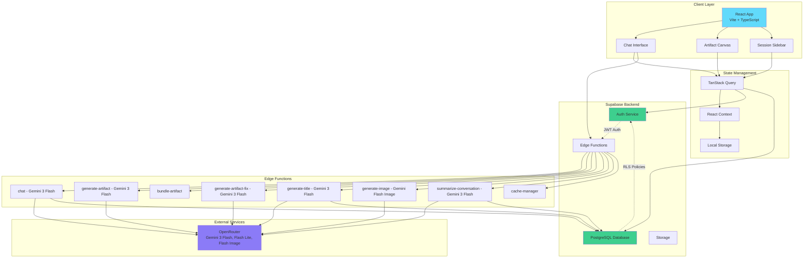
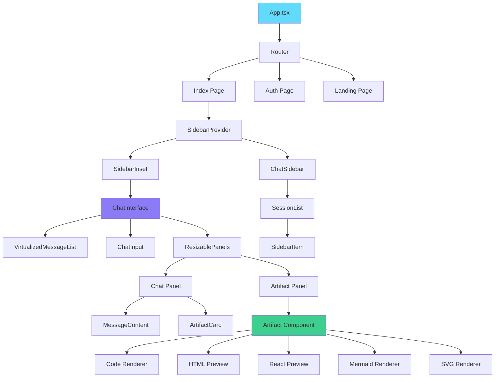
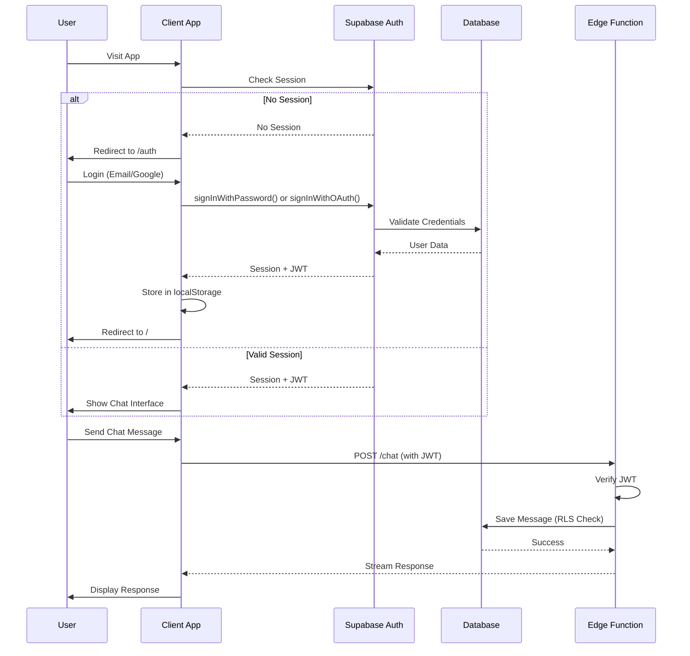
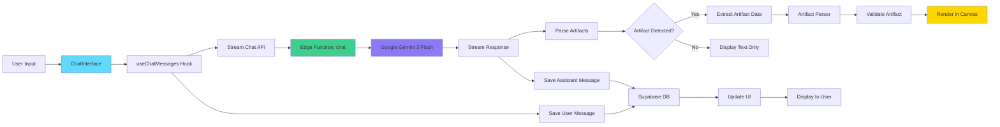
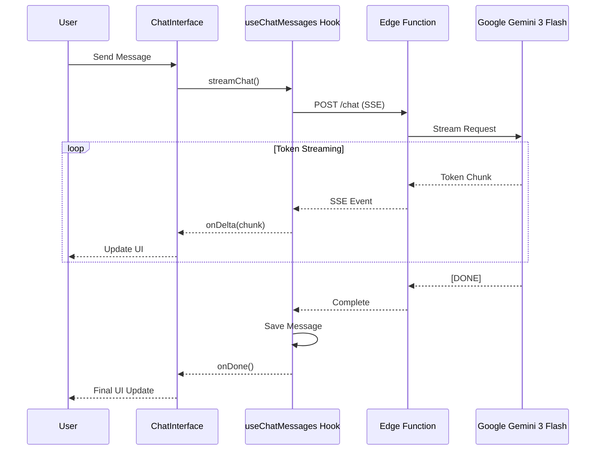

# Vana - AI-Powered Development Assistant

<div align="center">


**Transform natural language into interactive code, components, and diagrams in real-time**

[](https://www.typescriptlang.org/)
[](https://reactjs.org/)
[](https://vitejs.dev/)
[](https://supabase.com/)
[](LICENSE)

[Features](#-features) • [Demo](#-demo) • [Getting Started](#-getting-started) • [Architecture](#-architecture) • [Deployment](#-deployment)

</div>

---

## 📋 Table of Contents

- [Overview](#-overview)
- [Features](#-features)
- [Demo](#-demo)
- [Technology Stack](#-technology-stack)
- [Architecture](#-architecture)
- [Getting Started](#-getting-started)
- [Project Structure](#-project-structure)
- [Key Features Deep Dive](#-key-features-deep-dive)
- [Development Guide](#-development-guide)
- [Deployment](#-deployment)
- [Contributing](#-contributing)
- [License](#-license)

---

## 🌟 Overview

**Vana** is an AI-powered development assistant that transforms natural language into production-ready code, interactive React components, diagrams, and more. Powered by Google's Gemini 3 Flash (via OpenRouter) with 1M token context window, Vana provides a seamless chat interface where every conversation can generate interactive artifacts—fully functional components rendered in real-time alongside your chat.

### Why Vana?

- 🚀 **Real-time Generation**: Watch your ideas materialize with streaming AI responses
- 🎨 **Interactive Artifacts**: Generate React components, HTML pages, Mermaid diagrams, and SVG graphics
- 🔒 **Secure & Private**: Built on Supabase with authentication and Row-Level Security
- 📱 **Responsive Design**: Optimized for both desktop and mobile experiences
- 🎯 **Smart Context**: Maintains conversation history with intelligent summarization
- 🔧 **Developer-Friendly**: Full TypeScript support with modern tooling
- ✨ **Enterprise-Grade Quality**: Multi-layer validation, auto-error correction, and modern UI primitives

### Recent Major Improvements

**January 18, 2026 - Vanilla Sandpack Refactor:**
- 🗑️ **Massive Simplification**: Deleted ~15,000 lines of artifact complexity (artifact-rules/, bundling system, validation layers)
- 📦 **Vanilla Sandpack**: Client-side rendering via CodeSandbox's Sandpack runtime (zero server bundling)
- 💾 **Database Persistence**: Artifacts now stored in `artifact_versions` table (replaces XML embedding in messages)
- 🔧 **Simplified Backend**: New `artifact-tool-v2.ts` (~230 lines) replaces 1,337-line `artifact-executor.ts`
- 🎯 **Natural Error Handling**: Sandpack console shows errors directly + "Ask AI to Fix" button
- 📡 **Endpoint Consolidation**: Removed `/generate-artifact`, `/generate-artifact-fix`, `/bundle-artifact` endpoints
- ✅ **Maintained Coverage**: 78% line coverage (exceeds 55% threshold)

**December 24, 2025 - Code Quality & Documentation Cleanup:**
- 🧹 **Phase 4 Cleanup**: Extracted types from deprecated `reasoning-generator.ts` (886 line reduction, 70%)
- 🔒 **Enhanced Type Safety**: Added XSS/DoS protection with readonly modifiers for immutability
- 📊 **Type Design Improvement**: Grade improved from D to B (+108%)
- 🗑️ **Dead Code Removal**: Eliminated 4 unused components (~300 lines)
- 📚 **Documentation Sync**: Fixed 7 files referencing non-existent `Artifact.tsx`, standardized test counts to 1,048

**December 19, 2025 - Unified Tool-Calling Architecture (Issue #340):**
- 🔧 **Unified Tool System**: Single `chat/` endpoint now handles artifacts, images, and web search via tool calling
- 🛡️ **Security Infrastructure**: Prompt injection defense, fail-closed rate limiting, error sanitization
- 📡 **New SSE Events**: `tool_call_start`, `tool_result`, `artifact_complete`, `image_complete`, `web_search`
- ⚡ **Pure Business Logic**: Separated executors (`artifact-executor.ts`, `image-executor.ts`) from HTTP handling
- 🔐 **Tool Rate Limiting**: Per-tool rate limits with circuit breaker pattern for graceful degradation
- 📊 **Execution Tracking**: Resource exhaustion protection (max 3 tools/request), timing metrics

**December 15, 2025 - Hybrid ReasoningProvider (Issue #339):**
- 🧠 **LLM+Fallback Hybrid**: Semantic status summaries with template fallback (Note: Removed in Gemini migration, Jan 2026)
- 🔄 **Circuit Breaker**: 3 failures → 30s cooldown → auto-reset for resilient operation
- ⏱️ **Anti-Flicker**: 1.5s cooldown between updates, 8s idle heartbeat
- 📡 **Phase Detection**: analyzing → planning → implementing → styling → finalizing

**December 14, 2025 - Inline Citation Badges (Issue #335):**
- 📎 **Citation Badges**: Inline `[1]` badges with hover preview of source content
- 🔗 **Source Attribution**: Web search results now show clickable source references
- 🎨 **Improved UX**: Hover cards display title, snippet, and relevance score

**December 1, 2025 - SSE Streaming for Artifact Generation:**
- 🎯 **Native Streaming**: Single SSE endpoint replaces parallel dual-endpoint approach
- 🧠 **Claude-Style Reasoning Display**: Progressive ticker pill shows "Thinking..." → "Analyzing..." → status updates
- 📡 **Real-time SSE Events**: `reasoning_chunk`, `content_chunk`, `artifact_complete` event types
- 🐛 **Bug Fix**: Artifact code no longer streams to chat UI during generation
- ⏱️ **Timer Persistence**: Elapsed reasoning time displays after generation completes
- ⏹️ **Stop Button**: Cancel artifact generation mid-stream

**November 28, 2025 - AI Model Reasoning Display:**
- 🧠 **Real-time Reasoning Streaming**: Model reasoning displays immediately via SSE streaming
- 🐛 **Duplicate Key Fix**: Resolved React warning for duplicate message keys during streaming
- 📦 **Unified Client**: Streaming support with structured reasoning parsing

**November 27, 2025 - Smart Context Management & Bug Fixes:**
- 🧠 **Smart Context Management**: Token-aware context windowing for optimized AI responses
- 🔧 **Guest Artifact Bundling**: Fixed guest users unable to use npm-bundled artifacts
- ⚛️ **React Instance Unification**: Fixed "useRef null" errors in Radix UI artifacts via import map shims
- 🛡️ **CSP Security**: Updated Content Security Policy for Tailwind CDN and data: URL shims
- 📊 **Response Quality Tracking**: New `response_quality_logs` and `message_feedback` tables
- 🔄 **State Machine Architecture**: Conversation state tracking in `_shared/state-machine.ts`
- ⚡ **1,048 Tests**: Comprehensive test coverage across 90+ test files

**November 28, 2025 - AI Model Enhancement:**
- 🚀 **Enhanced Artifact Generation**: Advanced reasoning capabilities for artifact creation
- ⚡ **Improved Reliability**: Eliminated timeout issues with high-performance models
- 🔄 **Enhanced UI**: Gemini-style sidebar auto-collapse with manual toggle control
- 🎯 **Better Navigation**: Fixed artifact card Open button and image generation card behaviors

**November 14, 2025 - Chain of Thought Integration:**
- 🧠 **Transparent AI Reasoning**: Structured reasoning steps show how the AI thinks through problems
- 🔍 **Research → Analysis → Solution**: Three-phase reasoning pattern with collapsible steps
- 🔒 **Triple-Layer Security**: Server validation + Zod schemas + DOMPurify sanitization
- ♿ **Accessibility First**: WCAG 2.1 AA compliant with keyboard navigation and screen reader support
- ⚡ **Performance Optimized**: React.memo, virtualization for >5 steps, <1s reasoning generation
- ✅ **100% Test Coverage**: 21/21 tests passing, comprehensive security validation

**November 2025 - Feature Enhancements & UX:**
- 🚀 **Artifact Export System**: Multi-format export with clipboard, download, standalone HTML, and ZIP support
- 📝 **Structured Prompt Engineering**: All 20 artifact sample prompts optimized with Context→Task→Requirements→Output format
- 🎨 **AI-Powered Error Fixing**: Automatic detection and repair of artifact errors with detailed explanations
- ⚡ **Instant Build Suggestions**: Click any suggestion card to instantly populate chat and start building

**November 2025 - Production Security Hardening:**
- 🔒 **Database Security**: All SECURITY DEFINER functions protected against schema injection
- 🛡️ **Guest Rate Limiting**: IP-based rate limiting (20 requests/5h) prevents API quota abuse
- 🔐 **CORS Validation**: Environment-based origin whitelist replaces dangerous wildcard configuration
- ⚡ **Performance**: 52% smaller chat function bundle (system prompt externalization)

**November 2025 - CI/CD & Quality Infrastructure:**
- 🚀 **Automated CI/CD Pipeline**: GitHub Actions workflow (lint → test → coverage → build)
- 📊 **Coverage Tracking**: Codecov integration with automatic PR comments and trend analysis
- 🛡️ **Branch Protection**: GitHub ruleset requiring PR approval and passing checks
- ✅ **Testing Expansion**: 1,048 tests (coverage: 74%), exportArtifact.ts: 23% → 98%
- 🔒 **Security Testing**: 9 XSS attack scenarios validated, performance benchmarks added
- 📚 **Comprehensive Docs**: 5 detailed guides (setup, CI/CD, coverage, quickstart)

**October 2025 - Architecture & Testing:**
- ✅ **ai-elements Integration**: Modern UI primitives for cleaner artifact rendering
- ✅ **5-Layer Import Validation**: Comprehensive defense against artifact failures
- ✅ **Auto-Transformation**: Automatically fixes common coding mistakes in generated artifacts
- ✅ **Component Refactoring**: Eliminated prop mutations and improved code organization

---

## ✨ Features

### Core Capabilities

- **🤖 AI-Powered Chat**: Real-time conversations with Google Gemini 2.5
- **📦 Artifact System**: Generate and render interactive content
  - React components with shadcn/ui support
  - HTML pages with live preview
  - Mermaid diagrams
  - SVG graphics
  - Code snippets with syntax highlighting
  - Markdown documents
  - AI-generated images
- **💾 Session Management**: Persistent chat sessions with automatic title generation
- **🔄 Version Control**: Track changes to artifacts with Git-like versioning
- **📤 Artifact Export**: Multi-format export system with clipboard, download, standalone HTML, and ZIP
- **🎨 Theme Support**: Dark/light mode with system preference detection
- **📱 Mobile Optimized**: Responsive design with touch-friendly interactions
- **🔐 Authentication**: Email/password and Google OAuth support
- **🛡️ Security**: Row-Level Security, rate limiting, and CORS validation
- **⚡ Performance**: Optimized with code splitting, compression, and PWA support

### Advanced Features

- **Streaming Responses**: Real-time token streaming with progress indicators
- **Artifact Validation**: Multi-layer defense system (5 layers) against invalid imports
  - Pre-generation warnings and validation
  - Auto-transformation of common mistakes
  - Runtime error blocking with helpful messages
- **ai-elements Integration**: Modern UI primitives for artifact rendering
  - ArtifactContainer wrapper component
  - Clean separation of UI chrome from rendering logic
  - 150+ lines of reusable UI components
- **Context Management**: Intelligent conversation summarization for long chats
- **File Upload**: Support for image uploads and analysis
- **Error Recovery**: Automatic error detection and AI-powered fixes with detailed explanations
- **Artifact Export**: Comprehensive export system
  - Copy to clipboard (all artifact types)
  - Download with proper file extensions (.jsx, .html, .svg, .mmd, .md)
  - Export HTML as standalone with auto-injected CDN libraries
  - Export React as JSX component with import statements
  - Export Mermaid as rendered SVG or source .mmd file
  - Export with version history (JSON format)
  - Multi-artifact ZIP export for projects with dependencies
- **Structured Prompts**: 20 optimized artifact suggestions using Context→Task→Requirements→Output format
- **Keyboard Shortcuts**: Efficient navigation and actions

### Security Features (Nov 2025)

- **Database Hardening**:
  - All SECURITY DEFINER functions use `SET search_path = public, pg_temp`
  - Prevents privilege escalation through schema injection attacks

- **API Protection**:
  - Guest rate limiting: 20 requests per 5-hour window (IP-based)
  - CORS origin validation with environment-based whitelist
  - No wildcard `*` origins in production

- **Performance Optimizations**:
  - System prompt externalized to reduce bundle size by 52%
  - Shared CORS configuration module
  - Automatic cleanup of rate limit records (7-day retention)

---

## 🎬 Demo

### Live Preview

Experience Vana in action: [View Demo](https://llm-chat-site.pages.dev)

### Key Use Cases

- **Rapid Prototyping**: Generate UI components and layouts instantly
- **Code Generation**: Create functions, classes, and utilities with natural language
- **Data Visualization**: Build charts and dashboards with Recharts
- **Documentation**: Generate diagrams and technical documentation
- **Image Creation**: AI-powered image generation for mockups and designs

---

## 🛠 Technology Stack

### Frontend

| Technology | Version | Purpose |
|------------|---------|---------|
| **React** | 18.3 | UI framework |
| **TypeScript** | 5.8 | Type safety |
| **Vite** | 5.4 | Build tool & dev server |
| **Tailwind CSS** | 3.4 | Utility-first styling |
| **shadcn/ui** | Latest | Component library |
| **Radix UI** | Latest | Accessible primitives |
| **TanStack Query** | 5.83 | Data fetching & caching |
| **React Router** | 6.30 | Client-side routing |

### Backend & Services

| Service | Purpose |
|---------|---------|
| **Supabase** | PostgreSQL database, authentication, edge functions |
| **OpenRouter** | All AI operations (Gemini 3 Flash for artifacts/titles/summaries/query rewriting, Gemini Flash Lite for chat fallback, Gemini Flash Image for images) |

### Key Libraries

- **sucrase** - Fast JSX/TypeScript transpilation (20x faster than Babel)
- **marked** - Markdown parsing
- **mermaid** - Diagram rendering
- **shiki** - Syntax highlighting
- **react-markdown** - Markdown rendering
- **lucide-react** - Icon library
- **motion** - Animation library
- **vitest** - Testing framework

---

## 🏗 Architecture

### System Architecture



### Component Hierarchy



### Authentication Flow



### Data Flow



---

## 🚀 Getting Started

### Prerequisites

Before you begin, ensure you have the following installed:

- **Node.js** v20+ (LTS recommended) - [Install with nvm](https://github.com/nvm-sh/nvm#installing-and-updating)
- **npm** v10+ (comes with Node.js)
- **Git** - [Download](https://git-scm.com/downloads)
- **Deno** v1.40+ (for Edge Functions development) - [Install](https://deno.land/#installation)
- **Supabase CLI** v1.x - [Install](https://supabase.com/docs/guides/cli)
- **Chrome** (required for DevTools MCP browser testing)

### Installation

1. **Clone the repository**

```bash
git clone https://github.com/NickB03/llm-chat-site.git
cd llm-chat-site
```

2. **Install dependencies**

```bash
npm install
```

> ⚠️ **Important**: Always use `npm` for package management. Do not use Bun, Yarn, or pnpm as this will create conflicting lock files.

3. **Set up environment variables**

Create a `.env` file in the root directory:

```env
# Supabase Configuration
VITE_SUPABASE_URL=https://vznhbocnuykdmjvujaka.supabase.co
VITE_SUPABASE_PUBLISHABLE_KEY=your_supabase_anon_key
VITE_SUPABASE_PROJECT_ID=vznhbocnuykdmjvujaka

# Optional: Analytics
VITE_ENABLE_ANALYTICS=false
```

4. **Set up Supabase**

- Create a [Supabase](https://supabase.com) account
- Create a new project
- Run the migrations from `supabase/migrations/` in your Supabase SQL editor
- Configure authentication providers (Email, Google OAuth)
- Set up Edge Functions (see [Deployment](#-deployment))

5. **Start the development server**

```bash
npm run dev
```

The app will be available at `http://localhost:8080`

### Quick Start Commands

```bash
# Development
npm run dev              # Start dev server (port 8080)
npm run build            # Production build
npm run build:dev        # Development build with sourcemaps
npm run preview          # Preview production build

# Testing
npm run test             # Run tests
npm run test:ui          # Run tests with UI
npm run test:coverage    # Generate coverage report

# Code Quality
npm run lint             # Run ESLint

# CI/CD (runs automatically on PRs)
# - Lint validation
# - Full test suite
# - Coverage upload to Codecov
# - Production build verification
```

---

## 📁 Project Structure

```
llm-chat-site/
├── src/
│   ├── components/          # React components
│   │   ├── ui/             # shadcn/ui components (69 files)
│   │   ├── prompt-kit/     # Custom chat UI primitives
│   │   ├── landing/        # Landing page components
│   │   ├── ArtifactContainer.tsx # Main artifact wrapper with state management
│   │   ├── ArtifactRenderer.tsx  # Artifact rendering logic
│   │   ├── ArtifactCard.tsx # Artifact preview cards
│   │   ├── ChatInterface.tsx # Main chat interface
│   │   ├── ChatSidebar.tsx  # Session list sidebar
│   │   └── ...
│   ├── contexts/           # React Context providers
│   │   ├── MultiArtifactContext.tsx     # Multi-artifact state management
│   │   ├── MultiArtifactContextDef.ts   # Type definitions
│   │   └── ...
│   ├── hooks/              # Custom React hooks
│   │   ├── useChatMessages.tsx  # Chat message CRUD & streaming
│   │   ├── useChatSessions.tsx  # Session management
│   │   ├── useGoogleAuth.ts     # Google OAuth integration
│   │   ├── use-multi-artifact.ts # Multi-artifact context hook
│   │   └── ...
│   ├── pages/              # Route pages
│   │   ├── Index.tsx       # Main chat page
│   │   ├── Auth.tsx        # Login page
│   │   ├── Signup.tsx      # Registration page
│   │   ├── Landing.tsx     # Marketing landing page
│   │   └── ...
│   ├── utils/              # Utility functions
│   │   ├── artifactParser.ts    # Parse artifacts from AI responses
│   │   ├── artifactValidator.ts # Validate artifact syntax
│   │   ├── authHelpers.ts       # Authentication utilities
│   │   ├── themeUtils.ts        # Theme management
│   │   └── ...
│   ├── integrations/       # External service integrations
│   │   └── supabase/       # Supabase client & types
│   ├── constants/          # Constants and configurations
│   │   └── artifactTemplates.ts # Artifact templates
│   ├── App.tsx             # Root component
│   └── main.tsx            # Entry point
├── supabase/
│   ├── functions/          # Edge Functions
│   │   ├── chat/           # Main chat streaming (Gemini 3 Flash via OpenRouter)
│   │   ├── generate-artifact/ # Artifact generation (Gemini 3 Flash via OpenRouter)
│   │   ├── generate-artifact-fix/ # Artifact error fixing (Gemini 3 Flash via OpenRouter)
│   │   ├── generate-title/ # Auto-generate session titles (Gemini 3 Flash via OpenRouter)
│   │   ├── generate-image/ # AI image generation (Gemini Flash Image via OpenRouter)
│   │   ├── summarize-conversation/ # Context summarization (Gemini 3 Flash via OpenRouter)
│   │   ├── cache-manager/  # Redis cache management
│   │   ├── admin-analytics/ # Usage analytics dashboard
│   ├── migrations/         # Database migrations
│   └── config.toml         # Supabase configuration
├── public/                 # Static assets
├── docs/                   # Documentation
├── package.json            # Dependencies
├── vite.config.ts          # Vite configuration
├── tailwind.config.ts      # Tailwind CSS configuration
├── tsconfig.json           # TypeScript configuration
└── README.md               # This file
```

### Key Files

| File | Purpose | Lines |
|------|---------|-------|
| **Frontend Artifact System** | | |
| `src/components/ArtifactContainer.tsx` | Main wrapper with state, toolbar, editing | ~600 |
| `src/components/ArtifactRenderer.tsx` | Rendering engine (vanilla Sandpack) | ~400 |
| `src/components/SandpackArtifactRenderer.tsx` | Sandpack-specific React renderer | ~200 |
| `src/components/MessageWithArtifacts.tsx` | Loads artifacts from database | ~200 |
| `src/components/ArtifactCard.tsx` | Preview cards for artifact selection | ~200 |
| `src/components/ArtifactErrorBoundary.tsx` | React error boundary | ~150 |
| **Backend Artifact System** | | |
| `supabase/functions/_shared/artifact-tool-v2.ts` | Simple artifact generation handler | ~230 |
| `supabase/functions/_shared/artifact-saver.ts` | Database persistence layer | ~240 |
| `supabase/functions/_shared/system-prompt-inline.ts` | Artifact generation guidance | ~305 |
| **Chat & Tool System** | | |
| `supabase/functions/chat/index.ts` | Main chat API endpoint | ~400 |
| `supabase/functions/chat/handlers/tool-calling-chat.ts` | Tool-calling orchestrator | ~600 |
| `supabase/functions/_shared/tool-executor.ts` | Tool execution engine | ~800 |
| `supabase/functions/_shared/gemini-client.ts` | Gemini 3 Flash client with streaming | ~1,200 |
| **State Management** | | |
| `src/contexts/MultiArtifactContext.tsx` | Multi-artifact state provider | ~300 |
| `src/hooks/use-multi-artifact.ts` | Multi-artifact context hook | ~50 |
| `src/hooks/useChatMessages.tsx` | Chat messages & streaming | ~400 |
| **Configuration** | | |
| `vite.config.ts` | Build config with PWA support | ~300 |
| `supabase/functions/_shared/config.ts` | Central Edge Function config | ~450 |

---

## 🎯 Key Features Deep Dive

### Artifact System

Vana's artifact system allows AI to generate interactive content that renders alongside the chat. Artifacts are automatically detected and parsed from AI responses.

#### Supported Artifact Types

| Type | Description | Use Cases |
|------|-------------|-----------|
| **React** | Full React components with shadcn/ui | Interactive UIs, forms, dashboards |
| **HTML** | Standalone HTML pages | Landing pages, email templates |
| **Code** | Syntax-highlighted code | Functions, classes, snippets |
| **Mermaid** | Diagrams and flowcharts | Architecture diagrams, workflows |
| **SVG** | Vector graphics | Icons, illustrations, logos |
| **Markdown** | Formatted text | Documentation, notes |
| **Image** | AI-generated images | Mockups, designs, illustrations |

#### Artifact Format

Artifacts are embedded in AI responses using XML-like tags:

```xml
<artifact type="application/vnd.ant.react" title="Dashboard Component">
const { useState } = React;

export default function Dashboard() {
  return (
    <div className="p-4 bg-gray-100 rounded-lg">
      <h1>Hello World</h1>
    </div>
  );
}
</artifact>
```

#### Vanilla Sandpack Architecture (January 2026)

**Simplified System**: The artifact system uses vanilla Sandpack for instant, zero-config rendering.

**Key Features**:
1. **Database Persistence**: Artifacts stored in `artifact_versions` table (replaces XML embedding)
2. **Package Whitelist**: React, Recharts, Framer Motion, Lucide, Radix UI (auto-bundled by Sandpack)
3. **Natural Error Handling**: Errors surface in Sandpack console with "Ask AI to Fix" button
4. **No Server Bundling**: Client renders artifacts directly in Sandpack iframe

**For Developers**: Artifacts cannot use `@/` imports - use npm packages like `@radix-ui/react-*` instead. See CLAUDE.md rule #4 for details.

### Multi-Artifact Context System

**NEW: Concurrent Artifact Management (November 2024)**

The Multi-Artifact Context system enables users to work with multiple artifacts simultaneously, providing a workspace-like experience for comparing and managing different generated components.

#### Features

- **Concurrent Artifacts**: Support for up to 5 artifacts open simultaneously
- **LRU Eviction**: Automatic cleanup of least-recently-used artifacts when limit is reached
- **Session Persistence**: Artifact state automatically saved to `sessionStorage` and restored on page refresh
- **Duplicate Detection**: Prevents duplicate artifacts with automatic timestamp updates
- **Active Artifact Tracking**: Maintains focus state for the currently selected artifact
- **Minimize/Restore**: Toggle artifact visibility without removing them from the workspace

#### Architecture

**React Context API Implementation:**

The system uses React Context to provide centralized state management for artifacts across the application:

```typescript
// Core interfaces
interface ArtifactState {
  artifact: ArtifactData;          // The artifact data
  messageId?: string;              // Source message ID
  isMinimized?: boolean;           // Visibility state
  position?: number;               // Display order
  addedAt: number;                 // LRU timestamp
}

interface MultiArtifactContextType {
  artifacts: Map<string, ArtifactState>;
  activeArtifactId: string | null;
  maxArtifacts: number;            // Default: 5
  addArtifact: (artifact, messageId?) => void;
  removeArtifact: (artifactId) => void;
  setActiveArtifact: (artifactId) => void;
  minimizeArtifact: (artifactId) => void;
  clearAll: () => void;
  getArtifact: (artifactId) => ArtifactState | undefined;
  hasArtifact: (artifactId) => boolean;
}
```

**Key Components:**

| File | Purpose |
|------|---------|
| `src/contexts/MultiArtifactContext.tsx` | Provider implementation with state logic (312 lines) |
| `src/contexts/MultiArtifactContextDef.ts` | Type definitions and context creation |
| `src/hooks/use-multi-artifact.ts` | Convenience hook for consuming the context |

#### Implementation Details

**LRU Eviction Strategy:**

When the 6th artifact is added, the system automatically removes the least-recently-used artifact based on the `addedAt` timestamp. This ensures optimal performance while maintaining the most relevant artifacts.

```typescript
// Automatic LRU eviction when max artifacts reached
if (artifacts.size >= 5) {
  const oldestId = findLeastRecentlyUsed(artifacts);
  removeArtifact(oldestId);
}
```

**Session Persistence:**

All artifact state is automatically synchronized with `sessionStorage` for seamless page refresh recovery:

```typescript
// State automatically persisted on changes
sessionStorage.setItem('multi-artifact-state', JSON.stringify({
  artifacts: Object.fromEntries(artifactMap),
  activeArtifactId
}));
```

**Duplicate Prevention:**

When adding an artifact that already exists, the system updates its timestamp instead of creating a duplicate, ensuring clean artifact management.

#### Usage Example

```typescript
import { useMultiArtifact } from '@/hooks/use-multi-artifact';

function ArtifactManager() {
  const {
    artifacts,
    activeArtifactId,
    addArtifact,
    setActiveArtifact,
    minimizeArtifact,
    clearAll
  } = useMultiArtifact();

  // Add artifact when AI generates one
  const handleArtifactGenerated = (artifact: ArtifactData, messageId: string) => {
    addArtifact(artifact, messageId);
  };

  // Switch between artifacts
  const handleSelectArtifact = (id: string) => {
    setActiveArtifact(id);
  };

  return (
    <div>
      <ArtifactTabs
        artifacts={artifacts}
        activeId={activeArtifactId}
        onSelect={handleSelectArtifact}
      />
      <ArtifactCanvas artifactId={activeArtifactId} />
    </div>
  );
}
```

#### User-Facing Benefits

- **Compare Components**: Open multiple React components side-by-side for comparison
- **Reference Previous Work**: Keep earlier iterations accessible while generating new versions
- **Multi-tasking**: Switch between different artifacts without losing context
- **Automatic Cleanup**: No manual management needed - oldest artifacts automatically removed
- **Session Recovery**: Resume work exactly where you left off after page refresh
- **Workspace Organization**: Minimize artifacts you want to keep but aren't actively using

### Session Management

#### Features

- **Automatic Title Generation**: AI generates descriptive titles from the first message
- **Conversation Summarization**: Long conversations are automatically summarized to maintain context
- **Persistent Storage**: All sessions stored in Supabase with RLS policies
- **Session Grouping**: Sessions organized by time period (Today, Yesterday, Last 7 Days, etc.)

#### Database Schema

```typescript
// chat_sessions table
{
  id: string (UUID)
  user_id: string (FK to auth.users)
  title: string
  first_message: string
  conversation_summary: string | null
  created_at: timestamp
  updated_at: timestamp
}

// chat_messages table
{
  id: string (UUID)
  session_id: string (FK to chat_sessions)
  role: "user" | "assistant"
  content: string
  reasoning: string | null
  token_count: number
  created_at: timestamp
}
```

### Authentication

#### Supported Methods

1. **Email/Password**: Traditional authentication with email confirmation
2. **Google OAuth**: One-click sign-in with Google

#### Security Features

- JWT-based authentication
- Row-Level Security (RLS) policies on all tables
- Automatic session refresh
- Secure token storage in localStorage
- CSRF protection on Edge Functions

### Streaming & Real-time Updates

#### How Streaming Works



#### Progress Indicators

The streaming system provides real-time progress updates:

- **Analyzing**: Understanding the request
- **Planning**: Determining the approach
- **Generating**: Creating the response
- **Finalizing**: Completing the artifact
- **Complete**: Ready for interaction

---

## 💻 Development Guide

### Code Organization

#### Component Patterns

```typescript
// Example: Custom hook pattern
export function useChatMessages(sessionId: string) {
  const [messages, setMessages] = useState<ChatMessage[]>([]);
  const [isLoading, setIsLoading] = useState(false);

  // Fetch messages on mount
  useEffect(() => {
    fetchMessages();
  }, [sessionId]);

  return { messages, isLoading, streamChat, saveMessage };
}
```

#### Artifact Parser Pattern

```typescript
// Extract artifacts from AI response
export function parseArtifacts(content: string): {
  artifacts: ArtifactData[];
  cleanContent: string;
} {
  const artifacts: ArtifactData[] = [];
  let cleanContent = content;

  // Regex to match artifact tags
  const artifactRegex = /<artifact type="([^"]+)" title="([^"]+)"(?:\s+language="([^"]+)")?>(.+?)<\/artifact>/gs;

  // Extract and process artifacts
  // ...

  return { artifacts, cleanContent };
}
```

### Adding New Artifact Types

1. **Update type definition** in `src/components/ArtifactContainer.tsx`:
   ```typescript
   export type ArtifactType = "code" | "markdown" | "html" | "svg" | "mermaid" | "react" | "image" | "your-new-type";
   ```

2. **Add renderer logic** in `src/components/ArtifactRenderer.tsx`:
   ```typescript
   if (artifact.type === "your-new-type") {
     return <YourCustomRenderer content={artifact.content} />;
   }
   ```

3. **Update parser** in `src/utils/artifactParser.ts`:
   ```typescript
   const mimeTypeMap: Record<string, ArtifactType> = {
     'application/vnd.ant.react': 'react',
     'text/html': 'html',
     'application/vnd.your-type': 'your-new-type', // Add your MIME type
   };
   ```

4. **Add validation rules** (optional) in `supabase/functions/_shared/artifact-rules/type-selection.ts`

5. **Update tool definition** (optional) in `supabase/functions/_shared/tool-definitions.ts` if the new type should be available via tool calling

### Testing

**Test Infrastructure (Nov 2025):**

The project uses Vitest for frontend testing with coverage thresholds enforced in CI.

**Test Commands:**
```bash
# Run all tests
npm run test

# Run tests in watch mode
npm run test -- --watch

# Run tests with UI
npm run test:ui

# Generate coverage report
npm run test:coverage
```

**Test Highlights:**

1. **Artifact System** (`src/components/ArtifactContainer.test.tsx`):
   - 14 XSS security tests (9 attack scenarios covered)
   - 5 performance benchmarks for large artifacts
   - Theme integration and iframe refresh validation
   - Export menu and version control tests

2. **Export Utilities** (`src/utils/__tests__/exportArtifact.test.ts`):
   - 98% coverage (up from 23%)
   - Clipboard fallback mechanisms
   - Multi-file ZIP export validation
   - Version history integration

3. **Security Validators** (`src/utils/__tests__/artifactValidator.test.ts`):
   - Import restriction enforcement
   - Syntax validation for all artifact types
   - Component naming convention checks

**CI/CD Integration:**

All tests run automatically on every PR via GitHub Actions:
- Lint validation (ESLint)
- Full test suite execution
- Coverage reporting to Codecov
- Production build verification

PRs are blocked from merging if:
- Any tests fail
- Coverage drops below threshold
- Lint errors are present
- Build fails

**Example Test:**

```typescript
import { describe, it, expect } from 'vitest';
import { parseArtifacts } from '@/utils/artifactParser';

describe('artifactParser', () => {
  it('should extract React artifacts', () => {
    const content = '<artifact type="application/vnd.ant.react" title="Test">code</artifact>';
    const { artifacts } = parseArtifacts(content);

    expect(artifacts).toHaveLength(1);
    expect(artifacts[0].type).toBe('react');
  });
});
```

**Documentation:**
- `docs/testing-ci.md` - Complete CI/CD guide
- `docs/testing-coverage.md` - Coverage workflow
- `docs/quick-setup-checklist.md` - Setup instructions

---
## 🚢 Deployment

### Supabase Setup

1. **Create a Supabase project**
   - Visit [Supabase](https://supabase.com) and create a new project
   - Note your project URL and anon key

2. **Run database migrations**
   - Navigate to SQL Editor in Supabase dashboard
   - Run each migration file from `supabase/migrations/` in order

3. **Configure authentication**
   - Enable Email provider in Authentication > Providers
   - Configure Google OAuth (optional):
     - Add Google OAuth credentials
     - Set redirect URL: `https://your-project.supabase.co/auth/v1/callback`

4. **Deploy Edge Functions**

```bash
# Install Supabase CLI
npm install -g supabase

# Login to Supabase
supabase login

# Link your project
supabase link --project-ref your-project-ref

# Deploy all functions
supabase functions deploy chat
supabase functions deploy generate-artifact
supabase functions deploy generate-artifact-fix
supabase functions deploy bundle-artifact
supabase functions deploy generate-title
supabase functions deploy generate-image
supabase functions deploy summarize-conversation
supabase functions deploy cache-manager
```

5. **Set environment secrets**

```bash
# OpenRouter API Keys
supabase secrets set OPENROUTER_GEMINI_FLASH_KEY=sk-or-v1-...  # Gemini 3 Flash (artifacts, titles, summaries, query rewriting, chat fallback)
supabase secrets set OPENROUTER_GEMINI_IMAGE_KEY=sk-or-v1-...  # Gemini Flash Image (image generation)

# Optional: Set production CORS origins (comma-separated)
supabase secrets set ALLOWED_ORIGINS=https://yourdomain.com,https://www.yourdomain.com
```

**Get API Keys:**
- **OpenRouter:** [https://openrouter.ai/keys](https://openrouter.ai/keys)

**Current Architecture:**
- **Artifacts/Titles/Summaries/Query Rewriting**: OpenRouter Gemini 3 Flash (1M context window, thinking mode with effort levels)
- **Artifact Error Fixing**: Gemini 3 Flash (deep reasoning for debugging)
- **Chat Fallback**: OpenRouter Gemini Flash Lite (circuit breaker fallback only)
- **Images**: OpenRouter Gemini Flash Image

**Key Management:**
- All AI operations use OpenRouter for simplicity and reliability
- No key rotation required - OpenRouter provides unlimited capacity

This architecture provides excellent reliability and eliminates timeout issues for artifact generation.

**Security Configuration (Manual Steps):**
1. Enable "Leaked Password Protection" in Supabase Dashboard → Authentication → Password Security
2. Configure `ALLOWED_ORIGINS` environment variable for production deployments

### Frontend Deployment

#### Option 1: Netlify

1. **Build the project**

```bash
npm run build
```

2. **Deploy to Netlify**

```bash
# Install Netlify CLI
npm install -g netlify-cli

# Deploy
netlify deploy --prod --dir=dist
```

3. **Configure environment variables** in Netlify dashboard:
   - `VITE_SUPABASE_URL`
   - `VITE_SUPABASE_PUBLISHABLE_KEY`
   - `VITE_SUPABASE_PROJECT_ID`

#### Option 2: Vercel

1. **Install Vercel CLI**

```bash
npm install -g vercel
```

2. **Deploy**

```bash
vercel --prod
```

3. **Set environment variables** in Vercel dashboard

### Build Optimization

The production build includes:

- **Code Splitting**: Vendor chunks for React, UI libraries, and Supabase
- **Compression**: Brotli and Gzip compression
- **Minification**: Terser with console removal
- **PWA**: Service worker for offline support
- **Tree Shaking**: Removes unused code

### Performance Metrics

Target metrics for production:

- **First Contentful Paint (FCP)**: < 1.5s
- **Largest Contentful Paint (LCP)**: < 2.5s
- **Time to Interactive (TTI)**: < 3.5s
- **Cumulative Layout Shift (CLS)**: < 0.1

---

## 🤝 Contributing

We welcome contributions! Please read our [Contributing Guide](CONTRIBUTING.md) and [Security Policy](SECURITY.md) before getting started.

### Development Workflow

1. **Fork the repository**
2. **Create a feature branch**

```bash
git checkout -b feature/your-feature-name
```

3. **Make your changes**
   - Follow the existing code style
   - Add tests for new features
   - Update documentation as needed

4. **Run tests and linting**

```bash
npm run test
npm run lint
```

5. **Commit your changes**

```bash
git commit -m "feat: add your feature description"
```

Follow [Conventional Commits](https://www.conventionalcommits.org/):
- `feat:` - New feature
- `fix:` - Bug fix
- `docs:` - Documentation changes
- `style:` - Code style changes (formatting, etc.)
- `refactor:` - Code refactoring
- `test:` - Adding or updating tests
- `chore:` - Maintenance tasks

6. **Push to your fork**

```bash
git push origin feature/your-feature-name
```

7. **Create a Pull Request**
   - Provide a clear description of changes
   - Reference any related issues
   - Ensure all checks pass

### Code Style

- Use TypeScript for all new code
- Follow the existing component patterns
- Use functional components with hooks
- Prefer named exports over default exports
- Add JSDoc comments for complex functions

### Reporting Issues

When reporting issues, please include:

- Clear description of the problem
- Steps to reproduce
- Expected vs actual behavior
- Screenshots (if applicable)
- Browser and OS information

---

## 📄 License

This project is licensed under the MIT License - see the [LICENSE](LICENSE) file for details.

---

## 📞 Support

### Documentation

- [Supabase Docs](https://supabase.com/docs)
- [React Docs](https://react.dev)
- [Vite Docs](https://vitejs.dev/guide/)
- [shadcn/ui Docs](https://ui.shadcn.com)

### Community

- **Issues**: [GitHub Issues](https://github.com/NickB03/llm-chat-site/issues)
- **Discussions**: [GitHub Discussions](https://github.com/NickB03/llm-chat-site/discussions)

### Project Links

- **Repository**: [github.com/NickB03/llm-chat-site](https://github.com/NickB03/llm-chat-site)

---
