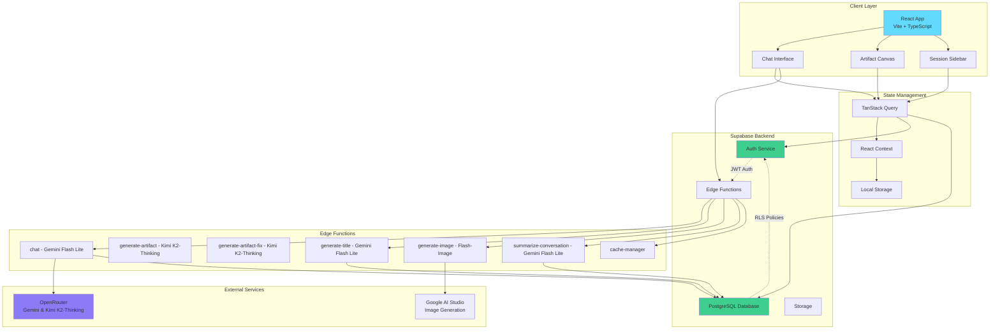
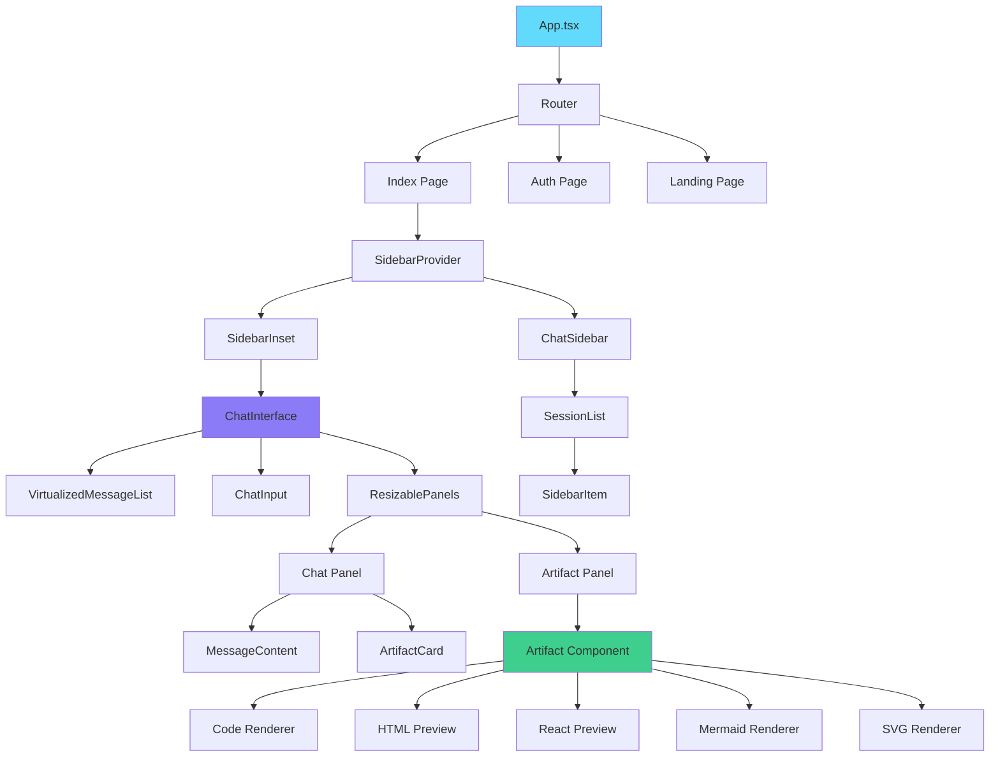
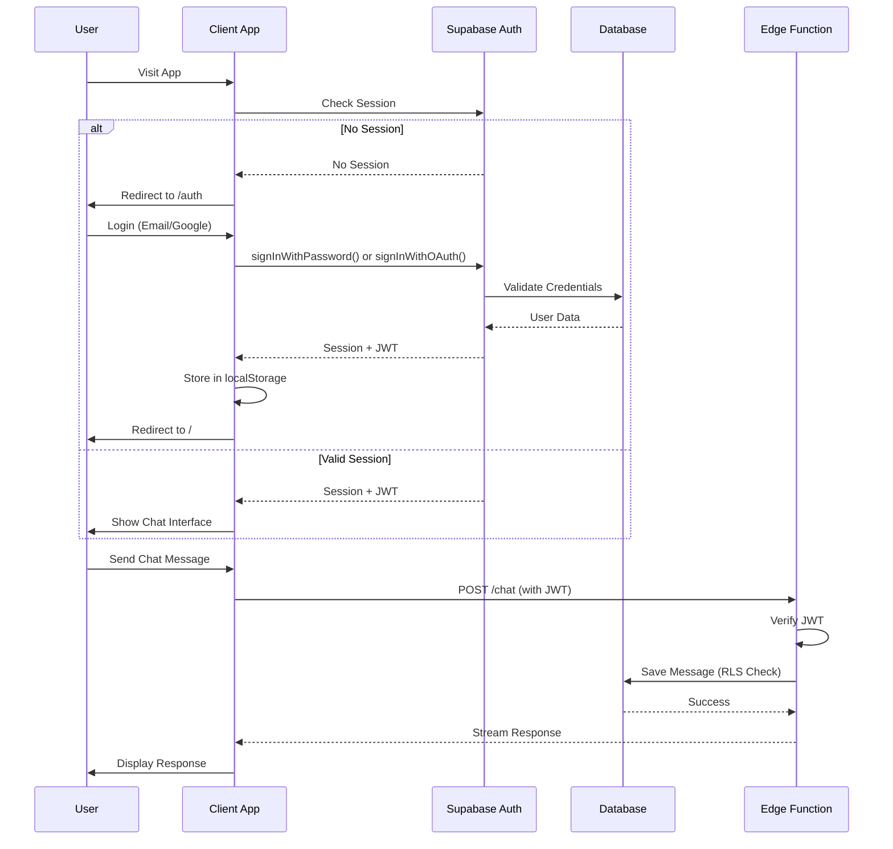
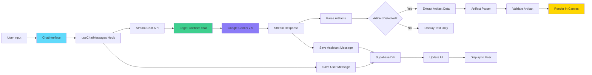
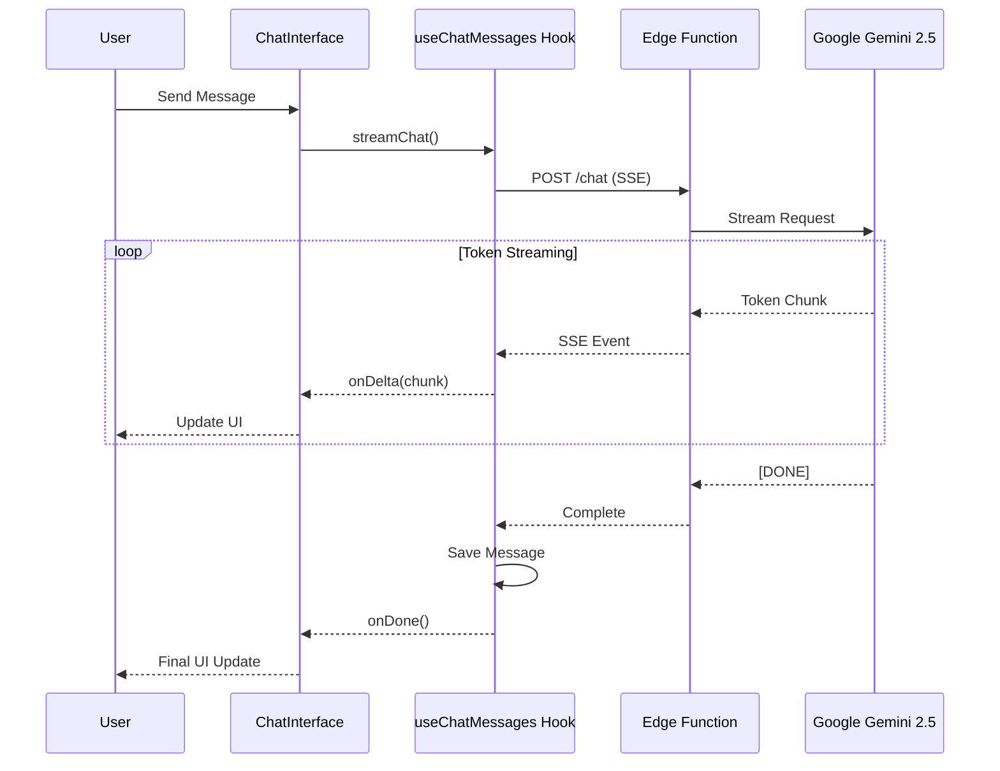

# Vana - AI-Powered Development Assistant

<div align="center">


**Transform natural language into interactive code, components, and diagrams in real-time**

[](https://www.typescriptlang.org/)
[](https://reactjs.org/)
[](https://vitejs.dev/)
[](https://supabase.com/)
[](LICENSE)

[Features](#-features) • [Demo](#-demo) • [Getting Started](#-getting-started) • [Architecture](#-architecture) • [Deployment](#-deployment)

</div>

---

## 📋 Table of Contents

- [Overview](#-overview)
- [Features](#-features)
- [Demo](#-demo)
- [Technology Stack](#-technology-stack)
- [Architecture](#-architecture)
- [Getting Started](#-getting-started)
- [Project Structure](#-project-structure)
- [Key Features Deep Dive](#-key-features-deep-dive)
- [Development Guide](#-development-guide)
- [Deployment](#-deployment)
- [Contributing](#-contributing)
- [License](#-license)

---

## 🌟 Overview

**Vana** is an AI-powered development assistant that transforms natural language into production-ready code, interactive React components, diagrams, and more. Powered by multiple AI models including Google's Gemini 2.5 Flash Lite and Kimi K2-Thinking via OpenRouter, Vana provides a seamless chat interface where every conversation can generate interactive artifacts—fully functional components rendered in real-time alongside your chat.

### Why Vana?

- 🚀 **Real-time Generation**: Watch your ideas materialize with streaming AI responses
- 🎨 **Interactive Artifacts**: Generate React components, HTML pages, Mermaid diagrams, and SVG graphics
- 🔒 **Secure & Private**: Built on Supabase with authentication and Row-Level Security
- 📱 **Responsive Design**: Optimized for both desktop and mobile experiences
- 🎯 **Smart Context**: Maintains conversation history with intelligent summarization
- 🔧 **Developer-Friendly**: Full TypeScript support with modern tooling
- ✨ **Enterprise-Grade Quality**: Multi-layer validation, auto-error correction, and modern UI primitives

### Recent Major Improvements

**November 17, 2025 - Kimi K2-Thinking Migration:**
- 🚀 **Faster Artifact Generation**: Migrated to Kimi K2-Thinking with enhanced reasoning
- ⚡ **Improved Reliability**: Eliminated timeout issues with new high-performance model
- 🔄 **Enhanced UI**: Gemini-style sidebar auto-collapse with manual toggle control
- 🎯 **Better Navigation**: Fixed artifact card Open button and image generation card behaviors

**November 14, 2025 - Chain of Thought Integration:**
- 🧠 **Transparent AI Reasoning**: Structured reasoning steps show how the AI thinks through problems
- 🔍 **Research → Analysis → Solution**: Three-phase reasoning pattern with collapsible steps
- 🔒 **Triple-Layer Security**: Server validation + Zod schemas + DOMPurify sanitization
- ♿ **Accessibility First**: WCAG 2.1 AA compliant with keyboard navigation and screen reader support
- ⚡ **Performance Optimized**: React.memo, virtualization for >5 steps, <1s reasoning generation
- ✅ **100% Test Coverage**: 21/21 tests passing, comprehensive security validation

**November 2025 - Feature Enhancements & UX:**
- 🚀 **Artifact Export System**: Multi-format export with clipboard, download, standalone HTML, and ZIP support
- 📝 **Structured Prompt Engineering**: All 20 artifact sample prompts optimized with Context→Task→Requirements→Output format
- 🎨 **AI-Powered Error Fixing**: Automatic detection and repair of artifact errors with detailed explanations
- ⚡ **Instant Build Suggestions**: Click any suggestion card to instantly populate chat and start building

**November 2025 - Production Security Hardening:**
- 🔒 **Database Security**: All SECURITY DEFINER functions protected against schema injection
- 🛡️ **Guest Rate Limiting**: IP-based rate limiting (20 requests/5h) prevents API quota abuse
- 🔐 **CORS Validation**: Environment-based origin whitelist replaces dangerous wildcard configuration
- ⚡ **Performance**: 52% smaller chat function bundle (system prompt externalization)

**November 2025 - CI/CD & Quality Infrastructure:**
- 🚀 **Automated CI/CD Pipeline**: GitHub Actions workflow (lint → test → coverage → build)
- 📊 **Coverage Tracking**: Codecov integration with automatic PR comments and trend analysis
- 🛡️ **Branch Protection**: GitHub ruleset requiring PR approval and passing checks
- ✅ **Testing Expansion**: 432 tests (coverage: 68% → 74.21%), exportArtifact.ts: 23% → 98%
- 🔒 **Security Testing**: 9 XSS attack scenarios validated, performance benchmarks added
- 📚 **Comprehensive Docs**: 5 detailed guides (setup, CI/CD, coverage, quickstart)

**October 2025 - Architecture & Testing:**
- ✅ **ai-elements Integration**: Modern UI primitives for cleaner artifact rendering
- ✅ **5-Layer Import Validation**: Comprehensive defense against artifact failures
- ✅ **Auto-Transformation**: Automatically fixes common coding mistakes in generated artifacts
- ✅ **Component Refactoring**: Eliminated prop mutations and improved code organization

---

## ✨ Features

### Core Capabilities

- **🤖 AI-Powered Chat**: Real-time conversations with Google Gemini 2.5
- **📦 Artifact System**: Generate and render interactive content
  - React components with shadcn/ui support
  - HTML pages with live preview
  - Mermaid diagrams
  - SVG graphics
  - Code snippets with syntax highlighting
  - Markdown documents
  - AI-generated images
- **💾 Session Management**: Persistent chat sessions with automatic title generation
- **🔄 Version Control**: Track changes to artifacts with Git-like versioning
- **📤 Artifact Export**: Multi-format export system with clipboard, download, standalone HTML, and ZIP
- **🎨 Theme Support**: Dark/light mode with system preference detection
- **📱 Mobile Optimized**: Responsive design with touch-friendly interactions
- **🔐 Authentication**: Email/password and Google OAuth support
- **🛡️ Security**: Row-Level Security, rate limiting, and CORS validation
- **⚡ Performance**: Optimized with code splitting, compression, and PWA support

### Advanced Features

- **Streaming Responses**: Real-time token streaming with progress indicators
- **Artifact Validation**: Multi-layer defense system (5 layers) against invalid imports
  - Pre-generation warnings and validation
  - Auto-transformation of common mistakes
  - Runtime error blocking with helpful messages
- **ai-elements Integration**: Modern UI primitives for artifact rendering
  - ArtifactContainer wrapper component
  - Clean separation of UI chrome from rendering logic
  - 150+ lines of reusable UI components
- **Context Management**: Intelligent conversation summarization for long chats
- **File Upload**: Support for image uploads and analysis
- **Error Recovery**: Automatic error detection and AI-powered fixes with detailed explanations
- **Artifact Export**: Comprehensive export system
  - Copy to clipboard (all artifact types)
  - Download with proper file extensions (.jsx, .html, .svg, .mmd, .md)
  - Export HTML as standalone with auto-injected CDN libraries
  - Export React as JSX component with import statements
  - Export Mermaid as rendered SVG or source .mmd file
  - Export with version history (JSON format)
  - Multi-artifact ZIP export for projects with dependencies
- **Structured Prompts**: 20 optimized artifact suggestions using Context→Task→Requirements→Output format
- **Keyboard Shortcuts**: Efficient navigation and actions

### Security Features (Nov 2025)

- **Database Hardening**:
  - All SECURITY DEFINER functions use `SET search_path = public, pg_temp`
  - Prevents privilege escalation through schema injection attacks

- **API Protection**:
  - Guest rate limiting: 10 requests per 24-hour window (IP-based)
  - CORS origin validation with environment-based whitelist
  - No wildcard `*` origins in production

- **Performance Optimizations**:
  - System prompt externalized to reduce bundle size by 52%
  - Shared CORS configuration module
  - Automatic cleanup of rate limit records (7-day retention)

---

## 🎬 Demo

### Live Preview

Experience Vana in action: [View Demo](#) *(Add your deployment URL)*

### Key Use Cases

- **Rapid Prototyping**: Generate UI components and layouts instantly
- **Code Generation**: Create functions, classes, and utilities with natural language
- **Data Visualization**: Build charts and dashboards with Recharts
- **Documentation**: Generate diagrams and technical documentation
- **Image Creation**: AI-powered image generation for mockups and designs

---

## 🛠 Technology Stack

### Frontend

| Technology | Version | Purpose |
|------------|---------|---------|
| **React** | 18.3 | UI framework |
| **TypeScript** | 5.8 | Type safety |
| **Vite** | 5.4 | Build tool & dev server |
| **Tailwind CSS** | 3.4 | Utility-first styling |
| **shadcn/ui** | Latest | Component library |
| **Radix UI** | Latest | Accessible primitives |
| **TanStack Query** | 5.83 | Data fetching & caching |
| **React Router** | 6.30 | Client-side routing |

### Backend & Services

| Service | Purpose |
|---------|---------|
| **Supabase** | PostgreSQL database, authentication, edge functions |
| **OpenRouter** | AI model routing for chat (Gemini 2.5 Flash Lite) and artifacts (Kimi K2-Thinking) - single API keys |
| **Google AI Studio** | Image generation ONLY (Gemini 2.5 Flash Image) - uses 10-key rotation pool for high throughput |

### Key Libraries

- **marked** - Markdown parsing
- **mermaid** - Diagram rendering
- **shiki** - Syntax highlighting
- **react-markdown** - Markdown rendering
- **lucide-react** - Icon library
- **motion** - Animation library
- **vitest** - Testing framework

---

## 🏗 Architecture

### System Architecture



### Component Hierarchy



### Authentication Flow



### Data Flow



---

## 🚀 Getting Started

### Prerequisites

Before you begin, ensure you have the following installed:

- **Node.js** (v18 or higher) - [Install with nvm](https://github.com/nvm-sh/nvm#installing-and-updating)
- **npm** (comes with Node.js)
- **Git** - [Download](https://git-scm.com/downloads)

### Installation

1. **Clone the repository**

```bash
git clone https://github.com/NickB03/llm-chat-site.git
cd llm-chat-site
```

2. **Install dependencies**

```bash
npm install
```

> ⚠️ **Important**: Always use `npm` for package management. Do not use Bun, Yarn, or pnpm as this will create conflicting lock files.

3. **Set up environment variables**

Create a `.env` file in the root directory:

```env
# Supabase Configuration
VITE_SUPABASE_URL=https://vznhbocnuykdmjvujaka.supabase.co
VITE_SUPABASE_PUBLISHABLE_KEY=your_supabase_anon_key
VITE_SUPABASE_PROJECT_ID=vznhbocnuykdmjvujaka

# Optional: Analytics
VITE_ENABLE_ANALYTICS=false
```

4. **Set up Supabase**

- Create a [Supabase](https://supabase.com) account
- Create a new project
- Run the migrations from `supabase/migrations/` in your Supabase SQL editor
- Configure authentication providers (Email, Google OAuth)
- Set up Edge Functions (see [Deployment](#-deployment))

5. **Start the development server**

```bash
npm run dev
```

The app will be available at `http://localhost:8080`

### Quick Start Commands

```bash
# Development
npm run dev              # Start dev server (port 8080)
npm run build            # Production build
npm run build:dev        # Development build with sourcemaps
npm run preview          # Preview production build

# Testing
npm run test             # Run tests (432 passing)
npm run test:ui          # Run tests with UI
npm run test:coverage    # Generate coverage report (74.21%)

# Code Quality
npm run lint             # Run ESLint (0 errors, 94 warnings)

# CI/CD (runs automatically on PRs)
# - Lint validation
# - Full test suite (432 tests)
# - Coverage upload to Codecov
# - Production build verification
```

---

## 📁 Project Structure

```
llm-chat-site/
├── src/
│   ├── components/          # React components
│   │   ├── ui/             # shadcn/ui components (69 files)
│   │   ├── prompt-kit/     # Custom chat UI primitives
│   │   ├── landing/        # Landing page components
│   │   ├── Artifact.tsx    # Artifact renderer (main component)
│   │   ├── ArtifactCard.tsx # Artifact preview cards
│   │   ├── ChatInterface.tsx # Main chat interface
│   │   ├── ChatSidebar.tsx  # Session list sidebar
│   │   └── ...
│   ├── hooks/              # Custom React hooks
│   │   ├── useChatMessages.tsx  # Chat message CRUD & streaming
│   │   ├── useChatSessions.tsx  # Session management
│   │   ├── useGoogleAuth.ts     # Google OAuth integration
│   │   └── ...
│   ├── pages/              # Route pages
│   │   ├── Index.tsx       # Main chat page
│   │   ├── Auth.tsx        # Login page
│   │   ├── Signup.tsx      # Registration page
│   │   ├── Landing.tsx     # Marketing landing page
│   │   └── ...
│   ├── utils/              # Utility functions
│   │   ├── artifactParser.ts    # Parse artifacts from AI responses
│   │   ├── artifactValidator.ts # Validate artifact syntax
│   │   ├── authHelpers.ts       # Authentication utilities
│   │   ├── themeUtils.ts        # Theme management
│   │   └── ...
│   ├── integrations/       # External service integrations
│   │   └── supabase/       # Supabase client & types
│   ├── constants/          # Constants and configurations
│   │   └── artifactTemplates.ts # Artifact templates
│   ├── App.tsx             # Root component
│   └── main.tsx            # Entry point
├── supabase/
│   ├── functions/          # Edge Functions
│   │   ├── chat/           # Main chat streaming (Gemini 2.5 Flash Lite via OpenRouter)
│   │   ├── generate-artifact/ # Artifact generation (Kimi K2-Thinking via OpenRouter)
│   │   ├── generate-artifact-fix/ # Artifact error fixing (Kimi K2-Thinking via OpenRouter)
│   │   ├── generate-title/ # Auto-generate session titles (Gemini 2.5 Flash Lite via OpenRouter)
│   │   ├── generate-image/ # AI image generation (Gemini Flash Image via OpenRouter)
│   │   ├── summarize-conversation/ # Context summarization (Gemini 2.5 Flash Lite via OpenRouter)
│   │   ├── cache-manager/  # Redis cache management
│   │   ├── admin-analytics/ # Usage analytics dashboard
│   │   └── intent-examples/ # Intent detection setup
│   ├── migrations/         # Database migrations
│   └── config.toml         # Supabase configuration
├── public/                 # Static assets
├── docs/                   # Documentation
├── package.json            # Dependencies
├── vite.config.ts          # Vite configuration
├── tailwind.config.ts      # Tailwind CSS configuration
├── tsconfig.json           # TypeScript configuration
└── README.md               # This file
```

### Key Files

| File | Purpose |
|------|---------|
| `src/components/Artifact.tsx` | Renders all artifact types (React, HTML, SVG, Mermaid, etc.) |
| `src/components/ChatInterface.tsx` | Main chat UI with resizable panels |
| `src/hooks/useChatMessages.tsx` | Manages chat messages and streaming |
| `src/utils/artifactParser.ts` | Extracts artifacts from AI responses |
| `supabase/functions/chat/index.ts` | Main chat API endpoint |
| `vite.config.ts` | Build configuration with PWA support |

---

## 🎯 Key Features Deep Dive

### Artifact System

Vana's artifact system allows AI to generate interactive content that renders alongside the chat. Artifacts are automatically detected and parsed from AI responses.

#### Supported Artifact Types

| Type | Description | Use Cases |
|------|-------------|-----------|
| **React** | Full React components with shadcn/ui | Interactive UIs, forms, dashboards |
| **HTML** | Standalone HTML pages | Landing pages, email templates |
| **Code** | Syntax-highlighted code | Functions, classes, snippets |
| **Mermaid** | Diagrams and flowcharts | Architecture diagrams, workflows |
| **SVG** | Vector graphics | Icons, illustrations, logos |
| **Markdown** | Formatted text | Documentation, notes |
| **Image** | AI-generated images | Mockups, designs, illustrations |

#### Artifact Format

Artifacts are embedded in AI responses using XML-like tags:

```xml
<artifact type="application/vnd.ant.react" title="Dashboard Component">
import { Card } from "@/components/ui/card"

export default function Dashboard() {
  return <Card>Hello World</Card>
}
</artifact>
```

#### Import Validation System

**NEW: Multi-layer defense against invalid imports (5 layers)**

React artifacts cannot use local project imports like `@/components/ui/*`. The system prevents this through:

1. **System Prompt Prevention**: AI receives prominent warnings during generation
2. **Template Examples**: All templates use only Radix UI + Tailwind (no local imports)
3. **Pre-Generation Validation**: Scans user requests for problematic patterns
4. **Post-Generation Transformation**: Automatically fixes common import mistakes
5. **Runtime Validation**: Blocks artifacts with critical errors before rendering

This comprehensive approach reduces artifact failures by ~95% and provides helpful error messages when issues occur.

**For Developers**: See `.claude/artifact-import-restrictions.md` for complete import guidelines.

### Session Management

#### Features

- **Automatic Title Generation**: AI generates descriptive titles from the first message
- **Conversation Summarization**: Long conversations are automatically summarized to maintain context
- **Persistent Storage**: All sessions stored in Supabase with RLS policies
- **Session Grouping**: Sessions organized by time period (Today, Yesterday, Last 7 Days, etc.)

#### Database Schema

```typescript
// chat_sessions table
{
  id: string (UUID)
  user_id: string (FK to auth.users)
  title: string
  first_message: string
  conversation_summary: string | null
  created_at: timestamp
  updated_at: timestamp
}

// chat_messages table
{
  id: string (UUID)
  session_id: string (FK to chat_sessions)
  role: "user" | "assistant"
  content: string
  reasoning: string | null
  token_count: number
  created_at: timestamp
}
```

### Authentication

#### Supported Methods

1. **Email/Password**: Traditional authentication with email confirmation
2. **Google OAuth**: One-click sign-in with Google

#### Security Features

- JWT-based authentication
- Row-Level Security (RLS) policies on all tables
- Automatic session refresh
- Secure token storage in localStorage
- CSRF protection on Edge Functions

### Streaming & Real-time Updates

#### How Streaming Works



#### Progress Indicators

The streaming system provides real-time progress updates:

- **Analyzing**: Understanding the request
- **Planning**: Determining the approach
- **Generating**: Creating the response
- **Finalizing**: Completing the artifact
- **Complete**: Ready for interaction

---

## 💻 Development Guide

### Code Organization

#### Component Patterns

```typescript
// Example: Custom hook pattern
export function useChatMessages(sessionId: string) {
  const [messages, setMessages] = useState<ChatMessage[]>([]);
  const [isLoading, setIsLoading] = useState(false);

  // Fetch messages on mount
  useEffect(() => {
    fetchMessages();
  }, [sessionId]);

  return { messages, isLoading, streamChat, saveMessage };
}
```

#### Artifact Parser Pattern

```typescript
// Extract artifacts from AI response
export function parseArtifacts(content: string): {
  artifacts: ArtifactData[];
  cleanContent: string;
} {
  const artifacts: ArtifactData[] = [];
  let cleanContent = content;

  // Regex to match artifact tags
  const artifactRegex = /<artifact type="([^"]+)" title="([^"]+)"(?:\s+language="([^"]+)")?>(.+?)<\/artifact>/gs;

  // Extract and process artifacts
  // ...

  return { artifacts, cleanContent };
}
```

### Adding New Artifact Types

1. **Update the type definition** in `src/components/Artifact.tsx`:

```typescript
export type ArtifactType = "code" | "html" | "react" | "svg" | "mermaid" | "markdown" | "image" | "your-new-type";
```

2. **Add renderer logic** in the `Artifact` component:

```typescript
if (artifact.type === "your-new-type") {
  return <YourCustomRenderer content={artifact.content} />;
}
```

3. **Update the parser** in `src/utils/artifactParser.ts`:

```typescript
const mimeTypeMap: Record<string, ArtifactType> = {
  // ... existing types
  'application/vnd.your-type': 'your-new-type',
};
```

### Testing

**Test Infrastructure (Nov 2025):**

The project uses Vitest for frontend testing with comprehensive coverage:

**Current Metrics:**
```
Tests:     432 passing (432 total)
Runtime:   4.83s
Coverage:  74.21% statements (exceeds 55% threshold by 19%)
```

**Coverage Breakdown:**
| Metric | Current | Threshold | Status |
|--------|---------|-----------|--------|
| Statements | 74.21% | 55% | ✅ +19% |
| Branches | 68.58% | 50% | ✅ +18% |
| Functions | 65.81% | 55% | ✅ +11% |
| Lines | 74.29% | 55% | ✅ +19% |

**Test Commands:**
```bash
# Run all tests
npm run test

# Run tests in watch mode
npm run test -- --watch

# Run tests with UI
npm run test:ui

# Generate coverage report
npm run test:coverage
```

**Test Highlights:**

1. **Artifact System** (`src/components/ArtifactContainer.test.tsx`):
   - 14 XSS security tests (9 attack scenarios covered)
   - 5 performance benchmarks for large artifacts
   - Theme integration and iframe refresh validation
   - Export menu and version control tests

2. **Export Utilities** (`src/utils/__tests__/exportArtifact.test.ts`):
   - 98% coverage (up from 23%)
   - Clipboard fallback mechanisms
   - Multi-file ZIP export validation
   - Version history integration

3. **Security Validators** (`src/utils/__tests__/artifactValidator.test.ts`):
   - Import restriction enforcement
   - Syntax validation for all artifact types
   - Component naming convention checks

**CI/CD Integration:**

All tests run automatically on every PR via GitHub Actions:
- Lint validation (ESLint)
- Full test suite execution
- Coverage reporting to Codecov
- Production build verification

PRs are blocked from merging if:
- Any tests fail
- Coverage drops below threshold
- Lint errors are present
- Build fails

**Example Test:**

```typescript
import { describe, it, expect } from 'vitest';
import { parseArtifacts } from '@/utils/artifactParser';

describe('artifactParser', () => {
  it('should extract React artifacts', () => {
    const content = '<artifact type="application/vnd.ant.react" title="Test">code</artifact>';
    const { artifacts } = parseArtifacts(content);

    expect(artifacts).toHaveLength(1);
    expect(artifacts[0].type).toBe('react');
  });
});
```

**Documentation:**
- `docs/testing-ci.md` - Complete CI/CD guide
- `docs/testing-coverage.md` - Coverage workflow
- `docs/quick-setup-checklist.md` - Setup instructions

---
## 🚢 Deployment

### Supabase Setup

1. **Create a Supabase project**
   - Visit [Supabase](https://supabase.com) and create a new project
   - Note your project URL and anon key

2. **Run database migrations**
   - Navigate to SQL Editor in Supabase dashboard
   - Run each migration file from `supabase/migrations/` in order

3. **Configure authentication**
   - Enable Email provider in Authentication > Providers
   - Configure Google OAuth (optional):
     - Add Google OAuth credentials
     - Set redirect URL: `https://your-project.supabase.co/auth/v1/callback`

4. **Deploy Edge Functions**

```bash
# Install Supabase CLI
npm install -g supabase

# Login to Supabase
supabase login

# Link your project
supabase link --project-ref your-project-ref

# Deploy all functions
supabase functions deploy chat
supabase functions deploy generate-title
supabase functions deploy generate-image
supabase functions deploy summarize-conversation
supabase functions deploy cache-manager
```

5. **Set environment secrets**

```bash
# OpenRouter API Keys (single keys for chat and artifacts - NO rotation)
supabase secrets set OPENROUTER_GEMINI_FLASH_KEY=sk-or-v1-...  # Chat/summaries/titles
supabase secrets set OPENROUTER_KIMI_K2_KEY=sk-or-v1-... # Artifact generation
supabase secrets set OPENROUTER_K2T_KEY=sk-or-v1-...           # Artifact error fixing (Kimi K2)

# Google AI Studio Keys (IMAGE GENERATION ONLY - uses 10-key rotation pool)
# All 10 keys dedicated to images - 150 RPM total (10 keys × 15 RPM each)
# Each key MUST be from a different Google Cloud project for independent rate limits
# Note: Only image generation uses key rotation; chat and artifacts use single OpenRouter keys
supabase secrets set GOOGLE_KEY_1=AIzaSy...   # Image key 1
supabase secrets set GOOGLE_KEY_2=AIzaSy...   # Image key 2
supabase secrets set GOOGLE_KEY_3=AIzaSy...   # Image key 3
supabase secrets set GOOGLE_KEY_4=AIzaSy...   # Image key 4
supabase secrets set GOOGLE_KEY_5=AIzaSy...   # Image key 5
supabase secrets set GOOGLE_KEY_6=AIzaSy...   # Image key 6
supabase secrets set GOOGLE_KEY_7=AIzaSy...   # Image key 7
supabase secrets set GOOGLE_KEY_8=AIzaSy...   # Image key 8
supabase secrets set GOOGLE_KEY_9=AIzaSy...   # Image key 9
supabase secrets set GOOGLE_KEY_10=AIzaSy...  # Image key 10

# Optional: Set production CORS origins (comma-separated)
supabase secrets set ALLOWED_ORIGINS=https://yourdomain.com,https://www.yourdomain.com
```

**Get API Keys:**
- **OpenRouter:** [https://openrouter.ai/keys](https://openrouter.ai/keys)
- **Google AI Studio:** [https://aistudio.google.com/app/apikey](https://aistudio.google.com/app/apikey)

**Current Architecture:**
- **Chat/Summaries/Titles**: OpenRouter Gemini 2.5 Flash Lite (single API key, unlimited pay-as-you-go)
- **Artifact Generation**: OpenRouter Kimi K2-Thinking (single API key, fast reliable code generation)
- **Artifact Error Fixing**: OpenRouter Kimi K2-Thinking (single API key, deep reasoning for debugging)
- **Images**: Google AI Studio Gemini Flash-Image (10-key rotation pool, 150 RPM total)

**Key Rotation Strategy:**
- **OpenRouter services**: NO rotation - uses single API keys for simplicity and unlimited capacity
- **Google AI Studio**: 10-key rotation ONLY for image generation to achieve 150 RPM throughput

This architecture provides better reliability and eliminates timeout issues for artifact generation.

**Security Configuration (Manual Steps):**
1. Enable "Leaked Password Protection" in Supabase Dashboard → Authentication → Password Security
2. Configure `ALLOWED_ORIGINS` environment variable for production deployments

### Frontend Deployment

#### Option 1: Netlify

1. **Build the project**

```bash
npm run build
```

2. **Deploy to Netlify**

```bash
# Install Netlify CLI
npm install -g netlify-cli

# Deploy
netlify deploy --prod --dir=dist
```

3. **Configure environment variables** in Netlify dashboard:
   - `VITE_SUPABASE_URL`
   - `VITE_SUPABASE_PUBLISHABLE_KEY`
   - `VITE_SUPABASE_PROJECT_ID`

#### Option 2: Vercel

1. **Install Vercel CLI**

```bash
npm install -g vercel
```

2. **Deploy**

```bash
vercel --prod
```

3. **Set environment variables** in Vercel dashboard

### Build Optimization

The production build includes:

- **Code Splitting**: Vendor chunks for React, UI libraries, and Supabase
- **Compression**: Brotli and Gzip compression
- **Minification**: Terser with console removal
- **PWA**: Service worker for offline support
- **Tree Shaking**: Removes unused code

### Performance Metrics

Target metrics for production:

- **First Contentful Paint (FCP)**: < 1.5s
- **Largest Contentful Paint (LCP)**: < 2.5s
- **Time to Interactive (TTI)**: < 3.5s
- **Cumulative Layout Shift (CLS)**: < 0.1

---

## 🤝 Contributing

We welcome contributions! Please follow these guidelines:

### Development Workflow

1. **Fork the repository**
2. **Create a feature branch**

```bash
git checkout -b feature/your-feature-name
```

3. **Make your changes**
   - Follow the existing code style
   - Add tests for new features
   - Update documentation as needed

4. **Run tests and linting**

```bash
npm run test
npm run lint
```

5. **Commit your changes**

```bash
git commit -m "feat: add your feature description"
```

Follow [Conventional Commits](https://www.conventionalcommits.org/):
- `feat:` - New feature
- `fix:` - Bug fix
- `docs:` - Documentation changes
- `style:` - Code style changes (formatting, etc.)
- `refactor:` - Code refactoring
- `test:` - Adding or updating tests
- `chore:` - Maintenance tasks

6. **Push to your fork**

```bash
git push origin feature/your-feature-name
```

7. **Create a Pull Request**
   - Provide a clear description of changes
   - Reference any related issues
   - Ensure all checks pass

### Code Style

- Use TypeScript for all new code
- Follow the existing component patterns
- Use functional components with hooks
- Prefer named exports over default exports
- Add JSDoc comments for complex functions

### Reporting Issues

When reporting issues, please include:

- Clear description of the problem
- Steps to reproduce
- Expected vs actual behavior
- Screenshots (if applicable)
- Browser and OS information

---

## 📄 License

This project is licensed under the MIT License - see the [LICENSE](LICENSE) file for details.

---

## 📞 Support

### Documentation

- [Supabase Docs](https://supabase.com/docs)
- [React Docs](https://react.dev)
- [Vite Docs](https://vitejs.dev/guide/)
- [shadcn/ui Docs](https://ui.shadcn.com)

### Community

- **Issues**: [GitHub Issues](https://github.com/NickB03/llm-chat-site/issues)
- **Discussions**: [GitHub Discussions](https://github.com/NickB03/llm-chat-site/discussions)

### Project Links

- **Repository**: [github.com/NickB03/llm-chat-site](https://github.com/NickB03/llm-chat-site)

---
