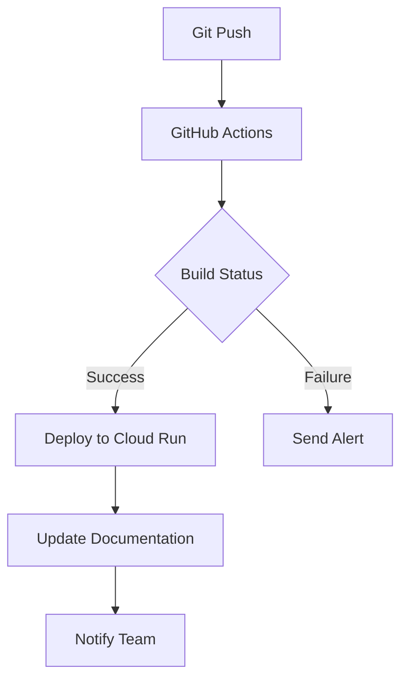

# Vana

Vana is an agent-driven cloud platform for SEO-ready products, providing agent-based prompting, memory, responses, and recall with high visibility.

This README is the complete, end-to-end system checklist and deployment guide.

---

## Stacks used:
- Lovable - for prompt control and UP configs
- Supabase - async database and memory storage
- Gemini - main runtime provider
- Korvus - embedding/recall service
- N8N - orchestration layer
- GCP - cloud run compute

---

## Technical Architecture

## Technical Architecture

For detailed architecture diagrams and component explanations, see [ARCHITECTURE.md](docs/ARCHITECTURE.md).

Key components:
- **Lovable UI**: Frontend interface handling user prompts and response display
- **n8n Workflows**: Orchestration layer connecting UI events to backend processing
- **Korvus Memory Service**: Vector database for context-aware AI operations
  - Embedding generation
  - Memory recall/search
  - Context management
- **Gemini API**: LLM processing for:
  - Prompt generation
  - Response synthesis
  - Agent-specific task execution
- **Supabase Database**: Relational storage for:
  - Agent action logs
  - System configurations
  - Audit trails

[View full architecture diagram](docs/ARCHITECTURE.md#system-diagram)

## API Documentation

For complete API specifications and endpoints, see [API.md](docs/API.md).

## Documentation Index
- [Agent Roster](docs/AGENTS.md)
- [System Architecture](docs/ARCHITECTURE.md)
- [API Documentation](docs/API.md)
---

## Minimal Deployment

## Deployment Guide

### Prerequisites
- Docker Desktop installed
- Google Cloud SDK configured
- Python 3.11+ and pip

### Production Deployment
```bash
# Build and push Docker image
docker build -t gcr.io/$(gcloud config get-value project)/vana-server:latest .
docker push gcr.io/$(gcloud config get-value project)/vana-server:latest

# Deploy to Cloud Run
gcloud run deploy vana-server \
  --image gcr.io/$(gcloud config get-value project)/vana-server:latest \
  --set-env-vars=GEMINI_API_KEY=...,SUPABASE_URL=...,SUPABASE_KEY=... \
  --region=us-central1 \
  --allow-unauthenticated \
  --min-instances=1 \
  --max-instances=10
```

### Local Development
```bash
# Install dependencies
pip install -U uvicorn[standard] gunicorn n8n supabase-client korvus

# Start local server
uvicorn main:app --reload
```

### Environment Variables
```env
# Required for all environments
GEMINI_API_KEY=your_gemini_key
SUPABASE_URL=your_supabase_url
SUPABASE_KEY=your_supabase_key
OPENAI_API_KEY=your_openai_key

# Optional development settings
DEBUG=true
LOG_LEVEL=debug
```

### CI/CD Integration


## Testing

```python
python scripts/test_router.py
```

Test payload used:
- `scripts/ui_test_payload.json`

## Lovable Studio Integration

- SageCard.tsx = markdown rendering of responses
- AdminPanel.tsx = view of past runs from Supabase
- PROMPTDERUCK = raw prompt to Gemini
- MemoryTag.tsx = memory context snap

## Cloud Run Environment

- GEMINI_API_KEY
- SUPABASE_URL
- SUPABASE_KEY

## URI Path suummary

Hook to /run with Lovable:
 * Lovable posts to `/run` route
 * Replay interface is /replay/:run_id
