# VANA: Enterprise Multi-Agent AI System

<!-- Phase 4 Complete - Production Ready with ThinkingPanel -->

<div align="center">
  
  [](https://www.python.org/downloads/)
  [](https://github.com/google/adk)
  [](https://opensource.org/licenses/MIT)
  []()
  []()
  
  **Transparent Multi-Agent AI: See How AI Thinks While It Works**
  
  [Demo](#demo) • [Features](#features) • [Quick Start](#quick-start) • [Architecture](#architecture) • [Documentation](#documentation)
</div>

---

## 🌟 Overview

VANA is an enterprise-grade multi-agent AI system that makes AI decision-making transparent. Built on Google's Agent Development Kit (ADK), VANA features a hierarchical orchestration system with real-time thinking visibility through its innovative ThinkingPanel.

### 🎯 Key Differentiator: See AI Think

Unlike traditional AI assistants, VANA shows you exactly how it processes your requests:
- **Real-time orchestration visibility** - Watch as requests are routed to specialists
- **Transparent decision making** - See which agents are working on your task
- **Live progress tracking** - Monitor each step of the analysis process

## 🚀 Quick Start

### Prerequisites

- Python 3.13+ (mandatory for ADK compatibility)
- Node.js 20+ and npm
- Docker (optional, for containerized deployment)
- Google API key for Gemini models

### Installation

```bash
# Clone the repository
git clone https://github.com/your-org/vana.git
cd vana

# Quick setup with Make
make setup && make dev

# Or manual setup:
# Backend
poetry install
cp .env.example .env
# Edit .env with your GOOGLE_API_KEY

# Frontend
cd vana-ui
npm install
```

### Running VANA

```bash
# Option 1: Using Make (recommended)
make dev

# Option 2: Manual
# Terminal 1 - Backend
python main.py

# Terminal 2 - Frontend
cd vana-ui && npm run dev

# Option 3: Docker
docker-compose up
```

### Access VANA

1. Open http://localhost:5173 (development) or http://localhost:8080 (production)
2. Login with demo credentials:
   - Email: `demo@vana.bot`
   - Password: `vana-demo-2025`
3. Try queries like:
   - "What are the security vulnerabilities in this code?"
   - "Analyze the data trends from last quarter"
   - "How should I deploy this application?"

## 🏗️ Architecture

```mermaid
graph TD
    User[User Interface] --> Chat[VANA Chat Agent]
    Chat --> Stream[Streaming API<br/>with ThinkingPanel Events]
    Stream --> Orchestrator[Master Orchestrator<br/>Enhanced V2]
    
    Orchestrator --> Routing{Intelligent<br/>Routing}
    
    Routing -->|Security Query| Security[🔒 Security Specialist]
    Routing -->|Data Query| DataSci[📊 Data Science Specialist]
    Routing -->|Code Query| Arch[🏗️ Architecture Specialist]
    Routing -->|Deploy Query| DevOps[⚙️ DevOps Specialist]
    Routing -->|Test Query| QA[🧪 QA Specialist]
    Routing -->|UI Query| UIUX[🎨 UI/UX Specialist]
    
    Security --> Tools1[Security Tools<br/>• Vulnerability Scan<br/>• Compliance Check<br/>• Threat Analysis]
    DataSci --> Tools2[Data Tools<br/>• Statistical Analysis<br/>• Data Cleaning<br/>• Trend Detection]
    Arch --> Tools3[Architecture Tools<br/>• AST Analysis<br/>• Pattern Detection<br/>• Refactoring]
    
    Orchestrator --> Thinking[ThinkingPanel<br/>Real-time Updates]
    Thinking --> User
    
    style Orchestrator fill:#f96,stroke:#333,stroke-width:4px
    style Thinking fill:#9f6,stroke:#333,stroke-width:2px
```



### Component Overview

1. **User Interface**: React-based chat interface with real-time thinking display
2. **Streaming API**: Server-sent events (SSE) for live updates
3. **Master Orchestrator**: Intelligent routing with caching and metrics
4. **Specialist Agents**: Domain-specific experts with real tools
5. **ThinkingPanel**: Transparent display of AI decision-making

## ✨ Features

### 🧠 ThinkingPanel - See AI in Action

The ThinkingPanel provides unprecedented transparency into AI operations:

```typescript
// Real-time thinking events displayed to users
🎯 Analyzing your request...
🔒 Security analysis requested - routing to Security Specialist...
🔍 Performing vulnerability scan...
✅ Analysis complete, preparing response...
```

### 👥 Specialist Agents

All specialists are production-ready with real tools:

| Specialist | Icon | Capabilities |
|------------|------|--------------|
| Security | 🔒 | Vulnerability scanning, compliance validation, threat analysis |
| Data Science | 📊 | Statistical analysis, data cleaning, trend detection |
| Architecture | 🏗️ | AST analysis, pattern detection, code refactoring |
| DevOps | ⚙️ | CI/CD generation, deployment configs, monitoring |
| QA | 🧪 | Test generation, coverage analysis, bug detection |
| UI/UX | 🎨 | Component generation, accessibility, responsive design |

### 🚀 Performance

- **Sub-100ms routing** - Lightning-fast specialist selection
- **LRU caching** - Optimized response times
- **Streaming responses** - Real-time content delivery
- **Thread-safe** - Enterprise-grade concurrency

### 🛡️ Production Features

- **Clean output formatting** - No internal handoff artifacts
- **Comprehensive error handling** - Graceful degradation
- **Health monitoring** - Built-in health checks
- **Docker ready** - Production containerization
- **Security first** - Input validation and sanitization

## 📊 API Documentation

### Streaming Chat Endpoint

```http
POST /chat
Content-Type: application/json

{
  "message": "Your query here",
  "session_id": "optional-session-id",
  "stream": true
}
```

**SSE Response Events:**

```javascript
// Thinking event
data: {"type": "thinking", "content": "Analyzing request...", "agent": "master_orchestrator"}

// Content streaming
data: {"type": "content", "content": "Based on my analysis..."}

// Completion
data: {"type": "done", "status": "complete"}
```

### Standard Chat Endpoint

```http
POST /run
Content-Type: application/json

{
  "input": "Your query here"
}
```

## 🔧 Configuration

### Environment Variables

```bash
# Required
GOOGLE_API_KEY=your-google-api-key
GOOGLE_CLOUD_PROJECT=your-project-id

# Optional
VANA_MODEL=gemini-2.0-flash  # Default model
PORT=8080                     # Server port
VANA_ENV=production          # Environment
LOG_LEVEL=INFO               # Logging level

# Feature Flags
VANA_ENABLE_SPECIALISTS=true  # Enable specialist agents
VANA_MAX_TOOLS_PER_AGENT=6   # ADK best practice
```

## 🐳 Docker Deployment

```bash
# Build and run with Docker Compose
docker-compose up -d

# Or build production image
docker build -t vana-prod -f Dockerfile.prod .
docker run -p 8080:8080 --env-file .env vana-prod
```

## 📁 Project Structure

```
vana/
├── agents/                 # Agent definitions
│   ├── vana/              # Main orchestrator
│   ├── specialists/       # Specialist agents
│   └── workflows/         # Workflow managers
├── lib/                   # Core libraries
│   ├── _tools/           # ADK tools
│   ├── _shared_libraries/ # Shared services
│   └── response_formatter.py # Output cleaning
├── vana-ui/              # React frontend
│   ├── src/
│   │   ├── components/   # UI components
│   │   │   └── ThinkingPanel.tsx
│   │   ├── pages/       # Page components
│   │   └── services/    # API integration
├── main.py              # Main entry point
├── docker-compose.yml   # Container orchestration
└── Dockerfile.prod      # Production image
```

## 🧪 Testing

```bash
# Run all tests
make test

# Test ThinkingPanel integration
python test_thinking_panel.py

# Run specific test suites
poetry run pytest -m unit       # Unit tests
poetry run pytest -m agent      # Agent tests
poetry run pytest -m integration # Integration tests
```

## 📈 Monitoring

- Health endpoint: `GET /health`
- Metrics: Performance tracking built into orchestrator
- Logging: Comprehensive logging with configurable levels

## 🔒 Security

- **Authentication**: Demo login (replace for production)
- **Input validation**: All inputs sanitized
- **Rate limiting**: Configurable per endpoint
- **CORS**: Properly configured for frontend
- **Secrets**: Environment-based configuration

## 🤝 Contributing

We welcome contributions! Please see [CONTRIBUTING.md](CONTRIBUTING.md) for guidelines.

## 📚 Documentation

- [Architecture Guide](docs/ARCHITECTURE.md) - Detailed system design
- [Development Guide](docs/DEVELOPMENT.md) - Setup and development
- [API Reference](docs/API.md) - Complete API documentation
- [Deployment Guide](DEPLOYMENT_GUIDE.md) - Production deployment

## 📄 License

This project is licensed under the MIT License - see [LICENSE](LICENSE) for details.

## 🙏 Acknowledgments

- Built on [Google ADK](https://github.com/google/adk) v1.1.1
- Powered by Gemini models
- UI components from [shadcn/ui](https://ui.shadcn.com/)

---

<div align="center">
  <strong>VANA - Making AI Transparent, One Decision at a Time</strong>
  
  [Report Bug](https://github.com/your-org/vana/issues) • [Request Feature](https://github.com/your-org/vana/issues)
</div>