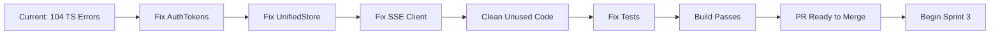

# Sprint 2 Stabilization Handoff Document
## Generated: 2025-08-24 7:45 PM

### 🎯 Executive Summary
**Current State**: Sprint 2 PRs merged but codebase has 104 TypeScript errors preventing build
**PR Status**: #115 open with CodeRabbit reviewing critical fixes
**Progress**: 5 critical issues fixed, ~100 remaining issues to resolve
**Swarm Limit**: Max 4 agents (M3 MacBook Air optimization)

---

## 📍 Where We Left Off

### Completed Work (Today)
1. ✅ Recovered from VS Code crash caused by too many agents
2. ✅ Verified all 8 Sprint 2 PRs successfully merged (#107-#114)
3. ✅ Created stabilization PR #115 for CodeRabbit review
4. ✅ Fixed 5 critical issues from CodeRabbit's first review:
   - Edge runtime environment variables
   - Message attribution in store
   - CSP WebAssembly configuration
   - Duplicate token refresh logic
   - Memory leaks in useTokenRefresh

### Current Branch
```bash
Branch: fix/sprint-2-stabilization
Latest Commit: 923607a2
PR: #115 (open)
```

---

## 📚 Essential Documents to Read

### 1. Sprint Planning Documents
```bash
# Primary planning docs (READ FIRST)
.claude_workspace/active-sprint-planning/sprint-quick-reference.md
.claude_workspace/active-sprint-planning/vana-frontend-sprint-plan.md
docs/vana-frontend-prd-final.md
docs/SPRINT-PLAN-FINAL.md

# Today's work reports
.claude_workspace/reports/sprint-2-recovery-assessment.md
.claude_workspace/reports/sprint-2-to-3-transition-report.md
.claude_workspace/reports/sprint-2-stabilization-handoff.md
```

### 2. Technical Context
```bash
# Configuration and setup
CLAUDE.md                    # Critical - M3 limits and project rules
frontend/package.json        # Dependencies and scripts
frontend/tsconfig.json       # TypeScript configuration
frontend/next.config.ts      # Next.js configuration
```

### 3. Current Issues
```bash
# Check these files for remaining errors
frontend/src/store/index.ts           # Type issues with UnifiedStore
frontend/src/lib/auth/google-oauth.ts # AuthTokens interface mismatch
frontend/src/lib/sse/client.ts        # Unused variables
frontend/src/validation/*             # Unused exports
```

---

## 🔧 Remaining Issues (Priority Order)

### 🔴 High Priority - Build Blockers (Must Fix)

#### 1. AuthTokens Interface Mismatch
**File**: `frontend/src/lib/auth/google-oauth.ts:287`
**Error**: Missing 'issued_at' property in AuthTokens
**Fix**: Add `issued_at: Date.now()` to tokens object

#### 2. UnifiedStore Type Issues
**File**: `frontend/src/store/index.ts:198-202`
**Error**: Circular reference and type inference problems
**Fix**: May need to refactor store initialization pattern

#### 3. SSE Client Issues
**Files**: `frontend/src/lib/sse/client.ts`
**Errors**: Unused event parameter, undefined type issues
**Fix**: Remove unused params or use underscore prefix

### 🟡 Medium Priority - Code Quality

#### 4. Unused Imports/Variables (~40 instances)
```typescript
// Common pattern to fix:
import { Something } from '...' // If unused, remove
const unused = value;           // Remove or prefix with _
```

#### 5. Middleware PROTECTED_ROUTES
**File**: `frontend/middleware.ts:27`
**Issue**: PROTECTED_ROUTES declared but never used
**Fix**: Either implement route protection or remove

### 🟢 Low Priority - Warnings

#### 6. Test Configuration
- React production mode in tests
- Missing NODE_ENV=test configuration
- Button component test failures

---

## 📋 Next Steps (In Order)

### Step 1: Check CodeRabbit's Latest Review
```bash
# Check PR for new comments
gh pr view 115 --comments

# Or via GitHub API
gh api repos/NickB03/vana/pulls/115/reviews --jq '.[].body'
```

### Step 2: Fix Remaining Build Blockers
```bash
# Start with the AuthTokens fix (easiest)
# File: frontend/src/lib/auth/google-oauth.ts
# Add: issued_at: Date.now() to the tokens object

# Then tackle UnifiedStore type issues
# This may require more significant refactoring
```

### Step 3: Run Validation Suite
```bash
# After each fix, test:
npm run build       # Should eventually pass
npm run lint        # Clean up warnings
npm test           # Fix test configuration
```

### Step 4: Commit Pattern
```bash
# Use atomic commits for each fix category
git add -p  # Stage specific changes
git commit -m "fix: [category] specific issue

- Detail what was fixed
- Why it was broken
- Impact of the fix"
```

---

## 🤖 Swarm Configuration

### Agent Allocation (Max 4)
```javascript
// Recommended swarm for continuation
1. TypeScriptFixer - Focus on type errors
2. LintCleaner - Handle unused imports/variables  
3. TestConfigFixer - Fix test environment
4. PRManager - Handle commits and PR updates
```

### Memory Namespaces
```javascript
// Existing memory stores
sprint2_recovery      // Recovery status
sprint2_stabilization // PR #115 info
sprint3              // Next sprint planning
coderabbit_fixes     // Review feedback tracking
```

---

## 🚨 Critical Warnings

### DO NOT:
- ❌ Spawn more than 4 agents (will crash VS Code)
- ❌ Use `process.env['KEY']` bracket notation (breaks Edge runtime)
- ❌ Merge without fixing build errors
- ❌ Start Sprint 3 until build is green

### ALWAYS:
- ✅ Test build after each fix
- ✅ Update memory after significant progress
- ✅ Use TodoWrite to track tasks
- ✅ Commit frequently with clear messages

---

## 📊 Success Metrics

### Minimum Viable Stabilization
```bash
✅ npm run build          # Exits with code 0
✅ TypeScript errors      # 0 errors
⚠️  Lint warnings         # < 50 acceptable
⚠️  Test suite           # Can be fixed later
```

### Ideal State
```bash
✅ Build passes
✅ TypeScript clean
✅ Lint warnings < 10
✅ All tests passing
✅ CodeRabbit approves
```

---

## 💡 Quick Wins

### Easy Fixes (< 5 min each)
1. Add `issued_at` to AuthTokens
2. Remove unused imports (use ESLint auto-fix)
3. Prefix unused vars with underscore
4. Remove PROTECTED_ROUTES if unused

### Auto-fixable
```bash
# Auto-fix many issues
npx eslint . --fix

# Format code
npx prettier --write .
```

---

## 📞 Communication

### PR Comment for Next Session
```markdown
@coderabbitai - Critical fixes from your review have been implemented:
- ✅ Edge runtime env vars fixed
- ✅ Message attribution corrected
- ✅ CSP WebAssembly updated
- ✅ Token refresh deduplicated
- ✅ Memory leaks prevented

Continuing with remaining TypeScript errors and build issues.
```

### Status Update Template
```markdown
## Stabilization Progress Update

**Errors Fixed**: X/104
**Build Status**: ❌ Still failing / ✅ Passing
**Next Focus**: [Current priority]

### Completed
- Item 1
- Item 2

### In Progress
- Current task

### Blocked
- Any blockers
```

---

## 🗺️ Recovery Path



---

## 🔗 Quick Commands

```bash
# Check current status
npm run build 2>&1 | grep -c "error"
npx tsc --noEmit 2>&1 | grep -c "error TS"

# See specific errors
npx tsc --noEmit 2>&1 | grep "error TS" | head -20

# Check PR status
gh pr view 115 --json state,mergeable,reviews

# Quick memory check
mcp__claude-flow__memory_usage { action: "list", namespace: "sprint2_stabilization" }

# Spawn stabilization swarm
mcp__claude-flow__swarm_init { topology: "hierarchical", maxAgents: 4 }
```

---

## 📝 Final Notes

### Current Challenges
1. UnifiedStore type system is complex - may need architectural review
2. Test environment not properly configured for React
3. Many interconnected type issues that cascade

### Opportunities
1. Most issues are straightforward (unused code)
2. CodeRabbit providing good guidance
3. Build is close to working (down from 116 to 104 errors)

### Time Estimate
- **Quick fixes**: 1-2 hours
- **Full stabilization**: 3-4 hours
- **With testing**: 4-5 hours

---

Generated by Claude Code SPARC Swarm Coordinator
Session: swarm_1756048444368_tzb6t7q2l
Handoff Time: 2025-08-24 19:45:00 UTC
Good luck! 🚀