# Todo Review Hooks - TypeScript Validation System

## Overview
A comprehensive hook system that automatically validates TypeScript code after each todo completion, triggers SPARC reviewer for analysis, and attempts automatic fixes when errors are detected.

## 🚀 Installation

```bash
# Run the installer script
chmod +x .claude_workspace/hooks/install-todo-hooks.sh
.claude_workspace/hooks/install-todo-hooks.sh
```

This creates:
- `.claude-hooks/` directory with validation scripts
- `.claude-flow-hooks.json` configuration file
- `.claude-hooks-config.yaml` for Claude Code integration

## 📁 File Structure

```
.claude-hooks/
├── post-todo-validate.sh    # Runs after todo completion
├── pre-todo-validate.sh     # Runs before todo starts
└── validate-typescript.sh    # Manual validation trigger

.claude_workspace/hooks/
├── todo-review-hook.ts       # TypeScript implementation
└── install-todo-hooks.sh     # Installation script
```

## 🔧 Configuration

### Main Configuration (`.claude-flow-hooks.json`)

```json
{
  "hooks": {
    "todo": {
      "pre": ".claude-hooks/pre-todo-validate.sh",
      "post": ".claude-hooks/post-todo-validate.sh",
      "enabled": true
    },
    "typescript": {
      "strictMode": true,
      "autoFix": true,
      "blockOnErrors": true,
      "validateOnEveryTodo": true
    },
    "sparc": {
      "reviewer": {
        "autoTrigger": true,
        "agents": ["reviewer", "tester", "sparc-validator"]
      },
      "fixer": {
        "autoTrigger": true,
        "maxRetries": 3,
        "agents": ["coder", "refactor", "optimizer"]
      }
    }
  }
}
```

### Configuration Options

| Option | Default | Description |
|--------|---------|-------------|
| `strictMode` | `true` | Fail on any TypeScript error |
| `autoFix` | `true` | Automatically attempt fixes using SPARC |
| `blockOnErrors` | `true` | Block todo completion if errors exist |
| `validateOnEveryTodo` | `true` | Run validation on all todo completions |
| `maxRetries` | `3` | Maximum auto-fix attempts |

## 🎯 How It Works

### 1. Pre-Todo Validation
- Checks for existing TypeScript errors before starting a todo
- Attempts to fix existing errors to ensure clean baseline
- Non-blocking by default (warns but continues)

### 2. Post-Todo Validation
- **Triggered automatically** when a todo is marked complete
- Runs TypeScript compiler (`tsc --noEmit`)
- If errors detected:
  1. Triggers SPARC reviewer for analysis
  2. Attempts automatic fix with SPARC coder
  3. Re-validates after fix attempt
  4. Blocks completion if errors persist

### 3. Error Handling Flow

```mermaid
graph TD
    A[Todo Completed] --> B{TypeScript Check}
    B -->|Pass| C[✅ Complete]
    B -->|Fail| D[SPARC Reviewer Analysis]
    D --> E[SPARC Auto-Fix Attempt]
    E --> F{Re-validate}
    F -->|Pass| C
    F -->|Fail| G[Generate Error Report]
    G --> H[❌ Block & Require Manual Fix]
```



## 💻 Usage Examples

### Manual Validation
```bash
# Run comprehensive TypeScript validation
.claude-hooks/validate-typescript.sh
```

### Simulate Todo Completion
```bash
# Test the post-todo hook
.claude-hooks/post-todo-validate.sh "todo-1" "Implement new feature" "completed"
```

### Check Pre-Todo State
```bash
# Ensure clean state before starting
.claude-hooks/pre-todo-validate.sh "Starting new feature"
```

## 🤖 SPARC Integration

The hooks automatically trigger SPARC agents:

1. **Reviewer Agent**: Analyzes TypeScript errors and suggests fixes
2. **Coder Agent**: Implements automatic fixes
3. **Refactor Agent**: Cleans up code structure if needed
4. **Validator Agent**: Final validation pass

### SPARC Commands Used

```bash
# Review errors
npx claude-flow sparc run reviewer "TypeScript errors: [errors]"

# Fix errors
npx claude-flow sparc run coder "Fix TypeScript errors: [errors]"

# Batch fix with multiple agents
npx claude-flow sparc batch "reviewer,coder,refactor" "Fix all errors"
```

## 📊 Error Reporting

Error reports are saved to `.claude_workspace/reports/` with:
- Todo content that caused the error
- Timestamp
- Full TypeScript error output
- Attempted fixes
- Remaining issues

Example report location:
```
.claude_workspace/reports/typescript-errors-1234567890.txt
```

## ⚙️ Advanced Features

### 1. Pattern Detection
The hook tracks error patterns across todos to identify recurring issues.

### 2. Memory Integration
Uses Claude Flow memory to store validation history:
```bash
npx claude-flow hooks post-edit --memory-key "todos/[id]/validation/[timestamp]"
```

### 3. Notification System
Sends notifications when manual intervention is required:
```bash
npx claude-flow hooks notify --message "TypeScript errors require manual fix"
```

### 4. Incremental Validation
Supports incremental TypeScript compilation for faster checks on large projects.

## 🚨 Common Issues & Solutions

### Issue: Hook not triggering
**Solution**: Ensure hooks are executable
```bash
chmod +x .claude-hooks/*.sh
```

### Issue: Auto-fix failing repeatedly
**Solution**: Adjust retry limit in configuration
```json
"maxRetries": 5
```

### Issue: Too many false positives
**Solution**: Disable strict mode
```json
"strictMode": false
```

### Issue: Performance on large projects
**Solution**: Enable incremental compilation
```bash
# Add to tsconfig.json
"incremental": true
```

## 🔍 Validation Checks

The hooks perform multiple validation levels:

1. **TypeScript Compilation** - Core type checking
2. **Unused Imports** - Detects and removes unused imports
3. **Type Assertions** - Warns about `as any` usage
4. **Suppressed Errors** - Identifies `@ts-ignore` comments
5. **Lint Checks** - Runs ESLint (non-blocking)

## 📈 Benefits

1. **Prevents Error Accumulation**: Catches TypeScript errors immediately after each change
2. **Automatic Fixes**: Reduces manual intervention with SPARC-powered fixes
3. **Quality Gates**: Ensures each todo completion maintains code quality
4. **Learning System**: Tracks patterns to improve future fixes
5. **Documentation**: Automatic error reporting for debugging

## 🎯 Best Practices

1. **Run validation before commits**: Use manual validation script
2. **Review error reports**: Check `.claude_workspace/reports/` regularly
3. **Adjust sensitivity**: Configure based on project needs
4. **Monitor patterns**: Use memory system to track recurring issues
5. **Keep SPARC updated**: Ensure claude-flow is latest version

## 🔗 Integration with CI/CD

Add to your CI pipeline:
```yaml
# GitHub Actions example
- name: TypeScript Validation
  run: |
    .claude-hooks/validate-typescript.sh
    if [ $? -ne 0 ]; then
      echo "TypeScript errors detected"
      exit 1
    fi
```

## 📝 Customization

### Add Custom Validation
Edit `.claude-hooks/post-todo-validate.sh` to add custom checks:
```bash
# Add custom validation
CUSTOM_CHECK=$(your-custom-command)
if [ ! -z "$CUSTOM_CHECK" ]; then
  echo "Custom validation failed"
  # Trigger SPARC fix
fi
```

### Change SPARC Agents
Modify `.claude-flow-hooks.json`:
```json
"agents": ["your-custom-agent", "another-agent"]
```

## 🆘 Support

- **Issues**: Report in `.claude_workspace/reports/`
- **Logs**: Check hook output for debugging
- **Configuration**: Adjust `.claude-flow-hooks.json`
- **Manual Override**: Disable with `"enabled": false`

---

**Version**: 1.0.0  
**Last Updated**: 2025-08-24  
**Status**: ✅ Active and Installed