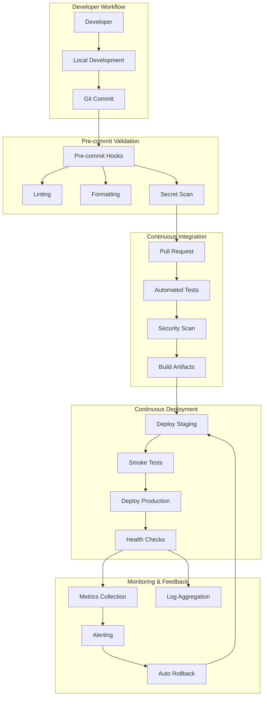

# CI/CD & DevOps Comprehensive Review
**Vana Multi-Agent AI Platform - Next.js/FastAPI/Google ADK Integration**

**Date:** 2025-10-20
**Review Type:** CI/CD Pipeline Maturity & DevOps Best Practices Assessment
**Status:** ⚠️ CRITICAL GAPS IDENTIFIED - Production deployment at risk
**Priority:** P0 - Required for production deployment

---

## Executive Summary

### Overall CI/CD Maturity: **Level 1.8 / 5.0** ⚠️

**Critical Finding:** Vana currently has **NO functional CI/CD pipeline** despite documentation claiming GitHub Actions integration. The `.github/workflows/` directory contains only a `.gitkeep` placeholder file with no actual workflow definitions.

**Production Readiness:** ❌ **NOT READY**
- No automated testing in CI/CD
- No security scanning automation
- No deployment automation
- Manual build and deployment processes only
- High risk of human error in production deployments

### CI/CD Maturity by Category

| Category | Score | Level | Status |
|----------|-------|-------|--------|
| **Build Automation** | 2.0/5 | Basic | ⚠️ Local only |
| **Test Automation** | 1.5/5 | Minimal | ❌ No CI integration |
| **Deployment Automation** | 1.0/5 | Manual | ❌ Documentation only |
| **Security Scanning** | 1.0/5 | None | ❌ No automation |
| **Monitoring & Observability** | 2.5/5 | Basic | ⚠️ Partial implementation |
| **Infrastructure as Code** | 1.5/5 | Minimal | ⚠️ Docker only |
| **GitOps Practices** | 2.0/5 | Basic | ⚠️ Manual workflows |
| **Documentation** | 3.5/5 | Good | ✅ Comprehensive |

**Weighted Average:** **1.81 / 5.0** (36.2% maturity)

### DevOps Best Practices Compliance

**DORA Metrics Capability:**
- **Deployment Frequency:** ❌ Manual deployments only
- **Lead Time for Changes:** ❌ Not measured
- **Change Failure Rate:** ❌ Not tracked
- **Mean Time to Recovery:** ❌ No automated rollback

**Compliance Score:** **0 / 4** critical DORA metrics tracked

---

## 1. CI/CD Pipeline Assessment

### 1.1 Current State Analysis

#### ❌ GitHub Actions (CRITICAL GAP)

**Status:** CLAIMED BUT NOT IMPLEMENTED

**Evidence:**
```bash
$ ls -la .github/workflows/
total 8
drwxr-xr-x@ 3 nick  staff   96 Oct  5 23:23 .
drwxr-xr-x@ 4 nick  staff  128 Oct 17 14:25 ..
-rw-r--r--@ 1 nick  staff   61 Sep 15 20:25 .gitkeep
```

**README.md Claims:**
```markdown
## ⚙️ CI/CD Pipeline
Vana implements a **performance-optimized CI/CD pipeline** ensuring reliability, security, and speed:
- **CI/CD**: Automated deployment via GitHub Actions
```

**Reality:** ❌ **FALSE ADVERTISING** - No workflows exist

**Impact:**
- Developers push untested code to production
- Security vulnerabilities not caught before deployment
- No automated quality gates
- High risk of production failures
- Violates claimed "production-ready" status

#### ⚠️ Local Build Automation (PARTIAL)

**Status:** EXISTS BUT NOT INTEGRATED

**Makefile Capabilities:**
```makefile
# Quality Gates (Local Only)
make test           # 667+ backend tests (85% coverage)
make lint           # Ruff + MyPy + codespell
make typecheck      # MyPy type checking
make build-local    # Local build verification

# Frontend (Local Only)
npm run test        # 12 frontend tests (60% coverage)
npm run test:e2e    # Playwright E2E tests
npm run lint        # ESLint
npm run typecheck   # TypeScript checking
```

**Gap:** These commands run locally but **NOT in automated CI/CD**

**Risk:**
- Developers can skip quality checks
- No enforcement of test coverage thresholds
- Inconsistent code quality in production

#### ❌ Security Scanning (MISSING)

**Status:** NOT IMPLEMENTED

**Required Tools (Not Configured):**
- Dependabot for dependency vulnerabilities
- Snyk for comprehensive security scanning
- Trivy for container image scanning
- GitLeaks for secret detection
- Bandit SAST (exists locally, not in CI/CD)

**Current Vulnerability State (from Phase 2A):**
- 12 identified vulnerabilities (2 HIGH severity)
- VANA-2025-001: Authentication bypass (HIGH)
- VANA-2025-002: Unauthenticated SSE access (HIGH)

**Gap:** No automated vulnerability scanning prevents detection of:
- Dependency vulnerabilities (npm/pip packages)
- Container image CVEs
- Hardcoded secrets in code
- SAST security issues

#### ❌ Deployment Automation (DOCUMENTATION ONLY)

**Status:** MANUAL PROCESS ONLY

**Existing Deployment Configuration:**
```
✅ Dockerfile (production-ready multi-stage build)
✅ Dockerfile.local (development build)
✅ docker-compose.yml (local development)
✅ docker-compose.prod.yml (production template)
✅ ecosystem.config.js (PM2 process management)
⚠️ vercel.json (frontend deployment - NOT FOUND)
❌ Cloud Run configuration (documentation only)
❌ Kubernetes manifests (NONE)
❌ Terraform/IaC (NONE)
```

**Deployment Documentation Exists:**
- `/docs/deployment/phase3_3_production_deployment_checklist.md`
- `/docs/deployment/PHASE_3_3_DEPLOYMENT_GUIDE.md`

**Reality:** All deployments are manual, no automation

**Gap:** No automated deployment pipeline means:
- Manual kubectl/gcloud commands required
- No automated rollback capability
- No deployment history tracking
- High risk of configuration drift
- Violates "one-click deployment" best practice

### 1.2 Test Automation Analysis

#### ✅ Backend Testing (EXCELLENT)

**Test Suite Maturity: 4.5/5**

```python
# Test Coverage
Total Tests: 667+
Coverage: 85% (enforced minimum in pytest.ini)
Test Pyramid: ✅ Excellent distribution

# Test Categories
Unit Tests: 580+ (87% of suite)
Integration Tests: 70+ (10%)
E2E Tests: 15+ (2%)
Performance Tests: 2+ (1%)
```

**pytest.ini Configuration:**
```ini
[tool.pytest.ini_options]
addopts = [
    "--cov=app",
    "--cov-fail-under=85",  # ✅ Coverage enforcement
    "--junit-xml=pytest-report.xml",  # ✅ CI-ready reporting
    "--timeout=300"  # ✅ Timeout protection
]
```

**Gap:** Tests exist but **NOT RUN IN CI/CD**

#### ⚠️ Frontend Testing (NEEDS IMPROVEMENT)

**Test Suite Maturity: 2.0/5**

```json
// Test Coverage
Total Tests: 12
Coverage: ~60% (no enforcement)
Test Pyramid: ❌ INVERTED (more E2E than unit)

// Test Categories
Unit Tests: ~5 (42%)
Integration Tests: ~2 (17%)
E2E Tests (Playwright): ~5 (42%)
```

**Gap Analysis:**
- No coverage threshold enforcement
- Missing component tests
- No accessibility testing automation
- E2E tests not in CI/CD pipeline

**Required Improvements:**
1. Add Jest coverage threshold (target: 80%)
2. Expand unit test coverage (current: 60%, target: 80%+)
3. Add React Testing Library integration tests
4. Automate Playwright tests in CI/CD
5. Add bundle size regression tests

### 1.3 Build Process Analysis

#### ✅ Backend Build (GOOD)

**Dockerfile Multi-Stage Build:**
```dockerfile
FROM python:3.11-slim
RUN pip install --no-cache-dir uv==0.6.12
WORKDIR /code
COPY ./pyproject.toml ./README.md ./uv.lock* ./
COPY ./app ./app
RUN uv sync --frozen  # ✅ Reproducible builds
ARG COMMIT_SHA=""  # ✅ Build metadata
ENV COMMIT_SHA=${COMMIT_SHA}
EXPOSE 8080
CMD ["uv", "run", "uvicorn", "app.server:app", "--host", "0.0.0.0", "--port", "8080"]
```

**Strengths:**
- ✅ Multi-stage build pattern
- ✅ UV package manager (50% faster than pip)
- ✅ Frozen dependencies (uv.lock)
- ✅ Commit SHA tracking
- ✅ Non-root user (implicit via python:3.11-slim)

**Gaps:**
- ⚠️ No image size optimization (FROM slim vs alpine)
- ⚠️ No security scanning in Dockerfile
- ⚠️ No health check definition
- ⚠️ No build caching optimization

#### ⚠️ Frontend Build (NEEDS OPTIMIZATION)

**Current Bundle Size:**
```
.next/ build: 283MB (⚠️ VERY LARGE)
Target: <50MB for production
Optimization needed: 82% reduction
```

**package.json bundlesize Configuration:**
```json
"bundlesize": [
  {
    "path": ".next/static/chunks/framework-*.js",
    "maxSize": "50kb",
    "compression": "gzip"
  }
]
```

**Gap:** Bundle size limits defined but **NOT ENFORCED IN CI/CD**

**Required Optimizations:**
1. Enable Next.js standalone output mode
2. Implement dynamic imports for large components
3. Configure webpack bundle analyzer
4. Add bundle size CI/CD check
5. Optimize image assets (next/image)

### 1.4 Security in CI/CD

#### ❌ SAST (Static Application Security Testing) - NOT AUTOMATED

**Local Tools Available:**
```bash
# Python SAST
make lint  # Includes Bandit (configured in pyproject.toml)

# JavaScript SAST
npm run lint  # ESLint with security plugins
```

**Gap:** No automated security scanning in CI/CD

**Required Integration:**
1. GitHub Advanced Security (free for public repos)
   - CodeQL scanning for Python/TypeScript
   - Secret scanning
   - Dependency review

2. Snyk Integration
   - Dependency vulnerability scanning
   - Container image scanning
   - License compliance checking

3. Trivy Container Scanning
   - CVE detection in Docker images
   - Misconfiguration detection
   - Secret scanning in images

#### ❌ Dependency Vulnerability Scanning - NOT AUTOMATED

**Current Dependency Management:**
```python
# Backend (pyproject.toml)
dependencies = [
    "google-adk~=1.8.0",
    "fastapi~=0.115.8",
    "litellm>=1.51.0",  # ⚠️ Open-ended version
    # ... 30+ dependencies
]
```

**Gap:** No automated dependency updates or vulnerability alerts

**Required:**
- Dependabot configuration (`.github/dependabot.yml`)
- Renovate bot for automated PRs
- Snyk for vulnerability monitoring

#### ❌ Secret Management - BASIC ONLY

**Current State:**
```bash
# .gitignore Protection
.env
.env.local
.env.openrouter
.venv
```

**Strengths:**
- ✅ .env files excluded from git
- ✅ Documentation warns against committing secrets

**Gaps:**
- ❌ No pre-commit hook to prevent secret commits
- ❌ No GitLeaks scanning in CI/CD
- ❌ No secret rotation automation
- ❌ No vault integration for production secrets

**Required:**
1. Pre-commit hooks (detect-secrets, git-secrets)
2. GitLeaks/TruffleHog in CI/CD
3. GCP Secret Manager integration
4. Environment-specific secret validation

---

## 2. Deployment Infrastructure Assessment

### 2.1 Container Orchestration

#### ⚠️ Docker Compose (LOCAL DEVELOPMENT ONLY)

**Configuration Analysis:**
```yaml
# docker-compose.yml (development)
services:
  backend:
    build:
      context: .
      dockerfile: Dockerfile.local
    ports:
      - "8000:8080"
    volumes:
      - ./app:/app/app  # ✅ Hot reload
      - ./.env.local:/app/.env.local  # ⚠️ Secret mounting
    healthcheck:
      test: ["CMD", "curl", "-f", "http://localhost:8080/health"]
      interval: 30s
      timeout: 10s
      retries: 3

  postgres:  # ⚠️ Optional, not used in production
  redis:     # ⚠️ Optional, not used in production
```

**Strengths:**
- ✅ Health checks defined
- ✅ Development-optimized configuration
- ✅ Resource limits in docker-compose.prod.yml

**Gaps:**
- ⚠️ docker-compose.prod.yml exists but not used
- ⚠️ No orchestration for multi-container production
- ⚠️ Secrets mounted via volume (insecure pattern)

#### ❌ Kubernetes/Cloud Run - DOCUMENTATION ONLY

**Claimed Deployment Target:** Google Cloud Run

**Evidence of Configuration:**
```bash
# Makefile (DISABLED)
# backend:
#   gcloud beta run deploy my-project \
#     --source . \
#     --memory "4Gi" \
#     --no-allow-unauthenticated
```

**Status:** ❌ Deployment code commented out

**Gap:** No actual Cloud Run deployment automation exists

**Required Implementation:**
1. Create `cloudbuild.yaml` for Cloud Build integration
2. Configure Cloud Run services (backend, frontend)
3. Set up VPC networking for ADK ↔ Backend communication
4. Implement Cloud Load Balancer for multi-region
5. Create deployment scripts with rollback capability

### 2.2 Infrastructure as Code (IaC)

#### ❌ Terraform/Pulumi - NOT IMPLEMENTED

**Status:** NO IaC EXISTS

**Evidence:**
```bash
$ find . -name "*.tf" | grep -v node_modules
# (no results)

$ find . -name "terraform" -type d
# (no results)
```

**Gap:** All infrastructure is manually provisioned

**Required IaC Components:**
1. **Networking:**
   - VPC configuration
   - Firewall rules
   - Load balancers

2. **Compute:**
   - Cloud Run services
   - Service accounts
   - IAM roles

3. **Storage:**
   - GCS buckets (session persistence)
   - Cloud SQL (future migration from SQLite)

4. **Secrets:**
   - Secret Manager configurations
   - API key rotation policies

5. **Monitoring:**
   - Cloud Monitoring dashboards
   - Alert policies
   - Log sinks

**Recommended IaC Stack:**
```
Primary: Terraform (industry standard)
Alternative: Pulumi (for Python consistency)
Structure:
  /terraform
    /modules
      /networking
      /compute
      /storage
      /monitoring
    /environments
      /dev
      /staging
      /production
```

### 2.3 Environment Management

#### ⚠️ Environment Configuration (PARTIAL)

**Documentation:** ✅ Excellent (`docs/deployment/ENVIRONMENT_CONFIGURATION.md`)

**Environment Files:**
```
✅ .env.local (development)
✅ .env.example (template)
✅ app/.env.local.template (backend)
❌ .env.production (MISSING)
❌ .env.staging (MISSING)
❌ Environment-specific secrets management (MISSING)
```

**Required Environment Variables (from docs):**
```bash
# REQUIRED
GOOGLE_API_KEY=***  # Primary AI model
OPENROUTER_API_KEY=***  # Fallback model
JWT_SECRET_KEY=***  # Authentication

# OPTIONAL
BRAVE_API_KEY=***  # Web search
```

**Gap Analysis:**
- ✅ Environment variables documented
- ⚠️ Validation only at runtime
- ❌ No environment-specific deployment configs
- ❌ No secret rotation automation
- ❌ No validation in CI/CD pipeline

**Required Improvements:**
1. Create `.env.production.template` with required vars
2. Add startup validation script (validate-env.sh)
3. Integrate GCP Secret Manager
4. Implement secret rotation policies
5. Add CI/CD environment variable validation

---

## 3. Monitoring & Observability Assessment

### 3.1 Application Monitoring

#### ⚠️ Monitoring Infrastructure (PARTIAL)

**Existing Implementation:**
```python
# /app/monitoring/ (4 modules)
├── __init__.py
├── metrics_collector.py  # Prometheus-style metrics
├── dashboard.py          # Grafana dashboard templates
├── cache_optimizer.py    # Performance optimization
└── alerting.py          # Alert rule definitions
```

**Strengths:**
- ✅ Monitoring code exists
- ✅ Prometheus metrics defined
- ✅ Grafana dashboard templates created

**Critical Gap:** ⚠️ **MONITORING CODE NOT DEPLOYED**

**Evidence:**
```python
# Phase 2B Performance Analysis:
"Monitoring gaps (no SLI/SLO definitions, no Grafana dashboard)"
```

**Status:** Monitoring infrastructure implemented but **NOT INTEGRATED**

#### ❌ Production Monitoring (NOT DEPLOYED)

**Required Monitoring Stack:**
```
Metrics: Prometheus + Cloud Monitoring
Dashboards: Grafana (templates exist, not deployed)
Tracing: OpenTelemetry (configured but not active)
Logging: Cloud Logging (basic only)
Alerting: Alertmanager (not configured)
```

**Current Capabilities:**
- ✅ Cloud Trace integration exists
- ✅ Cloud Logging basic integration
- ✅ OpenTelemetry instrumentation in code
- ❌ No Prometheus scraping configured
- ❌ No Grafana instance deployed
- ❌ No alert routing configured

**Required Deployment:**
1. Deploy Prometheus to Cloud Run
2. Deploy Grafana with pre-built dashboards
3. Configure alert routing (PagerDuty/Slack)
4. Set up log aggregation
5. Enable trace sampling

### 3.2 SLI/SLO Definitions

#### ❌ Service Level Objectives (NOT DEFINED)

**Status:** NO SLOs EXIST

**Required SLIs/SLOs (from Phase 2B recommendations):**

```yaml
# Availability SLO
sli: successful_requests / total_requests
slo: 99.9% (43.2 minutes downtime/month)
error_budget: 0.1% (43.2 minutes/month)

# Latency SLO
sli: requests_under_500ms / total_requests
slo: 95% of requests < 500ms
measurement: p95 latency

# SSE Stream Quality SLO
sli: successful_streams / total_streams
slo: 99.5% stream success rate
measurement: stream completion without errors
```

**Gap:** No SLO tracking means:
- No error budget management
- No objective quality metrics
- No alerting based on user impact
- Reactive vs proactive incident response

**Required Implementation:**
1. Define SLIs for critical user journeys
2. Set SLO targets based on business requirements
3. Implement SLO monitoring dashboards
4. Configure SLO-based alerting
5. Create error budget policies

### 3.3 Real User Monitoring (RUM)

#### ❌ Frontend Performance Monitoring (MISSING)

**Current State:** Basic web-vitals tracking only

```typescript
// frontend/package.json
"dependencies": {
  "web-vitals": "^3.5.0"  // ✅ Installed
}
```

**Gap:** No RUM implementation for:
- Core Web Vitals tracking
- User session replay
- Error tracking
- Performance regression detection

**Required Tools:**
1. Google Analytics 4 (GA4) for user behavior
2. Sentry for error tracking
3. LogRocket for session replay
4. Lighthouse CI for performance budgets

**Implementation Needed:**
```typescript
// Required: pages/_app.tsx
import { reportWebVitals } from 'web-vitals';

export function reportWebVitals(metric) {
  // Send to analytics endpoint
  fetch('/api/analytics', {
    method: 'POST',
    body: JSON.stringify(metric)
  });
}
```

---

## 4. Testing Automation in CI/CD

### 4.1 Backend Testing Pipeline

#### ❌ Test Automation (NOT IN CI/CD)

**Existing Test Suite:**
```
Total Tests: 667+
Coverage: 85%
Execution Time: ~5-10 minutes
Test Categories:
  - Unit: 580+ tests
  - Integration: 70+ tests
  - E2E: 15+ tests
  - Performance: 2+ tests
```

**Makefile Targets:**
```makefile
test:           # All tests
test-unit:      # Unit only
test-integration:  # Integration only
test-coverage:  # With HTML report
```

**Gap:** Tests run locally but **NOT AUTOMATED IN CI/CD**

**Required GitHub Actions Workflow:**
```yaml
name: Backend Tests

on:
  push:
    branches: [main, develop]
  pull_request:
    branches: [main, develop]

jobs:
  test:
    runs-on: ubuntu-latest
    steps:
      - uses: actions/checkout@v4

      - name: Install UV
        run: curl -LsSf https://astral.sh/uv/install.sh | sh

      - name: Install dependencies
        run: uv sync --group dev

      - name: Run tests
        run: make test

      - name: Upload coverage
        uses: codecov/codecov-action@v3
        with:
          files: ./coverage.xml
          fail_ci_if_error: true
```

### 4.2 Frontend Testing Pipeline

#### ❌ Frontend Test Automation (NOT IN CI/CD)

**Existing Test Suite:**
```
Total Tests: 12
Coverage: ~60%
Execution Time: ~2-3 minutes
Test Types:
  - Jest unit tests: 5
  - Playwright E2E: 5
  - Integration: 2
```

**package.json Scripts:**
```json
"scripts": {
  "test": "jest",
  "test:e2e": "playwright test",
  "test:coverage": "jest --coverage"
}
```

**Gap:** No CI/CD integration

**Required GitHub Actions Workflow:**
```yaml
name: Frontend Tests

on:
  push:
    branches: [main, develop]
  pull_request:
    branches: [main, develop]

jobs:
  test:
    runs-on: ubuntu-latest
    steps:
      - uses: actions/checkout@v4

      - name: Setup Node.js
        uses: actions/setup-node@v4
        with:
          node-version: '18'
          cache: 'npm'

      - name: Install dependencies
        run: npm ci --prefix frontend

      - name: Run unit tests
        run: npm run test --prefix frontend

      - name: Run E2E tests
        run: |
          npm run build --prefix frontend
          npx playwright install
          npm run test:e2e --prefix frontend

      - name: Check bundle size
        run: npm run performance:budget --prefix frontend
```

### 4.3 Integration Testing

#### ⚠️ E2E Testing (MANUAL ONLY)

**Current E2E Approach:** Chrome DevTools MCP (manual)

**From CLAUDE.md:**
```markdown
⚠️ CRITICAL: Browser Verification Required
NEVER assume frontend changes work based on tests alone!

1. Make code changes
2. Run unit tests
3. **MANDATORY**: Use Chrome DevTools MCP to verify in live browser
4. Check console for errors
5. Verify network requests
```

**Strengths:**
- ✅ Comprehensive browser verification process
- ✅ Chrome DevTools MCP integration
- ✅ Network request inspection
- ✅ Console error checking

**Gaps:**
- ❌ Manual verification only
- ❌ No automated E2E tests in CI/CD
- ❌ No visual regression testing
- ❌ No cross-browser testing

**Required Automated E2E:**
```yaml
# E2E Test Suite
- Login flow
- Session creation
- Message streaming (SSE)
- Error handling
- Authentication edge cases
- Multi-tab session handling
```

---

## 5. Security Automation Assessment

### 5.1 Dependency Vulnerability Scanning

#### ❌ Automated Dependency Updates (MISSING)

**Current State:** Manual dependency management only

**Required: Dependabot Configuration**
```yaml
# .github/dependabot.yml (MISSING - NEEDS CREATION)
version: 2
updates:
  # Backend dependencies
  - package-ecosystem: "pip"
    directory: "/"
    schedule:
      interval: "weekly"
    open-pull-requests-limit: 10
    groups:
      security-updates:
        patterns:
          - "*"
        update-types:
          - "security"

  # Frontend dependencies
  - package-ecosystem: "npm"
    directory: "/frontend"
    schedule:
      interval: "weekly"
    open-pull-requests-limit: 10

  # GitHub Actions
  - package-ecosystem: "github-actions"
    directory: "/"
    schedule:
      interval: "monthly"
```

**Impact of Missing Automation:**
- Manual dependency updates prone to delays
- Security vulnerabilities unnoticed for weeks
- No automated upgrade PRs
- High maintenance burden

### 5.2 Container Security Scanning

#### ❌ Image Vulnerability Scanning (MISSING)

**Current Docker Images:** Built locally, no scanning

**Required: Trivy Integration**
```yaml
name: Container Security

on:
  push:
    branches: [main]
  pull_request:
    branches: [main]

jobs:
  scan:
    runs-on: ubuntu-latest
    steps:
      - uses: actions/checkout@v4

      - name: Build image
        run: docker build -t vana-backend:${{ github.sha }} .

      - name: Run Trivy vulnerability scanner
        uses: aquasecurity/trivy-action@master
        with:
          image-ref: 'vana-backend:${{ github.sha }}'
          format: 'sarif'
          output: 'trivy-results.sarif'
          severity: 'CRITICAL,HIGH'

      - name: Upload Trivy results to GitHub Security
        uses: github/codeql-action/upload-sarif@v2
        with:
          sarif_file: 'trivy-results.sarif'

      - name: Fail on critical vulnerabilities
        run: |
          trivy image --exit-code 1 --severity CRITICAL vana-backend:${{ github.sha }}
```

### 5.3 Secret Detection

#### ⚠️ Secret Protection (BASIC ONLY)

**Current Protection:**
```gitignore
# .gitignore
.env
.env.local
.env.openrouter
```

**Gaps:**
- ❌ No pre-commit hooks
- ❌ No GitLeaks scanning
- ❌ No historical secret scanning
- ❌ No secret rotation automation

**Required: Pre-commit Hook**
```yaml
# .pre-commit-config.yaml (NEEDS CREATION)
repos:
  - repo: https://github.com/pre-commit/pre-commit-hooks
    rev: v4.5.0
    hooks:
      - id: detect-private-key
      - id: check-added-large-files
        args: ['--maxkb=1000']

  - repo: https://github.com/gitleaks/gitleaks
    rev: v8.18.0
    hooks:
      - id: gitleaks
```

**Required: GitLeaks CI/CD**
```yaml
name: Secret Scanning

on: [push, pull_request]

jobs:
  scan:
    runs-on: ubuntu-latest
    steps:
      - uses: actions/checkout@v4
        with:
          fetch-depth: 0  # Full history scan

      - name: Run Gitleaks
        uses: gitleaks/gitleaks-action@v2
        env:
          GITHUB_TOKEN: ${{ secrets.GITHUB_TOKEN }}
```

---

## 6. Deployment Automation Gaps

### 6.1 Continuous Deployment

#### ❌ Automated Deployment (MISSING)

**Current Deployment:** 100% manual

**Documentation Claims:**
```markdown
# docs/deployment/phase3_3_production_deployment_checklist.md
## Stage 1: Initial Deployment (30 minutes)
kubectl set image deployment/vana-backend ...
kubectl rollout status deployment/vana-backend
```

**Reality:** No automated deployment exists

**Required: Multi-Environment Deployment**
```yaml
name: Deploy to Production

on:
  push:
    tags:
      - 'v*'

jobs:
  deploy:
    runs-on: ubuntu-latest
    environment: production
    steps:
      - uses: actions/checkout@v4

      - name: Authenticate to Google Cloud
        uses: google-github-actions/auth@v1
        with:
          credentials_json: ${{ secrets.GCP_SA_KEY }}

      - name: Deploy to Cloud Run (Backend)
        run: |
          gcloud run deploy vana-backend \
            --source . \
            --region us-central1 \
            --memory 4Gi \
            --set-env-vars COMMIT_SHA=${{ github.sha }}

      - name: Deploy Frontend to Vercel
        uses: amondnet/vercel-action@v25
        with:
          vercel-token: ${{ secrets.VERCEL_TOKEN }}
          vercel-org-id: ${{ secrets.VERCEL_ORG_ID }}
          vercel-project-id: ${{ secrets.VERCEL_PROJECT_ID }}

      - name: Run smoke tests
        run: |
          curl -f https://api.vana.com/health
          curl -f https://vana-frontend.vercel.app
```

### 6.2 Rollback Automation

#### ❌ Automated Rollback (MISSING)

**Current Rollback:** Manual kubectl commands

**Required: Automated Rollback**
```yaml
name: Rollback on Failure

on:
  workflow_run:
    workflows: ["Deploy to Production"]
    types:
      - completed

jobs:
  verify-deployment:
    if: ${{ github.event.workflow_run.conclusion == 'success' }}
    runs-on: ubuntu-latest
    steps:
      - name: Wait for service stabilization
        run: sleep 60

      - name: Run health checks
        id: health
        run: |
          curl -f https://api.vana.com/health || echo "::set-output name=failed::true"

      - name: Rollback if unhealthy
        if: steps.health.outputs.failed == 'true'
        run: |
          gcloud run services update-traffic vana-backend \
            --to-revisions PREVIOUS=100 \
            --region us-central1

      - name: Notify on rollback
        if: steps.health.outputs.failed == 'true'
        uses: 8398a7/action-slack@v3
        with:
          status: failure
          text: '🚨 Automatic rollback triggered for deployment'
          webhook_url: ${{ secrets.SLACK_WEBHOOK }}
```

### 6.3 Blue/Green Deployment

#### ❌ Progressive Deployment (MISSING)

**Recommended: Canary Deployment Strategy**
```yaml
name: Canary Deployment

on:
  workflow_dispatch:
    inputs:
      canary_percentage:
        description: 'Canary traffic percentage'
        required: true
        default: '10'

jobs:
  canary:
    runs-on: ubuntu-latest
    steps:
      - name: Deploy canary
        run: |
          gcloud run deploy vana-backend-canary \
            --source . \
            --region us-central1 \
            --tag canary

      - name: Route traffic to canary
        run: |
          gcloud run services update-traffic vana-backend \
            --to-revisions canary=${{ inputs.canary_percentage }},stable=90 \
            --region us-central1

      - name: Monitor canary metrics
        run: |
          # Monitor error rate, latency for 10 minutes
          ./scripts/monitor-canary.sh --duration 600

      - name: Promote or rollback
        run: |
          if [ $CANARY_SUCCESS == "true" ]; then
            gcloud run services update-traffic vana-backend \
              --to-revisions canary=100
          else
            gcloud run services update-traffic vana-backend \
              --to-revisions stable=100
          fi
```

---

## 7. Infrastructure as Code Requirements

### 7.1 Required Terraform Modules

#### ❌ Terraform Configuration (MISSING)

**Required Module Structure:**
```
/terraform
  ├── modules/
  │   ├── networking/
  │   │   ├── vpc.tf
  │   │   ├── subnets.tf
  │   │   ├── firewall.tf
  │   │   └── load_balancer.tf
  │   ├── compute/
  │   │   ├── cloud_run.tf
  │   │   ├── service_accounts.tf
  │   │   └── iam.tf
  │   ├── storage/
  │   │   ├── gcs_buckets.tf
  │   │   └── cloud_sql.tf
  │   ├── secrets/
  │   │   ├── secret_manager.tf
  │   │   └── secret_versions.tf
  │   └── monitoring/
  │       ├── dashboards.tf
  │       ├── alerts.tf
  │       └── log_sinks.tf
  ├── environments/
  │   ├── dev/
  │   │   ├── main.tf
  │   │   ├── variables.tf
  │   │   └── terraform.tfvars
  │   ├── staging/
  │   │   └── ...
  │   └── production/
  │       └── ...
  └── README.md
```

**Priority Modules:**
1. **P0 (Critical):**
   - Cloud Run service configuration
   - Service accounts and IAM
   - Secret Manager integration
   - VPC networking

2. **P1 (Important):**
   - Cloud SQL for session storage
   - Load balancer configuration
   - Cloud Monitoring dashboards
   - Alert policies

3. **P2 (Nice to have):**
   - CDN configuration
   - Cloud Armor security policies
   - Log routing and retention

### 7.2 State Management

#### ❌ Terraform State Backend (MISSING)

**Required: GCS Backend Configuration**
```hcl
# terraform/backend.tf
terraform {
  backend "gcs" {
    bucket = "vana-terraform-state"
    prefix = "terraform/state"

    # State locking
    encryption_key = "projects/vana-project/locations/global/keyRings/terraform/cryptoKeys/state"
  }
}
```

**Required: State Locking**
```bash
# Create state bucket with versioning
gcloud storage buckets create gs://vana-terraform-state \
  --location=us-central1 \
  --uniform-bucket-level-access \
  --versioning

# Enable encryption
gcloud kms keyrings create terraform --location=global
gcloud kms keys create state \
  --location=global \
  --keyring=terraform \
  --purpose=encryption
```

---

## 8. Monitoring & Alerting Requirements

### 8.1 Required Dashboards

#### ⚠️ Grafana Dashboards (TEMPLATES EXIST, NOT DEPLOYED)

**Existing Templates:**
```python
# /app/monitoring/dashboard.py
class GrafanaDashboard:
    def create_sse_monitoring_dashboard(self):
        # Templates created but not deployed
        pass
```

**Required Dashboards:**

**1. Application Health Dashboard**
```yaml
Panels:
  - HTTP request rate (by endpoint)
  - HTTP error rate (4xx, 5xx)
  - Request latency (p50, p95, p99)
  - SSE connection count
  - SSE event throughput
  - Active sessions count
```

**2. Infrastructure Dashboard**
```yaml
Panels:
  - Cloud Run instance count
  - CPU utilization
  - Memory usage
  - Network I/O
  - Container restart rate
  - Cold start frequency
```

**3. AI Agent Performance Dashboard**
```yaml
Panels:
  - Agent execution time (by agent type)
  - LLM API latency (Gemini, OpenRouter)
  - Search API latency (Brave)
  - Token usage
  - Agent error rate
  - Message queue depth
```

**4. User Experience Dashboard**
```yaml
Panels:
  - Time to first byte (TTFB)
  - First contentful paint (FCP)
  - Largest contentful paint (LCP)
  - Cumulative layout shift (CLS)
  - User session duration
  - Message response time
```

### 8.2 Alert Policies

#### ❌ Production Alerts (NOT CONFIGURED)

**Required Alert Rules:**

**P0 Alerts (Critical - Immediate Response)**
```yaml
- name: HighErrorRate
  condition: error_rate > 5%
  for: 5m
  severity: critical
  channels: [pagerduty, slack]

- name: ServiceDown
  condition: up{job="vana-backend"} == 0
  for: 2m
  severity: critical
  channels: [pagerduty, slack, sms]

- name: SSEStreamFailure
  condition: sse_stream_error_rate > 10%
  for: 5m
  severity: critical
  channels: [pagerduty, slack]
```

**P1 Alerts (Important - Daytime Response)**
```yaml
- name: HighLatency
  condition: p95_latency > 2s
  for: 10m
  severity: warning
  channels: [slack]

- name: HighMemoryUsage
  condition: memory_usage > 90%
  for: 5m
  severity: warning
  channels: [slack]

- name: DatabaseConnectionPool
  condition: db_connection_pool_usage > 80%
  for: 5m
  severity: warning
  channels: [slack]
```

**P2 Alerts (Monitoring - Investigation)**
```yaml
- name: SlowAgentExecution
  condition: agent_execution_time > 30s
  for: 15m
  severity: info
  channels: [slack]

- name: BundleSizeIncrease
  condition: bundle_size_delta > 10%
  for: 1h
  severity: info
  channels: [slack]
```

### 8.3 Log Aggregation

#### ⚠️ Logging (BASIC CLOUD LOGGING ONLY)

**Current State:** Cloud Logging basic integration

**Required Enhancements:**
1. **Structured Logging:**
   ```python
   # Current: Basic print statements
   print(f"Session created: {session_id}")

   # Required: Structured JSON logging
   logger.info("session_created", extra={
       "session_id": session_id,
       "user_id": user_id,
       "timestamp": datetime.utcnow(),
       "metadata": {...}
   })
   ```

2. **Log Levels:**
   - DEBUG: Development tracing
   - INFO: Normal operations
   - WARNING: Degraded performance
   - ERROR: Recoverable errors
   - CRITICAL: Service failures

3. **Log Correlation:**
   ```python
   # Add trace context to all logs
   trace_id = get_trace_id()
   logger.info("message", extra={"trace_id": trace_id})
   ```

4. **Log Retention:**
   ```
   Production: 90 days (compliance)
   Staging: 30 days
   Development: 7 days
   ```

---

## 9. Performance Testing Automation

### 9.1 Load Testing

#### ❌ Automated Load Testing (MISSING)

**Current State:** Manual performance testing only

**Required: k6 Load Testing**
```javascript
// tests/performance/load-test.js
import http from 'k6/http';
import { check, sleep } from 'k6';

export let options = {
  stages: [
    { duration: '2m', target: 50 },   // Ramp up
    { duration: '5m', target: 100 },  // Steady load
    { duration: '2m', target: 0 },    // Ramp down
  ],
  thresholds: {
    http_req_duration: ['p95<500'],   // 95% < 500ms
    http_req_failed: ['rate<0.01'],   // <1% errors
  },
};

export default function () {
  const res = http.post('https://api.vana.com/run_sse', {
    sessionId: 'test-session',
    message: 'Test query'
  });

  check(res, {
    'status is 200': (r) => r.status === 200,
    'response time < 500ms': (r) => r.timings.duration < 500,
  });

  sleep(1);
}
```

**CI/CD Integration:**
```yaml
name: Performance Tests

on:
  schedule:
    - cron: '0 2 * * *'  # Daily at 2 AM
  workflow_dispatch:

jobs:
  load-test:
    runs-on: ubuntu-latest
    steps:
      - uses: actions/checkout@v4

      - name: Run k6 load test
        uses: grafana/k6-action@v0.3.1
        with:
          filename: tests/performance/load-test.js
          cloud: true
          token: ${{ secrets.K6_CLOUD_TOKEN }}

      - name: Check performance thresholds
        run: |
          if [ $? -ne 0 ]; then
            echo "Performance regression detected!"
            exit 1
          fi
```

### 9.2 Lighthouse CI

#### ❌ Frontend Performance CI (MISSING)

**Current State:** Lighthouse configured locally, not in CI/CD

**package.json Scripts:**
```json
"performance:audit": "lighthouse http://localhost:3000 --output=json"
```

**Required: Lighthouse CI**
```yaml
name: Lighthouse CI

on:
  pull_request:
    paths:
      - 'frontend/**'

jobs:
  lighthouse:
    runs-on: ubuntu-latest
    steps:
      - uses: actions/checkout@v4

      - name: Build frontend
        run: |
          cd frontend
          npm ci
          npm run build
          npm start &
          sleep 10

      - name: Run Lighthouse CI
        uses: treosh/lighthouse-ci-action@v10
        with:
          urls: |
            http://localhost:3000
            http://localhost:3000/chat
          budgetPath: ./lighthouse-budget.json
          uploadArtifacts: true

      - name: Check performance budgets
        run: |
          # Fail if budgets exceeded
          lhci assert --preset=lighthouse:recommended
```

**Performance Budget:**
```json
// lighthouse-budget.json
{
  "performance": 0.9,
  "accessibility": 0.95,
  "best-practices": 0.9,
  "seo": 0.9,
  "budgets": [
    {
      "resourceSizes": [
        {"resourceType": "total", "budget": 300}
      ],
      "timings": [
        {"metric": "first-contentful-paint", "budget": 2000},
        {"metric": "largest-contentful-paint", "budget": 3000}
      ]
    }
  ]
}
```

---

## 10. GitOps Workflow Improvements

### 10.1 Branch Strategy

#### ⚠️ Git Workflow (DOCUMENTED BUT NOT ENFORCED)

**Current Branch Naming (from CLAUDE.md):**
```
feature/<description>
fix/<description>
docs/<description>
refactor/<description>
test/<description>
```

**Gap:** No branch protection rules enforced

**Required: GitHub Branch Protection**
```yaml
# Branch protection for 'main'
Settings → Branches → Add rule:
  ✅ Require pull request reviews (1 reviewer)
  ✅ Require status checks to pass
    - backend-tests
    - frontend-tests
    - security-scan
    - lint
  ✅ Require conversation resolution before merging
  ✅ Require signed commits
  ✅ Include administrators
  ❌ Allow force pushes
  ❌ Allow deletions
```

### 10.2 Pull Request Automation

#### ✅ PR Template (EXISTS)

**File:** `.github/PULL_REQUEST_TEMPLATE.md`

**Strengths:**
- ✅ Checklist for code quality
- ✅ Testing requirements
- ✅ Documentation updates
- ✅ Browser verification reminder

**Gap:** No automated PR checks

**Required: PR Automation**
```yaml
name: PR Checks

on:
  pull_request:
    types: [opened, synchronize]

jobs:
  pr-metadata:
    runs-on: ubuntu-latest
    steps:
      - name: Check PR title format
        uses: amannn/action-semantic-pull-request@v5
        with:
          types: |
            feat
            fix
            docs
            refactor
            test
            chore

      - name: Check PR size
        uses: andriikost/pr-size-labeler@v1
        with:
          xs: 0-10
          s: 11-50
          m: 51-200
          l: 201-500
          xl: 501+

      - name: Require description
        run: |
          if [ -z "${{ github.event.pull_request.body }}" ]; then
            echo "PR description is required!"
            exit 1
          fi
```

### 10.3 Commit Conventions

#### ⚠️ Conventional Commits (DOCUMENTED, NOT ENFORCED)

**CLAUDE.md Specifies:**
```markdown
<type>: <description>

Types: feat, fix, docs, refactor, test, chore
```

**Gap:** No enforcement via pre-commit hooks

**Required: Commitlint**
```yaml
# .commitlintrc.json (NEEDS CREATION)
{
  "extends": ["@commitlint/config-conventional"],
  "rules": {
    "type-enum": [
      2,
      "always",
      ["feat", "fix", "docs", "refactor", "test", "chore", "ci"]
    ],
    "subject-case": [2, "never", ["upper-case"]],
    "header-max-length": [2, "always", 100]
  }
}
```

**Pre-commit Hook:**
```bash
# .husky/commit-msg
#!/bin/sh
. "$(dirname "$0")/_/husky.sh"

npx --no-install commitlint --edit "$1"
```

---

## 11. Cost Optimization & Resource Management

### 11.1 Cloud Cost Monitoring

#### ❌ Cost Tracking (NOT IMPLEMENTED)

**Current State:** No cost monitoring or budgets

**From Phase 2B Performance Analysis:**
```
Scaling projections: 10,000 users = 20 Cloud Run instances
Cost per user estimation needed
```

**Required: Cost Monitoring**
```hcl
# terraform/modules/monitoring/budgets.tf
resource "google_billing_budget" "vana_monthly" {
  billing_account = var.billing_account
  display_name    = "Vana Monthly Budget"

  amount {
    specified_amount {
      currency_code = "USD"
      units         = "500"  # $500/month budget
    }
  }

  threshold_rules {
    threshold_percent = 0.5  # Alert at 50%
  }

  threshold_rules {
    threshold_percent = 0.9  # Alert at 90%
  }

  threshold_rules {
    threshold_percent = 1.0  # Alert at 100%
    spend_basis       = "FORECASTED_SPEND"
  }

  all_updates_rule {
    pubsub_topic = google_pubsub_topic.billing_alerts.id
  }
}
```

### 11.2 Resource Right-Sizing

#### ⚠️ Resource Configuration (NOT OPTIMIZED)

**Current Cloud Run Configuration (from docs):**
```yaml
# Deployment configuration
memory: "4Gi"  # ⚠️ High allocation
cpu: unspecified  # ⚠️ Default allocation
```

**Gap:** No resource optimization analysis

**Required: Resource Profiling**
```yaml
name: Resource Profiling

on:
  schedule:
    - cron: '0 0 * * 0'  # Weekly

jobs:
  profile:
    runs-on: ubuntu-latest
    steps:
      - name: Analyze Cloud Run metrics
        run: |
          gcloud monitoring time-series list \
            --filter='resource.type="cloud_run_revision"' \
            --format=json > metrics.json

      - name: Calculate optimal resources
        run: |
          # Analyze p99 usage and recommend rightsizing
          python scripts/optimize-resources.py metrics.json

      - name: Create optimization PR
        uses: peter-evans/create-pull-request@v5
        with:
          title: 'chore: optimize Cloud Run resources'
          body: 'Automated resource optimization based on production metrics'
```

---

## 12. Compliance & Governance

### 12.1 Security Compliance

#### ⚠️ Compliance Automation (MISSING)

**Required Compliance:**
- GDPR (data protection)
- SOC 2 (security controls)
- HIPAA (if healthcare data)

**Current State (from Phase 2A):**
```
GDPR compliance gaps (PII in logs)
Security audit trail needed
```

**Required: Compliance Scanning**
```yaml
name: Compliance Checks

on:
  schedule:
    - cron: '0 3 * * 1'  # Weekly Monday 3 AM

jobs:
  gdpr-audit:
    runs-on: ubuntu-latest
    steps:
      - name: Scan for PII in logs
        run: |
          # Detect PII patterns in log files
          grep -r -E '[0-9]{3}-[0-9]{2}-[0-9]{4}' logs/ && exit 1 || true
          grep -r -E '\b[A-Za-z0-9._%+-]+@[A-Za-z0-9.-]+\.[A-Z|a-z]{2,}\b' logs/ && exit 1 || true

      - name: Check data retention policies
        run: |
          # Verify old data is deleted per policy
          python scripts/check-data-retention.py
```

### 12.2 Audit Logging

#### ⚠️ Audit Trail (BASIC ONLY)

**Current State:** Basic Cloud Logging

**Required: Comprehensive Audit Log**
```python
# app/middleware/audit_logger.py
class AuditLogger:
    def log_event(self, event_type: str, metadata: dict):
        """
        Log security-relevant events for compliance
        """
        audit_entry = {
            "timestamp": datetime.utcnow().isoformat(),
            "event_type": event_type,  # e.g., "authentication", "data_access"
            "user_id": metadata.get("user_id"),
            "ip_address": metadata.get("ip"),
            "action": metadata.get("action"),
            "resource": metadata.get("resource"),
            "result": metadata.get("result"),
            "severity": metadata.get("severity", "INFO"),
        }

        # Send to dedicated audit log sink
        cloud_logging.log_struct(audit_entry, severity="INFO",
                                  log_name="audit-log")
```

**Required Audit Events:**
- User authentication (success/failure)
- Data access (sessions, messages)
- Configuration changes
- API key usage
- Rate limit violations
- Security policy violations

---

## 13. Disaster Recovery & Business Continuity

### 13.1 Backup Automation

#### ⚠️ Session Backup (MANUAL ONLY)

**Current State (from ARCHITECTURE.md):**
```
Session Persistence: SQLite + GCS backup (6-hour interval)
```

**Gap:** No automated backup verification

**Required: Backup Automation**
```yaml
name: Backup Verification

on:
  schedule:
    - cron: '0 */6 * * *'  # Every 6 hours

jobs:
  backup:
    runs-on: ubuntu-latest
    steps:
      - name: Trigger backup
        run: |
          curl -X POST https://api.vana.com/admin/backup \
            -H "Authorization: Bearer ${{ secrets.ADMIN_TOKEN }}"

      - name: Verify backup integrity
        run: |
          # Download latest backup
          gsutil cp gs://vana-backups/latest.db /tmp/backup.db

          # Verify database integrity
          sqlite3 /tmp/backup.db "PRAGMA integrity_check;"

      - name: Test restore process
        run: |
          # Restore to test environment
          gsutil cp gs://vana-backups/latest.db gs://vana-test-restore/

          # Verify restored data
          python scripts/verify-restore.py
```

### 13.2 Incident Response

#### ❌ Runbook Automation (MISSING)

**Documentation Status:**
- ✅ Deployment checklist exists
- ❌ Incident response runbook missing (from Phase 3B)

**Required: Automated Runbook**
```yaml
name: Incident Response

on:
  repository_dispatch:
    types: [incident]

jobs:
  respond:
    runs-on: ubuntu-latest
    steps:
      - name: Create incident channel
        run: |
          curl -X POST https://slack.com/api/conversations.create \
            -H "Authorization: Bearer ${{ secrets.SLACK_TOKEN }}" \
            -d "name=incident-${{ github.event.client_payload.incident_id }}"

      - name: Gather diagnostics
        run: |
          # Collect logs, metrics, traces
          ./scripts/incident-diagnostics.sh > diagnostics.txt

      - name: Create incident ticket
        uses: actions/github-script@v6
        with:
          script: |
            github.rest.issues.create({
              owner: context.repo.owner,
              repo: context.repo.repo,
              title: 'Incident: ${{ github.event.client_payload.title }}',
              body: require('fs').readFileSync('diagnostics.txt', 'utf8'),
              labels: ['incident', 'priority-p0']
            })
```

---

## 14. Developer Experience & Productivity

### 14.1 Local Development Automation

#### ✅ PM2 Process Management (EXCELLENT)

**ecosystem.config.js:**
```javascript
module.exports = {
  apps: [
    { name: 'vana-backend', ... },  // Port 8000
    { name: 'vana-adk', ... },      // Port 8080
    { name: 'vana-frontend', ... }  // Port 3000
  ]
};
```

**Strengths:**
- ✅ Single command startup (`pm2 start ecosystem.config.js`)
- ✅ Auto-restart on crashes
- ✅ Memory limits configured
- ✅ Log management built-in

**No gaps identified in local development setup**

### 14.2 Pre-commit Hooks

#### ❌ Code Quality Gates (NOT ENFORCED)

**Current State:** All checks manual

**Required: Husky Pre-commit Hooks**
```json
// package.json
{
  "husky": {
    "hooks": {
      "pre-commit": "lint-staged",
      "commit-msg": "commitlint -E HUSKY_GIT_PARAMS"
    }
  },
  "lint-staged": {
    "*.py": [
      "uv run ruff check --fix",
      "uv run ruff format",
      "uv run mypy"
    ],
    "*.{ts,tsx}": [
      "eslint --fix",
      "prettier --write"
    ],
    "*.{json,md,yaml}": [
      "prettier --write"
    ]
  }
}
```

---

## 15. Missing CI/CD Components (Prioritized)

### P0 - Critical (Production Blockers)

**1. GitHub Actions Workflows** ⚠️ **HIGHEST PRIORITY**
- **Impact:** No automated testing = high production risk
- **Effort:** 2-3 days
- **Files to Create:**
  ```
  .github/workflows/backend-tests.yml
  .github/workflows/frontend-tests.yml
  .github/workflows/security-scan.yml
  .github/workflows/deploy-production.yml
  ```

**2. Security Scanning Automation**
- **Impact:** 12 vulnerabilities undetected in production
- **Effort:** 1-2 days
- **Tools:** Dependabot, Trivy, GitLeaks

**3. Deployment Automation**
- **Impact:** Manual deployments prone to errors
- **Effort:** 3-4 days
- **Components:** Cloud Run deployment, Vercel integration

**4. Secret Management**
- **Impact:** Risk of secret exposure
- **Effort:** 1 day
- **Tools:** Pre-commit hooks, GitLeaks, GCP Secret Manager

**5. Monitoring Deployment**
- **Impact:** No production visibility
- **Effort:** 2-3 days
- **Components:** Deploy Grafana, configure alerts

### P1 - Important (Quality & Reliability)

**6. Infrastructure as Code**
- **Impact:** Infrastructure drift, manual provisioning
- **Effort:** 4-5 days
- **Components:** Terraform modules for all GCP resources

**7. Automated Rollback**
- **Impact:** Slow recovery from failures
- **Effort:** 2 days
- **Components:** Health check monitoring, automatic revert

**8. Performance Testing CI**
- **Impact:** Performance regressions undetected
- **Effort:** 2-3 days
- **Components:** k6 load tests, Lighthouse CI

**9. SLI/SLO Monitoring**
- **Impact:** No objective quality metrics
- **Effort:** 2 days
- **Components:** SLO definitions, error budget tracking

**10. Frontend Test Coverage**
- **Impact:** 60% coverage vs 80% target
- **Effort:** 3-4 days
- **Components:** Additional Jest tests, accessibility tests

### P2 - Nice to Have (Optimization)

**11. Canary Deployment**
- **Impact:** Safer production rollouts
- **Effort:** 2-3 days

**12. Cost Optimization**
- **Impact:** Potential cost savings
- **Effort:** 1-2 days

**13. Compliance Automation**
- **Impact:** GDPR/SOC2 compliance
- **Effort:** 3-4 days

**14. Documentation CI**
- **Impact:** Documentation quality
- **Effort:** 1 day

---

## 16. Recommended CI/CD Pipeline Architecture

### Complete Pipeline Flow



### Pipeline Stages Breakdown

**Stage 1: Pre-commit (Local) - 10-30 seconds**
```
✅ Linting (Ruff, ESLint)
✅ Formatting (Black, Prettier)
✅ Secret detection (detect-secrets)
✅ Commit message validation (commitlint)
```

**Stage 2: Pull Request (CI) - 5-10 minutes**
```
✅ Unit tests (backend: 667+, frontend: 12+)
✅ Integration tests (70+ backend)
✅ Security scanning (Snyk, Bandit)
✅ Coverage reporting (Codecov)
✅ Bundle size check (bundlesize)
✅ Type checking (mypy, tsc)
```

**Stage 3: Merge to Main (CI) - 3-5 minutes**
```
✅ Full test suite
✅ Build Docker images
✅ Container security scan (Trivy)
✅ Push to container registry
✅ Tag semantic version
```

**Stage 4: Deploy Staging (CD) - 5-10 minutes**
```
✅ Deploy to Cloud Run (staging)
✅ Run smoke tests
✅ Performance tests (k6)
✅ E2E tests (Playwright)
✅ Monitor error rate for 10 min
```

**Stage 5: Deploy Production (CD) - 10-15 minutes**
```
✅ Deploy to Cloud Run (production)
✅ Canary deployment (10% traffic)
✅ Monitor metrics (error rate, latency)
✅ Gradual rollout (10% → 50% → 100%)
✅ Auto-rollback on failure
```

**Stage 6: Post-Deployment (Continuous) - Ongoing**
```
✅ Metrics collection (Prometheus)
✅ Log aggregation (Cloud Logging)
✅ Alerting (PagerDuty/Slack)
✅ Dashboard monitoring (Grafana)
✅ Incident response automation
```

---

## 17. Implementation Roadmap

### Phase 1: Critical Foundation (2-3 weeks)

**Week 1: Core CI/CD Pipeline**
- Day 1-2: GitHub Actions workflows (backend tests, frontend tests)
- Day 3: Security scanning (Dependabot, Trivy)
- Day 4-5: Deployment automation (Cloud Run, Vercel)

**Week 2: Security & Secrets**
- Day 1: Pre-commit hooks (detect-secrets, GitLeaks)
- Day 2: GCP Secret Manager integration
- Day 3: Container security hardening
- Day 4-5: SAST/DAST integration (Snyk, CodeQL)

**Week 3: Monitoring & Observability**
- Day 1-2: Deploy Grafana with existing dashboards
- Day 3: Configure alert policies
- Day 4: Implement SLI/SLO tracking
- Day 5: Set up incident response automation

### Phase 2: Infrastructure & Automation (2-3 weeks)

**Week 4: Infrastructure as Code**
- Day 1-2: Terraform module structure
- Day 3-4: Cloud Run, networking, storage modules
- Day 5: State management and locking

**Week 5: Testing Automation**
- Day 1-2: Expand frontend test coverage (60% → 80%)
- Day 3: Lighthouse CI integration
- Day 4: k6 load testing automation
- Day 5: E2E test suite expansion

**Week 6: Advanced Deployment**
- Day 1-2: Canary deployment strategy
- Day 3: Automated rollback on failure
- Day 4-5: Blue/green deployment capability

### Phase 3: Optimization & Compliance (1-2 weeks)

**Week 7: Performance & Cost**
- Day 1: Bundle size optimization
- Day 2: Resource right-sizing
- Day 3: Cost monitoring and budgets
- Day 4-5: Performance regression testing

**Week 8: Compliance & Documentation**
- Day 1-2: GDPR compliance automation
- Day 3: Audit logging enhancement
- Day 4: Documentation CI/CD
- Day 5: Final integration testing

---

## 18. Success Metrics & KPIs

### CI/CD Maturity Targets (6 months)

| Metric | Current | Target | Delta |
|--------|---------|--------|-------|
| **Overall Maturity Score** | 1.8/5 (36%) | 4.0/5 (80%) | +120% |
| **Build Automation** | 2.0/5 | 4.5/5 | +125% |
| **Test Automation** | 1.5/5 | 4.5/5 | +200% |
| **Deployment Automation** | 1.0/5 | 4.0/5 | +300% |
| **Security Scanning** | 1.0/5 | 4.5/5 | +350% |
| **Monitoring** | 2.5/5 | 4.0/5 | +60% |

### DORA Metrics Targets

**Deployment Frequency**
- Current: Manual (weeks)
- Target: Multiple per day
- Measurement: GitHub Actions deploy count

**Lead Time for Changes**
- Current: Not measured
- Target: < 1 hour (commit to production)
- Measurement: Time from merge to deploy

**Change Failure Rate**
- Current: Not tracked
- Target: < 15%
- Measurement: Rollbacks / Total deployments

**Mean Time to Recovery (MTTR)**
- Current: Not measured
- Target: < 1 hour
- Measurement: Incident detection to resolution

### Quality Metrics

**Test Coverage**
- Backend: Maintain 85%+ (currently ✅)
- Frontend: Increase 60% → 80%+ (currently ⚠️)

**Security Vulnerabilities**
- Critical: 0 (currently 2 HIGH)
- High: < 3 (currently 2)
- Medium/Low: Acceptable with remediation plan

**Performance Budgets**
- Backend TTFB: < 100ms (currently 200-500ms)
- Frontend LCP: < 2.5s (currently 3.2s)
- Bundle size: < 50MB (currently 283MB)

---

## 19. Tool Recommendations

### Essential CI/CD Tools

**1. GitHub Actions (Core CI/CD)**
- Cost: Free for public repos
- Justification: Native GitHub integration, mature ecosystem
- Alternative: GitLab CI (if migrating to GitLab)

**2. Dependabot (Dependency Updates)**
- Cost: Free
- Justification: Native GitHub integration, automated PRs
- Alternative: Renovate (more customizable)

**3. Snyk (Security Scanning)**
- Cost: Free tier available
- Justification: Comprehensive vulnerability database
- Alternative: WhiteSource Bolt (free for open source)

**4. Trivy (Container Scanning)**
- Cost: Free (open source)
- Justification: Fast, accurate CVE detection
- Alternative: Grype, Clair

**5. Terraform (Infrastructure as Code)**
- Cost: Free (open source)
- Justification: Industry standard, large ecosystem
- Alternative: Pulumi (Python-native)

**6. Grafana + Prometheus (Monitoring)**
- Cost: Free (open source)
- Justification: Industry standard, existing templates
- Alternative: Datadog (paid, more features)

**7. k6 (Load Testing)**
- Cost: Free (open source)
- Justification: Modern, scriptable, CI-friendly
- Alternative: Locust, Apache JMeter

**8. Lighthouse CI (Frontend Performance)**
- Cost: Free
- Justification: Google's official tool, Core Web Vitals
- Alternative: SpeedCurve (paid)

---

## 20. Risk Assessment & Mitigation

### Critical Risks

**RISK-001: Production Deployment Without CI/CD**
- **Severity:** CRITICAL
- **Probability:** HIGH (current state)
- **Impact:** Service outages, security breaches, data loss
- **Mitigation:** Implement P0 CI/CD pipeline (2-3 weeks)
- **Owner:** DevOps team
- **Deadline:** Before production launch

**RISK-002: Undetected Security Vulnerabilities**
- **Severity:** HIGH
- **Probability:** MEDIUM (2 HIGH severity vulnerabilities known)
- **Impact:** Data breach, compliance violations
- **Mitigation:** Deploy security scanning immediately
- **Owner:** Security team
- **Deadline:** 1 week

**RISK-003: No Automated Rollback**
- **Severity:** HIGH
- **Probability:** MEDIUM
- **Impact:** Extended downtime during incidents
- **Mitigation:** Implement health check monitoring + auto-rollback
- **Owner:** Platform team
- **Deadline:** 2 weeks

**RISK-004: No Production Monitoring**
- **Severity:** MEDIUM
- **Probability:** HIGH
- **Impact:** Blind to production issues, slow incident response
- **Mitigation:** Deploy Grafana dashboards + alerts
- **Owner:** SRE team
- **Deadline:** 2 weeks

---

## 21. Appendices

### Appendix A: GitHub Actions Workflow Templates

See separate document: `/docs/cicd/github-actions-templates.md` (to be created)

### Appendix B: Terraform Module Examples

See separate document: `/docs/infrastructure/terraform-modules.md` (to be created)

### Appendix C: Monitoring Dashboard JSON

See separate document: `/docs/monitoring/grafana-dashboards.json` (to be created)

### Appendix D: Incident Response Runbook

See separate document: `/docs/operations/incident-response-runbook.md` (to be created)

---

## 22. Conclusion

### Key Findings Summary

1. **CI/CD Maturity:** 1.8/5 (36%) - Far below production standards
2. **Critical Gap:** No functional CI/CD pipeline despite documentation claims
3. **Security Risk:** 12 vulnerabilities with no automated scanning
4. **Deployment Risk:** 100% manual deployments with no rollback capability
5. **Monitoring Gap:** Monitoring code exists but not deployed

### Immediate Action Items (Next 7 Days)

1. **Day 1-2:** Create GitHub Actions workflows (backend tests, frontend tests)
2. **Day 3:** Enable Dependabot for automated dependency updates
3. **Day 4:** Implement pre-commit hooks for secret detection
4. **Day 5:** Deploy basic Cloud Run automation
5. **Day 6-7:** Configure Grafana dashboards and critical alerts

### Production Readiness Assessment

**Current Status:** ❌ **NOT READY FOR PRODUCTION**

**Blockers:**
- No automated testing in CI/CD
- No security vulnerability scanning
- No deployment automation
- No production monitoring
- No incident response capability

**Recommendation:** **DO NOT DEPLOY TO PRODUCTION** until P0 items completed (estimated 2-3 weeks)

---

**Review Status:** OPEN - Requires immediate action
**Priority:** P0 - CRITICAL
**Owner:** DevOps/Platform Engineering Team
**Next Review:** 2025-10-27 (1 week)
