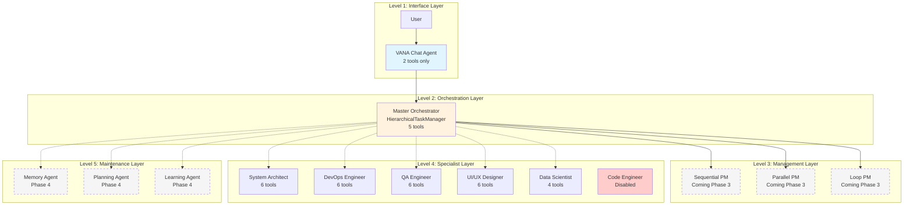
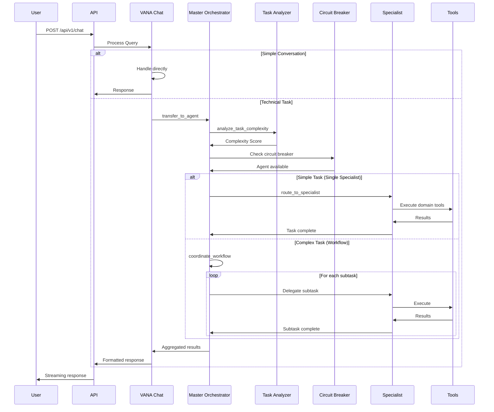

# VANA Agentic AI Architecture

**Version**: 2.0 (Phase 1 Complete)  
**Updated**: July 10, 2025

## System Overview

VANA has evolved into a true agentic AI system with a 5-level hierarchical architecture. Built on Google's Agent Development Kit (ADK), VANA now features intelligent task routing, specialized agent coordination, and distributed tool ownership following ADK best practices.

## Agentic Architecture (Phase 1)

### 1. Five-Level Agent Hierarchy



### 2. Agentic Request Processing Flow



## Component Details

### Level 1: VANA Chat Agent

The user-facing conversational interface:
- **Purpose**: Natural language understanding and response formatting
- **Tools**: Minimal (2 tools only - transfer_to_agent, analyze_task)
- **Responsibilities**:
  - Parse user intent
  - Handle simple conversations
  - Delegate technical tasks to orchestrator
  - Present results in natural language

### Level 2: Master Orchestrator (HierarchicalTaskManager)

The intelligent routing engine:
- **Task Complexity Analysis**: Simple → Moderate → Complex → Enterprise
- **Routing Decision Engine**: Selects appropriate specialists or workflows
- **Circuit Breaker Integration**: Prevents cascading failures
- **Performance Optimization**: Caches routing decisions
- Error handling and recovery
- Session state management

### Specialist Agents

Each specialist agent is optimized for specific domains:

#### Code Execution Agent
- Handles programming tasks
- Supports multiple languages
- Sandboxed execution environment
- Code analysis and optimization

#### Data Science Agent
- Statistical analysis
- Machine learning operations
- Data visualization
- Pattern recognition

### Tool Ecosystem

#### File Operations
```python
# Async file operations for better performance
await read_file(path)
await write_file(path, content)
list_directory(path)
file_exists(path)
```

#### Search Capabilities
```python
# Web search with fallback mechanisms
await web_search(query, max_results)

# Vector search for semantic similarity
await vector_search(query, max_results)

# Knowledge base search
search_knowledge(query)
```

#### Memory System
- Persistent storage across sessions
- Context management
- Learning from interactions
- Performance optimization through caching

## Data Flow Architecture


## Security Architecture

### Authentication & Authorization
- API key validation
- Session-based access control
- Rate limiting
- Request sanitization

### Data Protection
- Input validation
- Output sanitization
- Secure file operations
- Encrypted communications

### Audit & Compliance
- Comprehensive logging
- Action tracking
- Performance metrics
- Error monitoring

## Scalability Considerations

### Horizontal Scaling
- Stateless agent design
- Distributed task processing
- Load balancing support
- Cache optimization

### Performance Optimization
- Async/await patterns throughout
- Connection pooling
- Lazy loading of resources
- Efficient memory management

## Integration Points

### ADK Integration
- Native tool support
- Agent lifecycle management
- Event-driven architecture
- Standard communication protocols

### External Services
- Cloud storage integration
- Third-party API support
- Database connections
- Monitoring services

## Error Handling Strategy


## Future Architecture Enhancements

### Planned Improvements
1. **Event-Driven Architecture**: Transition to fully event-driven system
2. **Microservices**: Decompose into smaller, independent services
3. **GraphQL API**: Provide flexible query capabilities
4. **Real-time Updates**: WebSocket support for live updates

### Research Areas
- Federated learning across agents
- Autonomous agent improvement
- Predictive task routing
- Self-healing systems

---

*This architecture is designed to evolve with the project needs while maintaining backward compatibility and system reliability.*