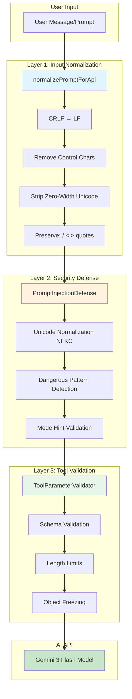
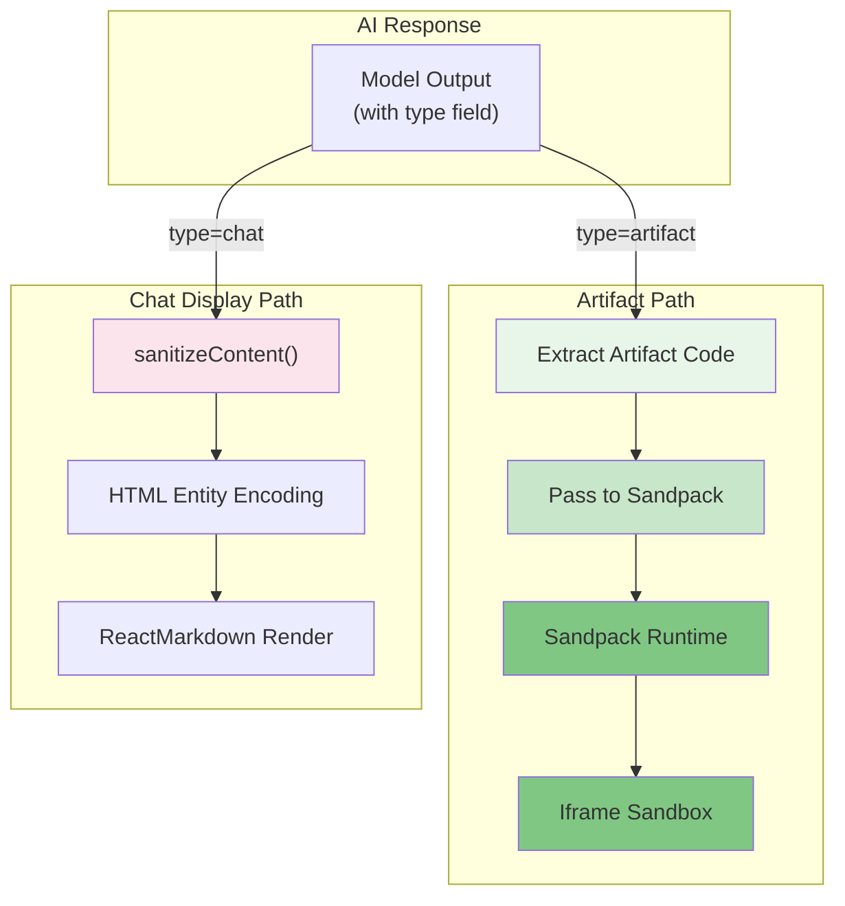
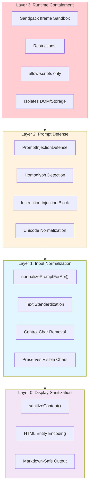
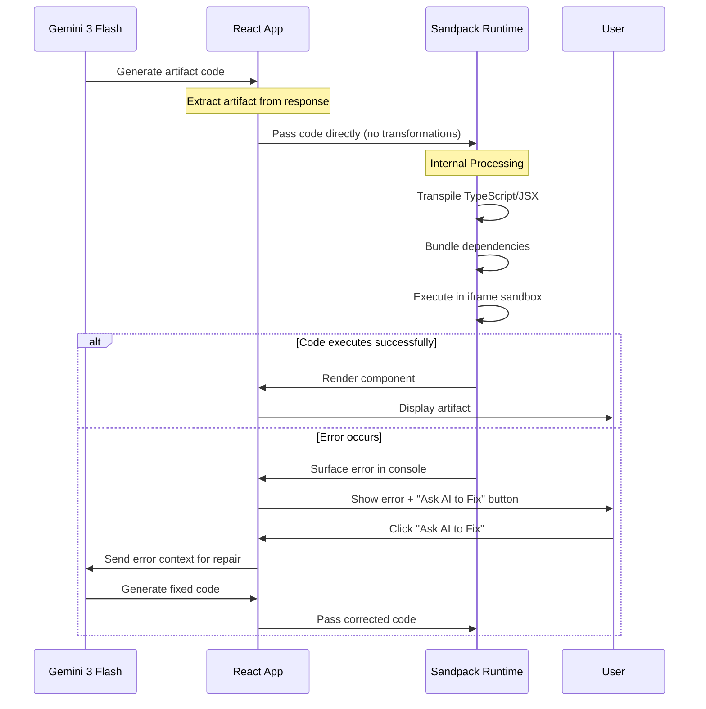

<!-- DIAGRAMS.md | Architecture Visualization Guide | Last updated: 2026-01-18 -->

# Architecture Diagrams

This document contains comprehensive Mermaid diagrams visualizing the Vana chat application architecture. These diagrams reflect the current architecture using vanilla Sandpack for artifact rendering — a zero-config approach where AI-generated code is passed directly to Sandpack with natural error surfacing.

## Overview

The architecture is organized into four key visualization layers:

1. **Input Processing Pipeline** — User message handling through normalization and validation
2. **Output Processing & Display** — Response routing to artifact vs. chat display
3. **Security Layer Stack** — Defense-in-depth from input to runtime
4. **Artifact Rendering Flow** — Vanilla Sandpack rendering with error recovery

---

## 1. Input Processing Pipeline

This diagram shows the complete flow from user input through three normalization/validation layers before reaching the AI API.

### Flow Description

- **User Input**: Raw message from chat interface
- **Layer 1 (Normalization)**: `normalizePromptForApi()` standardizes text format
  - Converts CRLF line endings to LF
  - Removes control characters (0x00-0x1F, 0x7F-0x9F)
  - Strips zero-width Unicode (ZWSP, ZWNJ, ZWJ)
  - Preserves important characters: `/`, `<`, `>`, quotes
- **Layer 2 (Security)**: `PromptInjectionDefense` detects malicious patterns
  - NFKC Unicode normalization
  - Homoglyph and instruction injection detection
  - Mode hint validation
- **Layer 3 (Validation)**: Tool parameter validation
  - JSON schema validation
  - Length limit enforcement
  - Object immutability (Object.freeze)
- **API**: Cleaned input sent to Gemini 3 Flash

---

## 2. Output Processing & Display

This diagram shows how AI responses branch into two distinct paths: artifact rendering or chat display.

### Path Descriptions

**Artifact Path** (Green):
1. Extract artifact code from AI response
2. Pass code directly to Sandpack (no transformations)
3. Sandpack handles transpilation and bundling internally
4. Execute in isolated iframe sandbox with natural error display

**Chat Path** (Pink):
1. Sanitize HTML entities
2. Encode special characters
3. Render with ReactMarkdown for formatting

---

## 3. Security Layer Stack

This diagram visualizes the defense-in-depth security architecture, with 4 layers from input sanitization through runtime containment.

### Layer Details

- **Layer 0 (Sanitization)**: For chat display only. HTML entity encoding prevents XSS in rendered markdown.
- **Layer 1 (Normalization)**: First touchpoint for user input. Removes invisible characters that could hide malicious code.
- **Layer 2 (Prompt Defense)**: Detects injection patterns before they reach the model. Homoglyph detection prevents unicode-based evasion.
- **Layer 3 (Runtime)**: Ultimate containment. Sandpack iframe sandbox prevents network access, storage access, and other dangerous APIs. Errors are surfaced naturally in the Sandpack console.

---

## 4. Artifact Rendering Flow

This sequence diagram shows the vanilla Sandpack artifact rendering flow, including error handling and the "Ask AI to Fix" recovery pattern.

### Flow Stages

1. **Code Generation**: Gemini 3 Flash generates React/TypeScript artifact code
2. **Direct Pass-through**: Code is passed to Sandpack without any transformations
3. **Sandpack Processing**: Internal transpilation and bundling (zero-config)
4. **Execution**: Component runs in isolated iframe sandbox
5. **Error Recovery**: Natural error surfacing with "Ask AI to Fix" button

### Key Design Points

- **Zero Transformations**: No client-side code manipulation or normalization
- **Sandpack Handles Everything**: Transpilation, bundling, and execution managed internally
- **Natural Error Display**: Errors appear in Sandpack's built-in console
- **AI-Assisted Recovery**: "Ask AI to Fix" button sends error context back to the model
- **Package Support**: React, Recharts, Framer Motion, Lucide, Radix UI (via Sandpack's npm integration)

---

## Related Documentation

- [ARTIFACT_SYSTEM.md](./ARTIFACT_SYSTEM.md) — Detailed artifact system architecture
- [ARCHITECTURE.md](./ARCHITECTURE.md) — Complete system design and components
- [DATABASE_SCHEMA.md](./DATABASE_SCHEMA.md) — Data model and RPC functions
- [DEVELOPMENT_PATTERNS.md](./DEVELOPMENT_PATTERNS.md) — Development recipes

---

## Diagram Usage Notes

These diagrams can be rendered in:

- GitHub Markdown (native Mermaid support)
- [mermaid.live](https://mermaid.live) for interactive editing
- Local Mermaid CLI: `npm install -g @mermaid-js/mermaid-cli && mmdc -i diagram.md -o output.html`
- Obsidian, Notion, and other tools with Mermaid support

For best results on GitHub, view this file directly in the repository.
