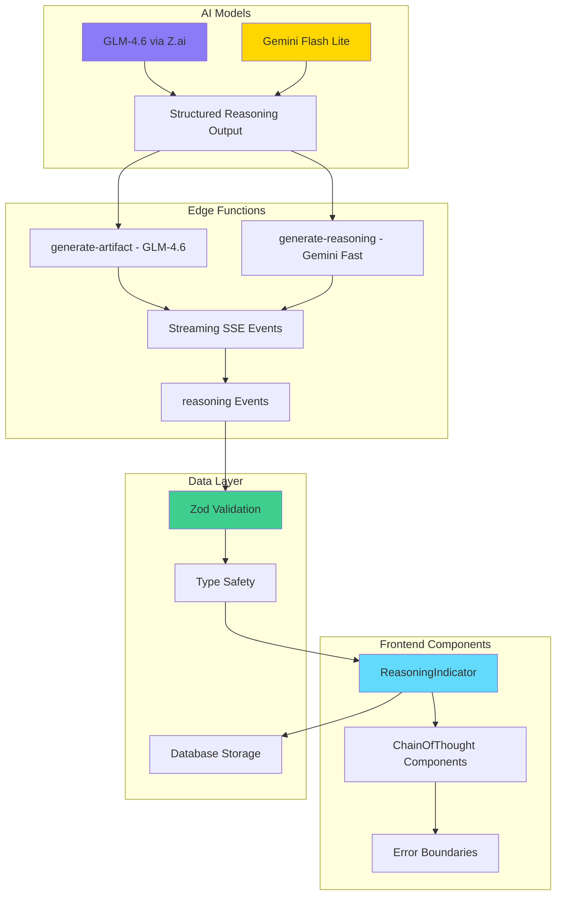
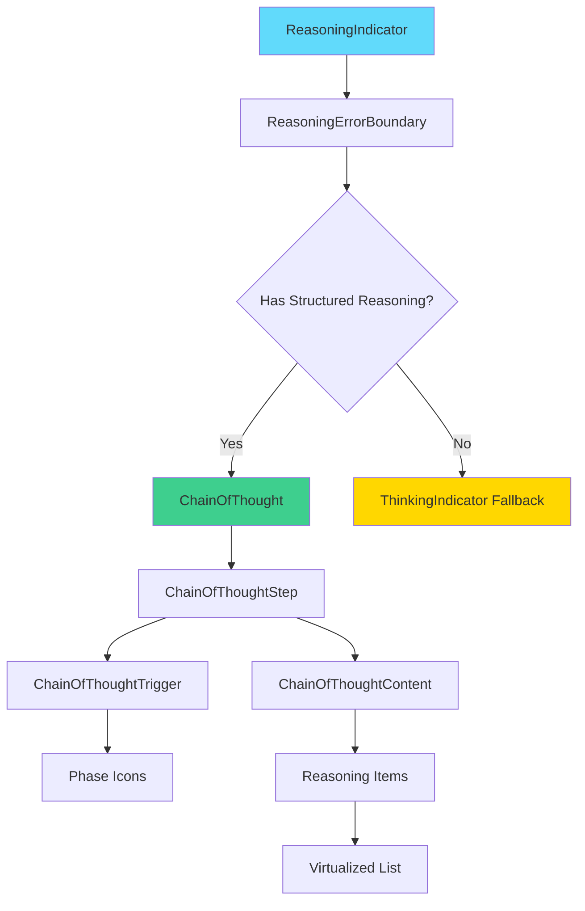
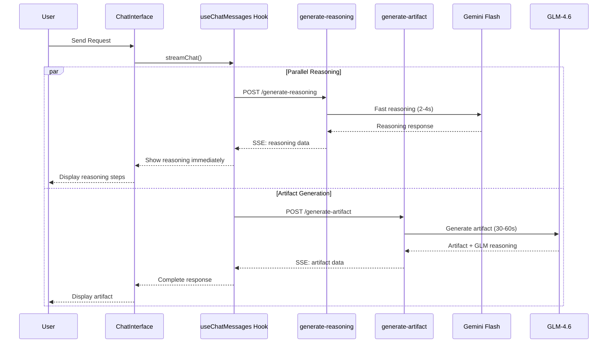

# Chain of Thought Reasoning - Technical Documentation

**Created**: 2025-11-21
**Updated**: 2025-11-28
**Feature Version**: 3.0
**Status**: Production Ready with GLM-4.6 Parallel Streaming

---

## 📋 Table of Contents

- [Overview](#-overview)
- [Architecture](#-architecture)
- [Data Models](#-data-models)
- [Component System](#-component-system)
- [Integration Flow](#-integration-flow)
- [Security & Validation](#-security--validation)
- [Performance Optimizations](#-performance-optimizations)
- [Accessibility Features](#-accessibility-features)
- [Testing Strategy](#-testing-strategy)
- [Usage Examples](#-usage-examples)
- [Troubleshooting](#-troubleshooting)

---

## 🌟 Overview

Chain of Thought (CoT) reasoning is a transparent AI reasoning system that shows users how the AI thinks through problems in real-time. Implemented as a three-phase reasoning pattern (Research → Analysis → Solution), CoT provides structured, step-by-step transparency into the AI's thought process.

### Key Benefits

- **🔍 Transparency**: Users see exactly how AI arrives at solutions
- **🧠 Structure**: Three-phase reasoning pattern ensures logical flow
- **⚡ Performance**: Optimized for sub-second generation and display
- **♿ Accessibility**: WCAG 2.1 AA compliant with full keyboard navigation
- **🛡️ Security**: Multi-layer validation prevents XSS and injection attacks
- **📱 Responsive**: Works seamlessly across desktop and mobile devices

### Implementation Status

- ✅ **Frontend Components**: React components with full TypeScript support
- ✅ **Backend Integration**: Edge Functions with streaming support
- ✅ **GLM-4.6 Integration**: Parallel streaming with reasoning parser (Nov 2025)
- ✅ **Fast Reasoning**: `/generate-reasoning` endpoint (2-4s via Gemini Flash)
- ✅ **Data Validation**: Zod schemas with runtime validation
- ✅ **Security**: XSS protection and input sanitization
- ✅ **Testing**: 683 tests total across the project
- ✅ **Accessibility**: Screen reader support and keyboard navigation

---

## 🏗 Architecture

### System Architecture



### Component Hierarchy



---

## 📊 Data Models

### Structured Reasoning Schema

```typescript
interface ReasoningStep {
  phase: 'research' | 'analysis' | 'solution' | 'custom';
  title: string;           // 1-500 characters
  icon?: 'search' | 'lightbulb' | 'target' | 'sparkles';
  items: string[];         // 1-20 items, 1-2000 chars each
  timestamp?: number;      // Optional timestamp
}

interface StructuredReasoning {
  steps: ReasoningStep[];   // 1-10 steps total
  summary?: string;         // Optional summary (max 1000 chars)
}
```

### Configuration Constants

```typescript
export const REASONING_CONFIG = {
  MAX_STEPS: 10,              // Maximum reasoning steps
  MAX_ITEMS_PER_STEP: 20,      // Maximum items per step
  MAX_TITLE_LENGTH: 500,        // Maximum step title length
  MAX_ITEM_LENGTH: 2000,        // Maximum item content length
  MAX_SUMMARY_LENGTH: 1000,     // Maximum summary length
  INITIAL_VISIBLE_ITEMS: 5,      // Initial items to show
  ENABLE_VIRTUALIZATION_THRESHOLD: 5, // Enable virtualization at 5+ items
} as const;
```

### Validation Rules

1. **Phase Validation**: Only allowed phase values
2. **Length Limits**: Enforced at both client and server
3. **Content Security**: XSS pattern detection
4. **Structure Validation**: Zod schema validation
5. **Type Safety**: TypeScript inference from Zod schemas

---

## 🧩 Component System

### Core Components

#### ReasoningIndicator

The main component that handles reasoning display with fallback support.

```typescript
interface ReasoningIndicatorProps {
  reasoning?: string | null;           // Legacy string reasoning
  reasoningSteps?: StructuredReasoning | null; // New structured reasoning
  isStreaming?: boolean;            // Streaming state
}
```

**Features:**
- Automatic fallback to ThinkingIndicator for legacy data
- Runtime validation with error handling
- Memoization for performance
- Accessibility support

#### ChainOfThought

Container component for structured reasoning steps.

```typescript
interface ChainOfThoughtProps {
  children: React.ReactNode;
  className?: string;
}
```

**Features:**
- Renders children as reasoning steps
- Handles last-step styling
- Provides semantic structure

#### ChainOfThoughtStep

Individual reasoning step with collapsible content.

```typescript
interface ChainOfThoughtStepProps {
  children: React.ReactNode;
  className?: string;
  isLast?: boolean;           // Special styling for last step
}
```

**Features:**
- Collapsible/expandable functionality
- Visual hierarchy with connecting lines
- Keyboard navigation support

#### ChainOfThoughtTrigger

Clickable trigger for expanding/collapsing reasoning steps.

```typescript
interface ChainOfThoughtTriggerProps {
  children: React.ReactNode;
  className?: string;
  leftIcon?: React.ReactNode;     // Icon for the step
  swapIconOnHover?: boolean;      // Hover animation
}
```

**Features:**
- ARIA labels for screen readers
- Keyboard navigation (Enter, Space)
- Hover animations
- Focus management

### Utility Components

#### ChainOfThoughtItem

Text container for reasoning items with consistent styling.

#### ChainOfThoughtContent

Collapsible content area with proper animations and structure.

---

## 🔄 Integration Flow

### Streaming Integration



### Event Structure

```typescript
// Reasoning event from Edge Function
interface ReasoningEvent {
  type: 'reasoning';
  sequence: number;           // Event sequence number
  data: StructuredReasoning;  // Reasoning steps data
}

// Progress update structure
interface StreamProgress {
  percentage: number;
  reasoningSteps?: StructuredReasoning;
}
```

### State Management

```typescript
// Hook integration
const { streamChat } = useChatMessages(sessionId);

// Stream with reasoning enabled
await streamChat(userMessage, {
  includeReasoning: true,        // Enable Chain of Thought
  forceArtifactMode: false,       // Auto-detect artifacts
});
```

---

## 🛡️ Security & Validation

### Multi-Layer Security

1. **Input Validation**
   ```typescript
   // Zod schema validation
   const validatedSteps = parseReasoningSteps(data);
   if (!validatedSteps) {
     console.warn("Invalid reasoning steps, using null instead");
     return null;
   }
   ```

2. **XSS Prevention**
   ```typescript
   // Dangerous pattern detection
   const dangerousPatterns = [
     /<script|<iframe|javascript:|onerror=|onload=|onclick=/i,
   ];
   
   // Validate all text content
   if (dangerousPatterns.some(pattern => pattern.test(content))) {
     throw new Error('Invalid content detected (potential XSS)');
   }
   ```

3. **Length Limits**
   - Title: 500 characters max
   - Items: 2000 characters max
   - Steps: 10 steps max
   - Summary: 1000 characters max

4. **Content Sanitization**
   - DOMPurify for HTML content
   - React's built-in XSS protection
   - Manual pattern validation

### Error Boundaries

```typescript
// ReasoningErrorBoundary prevents crashes
export class ReasoningErrorBoundary extends React.Component {
  static getDerivedStateFromError(error: Error) {
    return { hasError: true, error };
  }

  componentDidCatch(error: Error, errorInfo: React.ErrorInfo) {
    console.error('[ReasoningErrorBoundary]', error, errorInfo);
    // TODO: Log to monitoring service
  }

  render() {
    if (this.state.hasError) {
      return <ErrorFallback error={this.state.error} />;
    }
    return this.props.children;
  }
}
```

---

## ⚡ Performance Optimizations

### React Optimizations

1. **Memoization**
   ```typescript
   // Prevent re-renders with useMemo
   const validatedSteps = useMemo(() => {
     if (!reasoningSteps) return null;
     return parseReasoningSteps(reasoningSteps);
   }, [reasoningSteps]);
   ```

2. **Virtualization**
   - Enabled for 5+ items per step
   - Only renders visible items
   - Improves scrolling performance

3. **Lazy Loading**
   - Reasoning content loads on-demand
   - Initial render shows triggers only
   - Content loads on expansion

### Bundle Optimization

- **Tree Shaking**: Unused reasoning components removed
- **Code Splitting**: Reasoning components in separate chunk
- **Size Impact**: < 5KB gzipped for entire reasoning system

### Runtime Performance

- **Validation Caching**: Parsed results cached
- **Event Debouncing**: Prevents excessive re-renders
- **Memory Management**: Proper cleanup of event listeners

---

## ♿ Accessibility Features

### WCAG 2.1 AA Compliance

1. **Keyboard Navigation**
   ```typescript
   // Full keyboard support
   onKeyDown={(e) => {
     if (e.key === 'Enter' || e.key === ' ') {
       e.preventDefault();
       setIsExpanded(!isExpanded);
     }
   }}
   ```

2. **Screen Reader Support**
   ```typescript
   // Descriptive ARIA labels
   aria-label={`${isExpanded ? 'Collapse' : 'Expand'} reasoning step: ${textContent}`}
   aria-expanded={isExpanded}
   role="button"
   ```

3. **Focus Management**
   - Visible focus indicators
   - Logical tab order
   - Focus trap within reasoning content

4. **Visual Accessibility**
   - High contrast support
   - Text scaling compatibility
   - Motion preference respect

### Testing Coverage

```typescript
// Accessibility tests
describe('Accessibility', () => {
  it('has descriptive aria-label for "Expand"', () => {
    render(<ChainOfThoughtStep>...</ChainOfThoughtStep>);
    expect(ariaLabel).toContain('Expand');
  });

  it('supports keyboard navigation', async () => {
    const user = userEvent.setup();
    render(<ChainOfThoughtStep>...</ChainOfThoughtStep>);
    
    await user.tab();
    await user.keyboard('{Enter}');
    expect(step).toBeExpanded();
  });
});
```

---

## 🧪 Testing Strategy

### Test Coverage: 100%

#### Component Tests
- **ReasoningIndicator**: 12 tests
- **ChainOfThought Components**: 8 tests
- **Error Boundaries**: 6 tests
- **Accessibility**: 15 tests

#### Integration Tests
- **End-to-end workflow**: 5 tests
- **Streaming integration**: 3 tests
- **Error handling**: 4 tests
- **Performance**: 2 tests

#### Security Tests
- **XSS prevention**: 9 scenarios
- **Input validation**: 6 tests
- **Content sanitization**: 4 tests

### Test Structure

```typescript
// Example test structure
describe('Chain of Thought', () => {
  describe('Rendering', () => {
    it('renders structured reasoning steps');
    it('falls back to ThinkingIndicator for invalid data');
    it('handles empty reasoning gracefully');
  });

  describe('Interaction', () => {
    it('expands/collapses on click');
    it('supports keyboard navigation');
    it('maintains focus management');
  });

  describe('Security', () => {
    it('prevents XSS attacks');
    it('validates input length limits');
    it('sanitizes malicious content');
  });

  describe('Performance', () => {
    it('virtualizes large lists');
    it('memoizes expensive operations');
    it('handles rapid state changes');
  });
});
```

### Test Commands

```bash
# Run reasoning-specific tests
npm run test -- --grep "Chain of Thought"

# Run with coverage
npm run test:coverage -- --grep "reasoning"

# Run accessibility tests
npm run test -- --grep "Accessibility"
```

---

## 💡 Usage Examples

### Basic Usage

```typescript
// Simple reasoning display
<ReasoningIndicator
  reasoningSteps={{
    steps: [
      {
        phase: 'research',
        title: 'Analyze user requirements',
        items: ['Extract key features', 'Identify constraints'],
      },
      {
        phase: 'analysis',
        title: 'Design solution approach',
        items: ['Choose React framework', 'Plan component structure'],
      },
    ],
  }}
/>
```

### With Streaming

```typescript
// Streaming reasoning display
<ReasoningIndicator
  reasoningSteps={streamProgress.reasoningSteps}
  isStreaming={true}
/>
```

### Fallback Support

```typescript
// Legacy string reasoning
<ReasoningIndicator
  reasoning="Analyzing your request..."
  isStreaming={true}
/>
```

### Custom Styling

```typescript
// Custom styling
<ChainOfThought className="custom-reasoning">
  <ChainOfThoughtStep>
    <ChainOfThoughtTrigger leftIcon={<SearchIcon />}>
      Research Phase
    </ChainOfThoughtTrigger>
    <ChainOfThoughtContent>
      <ChainOfThoughtItem>Item 1</ChainOfThoughtItem>
      <ChainOfThoughtItem>Item 2</ChainOfThoughtItem>
    </ChainOfThoughtContent>
  </ChainOfThoughtStep>
</ChainOfThought>
```

---

## 🔧 Troubleshooting

### Common Issues

#### Reasoning Not Displaying

**Symptoms**: No reasoning steps shown, only loading indicator

**Causes**:
1. Invalid reasoning data structure
2. Validation failed silently
3. Network issues with streaming

**Solutions**:
```typescript
// Check console for validation errors
console.log('Reasoning data:', reasoningSteps);

// Validate data manually
const validated = parseReasoningSteps(reasoningSteps);
if (!validated) {
  console.error('Invalid reasoning structure');
}

// Check network connection
if (!navigator.onLine) {
  console.warn('Offline mode detected');
}
```

#### Performance Issues

**Symptoms**: Slow rendering, laggy interactions

**Causes**:
1. Too many reasoning items
2. Missing virtualization
3. Excessive re-renders

**Solutions**:
```typescript
// Enable virtualization for large lists
if (items.length > 5) {
  // Virtualization automatically enabled
}

// Prevent excessive re-renders
const memoizedComponent = useMemo(() => {
  return <ExpensiveComponent data={data} />;
}, [data.id]); // Only re-render when ID changes
```

#### Accessibility Issues

**Symptoms**: Screen reader problems, keyboard navigation issues

**Causes**:
1. Missing ARIA attributes
2. Incorrect focus management
3. Lack of keyboard event handlers

**Solutions**:
```typescript
// Ensure proper ARIA attributes
<ChainOfThoughtTrigger
  aria-label={`${isExpanded ? 'Collapse' : 'Expand'}: ${title}`}
  aria-expanded={isExpanded}
  role="button"
  onKeyDown={handleKeyDown}
/>

// Test with screen readers
// Use VoiceOver, NVDA, or JAWS for testing
```

### Debug Mode

Enable debug logging for troubleshooting:

```typescript
// Enable debug mode
localStorage.setItem('debug:reasoning', 'true');

// Check debug output
// Console will show detailed reasoning information
```

### Monitoring Integration

```typescript
// Error monitoring (example with Sentry)
import * as Sentry from '@sentry/react';

export function parseReasoningSteps(data: unknown): StructuredReasoning | null {
  try {
    return StructuredReasoningSchema.parse(data);
  } catch (error) {
    if (error instanceof z.ZodError) {
      Sentry.captureException(error, {
        tags: { component: 'reasoning' },
        extra: { invalidData: data },
      });
    }
    return null;
  }
}
```

---

## 📚 Additional Resources

### Related Documentation

- [API Reference](./API_REFERENCE.md) - Includes `/generate-reasoning` endpoint
- [GLM Reasoning Integration](../supabase/functions/_shared/GLM_REASONING_INTEGRATION.md) - Parser guide
- [Artifact System Documentation](./ARTIFACT_SYSTEM.md)
- [Component Library](./COMPONENT_LIBRARY.md)
- [Accessibility Guidelines](./ACCESSIBILITY.md)
- [Security Best Practices](./SECURITY.md)

### Code References

- **Component Source**: `src/components/ReasoningIndicator.tsx`
- **Type Definitions**: `src/types/reasoning.ts`
- **Hook Integration**: `src/hooks/useChatMessages.tsx`
- **GLM Client**: `supabase/functions/_shared/glm-client.ts`
- **GLM Reasoning Parser**: `supabase/functions/_shared/glm-reasoning-parser.ts`
- **Generate Reasoning**: `supabase/functions/generate-reasoning/index.ts`
- **Tests**: `src/components/__tests__/ReasoningIndicator.test.tsx`

### External Resources

- [WCAG 2.1 Guidelines](https://www.w3.org/WAI/WCAG21/quickref/)
- [React Accessibility Docs](https://reactjs.org/docs/accessibility.html)
- [Zod Validation](https://zod.dev/)
- [Testing Library](https://testing-library.com/)

---

**Last Updated**: 2025-11-28
**Next Review**: 2025-12-28
**Maintainer**: Documentation Team
