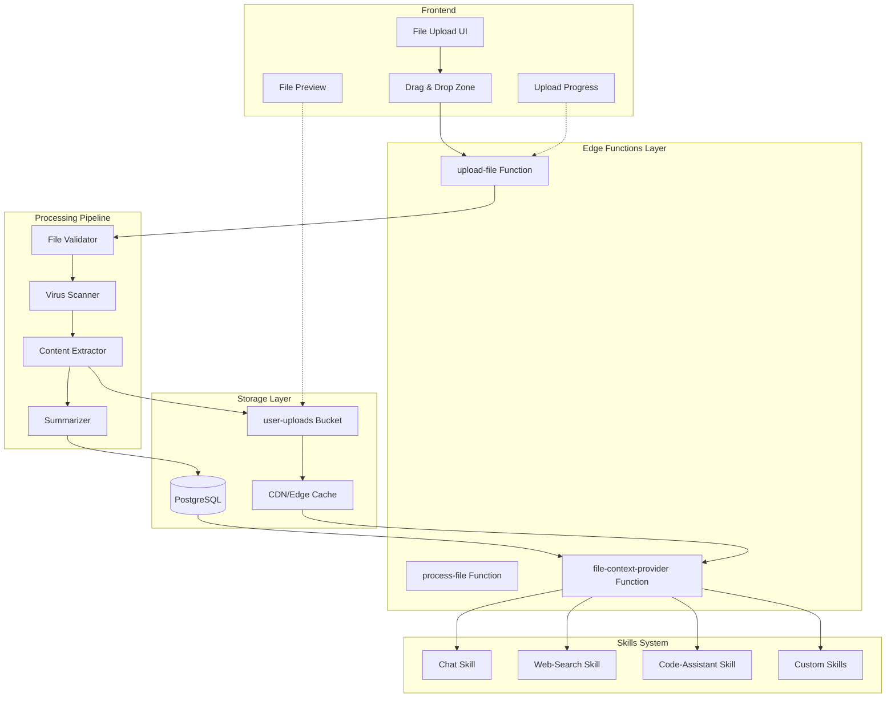

# Document Upload Architecture

**Last Updated:** 2026-01-26
**Status:** Design Phase
**Related Docs:** [SECURITY_AUDIT_FILE_UPLOAD.md](./SECURITY_AUDIT_FILE_UPLOAD.md), [DATABASE_SCHEMA.md](./DATABASE_SCHEMA.md)

---

## Table of Contents

1. [Overview](#overview)
2. [System Architecture](#system-architecture)
3. [Database Schema](#database-schema)
4. [Edge Functions](#edge-functions)
5. [File Processing Pipeline](#file-processing-pipeline)
6. [Context Provider Interface](#context-provider-interface)
7. [Token Management](#token-management)
8. [Storage Configuration](#storage-configuration)
9. [Integration with Skills](#integration-with-skills)
10. [Performance Considerations](#performance-considerations)
11. [Monitoring & Observability](#monitoring--observability)

---

## Overview

### Purpose

The document upload system enables users to attach files to chat sessions, making file content available to AI skills for analysis, processing, and contextual understanding. This architecture supports multiple file types while maintaining security, performance, and seamless integration with the existing Vana chat system.

### Key Capabilities

- **Multi-format Support**: PDF, DOCX, TXT, Markdown, CSV, JSON, images, and code files
- **Secure Processing**: Server-side validation, virus scanning, prompt injection detection
- **Smart Context Management**: Automatic summarization for large files, token budget optimization
- **Skills Integration**: Files available to all AI skills via unified context provider
- **User Isolation**: RLS-based access control, signed URLs, encrypted storage

### Design Principles

1. **Security First**: Every file undergoes comprehensive validation and scanning
2. **Performance**: Async processing, CDN caching, intelligent summarization
3. **User Experience**: Drag-and-drop, real-time progress, clear error messages
4. **Scalability**: Rate limiting, quota management, efficient storage
5. **Privacy**: User-isolated storage, temporary file lifecycle, secure deletion

---

## System Architecture

### High-Level Overview



### Component Descriptions

| Component | Purpose | Technology | Location |
|-----------|---------|------------|----------|
| **File Upload UI** | User interface for file selection | React + shadcn/ui | `src/components/FileUpload/` |
| **upload-file Function** | Handles file upload, validation | Deno Edge Function | `supabase/functions/upload-file/` |
| **process-file Function** | Extracts, processes file content | Deno Edge Function | `supabase/functions/process-file/` |
| **File Validator** | Magic byte, size, type checks | Shared utility | `_shared/file-validator.ts` |
| **Virus Scanner** | Malware detection integration | External API | `_shared/virus-scanner.ts` |
| **Content Extractor** | Format-specific parsers | Shared utilities | `_shared/file-processors/` |
| **Summarizer** | LLM-based content summarization | Gemini 3 Flash | `_shared/summarizer.ts` |
| **user-uploads Bucket** | Encrypted file storage | Supabase Storage | RLS-protected |
| **file-context-provider** | Retrieves file context for skills | Deno Edge Function | `supabase/functions/file-context-provider/` |

### Data Flow

```
1. User selects file → Frontend validation (size, type, extension)
2. File uploaded via multipart/form-data → upload-file Edge Function
3. Server-side validation:
   a. Magic byte verification
   b. File size enforcement
   c. Rate limit check
   d. MIME type validation
4. Virus scan (async, non-blocking warning)
5. Content extraction (format-specific processors)
6. Prompt injection scan on extracted text
7. Storage upload with user-isolated path
8. Database record creation with metadata
9. Optional summarization if content exceeds token budget
10. Return signed URL and file metadata to frontend
11. Skills request file context via context provider
12. Context provider retrieves, caches, and returns processed content
```

---

## Database Schema

### New Tables

#### uploaded_files

Stores metadata for all uploaded files.

```sql
-- Create uploaded_files table
CREATE TABLE IF NOT EXISTS uploaded_files (
  id UUID PRIMARY KEY DEFAULT gen_random_uuid(),
  user_id UUID NOT NULL REFERENCES auth.users(id) ON DELETE CASCADE,
  session_id UUID REFERENCES chat_sessions(id) ON DELETE CASCADE,

  -- File metadata
  original_filename TEXT NOT NULL,
  storage_path TEXT NOT NULL UNIQUE,
  file_size INTEGER NOT NULL CHECK (file_size > 0),
  mime_type TEXT NOT NULL,
  file_hash TEXT NOT NULL, -- SHA-256 hash for deduplication

  -- Processing status
  processing_status TEXT NOT NULL DEFAULT 'pending'
    CHECK (processing_status IN ('pending', 'processing', 'completed', 'failed')),
  processing_error TEXT,

  -- Content metadata
  extracted_text TEXT, -- Full extracted text
  summary TEXT, -- Summarized content for large files
  token_count INTEGER, -- Token count of extracted text
  summarization_method TEXT, -- 'none', 'truncation', 'llm_summary'

  -- Security flags
  virus_scan_status TEXT DEFAULT 'pending'
    CHECK (virus_scan_status IN ('pending', 'clean', 'infected', 'error')),
  virus_scan_result JSONB,
  prompt_injection_flags JSONB, -- Detected patterns
  contains_pii BOOLEAN DEFAULT false,
  pii_types TEXT[], -- ['ssn', 'credit_card', 'email', etc.]

  -- Lifecycle management
  expires_at TIMESTAMPTZ NOT NULL DEFAULT (now() + interval '1 hour'),
  accessed_count INTEGER DEFAULT 0,
  last_accessed_at TIMESTAMPTZ,

  -- Timestamps
  created_at TIMESTAMPTZ NOT NULL DEFAULT now(),
  updated_at TIMESTAMPTZ NOT NULL DEFAULT now()
);

-- Indexes for performance
CREATE INDEX idx_uploaded_files_user_id ON uploaded_files(user_id);
CREATE INDEX idx_uploaded_files_session_id ON uploaded_files(session_id);
CREATE INDEX idx_uploaded_files_file_hash ON uploaded_files(file_hash);
CREATE INDEX idx_uploaded_files_expires_at ON uploaded_files(expires_at);
CREATE INDEX idx_uploaded_files_processing_status ON uploaded_files(processing_status);

-- Updated_at trigger
CREATE TRIGGER update_uploaded_files_updated_at
  BEFORE UPDATE ON uploaded_files
  FOR EACH ROW
  EXECUTE FUNCTION update_updated_at_column();

-- RLS Policies
ALTER TABLE uploaded_files ENABLE ROW LEVEL SECURITY;

-- Users can only read their own files
CREATE POLICY "uploaded_files_select_own"
  ON uploaded_files FOR SELECT
  TO authenticated
  USING (user_id = auth.uid());

-- Users can only insert files for themselves
CREATE POLICY "uploaded_files_insert_own"
  ON uploaded_files FOR INSERT
  TO authenticated
  WITH CHECK (user_id = auth.uid());

-- Users can update their own files (for processing status)
CREATE POLICY "uploaded_files_update_own"
  ON uploaded_files FOR UPDATE
  TO authenticated
  USING (user_id = auth.uid());

-- Users can delete their own files
CREATE POLICY "uploaded_files_delete_own"
  ON uploaded_files FOR DELETE
  TO authenticated
  USING (user_id = auth.uid());

-- Service role has full access
CREATE POLICY "uploaded_files_service_role_all"
  ON uploaded_files FOR ALL
  TO service_role
  USING (true)
  WITH CHECK (true);
```

#### upload_audit_logs

Audit trail for all upload operations.

```sql
-- Create upload audit logs table
CREATE TABLE IF NOT EXISTS upload_audit_logs (
  id UUID PRIMARY KEY DEFAULT gen_random_uuid(),
  user_id UUID REFERENCES auth.users(id) ON DELETE SET NULL,
  file_id UUID REFERENCES uploaded_files(id) ON DELETE CASCADE,

  -- Event details
  event_type TEXT NOT NULL
    CHECK (event_type IN ('upload_initiated', 'upload_completed', 'upload_failed',
                          'virus_scan_completed', 'file_accessed', 'file_deleted',
                          'security_warning', 'rate_limit_exceeded')),
  event_details JSONB,

  -- Request metadata
  request_id TEXT,
  ip_address INET,
  user_agent TEXT,

  -- Security context
  security_flags JSONB, -- Warnings, violations, etc.

  -- Timestamp
  created_at TIMESTAMPTZ NOT NULL DEFAULT now()
);

-- Indexes
CREATE INDEX idx_upload_audit_logs_user_id ON upload_audit_logs(user_id);
CREATE INDEX idx_upload_audit_logs_file_id ON upload_audit_logs(file_id);
CREATE INDEX idx_upload_audit_logs_event_type ON upload_audit_logs(event_type);
CREATE INDEX idx_upload_audit_logs_created_at ON upload_audit_logs(created_at);

-- RLS Policies (users can only read their own logs)
ALTER TABLE upload_audit_logs ENABLE ROW LEVEL SECURITY;

CREATE POLICY "upload_audit_logs_select_own"
  ON upload_audit_logs FOR SELECT
  TO authenticated
  USING (user_id = auth.uid());

-- Service role can insert and read all logs
CREATE POLICY "upload_audit_logs_service_role_all"
  ON upload_audit_logs FOR ALL
  TO service_role
  USING (true)
  WITH CHECK (true);
```

#### file_upload_rate_limits

Track upload rate limits separately from general rate limits.

```sql
-- Create file upload rate limits table
CREATE TABLE IF NOT EXISTS file_upload_rate_limits (
  id UUID PRIMARY KEY DEFAULT gen_random_uuid(),
  user_id UUID UNIQUE REFERENCES auth.users(id) ON DELETE CASCADE,
  identifier TEXT, -- IP address for guests

  -- Counters for current window
  upload_count INTEGER DEFAULT 0,
  total_bytes_uploaded BIGINT DEFAULT 0,

  -- Window tracking
  window_start TIMESTAMPTZ NOT NULL DEFAULT now(),
  window_duration INTERVAL DEFAULT interval '1 hour',

  -- Timestamps
  created_at TIMESTAMPTZ NOT NULL DEFAULT now(),
  updated_at TIMESTAMPTZ NOT NULL DEFAULT now()
);

-- Indexes
CREATE INDEX idx_file_upload_rate_limits_user_id ON file_upload_rate_limits(user_id);
CREATE INDEX idx_file_upload_rate_limits_identifier ON file_upload_rate_limits(identifier);

-- RLS Policies
ALTER TABLE file_upload_rate_limits ENABLE ROW LEVEL SECURITY;

CREATE POLICY "file_upload_rate_limits_select_own"
  ON file_upload_rate_limits FOR SELECT
  TO authenticated
  USING (user_id = auth.uid());

CREATE POLICY "file_upload_rate_limits_service_role_all"
  ON file_upload_rate_limits FOR ALL
  TO service_role
  USING (true)
  WITH CHECK (true);
```

### Database Functions

#### check_upload_rate_limit

Checks if user/guest can upload more files.

```sql
CREATE OR REPLACE FUNCTION check_upload_rate_limit(
  p_user_id UUID DEFAULT NULL,
  p_identifier TEXT DEFAULT NULL,
  p_file_size BIGINT DEFAULT 0,
  p_is_guest BOOLEAN DEFAULT false
)
RETURNS JSONB
LANGUAGE plpgsql
SECURITY DEFINER
SET search_path = public, pg_temp
AS $$
DECLARE
  v_record RECORD;
  v_max_uploads INTEGER;
  v_max_bytes BIGINT;
  v_allowed BOOLEAN := true;
  v_reset_at TIMESTAMPTZ;
BEGIN
  -- Set limits based on user type
  IF p_is_guest THEN
    v_max_uploads := 5;
    v_max_bytes := 25 * 1024 * 1024; -- 25MB
  ELSE
    v_max_uploads := 20;
    v_max_bytes := 100 * 1024 * 1024; -- 100MB
  END IF;

  -- Get or create rate limit record
  IF p_user_id IS NOT NULL THEN
    SELECT * INTO v_record
    FROM file_upload_rate_limits
    WHERE user_id = p_user_id;
  ELSE
    SELECT * INTO v_record
    FROM file_upload_rate_limits
    WHERE identifier = p_identifier;
  END IF;

  -- Create record if doesn't exist
  IF v_record IS NULL THEN
    INSERT INTO file_upload_rate_limits (user_id, identifier, upload_count, total_bytes_uploaded)
    VALUES (p_user_id, p_identifier, 0, 0)
    RETURNING * INTO v_record;
  END IF;

  -- Check if window has expired
  IF now() > (v_record.window_start + v_record.window_duration) THEN
    -- Reset counters
    UPDATE file_upload_rate_limits
    SET upload_count = 0,
        total_bytes_uploaded = 0,
        window_start = now()
    WHERE id = v_record.id
    RETURNING * INTO v_record;
  END IF;

  -- Calculate reset time
  v_reset_at := v_record.window_start + v_record.window_duration;

  -- Check limits
  IF v_record.upload_count >= v_max_uploads THEN
    v_allowed := false;
  ELSIF (v_record.total_bytes_uploaded + p_file_size) > v_max_bytes THEN
    v_allowed := false;
  END IF;

  RETURN jsonb_build_object(
    'allowed', v_allowed,
    'current_uploads', v_record.upload_count,
    'max_uploads', v_max_uploads,
    'current_bytes', v_record.total_bytes_uploaded,
    'max_bytes', v_max_bytes,
    'reset_at', v_reset_at,
    'remaining_uploads', GREATEST(0, v_max_uploads - v_record.upload_count),
    'remaining_bytes', GREATEST(0, v_max_bytes - v_record.total_bytes_uploaded)
  );
END;
$$;
```

#### increment_upload_count

Increments upload counter after successful upload.

```sql
CREATE OR REPLACE FUNCTION increment_upload_count(
  p_user_id UUID DEFAULT NULL,
  p_identifier TEXT DEFAULT NULL,
  p_file_size BIGINT DEFAULT 0
)
RETURNS void
LANGUAGE plpgsql
SECURITY DEFINER
SET search_path = public, pg_temp
AS $$
BEGIN
  IF p_user_id IS NOT NULL THEN
    UPDATE file_upload_rate_limits
    SET upload_count = upload_count + 1,
        total_bytes_uploaded = total_bytes_uploaded + p_file_size,
        updated_at = now()
    WHERE user_id = p_user_id;
  ELSE
    UPDATE file_upload_rate_limits
    SET upload_count = upload_count + 1,
        total_bytes_uploaded = total_bytes_uploaded + p_file_size,
        updated_at = now()
    WHERE identifier = p_identifier;
  END IF;
END;
$$;
```

#### cleanup_expired_files

Cron job function to delete expired files.

```sql
CREATE OR REPLACE FUNCTION cleanup_expired_files()
RETURNS INTEGER
LANGUAGE plpgsql
SECURITY DEFINER
SET search_path = public, pg_temp
AS $$
DECLARE
  v_deleted_count INTEGER := 0;
  v_file RECORD;
BEGIN
  -- Find expired files
  FOR v_file IN
    SELECT id, storage_path, user_id
    FROM uploaded_files
    WHERE expires_at < now()
      AND processing_status != 'processing'
  LOOP
    -- Delete from storage (would need to be done via Edge Function)
    -- Mark as deleted in database
    DELETE FROM uploaded_files WHERE id = v_file.id;
    v_deleted_count := v_deleted_count + 1;

    -- Log deletion
    INSERT INTO upload_audit_logs (user_id, file_id, event_type, event_details)
    VALUES (
      v_file.user_id,
      v_file.id,
      'file_deleted',
      jsonb_build_object('reason', 'expired', 'storage_path', v_file.storage_path)
    );
  END LOOP;

  RETURN v_deleted_count;
END;
$$;
```

---

## Edge Functions

### upload-file Function

Handles initial file upload, validation, and storage.

**Location:** `supabase/functions/upload-file/index.ts`

#### Request Format

```typescript
// Multipart form-data with file
POST /upload-file
Headers:
  Authorization: Bearer <supabase_jwt>
  Content-Type: multipart/form-data

FormData:
  file: File                    // Required: The file to upload
  sessionId: string             // Optional: Chat session ID to associate with
  expiresIn: number             // Optional: TTL in seconds (default: 3600)
```

#### Response Format

```typescript
// Success response
{
  success: true,
  data: {
    fileId: string,
    originalFilename: string,
    storagePath: string,
    signedUrl: string,
    fileSize: number,
    mimeType: string,
    fileHash: string,
    expiresAt: string,          // ISO 8601 timestamp
    processingStatus: 'pending' | 'processing' | 'completed',
    warnings: string[]          // Security warnings, PII detection, etc.
  }
}

// Error response
{
  success: false,
  error: {
    code: string,               // 'RATE_LIMIT_EXCEEDED', 'INVALID_FILE_TYPE', etc.
    message: string,
    details?: any
  }
}
```

#### Implementation

```typescript
// supabase/functions/upload-file/index.ts
import { serve } from 'https://deno.land/std@0.177.0/http/server.ts';
import { createClient } from 'https://esm.sh/@supabase/supabase-js@2';
import { validateFileUpload } from '../_shared/file-validator.ts';
import { checkRateLimit } from '../_shared/rate-limiter.ts';
import { scanForViruses } from '../_shared/virus-scanner.ts';
import { generateSecurePath, sanitizeFilename } from '../_shared/file-utils.ts';
import { computeSHA256 } from '../_shared/crypto-utils.ts';
import { getCorsHeaders } from '../_shared/cors-config.ts';
import { ensureValidSession } from '../_shared/auth-helpers.ts';
import { logAuditEvent } from '../_shared/audit-logger.ts';

serve(async (req) => {
  // CORS preflight
  if (req.method === 'OPTIONS') {
    return new Response(null, { headers: getCorsHeaders() });
  }

  // Only allow POST
  if (req.method !== 'POST') {
    return new Response(
      JSON.stringify({ success: false, error: { code: 'METHOD_NOT_ALLOWED', message: 'Only POST is allowed' } }),
      { status: 405, headers: { ...getCorsHeaders(), 'Content-Type': 'application/json' } }
    );
  }

  try {
    // 1. Authenticate user
    const session = await ensureValidSession(req);
    if (!session) {
      return new Response(
        JSON.stringify({ success: false, error: { code: 'UNAUTHORIZED', message: 'Authentication required' } }),
        { status: 401, headers: { ...getCorsHeaders(), 'Content-Type': 'application/json' } }
      );
    }

    const userId = session.user.id;

    // 2. Parse multipart form data
    const formData = await req.formData();
    const file = formData.get('file') as File;
    const sessionId = formData.get('sessionId') as string | null;
    const expiresIn = parseInt(formData.get('expiresIn') as string || '3600', 10);

    if (!file) {
      return new Response(
        JSON.stringify({ success: false, error: { code: 'NO_FILE', message: 'No file provided' } }),
        { status: 400, headers: { ...getCorsHeaders(), 'Content-Type': 'application/json' } }
      );
    }

    // 3. Check rate limits
    const rateLimitResult = await checkRateLimit(userId, file.size);
    if (!rateLimitResult.allowed) {
      await logAuditEvent({
        userId,
        eventType: 'rate_limit_exceeded',
        eventDetails: { fileSize: file.size, filename: file.name },
        ipAddress: req.headers.get('x-forwarded-for') || req.headers.get('x-real-ip'),
      });

      return new Response(
        JSON.stringify({
          success: false,
          error: {
            code: 'RATE_LIMIT_EXCEEDED',
            message: 'Upload rate limit exceeded',
            details: rateLimitResult
          }
        }),
        { status: 429, headers: { ...getCorsHeaders(), 'Content-Type': 'application/json' } }
      );
    }

    // 4. Read file content
    const arrayBuffer = await file.arrayBuffer();
    const bytes = new Uint8Array(arrayBuffer);

    // 5. Validate file (magic bytes, size, type)
    const validationResult = await validateFileUpload(file, bytes);
    if (!validationResult.valid) {
      return new Response(
        JSON.stringify({
          success: false,
          error: {
            code: 'VALIDATION_FAILED',
            message: validationResult.error,
            details: validationResult.details
          }
        }),
        { status: 400, headers: { ...getCorsHeaders(), 'Content-Type': 'application/json' } }
      );
    }

    // 6. Compute file hash
    const fileHash = await computeSHA256(bytes);

    // 7. Generate secure storage path
    const sanitizedFilename = sanitizeFilename(file.name);
    const storagePath = generateSecurePath(userId, sanitizedFilename);

    // 8. Create database record (pending processing)
    const supabase = createClient(
      Deno.env.get('SUPABASE_URL')!,
      Deno.env.get('SUPABASE_SERVICE_ROLE_KEY')!
    );

    const { data: uploadRecord, error: dbError } = await supabase
      .from('uploaded_files')
      .insert({
        user_id: userId,
        session_id: sessionId,
        original_filename: file.name,
        storage_path: storagePath,
        file_size: file.size,
        mime_type: file.type,
        file_hash: fileHash,
        processing_status: 'pending',
        expires_at: new Date(Date.now() + expiresIn * 1000).toISOString(),
      })
      .select()
      .single();

    if (dbError) throw dbError;

    // 9. Upload to storage
    const { data: uploadData, error: storageError } = await supabase.storage
      .from('user-uploads')
      .upload(storagePath, bytes, {
        contentType: file.type,
        upsert: false,
      });

    if (storageError) {
      // Rollback database record
      await supabase.from('uploaded_files').delete().eq('id', uploadRecord.id);
      throw storageError;
    }

    // 10. Generate signed URL (1 hour expiry)
    const { data: signedUrlData } = await supabase.storage
      .from('user-uploads')
      .createSignedUrl(storagePath, 3600);

    const signedUrl = signedUrlData?.signedUrl || '';

    // 11. Increment rate limit counter
    await supabase.rpc('increment_upload_count', {
      p_user_id: userId,
      p_file_size: file.size,
    });

    // 12. Start async processing (virus scan, content extraction)
    const warnings: string[] = [];

    // Virus scan (async, non-blocking)
    scanForViruses(bytes, uploadRecord.id).then(async (result) => {
      await supabase
        .from('uploaded_files')
        .update({
          virus_scan_status: result.clean ? 'clean' : 'infected',
          virus_scan_result: result,
        })
        .eq('id', uploadRecord.id);

      if (!result.clean) {
        // Quarantine file
        await logAuditEvent({
          userId,
          fileId: uploadRecord.id,
          eventType: 'security_warning',
          eventDetails: { reason: 'virus_detected', ...result },
        });
      }
    }).catch(console.error);

    // 13. Log audit event
    await logAuditEvent({
      userId,
      fileId: uploadRecord.id,
      eventType: 'upload_completed',
      eventDetails: {
        filename: file.name,
        size: file.size,
        mimeType: file.type,
        storagePath,
      },
      ipAddress: req.headers.get('x-forwarded-for') || req.headers.get('x-real-ip'),
      userAgent: req.headers.get('user-agent'),
    });

    // 14. Return response
    return new Response(
      JSON.stringify({
        success: true,
        data: {
          fileId: uploadRecord.id,
          originalFilename: file.name,
          storagePath,
          signedUrl,
          fileSize: file.size,
          mimeType: file.type,
          fileHash,
          expiresAt: uploadRecord.expires_at,
          processingStatus: 'pending',
          warnings,
        }
      }),
      {
        status: 200,
        headers: { ...getCorsHeaders(), 'Content-Type': 'application/json' }
      }
    );

  } catch (error) {
    console.error('Upload error:', error);
    return new Response(
      JSON.stringify({
        success: false,
        error: {
          code: 'UPLOAD_FAILED',
          message: error instanceof Error ? error.message : 'Unknown error',
        }
      }),
      {
        status: 500,
        headers: { ...getCorsHeaders(), 'Content-Type': 'application/json' }
      }
    );
  }
});
```

### process-file Function

Extracts content from uploaded files and prepares for LLM context.

**Location:** `supabase/functions/process-file/index.ts`

#### Request Format

```typescript
POST /process-file
Headers:
  Authorization: Bearer <supabase_jwt>
  Content-Type: application/json

Body:
{
  fileId: string,
  options?: {
    extractText: boolean,      // Default: true
    generateSummary: boolean,  // Default: true if content > threshold
    tokenBudget: number        // Max tokens to include (default: 10000)
  }
}
```

#### Response Format

```typescript
{
  success: true,
  data: {
    fileId: string,
    extractedText: string,
    summary?: string,
    tokenCount: number,
    summarizationMethod: 'none' | 'truncation' | 'llm_summary',
    processingTime: number,     // ms
    promptInjectionWarnings: string[],
    piiDetected: boolean,
    piiTypes: string[]
  }
}
```

#### Implementation Overview

```typescript
// Key processing steps:
// 1. Fetch file from storage
// 2. Route to appropriate processor based on MIME type
// 3. Extract text content
// 4. Scan for prompt injection patterns
// 5. Detect PII
// 6. Summarize if exceeds token budget
// 7. Update database with processed content
// 8. Return results
```

### file-context-provider Function

Retrieves file context for AI skills with caching and optimization.

**Location:** `supabase/functions/file-context-provider/index.ts`

#### Request Format

```typescript
POST /file-context-provider
Headers:
  Authorization: Bearer <supabase_jwt>
  Content-Type: application/json

Body:
{
  sessionId: string,
  tokenBudget?: number,        // Max tokens to include (default: 10000)
  fileIds?: string[]          // Specific files, or all files in session if omitted
}
```

#### Response Format

```typescript
{
  success: true,
  data: {
    files: Array<{
      fileId: string,
      filename: string,
      mimeType: string,
      content: string,          // Extracted text or summary
      tokenCount: number,
      uploadedAt: string,
      isSummary: boolean
    }>,
    totalTokens: number,
    budgetExceeded: boolean,
    filesIncluded: number,
    filesOmitted: number
  }
}
```

---

## File Processing Pipeline

### Supported File Types

| Category | Extensions | MIME Types | Max Size | Processor |
|----------|-----------|------------|----------|-----------|
| **Documents** | `.pdf`, `.docx`, `.txt`, `.md` | `application/pdf`, `application/vnd.openxmlformats-officedocument.wordprocessingml.document`, `text/plain`, `text/markdown` | 10MB | PDFProcessor, DOCXProcessor, TextProcessor |
| **Data Files** | `.csv`, `.json`, `.xml` | `text/csv`, `application/json`, `application/xml` | 20MB | CSVProcessor, JSONProcessor, XMLProcessor |
| **Images** | `.jpg`, `.png`, `.webp`, `.gif` | `image/jpeg`, `image/png`, `image/webp`, `image/gif` | 5MB | ImageProcessor (OCR) |
| **Code** | `.js`, `.ts`, `.py`, `.html`, `.css` | `text/javascript`, `text/typescript`, `text/x-python`, `text/html`, `text/css` | 2MB | CodeProcessor |

### Processor Architecture

Each file type has a dedicated processor implementing the `FileProcessor` interface:

```typescript
// _shared/file-processors/types.ts
export interface FileProcessor {
  /**
   * Check if this processor can handle the given file type
   */
  canProcess(mimeType: string, filename: string): boolean;

  /**
   * Extract text content from file
   */
  extractText(bytes: Uint8Array, metadata: FileMetadata): Promise<ProcessingResult>;

  /**
   * Estimate token count without full processing (for quick checks)
   */
  estimateTokenCount(bytes: Uint8Array): Promise<number>;
}

export interface FileMetadata {
  filename: string;
  mimeType: string;
  size: number;
  encoding?: string;
}

export interface ProcessingResult {
  text: string;
  tokenCount: number;
  metadata: {
    pageCount?: number;
    language?: string;
    encoding?: string;
    hasImages?: boolean;
    hasFormulas?: boolean;
    extractionConfidence?: number;
  };
  warnings: string[];
  errors: string[];
}
```

### PDF Processor

```typescript
// _shared/file-processors/pdf-processor.ts
import { PDFDocument } from 'https://esm.sh/pdf-lib@1.17.1';
import { FileProcessor, FileMetadata, ProcessingResult } from './types.ts';

export class PDFProcessor implements FileProcessor {
  canProcess(mimeType: string): boolean {
    return mimeType === 'application/pdf';
  }

  async extractText(bytes: Uint8Array, metadata: FileMetadata): Promise<ProcessingResult> {
    try {
      // Load PDF
      const pdfDoc = await PDFDocument.load(bytes);
      const pageCount = pdfDoc.getPageCount();

      // Extract text from each page
      const textParts: string[] = [];
      for (let i = 0; i < pageCount; i++) {
        const page = pdfDoc.getPage(i);
        const textContent = await page.getTextContent();
        textParts.push(textContent.items.map((item: any) => item.str).join(' '));
      }

      const text = textParts.join('\n\n');
      const tokenCount = this.estimateTokens(text);

      return {
        text,
        tokenCount,
        metadata: {
          pageCount,
          hasImages: false, // TODO: Detect images
          extractionConfidence: 0.95,
        },
        warnings: [],
        errors: [],
      };
    } catch (error) {
      throw new Error(`PDF extraction failed: ${error.message}`);
    }
  }

  async estimateTokenCount(bytes: Uint8Array): Promise<number> {
    // Quick estimation without full text extraction
    // Assume average 500 tokens per page
    const pdfDoc = await PDFDocument.load(bytes);
    return pdfDoc.getPageCount() * 500;
  }

  private estimateTokens(text: string): number {
    // Rough estimation: 1 token ≈ 4 characters
    return Math.ceil(text.length / 4);
  }
}
```

### DOCX Processor

```typescript
// _shared/file-processors/docx-processor.ts
import JSZip from 'https://esm.sh/jszip@3.10.1';
import { DOMParser } from 'https://deno.land/x/deno_dom/deno-dom-wasm.ts';
import { FileProcessor, FileMetadata, ProcessingResult } from './types.ts';

export class DOCXProcessor implements FileProcessor {
  canProcess(mimeType: string, filename: string): boolean {
    return mimeType === 'application/vnd.openxmlformats-officedocument.wordprocessingml.document'
      || filename.endsWith('.docx');
  }

  async extractText(bytes: Uint8Array, metadata: FileMetadata): Promise<ProcessingResult> {
    try {
      // DOCX is a ZIP archive
      const zip = await JSZip.loadAsync(bytes);

      // Extract document.xml
      const documentXml = await zip.file('word/document.xml')?.async('string');
      if (!documentXml) {
        throw new Error('Invalid DOCX: missing document.xml');
      }

      // Parse XML and extract text
      const parser = new DOMParser();
      const doc = parser.parseFromString(documentXml, 'text/xml');

      // Get all text nodes
      const textNodes = doc.querySelectorAll('w\\:t');
      const text = Array.from(textNodes)
        .map(node => node.textContent)
        .join(' ');

      const tokenCount = this.estimateTokens(text);

      return {
        text,
        tokenCount,
        metadata: {
          encoding: 'UTF-8',
          extractionConfidence: 0.98,
        },
        warnings: [],
        errors: [],
      };
    } catch (error) {
      throw new Error(`DOCX extraction failed: ${error.message}`);
    }
  }

  async estimateTokenCount(bytes: Uint8Array): Promise<number> {
    // Quick estimation based on file size
    // Average DOCX: 1KB ≈ 150 tokens
    return Math.ceil(bytes.length / 1024 * 150);
  }

  private estimateTokens(text: string): number {
    return Math.ceil(text.length / 4);
  }
}
```

### CSV Processor

```typescript
// _shared/file-processors/csv-processor.ts
import { parse } from 'https://deno.land/std@0.177.0/encoding/csv.ts';
import { FileProcessor, FileMetadata, ProcessingResult } from './types.ts';

export class CSVProcessor implements FileProcessor {
  canProcess(mimeType: string, filename: string): boolean {
    return mimeType === 'text/csv' || filename.endsWith('.csv');
  }

  async extractText(bytes: Uint8Array, metadata: FileMetadata): Promise<ProcessingResult> {
    try {
      // Decode CSV
      const decoder = new TextDecoder('utf-8');
      const csvText = decoder.decode(bytes);

      // Parse CSV
      const records = await parse(csvText, {
        skipFirstRow: false,
      });

      // Sanitize formula injection (cells starting with =, +, -, @)
      const sanitized = this.sanitizeFormulaInjection(records);

      // Convert to readable text format
      const text = this.formatCSVAsText(sanitized);
      const tokenCount = this.estimateTokens(text);

      return {
        text,
        tokenCount,
        metadata: {
          encoding: 'UTF-8',
          extractionConfidence: 1.0,
        },
        warnings: this.detectInjectionPatterns(csvText),
        errors: [],
      };
    } catch (error) {
      throw new Error(`CSV extraction failed: ${error.message}`);
    }
  }

  async estimateTokenCount(bytes: Uint8Array): Promise<number> {
    // CSV: roughly 1 token per 4 bytes
    return Math.ceil(bytes.length / 4);
  }

  private sanitizeFormulaInjection(records: string[][]): string[][] {
    return records.map(row =>
      row.map(cell => {
        if (typeof cell === 'string' && /^[=+\-@]/.test(cell)) {
          return `'${cell}`; // Prefix with single quote
        }
        return cell;
      })
    );
  }

  private formatCSVAsText(records: string[][]): string {
    // Convert CSV to markdown table for better LLM understanding
    if (records.length === 0) return '';

    const headers = records[0];
    const rows = records.slice(1);

    let text = `| ${headers.join(' | ')} |\n`;
    text += `| ${headers.map(() => '---').join(' | ')} |\n`;

    for (const row of rows) {
      text += `| ${row.join(' | ')} |\n`;
    }

    return text;
  }

  private detectInjectionPatterns(csvText: string): string[] {
    const warnings: string[] = [];
    const injectionPatterns = [
      /^=.*$/gm,
      /^COMMAND/gim,
      /IGNORE.*PREVIOUS/gim,
    ];

    for (const pattern of injectionPatterns) {
      if (pattern.test(csvText)) {
        warnings.push(`Potential injection pattern detected: ${pattern.source}`);
      }
    }

    return warnings;
  }

  private estimateTokens(text: string): number {
    return Math.ceil(text.length / 4);
  }
}
```

### Image Processor (OCR)

```typescript
// _shared/file-processors/image-processor.ts
import { FileProcessor, FileMetadata, ProcessingResult } from './types.ts';

export class ImageProcessor implements FileProcessor {
  canProcess(mimeType: string): boolean {
    return mimeType.startsWith('image/');
  }

  async extractText(bytes: Uint8Array, metadata: FileMetadata): Promise<ProcessingResult> {
    // For now, return placeholder - OCR integration would go here
    // Options: Tesseract.js, Google Cloud Vision API, AWS Textract

    const text = `[Image: ${metadata.filename}]\nOCR text extraction not yet implemented.`;

    return {
      text,
      tokenCount: 50,
      metadata: {
        hasImages: true,
        extractionConfidence: 0.0,
      },
      warnings: ['OCR not implemented - image content not analyzed'],
      errors: [],
    };
  }

  async estimateTokenCount(bytes: Uint8Array): Promise<number> {
    // Placeholder estimate for images
    return 100;
  }
}
```

### Processor Registry

```typescript
// _shared/file-processors/registry.ts
import { FileProcessor } from './types.ts';
import { PDFProcessor } from './pdf-processor.ts';
import { DOCXProcessor } from './docx-processor.ts';
import { CSVProcessor } from './csv-processor.ts';
import { JSONProcessor } from './json-processor.ts';
import { TextProcessor } from './text-processor.ts';
import { ImageProcessor } from './image-processor.ts';
import { CodeProcessor } from './code-processor.ts';

export class ProcessorRegistry {
  private processors: FileProcessor[] = [
    new PDFProcessor(),
    new DOCXProcessor(),
    new CSVProcessor(),
    new JSONProcessor(),
    new TextProcessor(),
    new CodeProcessor(),
    new ImageProcessor(), // Fallback
  ];

  getProcessor(mimeType: string, filename: string): FileProcessor {
    for (const processor of this.processors) {
      if (processor.canProcess(mimeType, filename)) {
        return processor;
      }
    }
    throw new Error(`No processor found for ${mimeType} (${filename})`);
  }
}
```

---

## Context Provider Interface

### Overview

The context provider acts as a unified interface between AI skills and uploaded files. It handles:

1. **File retrieval** from storage
2. **Token budget management** (prioritization, summarization)
3. **Caching** for performance
4. **Access control** (RLS enforcement)

### TypeScript Interface

```typescript
// _shared/context-provider/types.ts
export interface FileContext {
  fileId: string;
  filename: string;
  mimeType: string;
  content: string;          // Full text or summary
  tokenCount: number;
  uploadedAt: string;
  isSummary: boolean;
  metadata: Record<string, any>;
}

export interface ContextProviderRequest {
  sessionId: string;
  tokenBudget?: number;     // Default: 10000
  fileIds?: string[];       // If omitted, include all session files
  includeMetadata?: boolean;
  sortBy?: 'recent' | 'relevant' | 'size';
}

export interface ContextProviderResponse {
  files: FileContext[];
  totalTokens: number;
  budgetExceeded: boolean;
  filesIncluded: number;
  filesOmitted: number;
  cacheHit: boolean;
}
```

### Usage Example

```typescript
// In a skill (e.g., chat skill)
import { getFileContext } from '../_shared/context-provider/index.ts';

async function buildChatContext(sessionId: string, userMessage: string): Promise<string> {
  // Get file context with 10k token budget
  const fileContext = await getFileContext({
    sessionId,
    tokenBudget: 10000,
    sortBy: 'recent',
  });

  if (fileContext.files.length === 0) {
    return userMessage; // No files uploaded
  }

  // Build context string
  let contextParts: string[] = [
    '<uploaded_files>',
    'The user has uploaded the following files. Use this context to inform your responses:',
  ];

  for (const file of fileContext.files) {
    contextParts.push(`
<file name="${file.filename}" type="${file.mimeType}" tokens="${file.tokenCount}">
${file.content}
</file>
    `);
  }

  contextParts.push('</uploaded_files>');
  contextParts.push('');
  contextParts.push(`User message: ${userMessage}`);

  return contextParts.join('\n');
}
```

### Caching Strategy

```typescript
// _shared/context-provider/cache.ts
interface CacheEntry {
  key: string;
  data: ContextProviderResponse;
  expiresAt: number;
}

class FileContextCache {
  private cache = new Map<string, CacheEntry>();
  private readonly TTL = 5 * 60 * 1000; // 5 minutes

  generateKey(request: ContextProviderRequest): string {
    return `${request.sessionId}:${request.tokenBudget}:${request.fileIds?.join(',') || 'all'}`;
  }

  get(request: ContextProviderRequest): ContextProviderResponse | null {
    const key = this.generateKey(request);
    const entry = this.cache.get(key);

    if (!entry) return null;
    if (Date.now() > entry.expiresAt) {
      this.cache.delete(key);
      return null;
    }

    return entry.data;
  }

  set(request: ContextProviderRequest, data: ContextProviderResponse): void {
    const key = this.generateKey(request);
    this.cache.set(key, {
      key,
      data,
      expiresAt: Date.now() + this.TTL,
    });
  }

  invalidate(sessionId: string): void {
    // Remove all cache entries for this session
    for (const [key, entry] of this.cache.entries()) {
      if (key.startsWith(`${sessionId}:`)) {
        this.cache.delete(key);
      }
    }
  }

  cleanup(): void {
    const now = Date.now();
    for (const [key, entry] of this.cache.entries()) {
      if (now > entry.expiresAt) {
        this.cache.delete(key);
      }
    }
  }
}

export const fileContextCache = new FileContextCache();

// Run cleanup every 5 minutes
setInterval(() => fileContextCache.cleanup(), 5 * 60 * 1000);
```

---

## Token Management

### Summarization Strategies

When file content exceeds token budget, the system uses a tiered approach:

#### 1. Truncation (Fast)

For files slightly over budget:

```typescript
function truncateContent(content: string, maxTokens: number): string {
  const estimatedChars = maxTokens * 4; // 1 token ≈ 4 chars

  if (content.length <= estimatedChars) {
    return content;
  }

  // Truncate at sentence boundary
  const truncated = content.substring(0, estimatedChars);
  const lastPeriod = truncated.lastIndexOf('.');

  if (lastPeriod > estimatedChars * 0.8) {
    return truncated.substring(0, lastPeriod + 1) + '\n\n[Content truncated...]';
  }

  return truncated + '\n\n[Content truncated...]';
}
```

#### 2. Chunk Summarization (Moderate)

For large files (2x-10x budget):

```typescript
async function summarizeInChunks(
  content: string,
  targetTokens: number
): Promise<string> {
  const chunkSize = 10000; // tokens
  const chunks: string[] = [];

  // Split content into chunks
  let remaining = content;
  while (remaining.length > 0) {
    const chunkChars = chunkSize * 4;
    const chunk = remaining.substring(0, chunkChars);
    chunks.push(chunk);
    remaining = remaining.substring(chunkChars);
  }

  // Summarize each chunk
  const summaries = await Promise.all(
    chunks.map(chunk => summarizeText(chunk, targetTokens / chunks.length))
  );

  return summaries.join('\n\n');
}
```

#### 3. LLM Summarization (High Quality)

For complex documents requiring semantic understanding:

```typescript
async function summarizeWithLLM(
  content: string,
  targetTokens: number,
  metadata: FileMetadata
): Promise<string> {
  const systemPrompt = `You are a document summarization assistant.
Create a concise summary of the following document that captures key information,
maintaining important details while reducing length to approximately ${targetTokens} tokens.

Document type: ${metadata.mimeType}
Original filename: ${metadata.filename}`;

  const response = await callGeminiFlash({
    model: MODELS.GEMINI_FLASH,
    messages: [
      { role: 'system', content: systemPrompt },
      { role: 'user', content: `Please summarize:\n\n${content}` }
    ],
    max_tokens: targetTokens,
  });

  return response.content;
}
```

### Token Budget Allocation

```typescript
interface TokenAllocation {
  systemPrompt: number;      // ~500 tokens
  conversationHistory: number; // ~2000 tokens
  uploadedFiles: number;     // ~10000 tokens (configurable)
  userMessage: number;       // ~500 tokens
  responseBuffer: number;    // ~4000 tokens
  total: number;             // 17000 tokens (leaves room in 1M context)
}

function allocateTokenBudget(
  totalAvailable: number,
  hasUploadedFiles: boolean
): TokenAllocation {
  const allocation: TokenAllocation = {
    systemPrompt: 500,
    conversationHistory: 2000,
    uploadedFiles: hasUploadedFiles ? 10000 : 0,
    userMessage: 500,
    responseBuffer: 4000,
    total: 0,
  };

  allocation.total = Object.values(allocation).reduce((sum, val) => sum + val, 0);

  // Validate doesn't exceed available
  if (allocation.total > totalAvailable) {
    // Reduce conversation history first
    const excess = allocation.total - totalAvailable;
    allocation.conversationHistory = Math.max(500, allocation.conversationHistory - excess);
    allocation.total = totalAvailable;
  }

  return allocation;
}
```

---

## Storage Configuration

### Supabase Storage Bucket Setup

```sql
-- Create user-uploads bucket
INSERT INTO storage.buckets (id, name, public)
VALUES ('user-uploads', 'user-uploads', false);

-- Configure bucket settings
UPDATE storage.buckets
SET
  file_size_limit = 26214400, -- 25MB max
  allowed_mime_types = ARRAY[
    'application/pdf',
    'application/vnd.openxmlformats-officedocument.wordprocessingml.document',
    'text/plain',
    'text/markdown',
    'text/csv',
    'application/json',
    'application/xml',
    'image/jpeg',
    'image/png',
    'image/webp',
    'image/gif',
    'text/javascript',
    'text/html',
    'text/css',
    'text/x-python'
  ]
WHERE id = 'user-uploads';
```

### RLS Policies for Storage

```sql
-- Policy: Users can only upload to their own folder
CREATE POLICY "user_uploads_insert_own_folder"
ON storage.objects FOR INSERT
TO authenticated
WITH CHECK (
  bucket_id = 'user-uploads'
  AND (storage.foldername(name))[1] = auth.uid()::text
);

-- Policy: Users can only read their own files
CREATE POLICY "user_uploads_select_own_folder"
ON storage.objects FOR SELECT
TO authenticated
USING (
  bucket_id = 'user-uploads'
  AND (storage.foldername(name))[1] = auth.uid()::text
);

-- Policy: Users can update their own files (metadata only)
CREATE POLICY "user_uploads_update_own_folder"
ON storage.objects FOR UPDATE
TO authenticated
USING (
  bucket_id = 'user-uploads'
  AND (storage.foldername(name))[1] = auth.uid()::text
);

-- Policy: Users can delete their own files
CREATE POLICY "user_uploads_delete_own_folder"
ON storage.objects FOR DELETE
TO authenticated
USING (
  bucket_id = 'user-uploads'
  AND (storage.foldername(name))[1] = auth.uid()::text
);

-- Policy: Service role has full access
CREATE POLICY "user_uploads_service_role_all"
ON storage.objects FOR ALL
TO service_role
USING (bucket_id = 'user-uploads')
WITH CHECK (bucket_id = 'user-uploads');

-- Ensure no public access
DROP POLICY IF EXISTS "user_uploads_public_access" ON storage.objects;
```

### Storage Path Structure

```
user-uploads/
├── {user_id}/                    # User isolation
│   ├── {session_id}/             # Optional: group by session
│   │   ├── {timestamp}_{sanitized_filename}
│   │   └── {timestamp}_{sanitized_filename}
│   └── {timestamp}_{sanitized_filename}
└── ...
```

Example path: `user-uploads/550e8400-e29b-41d4-a716-446655440000/1737926400000_project-spec.pdf`

### CDN Configuration

```typescript
// _shared/storage-config.ts
export const STORAGE_CONFIG = {
  BUCKET: 'user-uploads',
  CDN_ENABLED: true,
  CDN_URL: Deno.env.get('SUPABASE_CDN_URL'),
  SIGNED_URL_EXPIRY: 3600, // 1 hour
  MAX_FILE_SIZE: 25 * 1024 * 1024, // 25MB
} as const;

export function getFileURL(storagePath: string, signed: boolean = true): string {
  const baseUrl = STORAGE_CONFIG.CDN_ENABLED && STORAGE_CONFIG.CDN_URL
    ? STORAGE_CONFIG.CDN_URL
    : Deno.env.get('SUPABASE_URL');

  if (signed) {
    // Generate signed URL via Supabase client
    return `${baseUrl}/storage/v1/object/sign/${STORAGE_CONFIG.BUCKET}/${storagePath}`;
  }

  return `${baseUrl}/storage/v1/object/public/${STORAGE_CONFIG.BUCKET}/${storagePath}`;
}
```

---

## Integration with Skills

### Skills System Context Injection

All skills automatically receive file context when available:

```typescript
// In chat/handlers/tool-calling-chat.ts
import { getFileContext } from '../_shared/context-provider/index.ts';

async function buildSkillContext(
  sessionId: string,
  userMessage: string,
  activeSkill: Skill
): Promise<string> {
  let context = '';

  // Check if session has uploaded files
  const fileContext = await getFileContext({
    sessionId,
    tokenBudget: activeSkill.fileContextBudget || 10000,
  });

  if (fileContext.files.length > 0) {
    context += '<uploaded_files>\n';
    context += 'The user has uploaded files that may be relevant to this conversation:\n\n';

    for (const file of fileContext.files) {
      context += `<file name="${file.filename}" type="${file.mimeType}">\n`;
      context += file.content;
      context += '\n</file>\n\n';
    }

    context += '</uploaded_files>\n\n';
  }

  context += userMessage;
  return context;
}
```

### Skill-Specific File Handling

#### Web-Search Skill

```typescript
// When user uploads a document and asks to search for related info
if (fileContext.files.length > 0) {
  // Extract key terms from uploaded files
  const keyTerms = extractKeyTerms(fileContext.files[0].content);

  // Enhance search query
  enhancedQuery = `${userMessage} (context: ${keyTerms.join(', ')})`;
}
```

#### Code-Assistant Skill

```typescript
// When user uploads code files
if (fileContext.files.some(f => f.mimeType.includes('javascript') || f.mimeType.includes('python'))) {
  // Analyze code structure
  const codeAnalysis = analyzeCode(fileContext.files);

  // Provide context-aware suggestions
  systemPrompt += `\n\nThe user has uploaded the following code files:\n${codeAnalysis}`;
}
```

#### Custom Skills

Skills can access files via the context provider:

```typescript
// In a custom skill definition
export const myCustomSkill: SkillDefinition = {
  id: 'my-custom-skill',
  name: 'My Custom Skill',
  description: 'Does something with uploaded files',

  async execute(context: SkillContext) {
    // Access uploaded files
    const fileContext = await getFileContext({
      sessionId: context.sessionId,
      tokenBudget: 5000, // Custom budget
    });

    // Process files as needed
    for (const file of fileContext.files) {
      if (file.mimeType === 'application/json') {
        const data = JSON.parse(file.content);
        // Do something with JSON data
      }
    }

    return {
      success: true,
      data: { processedFiles: fileContext.files.length }
    };
  }
};
```

---

## Performance Considerations

### Latency Targets

| Operation | Target | Typical | Notes |
|-----------|--------|---------|-------|
| **File Upload** | < 2s | ~500ms | For files < 5MB |
| **Content Extraction** | < 3s | ~1s | PDF with 10 pages |
| **Summarization** | < 5s | ~2s | Using Gemini Flash |
| **Context Retrieval** | < 500ms | ~100ms | With caching |
| **Virus Scan** | < 10s | ~3s | Async, non-blocking |

### Optimization Strategies

#### 1. Parallel Processing

```typescript
// Process file upload and content extraction in parallel
const [uploadResult, extractionResult] = await Promise.all([
  uploadToStorage(file),
  extractContent(file)
]);
```

#### 2. Streaming for Large Files

```typescript
// Stream large file uploads to avoid memory issues
async function streamUpload(file: File, storagePath: string) {
  const stream = file.stream();
  const reader = stream.getReader();

  // Upload in chunks
  const chunks: Uint8Array[] = [];
  while (true) {
    const { done, value } = await reader.read();
    if (done) break;
    chunks.push(value);
  }

  return uploadChunks(storagePath, chunks);
}
```

#### 3. Lazy Summarization

```typescript
// Only summarize when content is actually requested
async function getFileContent(fileId: string, tokenBudget: number): Promise<string> {
  const file = await getFileRecord(fileId);

  // Return cached summary if exists
  if (file.summary && file.token_count <= tokenBudget) {
    return file.summary;
  }

  // Return full text if within budget
  if (file.token_count <= tokenBudget) {
    return file.extracted_text;
  }

  // Generate summary on-demand
  const summary = await summarizeContent(file.extracted_text, tokenBudget);

  // Cache summary
  await updateFileRecord(fileId, { summary, summarization_method: 'llm_summary' });

  return summary;
}
```

#### 4. CDN Caching

```typescript
// Set cache headers for file downloads
const cacheHeaders = {
  'Cache-Control': 'public, max-age=3600',
  'ETag': fileHash,
  'Vary': 'Authorization', // Vary by user
};
```

### Memory Management

```typescript
// Limit concurrent file processing
const PROCESSING_CONCURRENCY = 3;
const processingQueue = new PQueue({ concurrency: PROCESSING_CONCURRENCY });

async function processFileWithQueue(file: File) {
  return processingQueue.add(async () => {
    try {
      return await processFile(file);
    } finally {
      // Explicit cleanup
      file = null as any;
    }
  });
}
```

---

## Monitoring & Observability

### Key Metrics

```typescript
// _shared/metrics/upload-metrics.ts
export interface UploadMetrics {
  // Volume metrics
  total_uploads: number;
  total_bytes: number;
  uploads_by_type: Record<string, number>;

  // Performance metrics
  avg_upload_time: number;
  avg_extraction_time: number;
  avg_summarization_time: number;

  // Error metrics
  failed_uploads: number;
  validation_failures: number;
  virus_scan_failures: number;

  // Security metrics
  prompt_injection_detections: number;
  pii_detections: number;
  rate_limit_violations: number;
}

export async function recordUploadMetric(metric: Partial<UploadMetrics>) {
  // Send to monitoring service (e.g., Supabase Analytics, Datadog, etc.)
  console.log('[METRIC]', JSON.stringify(metric));
}
```

### Logging Strategy

```typescript
// _shared/logging/upload-logger.ts
export enum LogLevel {
  DEBUG = 'debug',
  INFO = 'info',
  WARN = 'warn',
  ERROR = 'error',
}

export interface LogEntry {
  level: LogLevel;
  message: string;
  context: {
    userId?: string;
    fileId?: string;
    sessionId?: string;
    requestId?: string;
  };
  metadata?: Record<string, any>;
  timestamp: string;
}

export function logUploadEvent(entry: LogEntry) {
  const formattedLog = {
    ...entry,
    timestamp: new Date().toISOString(),
  };

  // Console logging (captured by Supabase)
  console.log(`[${entry.level.toUpperCase()}]`, JSON.stringify(formattedLog));

  // Optional: Send to external logging service
  // sendToLogService(formattedLog);
}

// Usage examples
logUploadEvent({
  level: LogLevel.INFO,
  message: 'File upload completed',
  context: { userId: 'xxx', fileId: 'yyy' },
  metadata: { size: 1024000, mimeType: 'application/pdf' }
});

logUploadEvent({
  level: LogLevel.WARN,
  message: 'Prompt injection detected in uploaded file',
  context: { userId: 'xxx', fileId: 'yyy' },
  metadata: { patterns: ['IGNORE PREVIOUS', 'SYSTEM OVERRIDE'] }
});
```

### Alerting Rules

```typescript
// _shared/monitoring/alerts.ts
export interface AlertRule {
  name: string;
  condition: (metrics: UploadMetrics) => boolean;
  severity: 'low' | 'medium' | 'high' | 'critical';
  message: string;
}

export const ALERT_RULES: AlertRule[] = [
  {
    name: 'High Upload Failure Rate',
    condition: (m) => (m.failed_uploads / m.total_uploads) > 0.1,
    severity: 'high',
    message: 'Upload failure rate exceeds 10%'
  },
  {
    name: 'Frequent Rate Limit Violations',
    condition: (m) => m.rate_limit_violations > 100,
    severity: 'medium',
    message: 'More than 100 rate limit violations detected'
  },
  {
    name: 'Multiple Prompt Injection Attempts',
    condition: (m) => m.prompt_injection_detections > 10,
    severity: 'critical',
    message: 'Potential coordinated prompt injection attack'
  },
];

export function checkAlerts(metrics: UploadMetrics) {
  for (const rule of ALERT_RULES) {
    if (rule.condition(metrics)) {
      sendAlert({
        rule: rule.name,
        severity: rule.severity,
        message: rule.message,
        metrics,
      });
    }
  }
}
```

### Debug Mode

```typescript
// Enable detailed logging for troubleshooting
const DEBUG_MODE = Deno.env.get('UPLOAD_DEBUG') === 'true';

function debugLog(message: string, data?: any) {
  if (!DEBUG_MODE) return;

  console.log(`[DEBUG] ${message}`, data ? JSON.stringify(data, null, 2) : '');
}

// Usage in processing pipeline
debugLog('Starting file validation', { filename: file.name, size: file.size });
debugLog('Magic bytes check result', { expected, actual, match: isValid });
debugLog('Content extraction completed', { tokenCount, warnings });
```

---

## Next Steps

### Implementation Phases

**Phase 1: Core Upload (Week 1)**
- [ ] Database schema migration
- [ ] `upload-file` Edge Function
- [ ] Server-side validation
- [ ] Basic frontend UI
- [ ] Storage bucket setup with RLS

**Phase 2: Content Processing (Week 2)**
- [ ] `process-file` Edge Function
- [ ] File processors (PDF, DOCX, CSV, JSON, TXT)
- [ ] Token counting and estimation
- [ ] Prompt injection scanning

**Phase 3: Context Integration (Week 3)**
- [ ] `file-context-provider` Function
- [ ] Skills system integration
- [ ] Caching layer
- [ ] Summarization strategies

**Phase 4: Security & Compliance (Week 4)**
- [ ] Virus scanning integration
- [ ] PII detection
- [ ] Rate limiting
- [ ] Audit logging
- [ ] Auto-expiration

**Phase 5: Polish & Optimization (Week 5)**
- [ ] Performance optimization
- [ ] Monitoring & alerting
- [ ] Comprehensive testing
- [ ] Documentation

### Testing Requirements

See [SECURITY_AUDIT_FILE_UPLOAD.md](./SECURITY_AUDIT_FILE_UPLOAD.md#7-testing-strategy) for comprehensive security test cases.

**Additional functional tests:**
- Unit tests for each file processor
- Integration tests for upload → extraction → context flow
- E2E tests for UI upload flow
- Load tests for concurrent uploads
- Token budget allocation tests

### Related Documentation

- [SECURITY_AUDIT_FILE_UPLOAD.md](./SECURITY_AUDIT_FILE_UPLOAD.md) - Security requirements and threat model
- [FILE_UPLOAD_UI_DESIGN.md](./FILE_UPLOAD_UI_DESIGN.md) - Frontend UI/UX specifications
- [DATABASE_SCHEMA.md](./DATABASE_SCHEMA.md) - Database architecture patterns
- [ARCHITECTURE.md](./ARCHITECTURE.md) - Overall system architecture

---

**Document Version:** 1.0
**Last Updated:** 2026-01-26
**Status:** Design Phase - Pending Implementation
