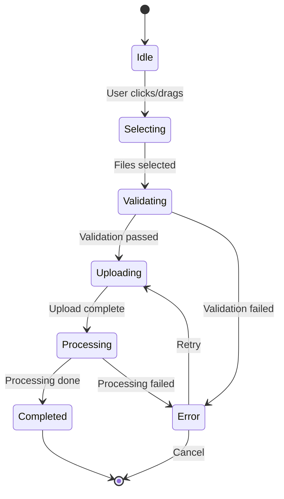

# Document Upload UI/UX Design

**Last Updated:** 2026-01-26
**Status:** Design Phase
**Related Docs:** [FILE_UPLOAD_ARCHITECTURE.md](./FILE_UPLOAD_ARCHITECTURE.md), [SECURITY_AUDIT_FILE_UPLOAD.md](./SECURITY_AUDIT_FILE_UPLOAD.md)

---

## Table of Contents

1. [Design Philosophy](#design-philosophy)
2. [Visual Design System](#visual-design-system)
3. [Component Specifications](#component-specifications)
4. [State Management](#state-management)
5. [Animation Patterns](#animation-patterns)
6. [Accessibility](#accessibility)
7. [Mobile Optimizations](#mobile-optimizations)
8. [Integration Points](#integration-points)
9. [File Structure](#file-structure)
10. [Implementation Notes](#implementation-notes)

---

## Design Philosophy

### Core Principles

1. **Invisible Until Needed**: File upload UI appears contextually when relevant
2. **Progressive Disclosure**: Advanced options hidden until user needs them
3. **Immediate Feedback**: Real-time validation and progress indication
4. **Error Recovery**: Clear error messages with actionable next steps
5. **Consistency**: Matches existing Vana design language and patterns

### User Experience Goals

- **Fast**: Upload and process files with minimal friction
- **Clear**: Always communicate status, progress, and next steps
- **Forgiving**: Handle errors gracefully with helpful guidance
- **Delightful**: Smooth animations and polished interactions
- **Trustworthy**: Clearly communicate security and privacy measures

### Design Constraints

- Must work in existing chat interface without disrupting conversation flow
- Support drag-and-drop from desktop and file picker on mobile
- Handle multiple file uploads with clear queue management
- Provide inline preview for uploaded files
- Minimize vertical space when no files are uploaded

---

## Visual Design System

### Color Palette

Following Vana's existing design system:

```typescript
// Design tokens from existing theme
export const FILE_UPLOAD_COLORS = {
  // Neutral colors (existing)
  background: 'bg-gray-50 dark:bg-gray-900',
  surface: 'bg-white dark:bg-gray-800',
  border: 'border-gray-200 dark:border-gray-700',
  text: {
    primary: 'text-gray-900 dark:text-gray-100',
    secondary: 'text-gray-600 dark:text-gray-400',
    tertiary: 'text-gray-500 dark:text-gray-500',
  },

  // Status colors
  upload: {
    idle: 'bg-blue-50 dark:bg-blue-900/20 border-blue-200 dark:border-blue-800',
    hover: 'bg-blue-100 dark:bg-blue-900/40 border-blue-300 dark:border-blue-700',
    active: 'bg-blue-600 dark:bg-blue-500 text-white',
    progress: 'bg-blue-600 dark:bg-blue-500',
  },
  success: {
    background: 'bg-green-50 dark:bg-green-900/20',
    border: 'border-green-200 dark:border-green-800',
    text: 'text-green-700 dark:text-green-400',
    icon: 'text-green-600 dark:text-green-500',
  },
  error: {
    background: 'bg-red-50 dark:bg-red-900/20',
    border: 'border-red-200 dark:border-red-800',
    text: 'text-red-700 dark:text-red-400',
    icon: 'text-red-600 dark:text-red-500',
  },
  warning: {
    background: 'bg-amber-50 dark:bg-amber-900/20',
    border: 'border-amber-200 dark:border-amber-800',
    text: 'text-amber-700 dark:text-amber-400',
    icon: 'text-amber-600 dark:text-amber-500',
  },
} as const;
```

### Typography

```typescript
export const FILE_UPLOAD_TYPOGRAPHY = {
  filename: 'text-sm font-medium',
  fileSize: 'text-xs text-gray-500 dark:text-gray-400',
  status: 'text-xs font-medium',
  error: 'text-xs font-normal',
  dropzone: 'text-sm text-gray-600 dark:text-gray-400',
  hint: 'text-xs text-gray-500 dark:text-gray-500',
} as const;
```

### Spacing & Sizing

```typescript
export const FILE_UPLOAD_SPACING = {
  // Component spacing
  dropZone: {
    padding: 'p-8',
    minHeight: 'min-h-[200px]',
    borderRadius: 'rounded-lg',
    borderWidth: 'border-2',
    borderStyle: 'border-dashed',
  },
  fileCard: {
    padding: 'p-3',
    gap: 'gap-3',
    borderRadius: 'rounded-md',
    borderWidth: 'border',
  },
  uploadButton: {
    height: 'h-9',
    padding: 'px-4',
    borderRadius: 'rounded-md',
  },
  icon: {
    size: 'h-5 w-5',
    sizeLarge: 'h-8 w-8',
  },
  progressBar: {
    height: 'h-1',
    borderRadius: 'rounded-full',
  },
} as const;
```

### Icons

Using Lucide React (already in project):

```typescript
import {
  Upload,        // Upload button
  File,          // Generic file icon
  FileText,      // Text documents
  FileCode,      // Code files
  Image,         // Images
  Table,         // CSV/Excel
  FileJson,      // JSON
  X,             // Remove file
  CheckCircle2,  // Success
  AlertCircle,   // Error
  Loader2,       // Loading spinner
  Paperclip,     // Attachment indicator
} from 'lucide-react';
```

---

## Component Specifications

### 1. FileUploadZone

The main drop zone for file uploads.

#### Props Interface

```typescript
interface FileUploadZoneProps {
  /** Callback when files are selected */
  onFilesSelected: (files: File[]) => void;

  /** Maximum file size in bytes */
  maxFileSize?: number;

  /** Allowed file types (MIME types or extensions) */
  acceptedFileTypes?: string[];

  /** Maximum number of files */
  maxFiles?: number;

  /** Whether multiple files can be selected */
  multiple?: boolean;

  /** Disabled state */
  disabled?: boolean;

  /** Show compact version (smaller, inline) */
  compact?: boolean;

  /** Custom placeholder text */
  placeholder?: string;

  /** Custom hint text */
  hint?: string;
}
```

#### Visual States

**Idle State**:
```tsx
<div className="
  border-2 border-dashed border-gray-300 dark:border-gray-700
  rounded-lg p-8 min-h-[200px]
  flex flex-col items-center justify-center
  bg-gray-50 dark:bg-gray-900/50
  transition-colors duration-200
">
  <Upload className="h-8 w-8 text-gray-400 mb-3" />
  <p className="text-sm text-gray-600 dark:text-gray-400">
    Drag & drop files here, or click to browse
  </p>
  <p className="text-xs text-gray-500 dark:text-gray-500 mt-1">
    PDF, DOCX, TXT, CSV, JSON, Images up to 25MB
  </p>
</div>
```

**Hover State**:
```tsx
<div className="
  border-2 border-dashed border-blue-400 dark:border-blue-600
  bg-blue-50 dark:bg-blue-900/20
  // ... rest of classes
">
  <Upload className="h-8 w-8 text-blue-600 dark:text-blue-400 mb-3" />
  <p className="text-sm text-blue-700 dark:text-blue-300">
    Drop files to upload
  </p>
</div>
```

**Disabled State**:
```tsx
<div className="
  border-2 border-dashed border-gray-200 dark:border-gray-800
  bg-gray-100 dark:bg-gray-900
  opacity-50 cursor-not-allowed
">
  <Upload className="h-8 w-8 text-gray-300 mb-3" />
  <p className="text-sm text-gray-400">
    File upload unavailable
  </p>
</div>
```

**Compact State** (for chat input):
```tsx
<button className="
  h-9 px-3
  flex items-center gap-2
  border border-gray-300 dark:border-gray-700
  rounded-md
  bg-white dark:bg-gray-800
  hover:bg-gray-50 dark:hover:bg-gray-750
  transition-colors
">
  <Paperclip className="h-4 w-4 text-gray-600 dark:text-gray-400" />
  <span className="text-sm text-gray-700 dark:text-gray-300">
    Attach
  </span>
</button>
```

#### Code Example

```tsx
// src/components/FileUpload/FileUploadZone.tsx
import React, { useCallback, useState } from 'react';
import { Upload } from 'lucide-react';
import { cn } from '@/lib/utils';
import { validateFileUpload } from '@/utils/fileValidation';

export function FileUploadZone({
  onFilesSelected,
  maxFileSize = 25 * 1024 * 1024,
  acceptedFileTypes = [],
  maxFiles = 10,
  multiple = true,
  disabled = false,
  compact = false,
  placeholder = 'Drag & drop files here, or click to browse',
  hint = 'PDF, DOCX, TXT, CSV, JSON, Images up to 25MB',
}: FileUploadZoneProps) {
  const [isDragging, setIsDragging] = useState(false);
  const inputRef = React.useRef<HTMLInputElement>(null);

  const handleDragOver = useCallback((e: React.DragEvent) => {
    e.preventDefault();
    e.stopPropagation();
    if (!disabled) {
      setIsDragging(true);
    }
  }, [disabled]);

  const handleDragLeave = useCallback((e: React.DragEvent) => {
    e.preventDefault();
    e.stopPropagation();
    setIsDragging(false);
  }, []);

  const handleDrop = useCallback((e: React.DragEvent) => {
    e.preventDefault();
    e.stopPropagation();
    setIsDragging(false);

    if (disabled) return;

    const files = Array.from(e.dataTransfer.files);
    handleFiles(files);
  }, [disabled]);

  const handleFiles = (files: File[]) => {
    // Validate files
    const validFiles = files.filter(file => {
      const validation = validateFileUpload(file, maxFileSize, acceptedFileTypes);
      if (!validation.valid) {
        console.error(`File validation failed: ${file.name}`, validation.error);
        return false;
      }
      return true;
    });

    // Limit number of files
    const limitedFiles = validFiles.slice(0, maxFiles);

    if (limitedFiles.length > 0) {
      onFilesSelected(limitedFiles);
    }
  };

  const handleClick = () => {
    if (!disabled) {
      inputRef.current?.click();
    }
  };

  const handleInputChange = (e: React.ChangeEvent<HTMLInputElement>) => {
    const files = Array.from(e.target.files || []);
    handleFiles(files);

    // Reset input to allow selecting the same file again
    e.target.value = '';
  };

  if (compact) {
    return (
      <>
        <button
          type="button"
          onClick={handleClick}
          disabled={disabled}
          className={cn(
            'h-9 px-3 flex items-center gap-2',
            'border border-gray-300 dark:border-gray-700 rounded-md',
            'bg-white dark:bg-gray-800',
            'hover:bg-gray-50 dark:hover:bg-gray-750',
            'transition-colors',
            disabled && 'opacity-50 cursor-not-allowed'
          )}
        >
          <Paperclip className="h-4 w-4 text-gray-600 dark:text-gray-400" />
          <span className="text-sm text-gray-700 dark:text-gray-300">
            Attach
          </span>
        </button>
        <input
          ref={inputRef}
          type="file"
          multiple={multiple}
          accept={acceptedFileTypes.join(',')}
          onChange={handleInputChange}
          className="hidden"
        />
      </>
    );
  }

  return (
    <>
      <div
        onClick={handleClick}
        onDragOver={handleDragOver}
        onDragLeave={handleDragLeave}
        onDrop={handleDrop}
        className={cn(
          'border-2 border-dashed rounded-lg p-8 min-h-[200px]',
          'flex flex-col items-center justify-center',
          'transition-all duration-200 cursor-pointer',
          isDragging
            ? 'border-blue-400 dark:border-blue-600 bg-blue-50 dark:bg-blue-900/20'
            : 'border-gray-300 dark:border-gray-700 bg-gray-50 dark:bg-gray-900/50',
          disabled && 'opacity-50 cursor-not-allowed',
          !disabled && 'hover:border-blue-300 dark:hover:border-blue-700'
        )}
      >
        <Upload
          className={cn(
            'h-8 w-8 mb-3',
            isDragging
              ? 'text-blue-600 dark:text-blue-400'
              : 'text-gray-400 dark:text-gray-500'
          )}
        />
        <p
          className={cn(
            'text-sm',
            isDragging
              ? 'text-blue-700 dark:text-blue-300'
              : 'text-gray-600 dark:text-gray-400'
          )}
        >
          {isDragging ? 'Drop files to upload' : placeholder}
        </p>
        <p className="text-xs text-gray-500 dark:text-gray-500 mt-1">
          {hint}
        </p>
      </div>

      <input
        ref={inputRef}
        type="file"
        multiple={multiple}
        accept={acceptedFileTypes.join(',')}
        onChange={handleInputChange}
        className="hidden"
      />
    </>
  );
}
```

---

### 2. FileCard

Displays uploaded file with status, progress, and actions.

#### Props Interface

```typescript
interface FileCardProps {
  /** File metadata */
  file: {
    id: string;
    name: string;
    size: number;
    type: string;
    status: 'pending' | 'uploading' | 'processing' | 'completed' | 'error';
    progress?: number; // 0-100
    error?: string;
    warnings?: string[];
  };

  /** Callback when user removes file */
  onRemove?: () => void;

  /** Callback when user retries upload */
  onRetry?: () => void;

  /** Show detailed information */
  detailed?: boolean;

  /** Compact mode (smaller) */
  compact?: boolean;
}
```

#### Visual States

**Uploading**:
```tsx
<div className="
  flex items-center gap-3 p-3
  border border-gray-200 dark:border-gray-700
  rounded-md bg-white dark:bg-gray-800
">
  {/* Icon */}
  <FileText className="h-5 w-5 text-blue-600 dark:text-blue-400 flex-shrink-0" />

  {/* Info */}
  <div className="flex-1 min-w-0">
    <div className="flex items-center justify-between mb-1">
      <p className="text-sm font-medium text-gray-900 dark:text-gray-100 truncate">
        project-spec.pdf
      </p>
      <span className="text-xs font-medium text-blue-600 dark:text-blue-400 ml-2">
        45%
      </span>
    </div>
    <p className="text-xs text-gray-500 dark:text-gray-400 mb-2">
      2.4 MB • Uploading...
    </p>
    {/* Progress bar */}
    <div className="h-1 bg-gray-200 dark:bg-gray-700 rounded-full overflow-hidden">
      <div
        className="h-full bg-blue-600 dark:bg-blue-500 transition-all duration-300"
        style={{ width: '45%' }}
      />
    </div>
  </div>

  {/* Cancel button */}
  <button className="text-gray-400 hover:text-gray-600 dark:hover:text-gray-300">
    <X className="h-4 w-4" />
  </button>
</div>
```

**Completed**:
```tsx
<div className="
  flex items-center gap-3 p-3
  border border-green-200 dark:border-green-800
  bg-green-50 dark:bg-green-900/20
  rounded-md
">
  <FileText className="h-5 w-5 text-green-600 dark:text-green-400 flex-shrink-0" />

  <div className="flex-1 min-w-0">
    <p className="text-sm font-medium text-gray-900 dark:text-gray-100 truncate">
      project-spec.pdf
    </p>
    <p className="text-xs text-gray-500 dark:text-gray-400">
      2.4 MB • Ready
    </p>
  </div>

  <CheckCircle2 className="h-4 w-4 text-green-600 dark:text-green-500 flex-shrink-0" />

  <button className="text-gray-400 hover:text-gray-600 dark:hover:text-gray-300">
    <X className="h-4 w-4" />
  </button>
</div>
```

**Error**:
```tsx
<div className="
  flex items-start gap-3 p-3
  border border-red-200 dark:border-red-800
  bg-red-50 dark:bg-red-900/20
  rounded-md
">
  <FileText className="h-5 w-5 text-red-600 dark:text-red-400 flex-shrink-0 mt-0.5" />

  <div className="flex-1 min-w-0">
    <p className="text-sm font-medium text-gray-900 dark:text-gray-100 truncate">
      invalid-file.exe
    </p>
    <p className="text-xs text-red-700 dark:text-red-400 mt-1">
      File type not supported
    </p>
  </div>

  <button className="text-red-600 hover:text-red-700 dark:hover:text-red-300 text-xs font-medium">
    Retry
  </button>
</div>
```

#### Code Example

```tsx
// src/components/FileUpload/FileCard.tsx
import React from 'react';
import { FileText, FileCode, Image as ImageIcon, Table, FileJson, File, X, CheckCircle2, AlertCircle, Loader2 } from 'lucide-react';
import { cn } from '@/lib/utils';
import { formatFileSize } from '@/utils/formatters';

function getFileIcon(mimeType: string) {
  if (mimeType.startsWith('image/')) return ImageIcon;
  if (mimeType.includes('csv')) return Table;
  if (mimeType.includes('json')) return FileJson;
  if (mimeType.includes('javascript') || mimeType.includes('python') || mimeType.includes('html')) return FileCode;
  if (mimeType.includes('pdf') || mimeType.includes('document') || mimeType.includes('text')) return FileText;
  return File;
}

export function FileCard({
  file,
  onRemove,
  onRetry,
  detailed = false,
  compact = false,
}: FileCardProps) {
  const FileIcon = getFileIcon(file.type);
  const isLoading = file.status === 'uploading' || file.status === 'processing';
  const isError = file.status === 'error';
  const isComplete = file.status === 'completed';

  const statusColors = {
    pending: 'border-gray-200 dark:border-gray-700 bg-white dark:bg-gray-800',
    uploading: 'border-blue-200 dark:border-blue-800 bg-blue-50 dark:bg-blue-900/10',
    processing: 'border-blue-200 dark:border-blue-800 bg-blue-50 dark:bg-blue-900/10',
    completed: 'border-green-200 dark:border-green-800 bg-green-50 dark:bg-green-900/20',
    error: 'border-red-200 dark:border-red-800 bg-red-50 dark:bg-red-900/20',
  };

  const iconColors = {
    pending: 'text-gray-600 dark:text-gray-400',
    uploading: 'text-blue-600 dark:text-blue-400',
    processing: 'text-blue-600 dark:text-blue-400',
    completed: 'text-green-600 dark:text-green-400',
    error: 'text-red-600 dark:text-red-400',
  };

  const getStatusText = () => {
    switch (file.status) {
      case 'pending': return 'Pending...';
      case 'uploading': return 'Uploading...';
      case 'processing': return 'Processing...';
      case 'completed': return 'Ready';
      case 'error': return file.error || 'Upload failed';
      default: return '';
    }
  };

  return (
    <div
      className={cn(
        'flex items-start gap-3 border rounded-md transition-all duration-200',
        compact ? 'p-2' : 'p-3',
        statusColors[file.status]
      )}
    >
      {/* File icon */}
      <FileIcon
        className={cn(
          compact ? 'h-4 w-4' : 'h-5 w-5',
          'flex-shrink-0 mt-0.5',
          iconColors[file.status]
        )}
      />

      {/* File info */}
      <div className="flex-1 min-w-0">
        <div className="flex items-center justify-between mb-1">
          <p
            className={cn(
              compact ? 'text-xs' : 'text-sm',
              'font-medium text-gray-900 dark:text-gray-100 truncate'
            )}
            title={file.name}
          >
            {file.name}
          </p>

          {isLoading && file.progress !== undefined && (
            <span className="text-xs font-medium text-blue-600 dark:text-blue-400 ml-2">
              {file.progress}%
            </span>
          )}
        </div>

        <p className={cn(compact ? 'text-[10px]' : 'text-xs', 'text-gray-500 dark:text-gray-400')}>
          {formatFileSize(file.size)} • {getStatusText()}
        </p>

        {/* Progress bar */}
        {isLoading && file.progress !== undefined && (
          <div className="h-1 bg-gray-200 dark:bg-gray-700 rounded-full overflow-hidden mt-2">
            <div
              className="h-full bg-blue-600 dark:bg-blue-500 transition-all duration-300"
              style={{ width: `${file.progress}%` }}
            />
          </div>
        )}

        {/* Error message */}
        {isError && file.error && detailed && (
          <p className="text-xs text-red-700 dark:text-red-400 mt-1">
            {file.error}
          </p>
        )}

        {/* Warnings */}
        {isComplete && file.warnings && file.warnings.length > 0 && detailed && (
          <div className="mt-2 space-y-1">
            {file.warnings.map((warning, idx) => (
              <div key={idx} className="flex items-start gap-1">
                <AlertCircle className="h-3 w-3 text-amber-600 dark:text-amber-500 flex-shrink-0 mt-0.5" />
                <p className="text-xs text-amber-700 dark:text-amber-400">
                  {warning}
                </p>
              </div>
            ))}
          </div>
        )}
      </div>

      {/* Status icon / Actions */}
      <div className="flex items-center gap-2 flex-shrink-0">
        {isLoading && (
          <Loader2 className="h-4 w-4 text-blue-600 dark:text-blue-400 animate-spin" />
        )}

        {isComplete && (
          <CheckCircle2 className="h-4 w-4 text-green-600 dark:text-green-500" />
        )}

        {isError && onRetry && (
          <button
            onClick={onRetry}
            className="text-xs font-medium text-red-600 hover:text-red-700 dark:hover:text-red-400"
          >
            Retry
          </button>
        )}

        {onRemove && !isLoading && (
          <button
            onClick={onRemove}
            className="text-gray-400 hover:text-gray-600 dark:hover:text-gray-300"
            aria-label="Remove file"
          >
            <X className="h-4 w-4" />
          </button>
        )}
      </div>
    </div>
  );
}
```

---

### 3. FileUploadManager

Manages multiple file uploads with queue display.

#### Props Interface

```typescript
interface FileUploadManagerProps {
  /** Current session ID */
  sessionId: string;

  /** Callback when files are uploaded */
  onUploadComplete?: (files: UploadedFile[]) => void;

  /** Maximum files allowed */
  maxFiles?: number;

  /** Show in sidebar vs inline */
  placement?: 'inline' | 'sidebar';
}
```

#### Code Example

```tsx
// src/components/FileUpload/FileUploadManager.tsx
import React, { useState } from 'react';
import { FileUploadZone } from './FileUploadZone';
import { FileCard } from './FileCard';
import { useFileUpload } from '@/hooks/useFileUpload';

export function FileUploadManager({
  sessionId,
  onUploadComplete,
  maxFiles = 10,
  placement = 'inline',
}: FileUploadManagerProps) {
  const [files, setFiles] = useState<UploadedFile[]>([]);
  const { uploadFile, removeFile, retryUpload } = useFileUpload({ sessionId });

  const handleFilesSelected = async (selectedFiles: File[]) => {
    // Create upload records
    const newFiles = selectedFiles.map(file => ({
      id: crypto.randomUUID(),
      name: file.name,
      size: file.size,
      type: file.type,
      status: 'pending' as const,
      progress: 0,
      file, // Keep reference for upload
    }));

    setFiles(prev => [...prev, ...newFiles]);

    // Start uploads
    for (const fileRecord of newFiles) {
      try {
        await uploadFile(fileRecord, (progress) => {
          setFiles(prev => prev.map(f =>
            f.id === fileRecord.id
              ? { ...f, status: 'uploading', progress }
              : f
          ));
        });

        // Mark as completed
        setFiles(prev => prev.map(f =>
          f.id === fileRecord.id
            ? { ...f, status: 'completed', progress: 100 }
            : f
        ));
      } catch (error) {
        // Mark as error
        setFiles(prev => prev.map(f =>
          f.id === fileRecord.id
            ? { ...f, status: 'error', error: error.message }
            : f
        ));
      }
    }

    // Notify parent
    const completedFiles = files.filter(f => f.status === 'completed');
    onUploadComplete?.(completedFiles);
  };

  const handleRemove = (fileId: string) => {
    setFiles(prev => prev.filter(f => f.id !== fileId));
    removeFile(fileId);
  };

  const handleRetry = async (fileId: string) => {
    const file = files.find(f => f.id === fileId);
    if (!file) return;

    // Reset status
    setFiles(prev => prev.map(f =>
      f.id === fileId
        ? { ...f, status: 'pending', error: undefined }
        : f
    ));

    // Retry upload
    try {
      await retryUpload(file);
      setFiles(prev => prev.map(f =>
        f.id === fileId
          ? { ...f, status: 'completed', progress: 100 }
          : f
      ));
    } catch (error) {
      setFiles(prev => prev.map(f =>
        f.id === fileId
          ? { ...f, status: 'error', error: error.message }
          : f
      ));
    }
  };

  const hasReachedLimit = files.length >= maxFiles;

  return (
    <div className="space-y-4">
      {/* Upload zone */}
      {!hasReachedLimit && (
        <FileUploadZone
          onFilesSelected={handleFilesSelected}
          maxFiles={maxFiles - files.length}
          compact={placement === 'inline'}
        />
      )}

      {/* File list */}
      {files.length > 0 && (
        <div className="space-y-2">
          <div className="flex items-center justify-between">
            <h3 className="text-sm font-medium text-gray-900 dark:text-gray-100">
              Uploaded Files ({files.length}/{maxFiles})
            </h3>
            {files.some(f => f.status === 'completed') && (
              <button
                onClick={() => setFiles([])}
                className="text-xs text-gray-600 hover:text-gray-900 dark:text-gray-400 dark:hover:text-gray-100"
              >
                Clear all
              </button>
            )}
          </div>

          <div className="space-y-2">
            {files.map(file => (
              <FileCard
                key={file.id}
                file={file}
                onRemove={() => handleRemove(file.id)}
                onRetry={() => handleRetry(file.id)}
                detailed
              />
            ))}
          </div>
        </div>
      )}
    </div>
  );
}
```

---

### 4. FileContextIndicator

Shows which files are being used in current conversation.

#### Props Interface

```typescript
interface FileContextIndicatorProps {
  /** Files in current context */
  files: Array<{
    id: string;
    name: string;
    tokenCount: number;
    isSummary: boolean;
  }>;

  /** Total tokens used */
  totalTokens: number;

  /** Token budget */
  tokenBudget: number;

  /** Callback to remove file from context */
  onRemoveFromContext?: (fileId: string) => void;
}
```

#### Visual Design

```tsx
<div className="
  flex items-center gap-2 p-2
  border border-blue-200 dark:border-blue-800
  bg-blue-50 dark:bg-blue-900/10
  rounded-md text-xs
">
  <Paperclip className="h-3.5 w-3.5 text-blue-600 dark:text-blue-400" />
  <span className="text-blue-700 dark:text-blue-300">
    Using 2 files ({formatTokenCount(totalTokens)} tokens)
  </span>

  {/* File pills */}
  <div className="flex items-center gap-1 ml-auto">
    {files.map(file => (
      <div key={file.id} className="
        flex items-center gap-1 px-2 py-0.5
        bg-blue-100 dark:bg-blue-900/30
        rounded-full
      ">
        <span className="text-blue-800 dark:text-blue-200 truncate max-w-[100px]">
          {file.name}
        </span>
        {file.isSummary && (
          <span className="text-blue-600 dark:text-blue-400 text-[10px]">
            (summary)
          </span>
        )}
        <button
          onClick={() => onRemoveFromContext?.(file.id)}
          className="text-blue-600 hover:text-blue-800 dark:hover:text-blue-200"
        >
          <X className="h-3 w-3" />
        </button>
      </div>
    ))}
  </div>
</div>
```

---

### 5. FilePreviewModal

Shows file details and preview.

#### Props Interface

```typescript
interface FilePreviewModalProps {
  /** File to preview */
  file: {
    id: string;
    name: string;
    size: number;
    type: string;
    uploadedAt: string;
    content?: string; // Extracted text
    signedUrl?: string;
  };

  /** Whether modal is open */
  open: boolean;

  /** Callback to close modal */
  onClose: () => void;

  /** Callback to download file */
  onDownload?: () => void;
}
```

#### Visual Design

Uses shadcn Dialog component with custom content area for file preview.

---

### 6. FileUploadButton (Compact)

Compact button for chat input area.

#### Code Example

```tsx
// src/components/FileUpload/FileUploadButton.tsx
import React from 'react';
import { Paperclip } from 'lucide-react';
import { cn } from '@/lib/utils';

export function FileUploadButton({
  onFilesSelected,
  disabled = false,
  hasFiles = false,
}: {
  onFilesSelected: (files: File[]) => void;
  disabled?: boolean;
  hasFiles?: boolean;
}) {
  const inputRef = React.useRef<HTMLInputElement>(null);

  const handleClick = () => {
    if (!disabled) {
      inputRef.current?.click();
    }
  };

  const handleChange = (e: React.ChangeEvent<HTMLInputElement>) => {
    const files = Array.from(e.target.files || []);
    if (files.length > 0) {
      onFilesSelected(files);
    }
    e.target.value = '';
  };

  return (
    <>
      <button
        type="button"
        onClick={handleClick}
        disabled={disabled}
        className={cn(
          'p-2 rounded-md transition-colors',
          hasFiles
            ? 'text-blue-600 dark:text-blue-400 bg-blue-50 dark:bg-blue-900/20'
            : 'text-gray-600 dark:text-gray-400 hover:bg-gray-100 dark:hover:bg-gray-800',
          disabled && 'opacity-50 cursor-not-allowed'
        )}
        aria-label="Attach file"
      >
        <Paperclip className="h-5 w-5" />
      </button>

      <input
        ref={inputRef}
        type="file"
        multiple
        onChange={handleChange}
        className="hidden"
      />
    </>
  );
}
```

---

## State Management

### TanStack Query Hooks

```typescript
// src/hooks/useFileUpload.ts
import { useMutation, useQueryClient } from '@tanstack/react-query';
import { uploadFile as uploadFileAPI } from '@/api/fileUpload';

export function useFileUpload({ sessionId }: { sessionId: string }) {
  const queryClient = useQueryClient();

  const uploadMutation = useMutation({
    mutationFn: async ({
      file,
      onProgress,
    }: {
      file: File;
      onProgress?: (progress: number) => void;
    }) => {
      return uploadFileAPI(file, sessionId, onProgress);
    },
    onSuccess: () => {
      // Invalidate session files query
      queryClient.invalidateQueries(['session-files', sessionId]);
    },
  });

  return {
    uploadFile: uploadMutation.mutateAsync,
    isUploading: uploadMutation.isPending,
    error: uploadMutation.error,
  };
}

// src/hooks/useSessionFiles.ts
import { useQuery } from '@tanstack/react-query';
import { getSessionFiles } from '@/api/fileUpload';

export function useSessionFiles(sessionId: string) {
  return useQuery({
    queryKey: ['session-files', sessionId],
    queryFn: () => getSessionFiles(sessionId),
    staleTime: 30000, // 30 seconds
  });
}
```

### Upload State Flow



---

## Animation Patterns

### Entry Animations

```typescript
// File card entrance (staggered)
const fileCardVariants = {
  hidden: { opacity: 0, y: -10 },
  visible: (i: number) => ({
    opacity: 1,
    y: 0,
    transition: {
      delay: i * 0.05,
      duration: 0.2,
      ease: 'easeOut',
    },
  }),
  exit: {
    opacity: 0,
    x: -20,
    transition: { duration: 0.15 },
  },
};

// Usage with Framer Motion
<motion.div
  variants={fileCardVariants}
  initial="hidden"
  animate="visible"
  exit="exit"
  custom={index}
>
  <FileCard {...props} />
</motion.div>
```

### Progress Animation

```tsx
// Smooth progress bar
<motion.div
  className="h-1 bg-blue-600 rounded-full"
  initial={{ width: 0 }}
  animate={{ width: `${progress}%` }}
  transition={{ duration: 0.3, ease: 'easeInOut' }}
/>
```

### Success Animation

```tsx
// Checkmark animation
<motion.div
  initial={{ scale: 0 }}
  animate={{ scale: 1 }}
  transition={{ type: 'spring', stiffness: 200, damping: 15 }}
>
  <CheckCircle2 className="h-5 w-5 text-green-600" />
</motion.div>
```

### Drag Overlay Animation

```tsx
// Drop zone highlight
<motion.div
  animate={{
    borderColor: isDragging ? 'rgb(59, 130, 246)' : 'rgb(209, 213, 219)',
    backgroundColor: isDragging ? 'rgba(59, 130, 246, 0.05)' : 'rgba(0, 0, 0, 0)',
  }}
  transition={{ duration: 0.2 }}
>
  {/* Drop zone content */}
</motion.div>
```

---

## Accessibility

### Keyboard Navigation

- **Tab**: Navigate through upload button, file cards, action buttons
- **Enter/Space**: Activate upload button, confirm actions
- **Escape**: Cancel upload, close modal
- **Arrow Keys**: Navigate between files in list

### ARIA Labels

```tsx
// Upload zone
<div
  role="button"
  tabIndex={0}
  aria-label="Upload files by clicking or dragging"
  aria-describedby="upload-hint"
>
  <p id="upload-hint">PDF, DOCX, TXT, CSV, JSON, Images up to 25MB</p>
</div>

// File card
<div
  role="listitem"
  aria-label={`${file.name}, ${formatFileSize(file.size)}, ${file.status}`}
>
  {/* File content */}
</div>

// Remove button
<button
  aria-label={`Remove ${file.name}`}
  onClick={onRemove}
>
  <X />
</button>

// Progress indicator
<div
  role="progressbar"
  aria-valuenow={progress}
  aria-valuemin={0}
  aria-valuemax={100}
  aria-label="Upload progress"
/>
```

### Screen Reader Announcements

```tsx
// Use live region for status updates
const [announcement, setAnnouncement] = useState('');

useEffect(() => {
  if (file.status === 'completed') {
    setAnnouncement(`${file.name} uploaded successfully`);
  } else if (file.status === 'error') {
    setAnnouncement(`${file.name} upload failed: ${file.error}`);
  }
}, [file.status]);

return (
  <>
    <div aria-live="polite" aria-atomic="true" className="sr-only">
      {announcement}
    </div>
    {/* Component content */}
  </>
);
```

### Focus Management

```tsx
// Focus trap in modal
import { Dialog } from '@radix-ui/react-dialog';

<Dialog open={isOpen} onOpenChange={setIsOpen}>
  <Dialog.Content>
    {/* Content automatically traps focus */}
  </Dialog.Content>
</Dialog>
```

---

## Mobile Optimizations

### Touch Targets

All interactive elements minimum 44x44px:

```tsx
// Mobile-friendly button sizing
<button className="min-h-[44px] min-w-[44px] p-2">
  <Paperclip className="h-5 w-5" />
</button>
```

### Responsive Layout

```tsx
// Stack vertically on mobile
<div className="
  grid grid-cols-1 md:grid-cols-2 lg:grid-cols-3
  gap-3
">
  {files.map(file => <FileCard key={file.id} file={file} />)}
</div>
```

### Native File Picker

```tsx
// Use native file picker on mobile
<input
  type="file"
  accept="image/*,application/pdf,.docx,.txt,.csv"
  capture="environment" // Use camera on mobile if needed
  multiple
/>
```

### Swipe Gestures

```tsx
// Swipe to remove (optional enhancement)
import { motion, useMotionValue, useTransform } from 'framer-motion';

function SwipeableFileCard({ file, onRemove }) {
  const x = useMotionValue(0);
  const opacity = useTransform(x, [-100, 0], [0, 1]);

  return (
    <motion.div
      drag="x"
      dragConstraints={{ left: -100, right: 0 }}
      style={{ x, opacity }}
      onDragEnd={(_, info) => {
        if (info.offset.x < -80) {
          onRemove();
        }
      }}
    >
      <FileCard file={file} />
    </motion.div>
  );
}
```

---

## Integration Points

### Chat Input Integration

```tsx
// src/components/ChatInput.tsx
import { FileUploadButton } from './FileUpload/FileUploadButton';
import { FileContextIndicator } from './FileUpload/FileContextIndicator';

export function ChatInput({ sessionId }: { sessionId: string }) {
  const [uploadedFiles, setUploadedFiles] = useState([]);
  const { data: sessionFiles } = useSessionFiles(sessionId);

  return (
    <div className="space-y-2">
      {/* File context indicator */}
      {sessionFiles && sessionFiles.length > 0 && (
        <FileContextIndicator
          files={sessionFiles}
          totalTokens={sessionFiles.reduce((sum, f) => sum + f.tokenCount, 0)}
          tokenBudget={10000}
        />
      )}

      {/* Input area */}
      <div className="flex items-end gap-2">
        <FileUploadButton
          onFilesSelected={handleFilesSelected}
          hasFiles={sessionFiles && sessionFiles.length > 0}
        />

        <textarea
          value={message}
          onChange={(e) => setMessage(e.target.value)}
          placeholder="Type a message..."
          className="flex-1 resize-none"
        />

        <button type="submit">Send</button>
      </div>
    </div>
  );
}
```

### Sidebar Integration

```tsx
// src/components/Sidebar.tsx
import { FileUploadManager } from './FileUpload/FileUploadManager';

export function Sidebar({ sessionId }: { sessionId: string }) {
  return (
    <div className="w-80 border-l border-gray-200 dark:border-gray-700 p-4">
      <h2 className="text-lg font-semibold mb-4">Uploaded Files</h2>

      <FileUploadManager
        sessionId={sessionId}
        placement="sidebar"
        maxFiles={10}
      />
    </div>
  );
}
```

---

## File Structure

```
src/components/FileUpload/
├── index.ts                      # Barrel exports
├── FileUploadZone.tsx            # Main drop zone component
├── FileCard.tsx                  # Individual file display
├── FileUploadManager.tsx         # Multi-file manager
├── FileContextIndicator.tsx      # Context usage indicator
├── FilePreviewModal.tsx          # File preview dialog
├── FileUploadButton.tsx          # Compact button for chat
└── __tests__/
    ├── FileUploadZone.test.tsx
    ├── FileCard.test.tsx
    └── FileUploadManager.test.tsx

src/hooks/
├── useFileUpload.ts              # Upload mutation hook
├── useSessionFiles.ts            # Fetch session files
└── useFileContext.ts             # Context provider hook

src/api/
└── fileUpload.ts                 # API client functions

src/utils/
├── fileValidation.ts             # Frontend validation
└── formatters.ts                 # File size, date formatters
```

---

## Implementation Notes

### Best Practices

1. **Validation**: Always validate files on frontend AND backend
2. **Progress Feedback**: Show progress for all operations > 1s
3. **Error Recovery**: Provide clear error messages with retry options
4. **Performance**: Lazy load file previews, use virtual scrolling for large lists
5. **Security**: Never trust client-side validation alone

### Testing Requirements

#### Unit Tests

```typescript
// FileCard.test.tsx
describe('FileCard', () => {
  it('renders file name and size', () => {
    const file = {
      id: '1',
      name: 'test.pdf',
      size: 1024000,
      type: 'application/pdf',
      status: 'completed',
    };

    render(<FileCard file={file} />);

    expect(screen.getByText('test.pdf')).toBeInTheDocument();
    expect(screen.getByText(/1.0 MB/)).toBeInTheDocument();
  });

  it('shows progress bar when uploading', () => {
    const file = {
      id: '1',
      name: 'test.pdf',
      size: 1024000,
      type: 'application/pdf',
      status: 'uploading',
      progress: 45,
    };

    render(<FileCard file={file} />);

    expect(screen.getByText('45%')).toBeInTheDocument();
    expect(screen.getByRole('progressbar')).toBeInTheDocument();
  });

  it('calls onRemove when remove button clicked', () => {
    const onRemove = vi.fn();
    const file = {
      id: '1',
      name: 'test.pdf',
      size: 1024000,
      type: 'application/pdf',
      status: 'completed',
    };

    render(<FileCard file={file} onRemove={onRemove} />);

    fireEvent.click(screen.getByLabelText('Remove file'));

    expect(onRemove).toHaveBeenCalledTimes(1);
  });
});
```

#### Integration Tests

```typescript
// FileUploadManager.test.tsx
describe('FileUploadManager', () => {
  it('uploads multiple files and shows progress', async () => {
    const { user } = setup(<FileUploadManager sessionId="session-1" />);

    // Simulate file selection
    const files = [
      new File(['content1'], 'file1.txt', { type: 'text/plain' }),
      new File(['content2'], 'file2.txt', { type: 'text/plain' }),
    ];

    const input = screen.getByLabelText(/upload/i);
    await user.upload(input, files);

    // Check files are shown
    expect(await screen.findByText('file1.txt')).toBeInTheDocument();
    expect(await screen.findByText('file2.txt')).toBeInTheDocument();

    // Wait for uploads to complete
    expect(await screen.findByText(/Ready/)).toBeInTheDocument();
  });
});
```

#### E2E Tests

```typescript
// e2e/file-upload.spec.ts
test('user can upload file and use in chat', async ({ page }) => {
  await page.goto('/chat/session-123');

  // Click attach button
  await page.click('[aria-label="Attach file"]');

  // Upload file
  await page.setInputFiles('input[type="file"]', './fixtures/test-doc.pdf');

  // Wait for upload to complete
  await page.waitForSelector('text=Ready');

  // Send message
  await page.fill('textarea', 'What does the document say?');
  await page.click('button[type="submit"]');

  // Check AI uses file context
  await expect(page.locator('.message')).toContainText('Based on the document');
});
```

### Gotchas & Common Issues

1. **File Size Calculation**: Browser File.size is in bytes, not KB
2. **MIME Type Detection**: Frontend MIME type can be spoofed, always verify server-side
3. **Memory Leaks**: Clean up File objects and ObjectURLs after use
4. **Drag Events**: Must call `preventDefault()` on dragOver to enable drop
5. **Mobile Keyboards**: Input focus can hide upload UI, use scrollIntoView

### Performance Tips

- Use `React.memo` for FileCard to prevent unnecessary re-renders
- Virtualize long file lists with `react-window`
- Debounce progress updates to reduce re-renders
- Use `IntersectionObserver` for lazy loading file previews
- Compress images client-side before upload if needed

---

## Related Documentation

- [FILE_UPLOAD_ARCHITECTURE.md](./FILE_UPLOAD_ARCHITECTURE.md) - Backend architecture and processing
- [SECURITY_AUDIT_FILE_UPLOAD.md](./SECURITY_AUDIT_FILE_UPLOAD.md) - Security requirements
- [DEVELOPMENT_PATTERNS.md](./DEVELOPMENT_PATTERNS.md) - General development patterns

---

**Document Version:** 1.0
**Last Updated:** 2026-01-26
**Status:** Design Phase - Pending Implementation
