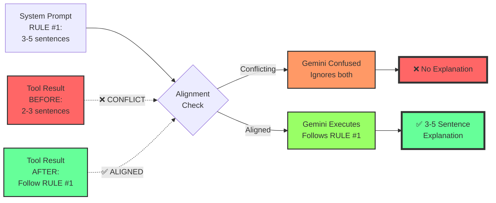
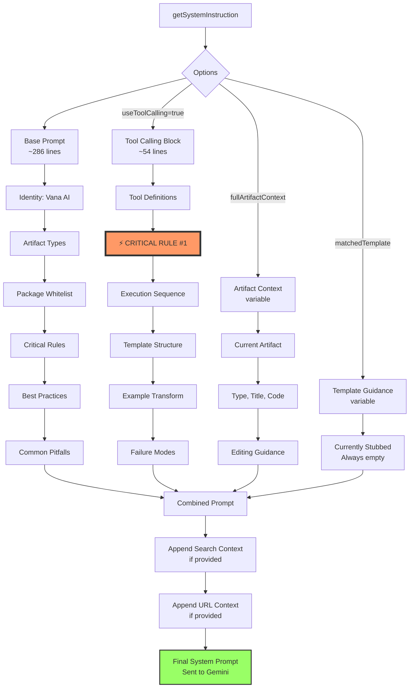
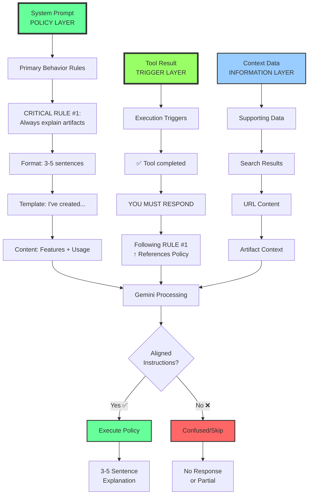
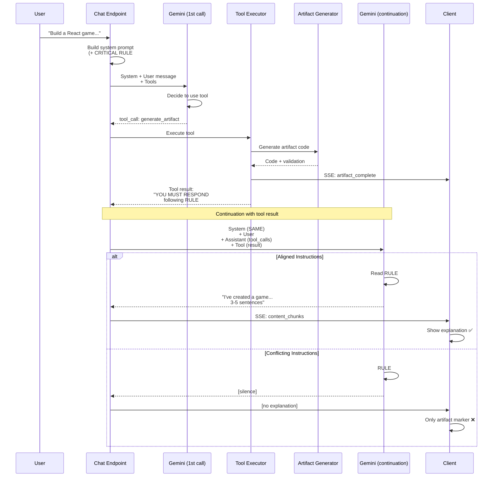

# Prompt Flow Diagram

**Visual representation of complete instruction flow from user input to AI response**

---

## 🔄 COMPLETE FLOW (Mermaid Diagram)

```mermaid
graph TD
    A[👤 User Input<br/>Carousel: Build a React game...] --> B[🔐 Chat Endpoint<br/>Validation & Rate Limiting]

    B --> C{Artifact<br/>Editing?}
    C -->|Yes| D1[📝 Build Artifact Context<br/>Current artifact details]
    C -->|No| D2[Skip artifact context]
    D1 --> E
    D2 --> E

    E[🏗️ System Prompt Construction<br/>system-prompt-inline.ts] --> E1[Base Prompt 286 lines]
    E1 --> E2{Tool Calling<br/>Enabled?}

    E2 -->|Yes| E3[⚡ CRITICAL RULE #1<br/>3-5 sentences MANDATORY]
    E2 -->|No| F
    E3 --> E4[Tool Definitions]
    E4 --> E5[Execution Sequence]
    E5 --> E6[Example Transformation]
    E6 --> E7[Failure Modes]
    E7 --> F

    F{Additional<br/>Context?} -->|Search| F1[+ Search Results]
    F -->|URL Extract| F2[+ URL Content]
    F -->|None| G
    F1 --> G
    F2 --> G

    G[📤 First Gemini Call] --> G1[System: FULL PROMPT<br/>User: Build game...]
    G1 --> G2[Tools: artifact, image, search]
    G2 --> H{Gemini<br/>Decision}

    H -->|Text Only| Z[💬 Direct Response<br/>No tool used]
    H -->|Tool Call| I[🔧 Tool Call Detected<br/>generate_artifact]

    I --> J[⚙️ Tool Execution<br/>artifact-generator-structured.ts]
    J --> J1[Generate via JSON Schema]
    J1 --> J2[Validate with Zod]
    J2 --> J3[Send to Client via SSE]
    J3 --> K

    K[📊 Tool Result Formatting<br/>tool-executor.ts] --> K1{Format<br/>Type?}

    K1 -->|Artifact| K2[✅ Artifact created<br/>YOU MUST RESPOND<br/>following RULE #1]
    K1 -->|Image| K3[✅ Image created<br/>YOU MUST RESPOND<br/>following RULE #1]
    K1 -->|Search| K4[Search results...]

    K2 --> L
    K3 --> L
    K4 --> L

    L[🔄 Continuation Call] --> L1[System: SAME PROMPT<br/>User: Build game...<br/>Assistant: tool_calls<br/>Tool: RESULT]
    L1 --> M[🤖 Final Gemini Response]

    M --> N{Has<br/>Explanation?}

    N -->|Yes ✅| O[I've created a game...<br/>3-5 sentences]
    N -->|No ❌| P[SILENT<br/>Indicates conflict]

    O --> Q[✅ Client Receives<br/>Artifact + Explanation]
    P --> R[❌ Client Receives<br/>Only Artifact marker]

    Q --> S[😊 Good UX]
    R --> T[😞 Bad UX]

    Z --> S

    style E3 fill:#f96,stroke:#333,stroke-width:4px
    style K2 fill:#9f6,stroke:#333,stroke-width:4px
    style K3 fill:#9f6,stroke:#333,stroke-width:4px
    style O fill:#6f9,stroke:#333,stroke-width:2px
    style P fill:#f66,stroke:#333,stroke-width:2px
    style S fill:#6f9,stroke:#333,stroke-width:2px
    style T fill:#f66,stroke:#333,stroke-width:2px
```

---

## 🎯 CONFLICT POINTS VISUALIZATION

---

## 🏗️ SYSTEM PROMPT STRUCTURE

---

## 📊 INSTRUCTION INJECTION HIERARCHY

---

## 🔧 TOOL EXECUTION FLOW

---

## 📝 KEY TAKEAWAYS

### Visualization Insights

1. **Three-Layer Architecture**
   - **Policy Layer** (System Prompt): Defines WHAT and HOW
   - **Trigger Layer** (Tool Results): Signals WHEN to execute policy
   - **Information Layer** (Context Data): Provides WHAT to explain

2. **Critical Alignment Points**
   - System Prompt ← **MUST ALIGN** → Tool Results
   - Both must reference same requirements
   - Conflicts cause complete failure, not partial compliance

3. **Flow Bottleneck**
   - Step 7 (Tool Result Formatting) was the failure point
   - Fixed by aligning tool results with system prompt
   - Now both layers reinforce same requirement

### Testing Focus Areas

Based on flow diagram, test these critical paths:

1. **Path A**: User input → First Gemini call → Direct response (no tools)
   - Expected: Works normally (not affected by tool changes)

2. **Path B**: User input → Tool call → Tool execution → Continuation → Explanation
   - Expected: **95%+ compliance** with aligned instructions

3. **Path C**: User input with artifact editing context → Tool call → Explanation
   - Expected: Explanation mentions edits/improvements

---

**Diagrams created**: 2026-01-20
**Purpose**: Visual audit of prompt flow and conflict identification
**Status**: ✅ All conflicts identified and resolved
