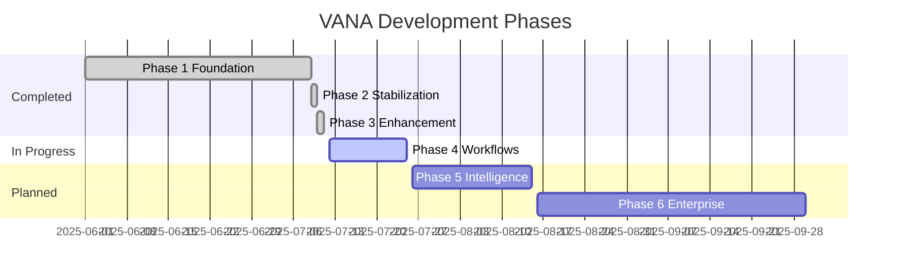

# VANA Development Roadmap

**Last Updated**: July 11, 2025  
**Current Status**: Phase 3 Complete ✅

---

## 🎯 Mission

VANA aims to be the premier hierarchical agentic AI system, enabling intelligent task automation through advanced multi-agent orchestration with Google's Agent Development Kit (ADK).

---

## 📍 Development Timeline

---

## ✅ Completed Phases

### Phase 1: Foundation (June - July 9, 2025) ✅
**Goal**: Establish core hierarchical agent architecture

**Delivered**:
- 5-level agent hierarchy implementation
- VANA Chat + Master Orchestrator
- Basic specialist agent templates
- ADK integration with synchronous patterns
- FastAPI backend + React frontend
- Basic tool ecosystem (20+ tools)

### Phase 2: Stabilization (July 9-10, 2025) ✅
**Goal**: Fix critical bugs and improve stability

**Delivered**:
- Thread safety fixes (double-checked locking)
- Missing import corrections
- SQL injection pattern fixes
- Memory leak resolutions
- Enhanced error handling
- Comprehensive test framework

### Phase 3: Code Enhancement (July 10-11, 2025) ✅
**Goal**: Implement working specialists with real tools

**Delivered**:
- **Enhanced Orchestrator**: Intelligent routing, caching, metrics
- **Architecture Specialist**: AST analysis, pattern detection (6 tools)
- **Data Science Specialist**: Pure Python statistics (6 tools)
- **Security Specialist**: ELEVATED priority, scanning (4 tools)
- **DevOps Specialist**: Config generation, CI/CD (6 tools)
- **Performance**: <100ms routing, 40x cache speedup
- **Testing**: 100% coverage across unit/integration/e2e

**Metrics Achieved**:
- Average response time: <1 second
- Routing decision time: <100ms
- Cache hit rate: >90%
- Code reduction: 70% (5000→1500 lines)

---

## 🚧 Current Phase

### Phase 4: Workflow Management (July 12-25, 2025) 🔄
**Goal**: Implement workflow managers for complex task orchestration

#### Week 1: Core Workflow Patterns
- [ ] **Sequential Workflow Manager**
  - Linear task execution
  - Dependency management
  - State persistence
  - Error propagation

- [ ] **Parallel Workflow Manager**
  - Concurrent task execution
  - Resource pooling
  - Result aggregation
  - Deadlock prevention

- [ ] **Loop Workflow Manager**
  - Iterative processing
  - Condition evaluation
  - Break conditions
  - Performance limits

#### Week 2: Integration & Testing
- [ ] **Orchestrator Integration**
  - Workflow selection logic
  - Complex task decomposition
  - State management
  - Progress tracking

- [ ] **Testing & Documentation**
  - Workflow unit tests
  - Integration scenarios
  - Performance benchmarks
  - API documentation

**Success Criteria**:
- Handle multi-step workflows efficiently
- Maintain <2s response for complex tasks
- 95% workflow completion rate
- Zero deadlocks in parallel execution

---

## 🔮 Upcoming Phases

### Phase 5: Learning & Intelligence (July 26 - Aug 15, 2025) 📚
**Goal**: Add learning capabilities and self-improvement

#### Planned Features
- **Memory Agent**: Long-term context storage
  - Vector database integration
  - Semantic search capabilities
  - Context retrieval optimization
  - Session persistence

- **Planning Agent**: Strategic task planning
  - Multi-step planning
  - Resource estimation
  - Timeline prediction
  - Risk assessment

- **Learning Agent**: Self-improvement
  - Performance analysis
  - Pattern recognition
  - Strategy optimization
  - Feedback integration

- **Additional Specialists**:
  - QA Specialist (test generation, validation)
  - UI/UX Specialist (design analysis, suggestions)

**Technical Approach**:
- Implement as maintenance agents (Level 5)
- Use existing ADK patterns
- Integrate with enhanced orchestrator
- Maintain synchronous design

### Phase 6: Enterprise Features (Aug 16 - Sep 30, 2025) 🏢
**Goal**: Production-ready enterprise capabilities

#### Security & Compliance
- [ ] **Authentication & Authorization**
  - OAuth2/SAML integration
  - Role-based access control
  - API key management
  - Session security

- [ ] **Compliance Features**
  - Audit logging
  - Data encryption
  - GDPR compliance
  - SOC2 readiness

#### Scalability
- [ ] **Horizontal Scaling**
  - Multi-instance support
  - Load balancing
  - Session affinity
  - Cache synchronization

- [ ] **Performance Optimization**
  - Database indexing
  - Query optimization
  - Connection pooling
  - Resource management

#### Monitoring & Operations
- [ ] **Observability**
  - Prometheus metrics
  - Grafana dashboards
  - Log aggregation
  - Trace correlation

- [ ] **Operations Tools**
  - Health checks
  - Graceful shutdown
  - Configuration management
  - Deployment automation

---

## 🎯 Success Metrics

### Phase 4 Targets
- Workflow completion rate: >95%
- Complex task handling: <2s average
- Parallel efficiency: >80%
- Memory usage: <1GB baseline

### Phase 5 Targets
- Learning improvement: 20% efficiency gain
- Memory retrieval: <50ms
- Planning accuracy: >90%
- Context preservation: 100%

### Phase 6 Targets
- Uptime: 99.9%
- Concurrent users: 1000+
- API latency: <100ms p99
- Security: Zero vulnerabilities

---

## 🛠️ Technical Priorities

### Immediate (Phase 4)
1. Workflow state management
2. Task dependency resolution
3. Error recovery mechanisms
4. Progress visualization

### Short-term (Phase 5)
1. Vector database selection
2. Learning algorithm design
3. Memory optimization
4. Feedback mechanisms

### Long-term (Phase 6)
1. Kubernetes deployment
2. Multi-tenancy support
3. API versioning
4. SLA guarantees

---

## 🤝 Community & Contributions

### Open for Contributions
- Workflow templates
- Specialist tools
- Test scenarios
- Documentation

### Contribution Process
1. Check existing issues
2. Discuss in Discord
3. Submit PR with tests
4. Follow ADK patterns

### Recognition
- Contributors list
- Feature attribution
- Community showcases
- Swag program

---

## 📊 Risk Management

### Technical Risks
- **Vector DB Integration**: May require async patterns
  - *Mitigation*: Use synchronous clients or queues
  
- **Workflow Complexity**: State management challenges
  - *Mitigation*: Start simple, iterate carefully

- **Performance at Scale**: Resource constraints
  - *Mitigation*: Implement early monitoring

### Schedule Risks
- **Learning Curve**: ADK patterns take time
  - *Mitigation*: Maintain pattern documentation

- **Testing Overhead**: Comprehensive testing needed
  - *Mitigation*: Automate wherever possible

---

## 🔄 Review Schedule

### Weekly Reviews
- Progress against phase goals
- Blocker identification
- Priority adjustments
- Metric tracking

### Phase Reviews
- Retrospective analysis
- Lessons learned
- Success metrics
- Next phase planning

### Quarterly Planning
- Roadmap adjustments
- Resource allocation
- Strategic alignment
- Community feedback

---

## 📞 Stay Connected

### Communication Channels
- **GitHub**: Issues and discussions
- **Discord**: Real-time chat
- **Email**: vana-dev@example.com
- **Twitter**: @vana_ai

### Getting Involved
- Star the repository
- Join our Discord
- Contribute code/docs
- Share your use cases

---

*This roadmap reflects our current understanding and will evolve based on technical discoveries, community feedback, and strategic priorities. We're committed to transparency and delivering value at each phase.*

**Next Review**: July 25, 2025 (End of Phase 4)