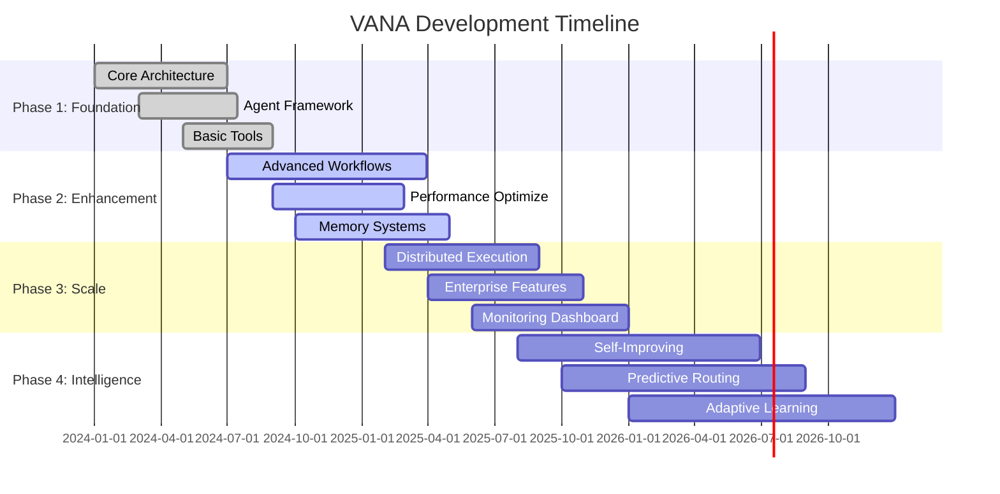
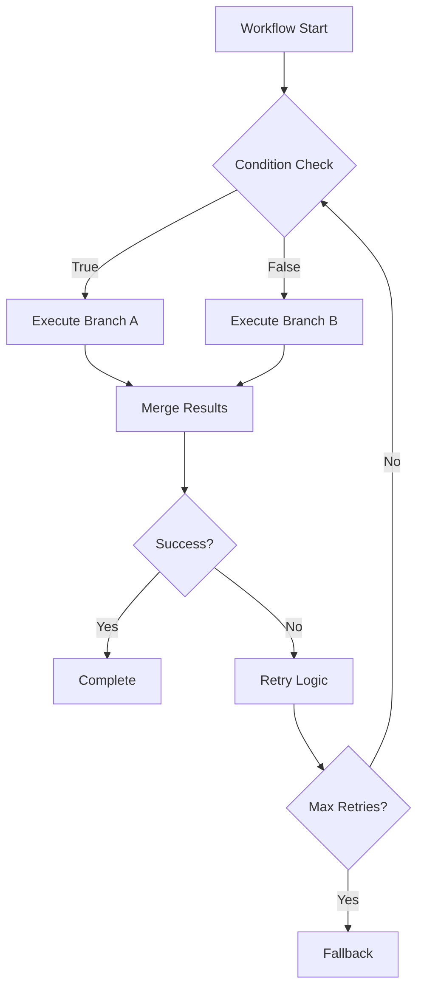

# VANA Development Roadmap

*Building the future of multi-agent AI orchestration*

## 🎯 Mission

VANA aims to be the premier platform for intelligent agent coordination, enabling seamless automation of complex tasks through advanced AI orchestration.

## 🗺️ Roadmap Overview

---

## 📍 Current Status (July 2025)

### ✅ Completed (Phase 1)

#### Core Architecture
- [x] Multi-agent orchestration system
- [x] Google ADK integration
- [x] FastAPI backend with async support
- [x] Session management and state handling
- [x] Comprehensive error handling

#### Agent Framework
- [x] VANA orchestrator agent
- [x] Code execution specialist
- [x] Data science specialist
- [x] Dynamic agent selection
- [x] Task analysis and routing

#### Tool Ecosystem
- [x] File operations (read, write, list)
- [x] Web search with fallback
- [x] Vector search capabilities
- [x] Memory storage and retrieval
- [x] System utilities and health checks

#### Security & Quality
- [x] Input validation and sanitization
- [x] Secure session management
- [x] Comprehensive testing framework
- [x] Code quality automation

---

## 🚧 Phase 2: Enhancement (Current Focus)

*Timeline: July 2024 - April 2025*

### Advanced Workflow Management

#### Workflow Templates
- [ ] **Pre-built Templates**: Common automation patterns
- [ ] **Custom Workflows**: User-defined multi-step processes
- [ ] **Conditional Logic**: Branch and loop support
- [ ] **Error Recovery**: Automatic retry and fallback mechanisms

#### Parallel Processing
- [ ] **Concurrent Execution**: Multiple agents working simultaneously
- [ ] **Resource Management**: Intelligent resource allocation
- [ ] **Dependency Resolution**: Smart task ordering
- [ ] **Load Balancing**: Distribute work efficiently

### Enhanced Memory Systems

#### Persistent Storage
- [ ] **Vector Database Integration**: Semantic search capabilities
- [ ] **Knowledge Graphs**: Relationship mapping
- [ ] **Context Preservation**: Long-term memory across sessions
- [ ] **Learning Integration**: Improve from interactions

#### Memory Optimization
- [ ] **Caching Strategies**: Intelligent data caching
- [ ] **Memory Compression**: Efficient storage
- [ ] **Retrieval Optimization**: Fast context access
- [ ] **Cleanup Automation**: Manage memory lifecycle

### Performance Optimization

#### Response Time Improvements
- [ ] **Async Optimization**: Better concurrency patterns
- [ ] **Connection Pooling**: Efficient resource usage
- [ ] **Caching Layer**: Reduce redundant operations
- [ ] **Stream Processing**: Real-time response streaming

#### Scalability Enhancements
- [ ] **Horizontal Scaling**: Multi-instance deployment
- [ ] **Database Optimization**: Query performance tuning
- [ ] **Resource Monitoring**: Usage analytics
- [ ] **Auto-scaling**: Dynamic capacity management

---

## 🏗️ Phase 3: Scale (Planned)

*Timeline: February 2025 - December 2025*

### Distributed Agent Execution

#### Multi-Node Architecture
- [ ] **Agent Distribution**: Agents across multiple nodes
- [ ] **Service Mesh**: Inter-agent communication
- [ ] **Fault Tolerance**: System resilience
- [ ] **Load Distribution**: Intelligent work sharing

#### Cloud Integration
- [ ] **Kubernetes Support**: Container orchestration
- [ ] **Cloud Provider APIs**: AWS, GCP, Azure integration
- [ ] **Auto-scaling Groups**: Dynamic resource management
- [ ] **Geographic Distribution**: Global deployment

### Enterprise Features

#### Security Enhancements
- [ ] **Enterprise SSO**: SAML, OAuth2 integration
- [ ] **Role-Based Access**: Granular permissions
- [ ] **Audit Logging**: Comprehensive activity tracking
- [ ] **Compliance Tools**: SOC2, GDPR compliance

#### Integration Capabilities
- [ ] **Enterprise APIs**: Salesforce, ServiceNow, etc.
- [ ] **Database Connectors**: SQL, NoSQL support
- [ ] **Message Queues**: Kafka, RabbitMQ integration
- [ ] **Webhook Support**: Event-driven automation

### Monitoring & Observability

#### Real-time Dashboard
- [ ] **Agent Performance**: Live metrics and status
- [ ] **Task Visualization**: Workflow progress tracking
- [ ] **Resource Usage**: System health monitoring
- [ ] **Error Analytics**: Failure pattern analysis

#### Analytics Platform
- [ ] **Usage Patterns**: Behavior analysis
- [ ] **Performance Trends**: Historical data insights
- [ ] **Predictive Analytics**: Capacity planning
- [ ] **Custom Reports**: Business intelligence

---

## 🔮 Phase 4: Intelligence (Future Vision)

*Timeline: August 2025 - December 2026*

### Self-Improving Agents

#### Adaptive Learning
- [ ] **Performance Analysis**: Agent effectiveness measurement
- [ ] **Strategy Optimization**: Auto-improve routing decisions
- [ ] **Tool Enhancement**: Dynamic capability expansion
- [ ] **Error Pattern Learning**: Prevent recurring issues

#### Autonomous Evolution
- [ ] **Code Generation**: Agents write new tools
- [ ] **Agent Specialization**: Automatic role optimization
- [ ] **Workflow Discovery**: Pattern-based automation
- [ ] **Self-Healing**: Automatic error resolution

### Advanced Intelligence Features

#### Predictive Capabilities
- [ ] **Task Prediction**: Anticipate user needs
- [ ] **Resource Forecasting**: Predict capacity requirements
- [ ] **Failure Prevention**: Proactive issue resolution
- [ ] **Optimization Suggestions**: Performance recommendations

#### Natural Language Processing
- [ ] **Intent Understanding**: Better task interpretation
- [ ] **Context Awareness**: Understand implicit requirements
- [ ] **Conversational Flow**: Multi-turn interactions
- [ ] **Explanation Generation**: Transparent decision-making

---

## 🎯 Success Metrics

### Phase 2 Targets
- **Response Time**: < 2 seconds average
- **Uptime**: 99.9% availability
- **Task Success Rate**: > 95%
- **User Satisfaction**: > 4.5/5 rating

### Phase 3 Targets
- **Concurrent Users**: 10,000+
- **Tasks per Second**: 1,000+
- **Global Latency**: < 100ms
- **Enterprise Adoption**: 100+ companies

### Phase 4 Targets
- **Autonomous Tasks**: 80% fully automated
- **Learning Efficiency**: 50% improvement in accuracy
- **Innovation Rate**: 10+ new capabilities per month
- **Community Growth**: 10,000+ active developers

---

## 🤝 Community Involvement

### Open Source Contributions
- [ ] **Plugin Architecture**: Third-party agent development
- [ ] **Tool Marketplace**: Community-contributed tools
- [ ] **Template Library**: Shared workflow templates
- [ ] **Documentation Wiki**: Community-maintained docs

### Developer Ecosystem
- [ ] **SDK Development**: Multiple programming languages
- [ ] **Integration Examples**: Real-world use cases
- [ ] **Training Programs**: Developer education
- [ ] **Certification**: Professional credentials

---

## 🔄 Feedback Loop

### Continuous Improvement
1. **User Feedback Collection**: Regular surveys and interviews
2. **Performance Monitoring**: Real-time system metrics
3. **Feature Usage Analysis**: Data-driven prioritization
4. **Community Input**: Public roadmap discussions

### Agile Adaptation
- **Quarterly Reviews**: Roadmap adjustments
- **Sprint Planning**: Feature prioritization
- **Beta Testing**: Early user feedback
- **Iterative Development**: Continuous delivery

---

## 📞 Get Involved

### How to Contribute
- **Feature Requests**: Share your ideas
- **Beta Testing**: Help test new features
- **Documentation**: Improve user guides
- **Code Contributions**: Implement features

### Stay Updated
- **GitHub Issues**: Track development progress
- **Discord Community**: Real-time discussions
- **Newsletter**: Monthly updates
- **Developer Blog**: Technical deep dives

---

*This roadmap is a living document that evolves based on user needs, technological advances, and community feedback. We're committed to transparency and collaboration in building the future of AI orchestration.*

**Last Updated**: July 10, 2025
**Next Review**: October 2025