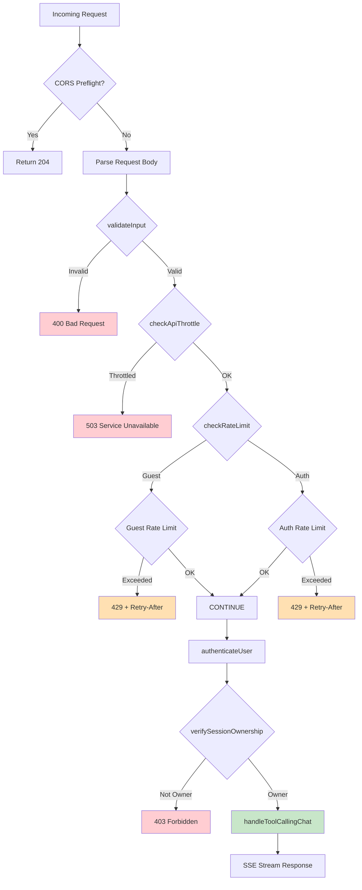
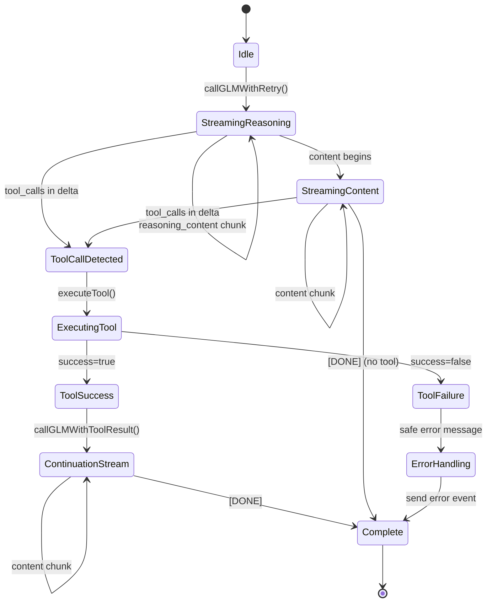
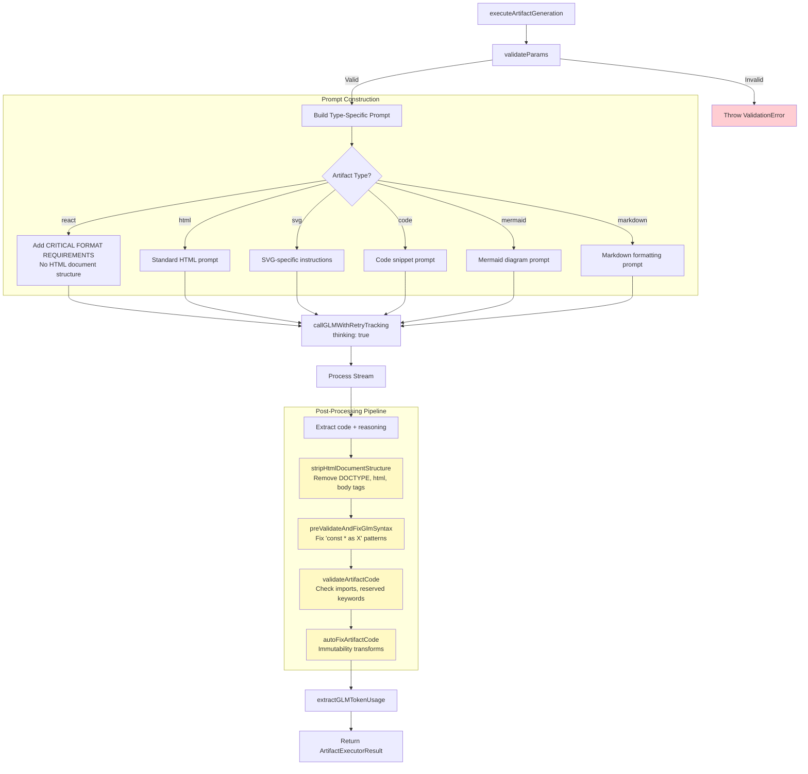
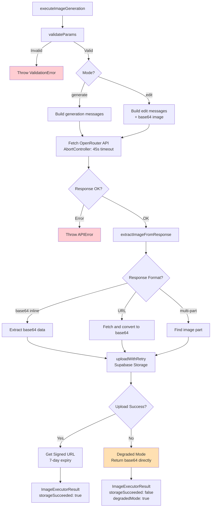
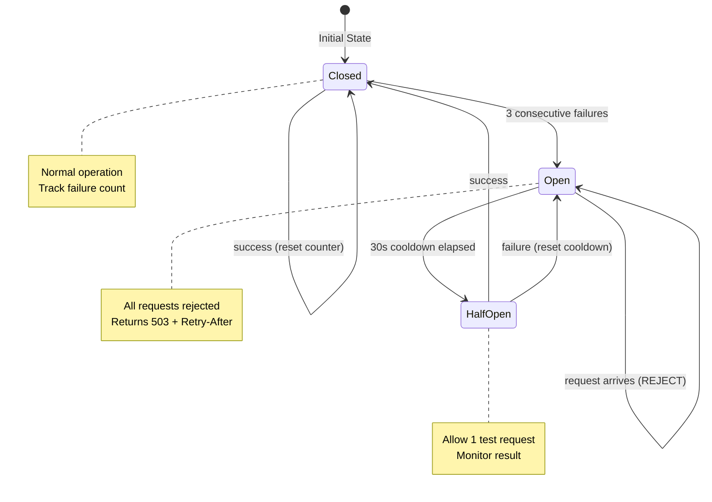
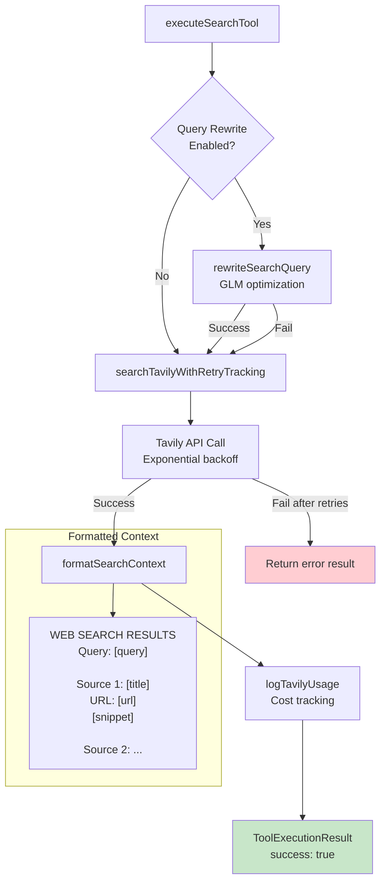
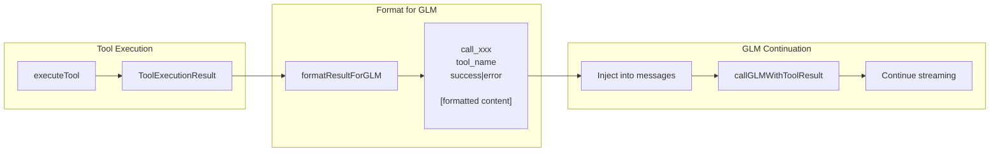
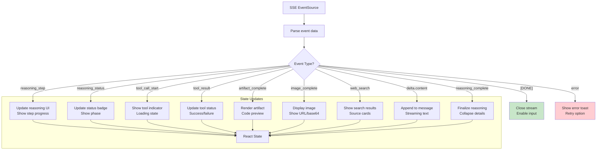
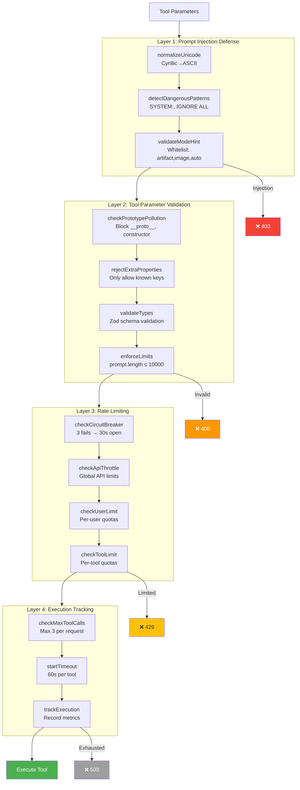
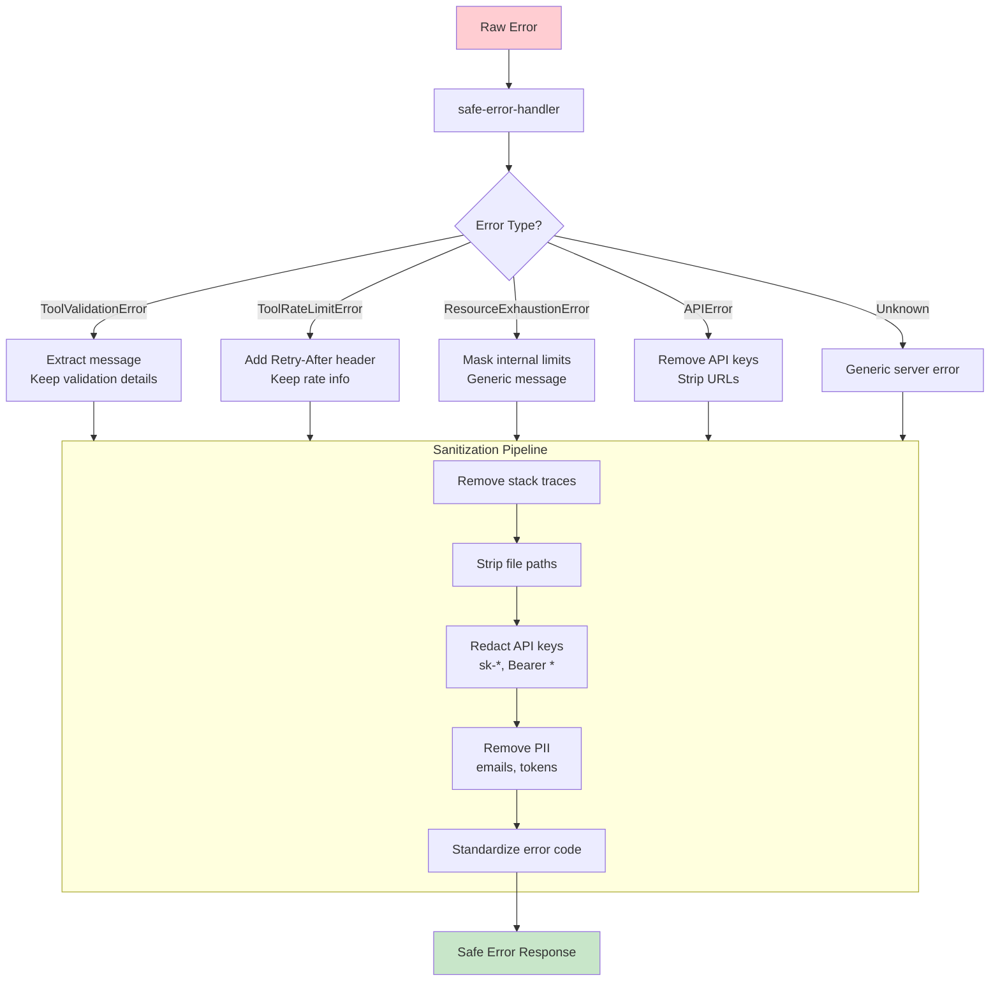

# Tool System Deep Dive

> Detailed diagrams for specific subsystems of the unified tool architecture.

---

## 1. Chat Function Entry Point (Middleware Pipeline)

---

## 2. GLM Native Tool Calling Flow

---

## 3. Artifact Executor Pipeline

---

## 4. Image Executor Pipeline

---

## 5. Tool Rate Limiter Circuit Breaker

---

## 6. Search Tool Flow

---

## 7. Tool Result Injection Format

---

## 8. Frontend SSE Event Handling

---

## 9. Validation Layers Deep Dive

---

## 10. Error Sanitization Flow

---

*Deep dive diagrams for the unified tool architecture*
