```mermaid
gantt
    title PR Timeline
    dateFormat HH:mm
    section Day 1
    PR#1 CSS/Fonts       :crit, pr1, 09:00, 2h
    Review/Merge PR#1    :crit, 11:00, 1h
    PR#2 Colors          :pr2, 13:00, 4h
    
    section Day 2
    Review/Merge PR#2    :09:00, 2h
    PR#3 Layout          :pr3, 11:00, 3h
    PR#4 Single Column   :pr4, 11:00, 2h
    Review PR#3/4        :15:00, 2h
    
    section Day 3
    Merge PR#3/4         :09:00, 1h
    PR#5 Input Area      :pr5, 10:00, 2h
    PR#6 Navigation      :pr6, 13:00, 3h
    Final Review         :16:00, 2h
```

# 🎯 VANA UI FIX MASTER PLAN - CHATGPT/GEMINI ALIGNMENT

## Executive Summary
This document provides a complete, unambiguous plan to fix Vana's UI issues and align with ChatGPT/Gemini specifications. Created by swarm specialist analysis on 2025-08-30.

**Critical Issue**: CSS/Font imports are commented out, breaking the entire styling system.

**Approach**: 6 incremental PRs, each <400 LOC for optimal CodeRabbit review.

---

## 🔴 PR #1: [CRITICAL] Restore CSS and Font System
**Priority**: URGENT - Fixes 90% of visual issues  
**Size**: ~10 LOC  
**Timeline**: Day 1 Morning

### Files to Modify

#### `frontend/src/app/layout.tsx`
```typescript
// Line 2 - UNCOMMENT:
import { Inter } from "next/font/google";

// Line 3 - UNCOMMENT:
import "./globals.css";

// Lines 4-8 - ADD after imports:
const inter = Inter({ 
  subsets: ['latin'],
  display: 'swap',
  variable: '--font-inter',
  preload: true
});

// Line 64 - CHANGE:
// FROM:
<body className="font-sans antialiased bg-background text-foreground" suppressHydrationWarning>

// TO:
<body className={`${inter.variable} font-sans antialiased bg-background text-foreground`} suppressHydrationWarning>
```

### Commands to Execute
```bash
# Navigate to frontend
cd frontend

# Verify changes work
npm run dev
# Check localhost:3000 - styling should be restored

# Run quality checks
npm run build
npm run lint
npm run typecheck

# Create PR
git checkout -b fix/restore-css-imports
git add src/app/layout.tsx
git commit -m "fix: restore CSS and font imports for styling system" \
  -m "Uncomment globals.css import to restore CSS variables
Uncomment and configure Inter font import
Add font variable to body className
Fix broken styling across entire application

Resolves: Broken UI styling"
# Push and create PR
git push origin fix/restore-css-imports
gh pr create \
  --title "🔴 [CRITICAL] Fix: Restore CSS and font imports" \
  --body "## Problem
CSS and font imports were commented out for CSP testing, breaking all styling.

## Solution
- Restored globals.css import
- Restored Inter font with proper configuration
- Applied font variable to body element

## Testing
- [x] Build passes
- [x] No lint errors
- [x] Visual styling restored
- [x] Font loading works
- [x] CSP compliant

## Screenshots
Before: [Broken styling]
After: [Restored styling]

## Review Focus
- CSP compliance
- Font loading performance
- CSS variable availability"
```

### CodeRabbit Review Points
- ✅ CSP headers compatibility
- ✅ Font preloading performance
- ✅ No inline styles without nonce
- ✅ Proper font fallback chain

### Rollback Plan
```bash
git checkout main
git pull origin main
git revert <commit-hash>
git push origin main
```

### Success Metrics
- [ ] All CSS variables available in DevTools
- [ ] Inter font loads successfully
- [ ] Dark theme colors applied correctly
- [ ] No console errors about missing styles

---

## 🟠 PR #2: Replace Hardcoded Colors with CSS Variables
**Priority**: HIGH  
**Size**: ~350 LOC across 15 files  
**Timeline**: Day 1 Afternoon - Day 2 Morning

### Files to Modify

#### Color Replacement Map
```
REPLACE ALL INSTANCES:
bg-[#131314] → bg-background
bg-[#1F1F20] → bg-card  
bg-[#2A2B2C] → bg-secondary
bg-[#3C3C3C] → bg-muted
border-[#3C3C3C] → border-border
border-[#4A4A4A] → border-border/60
text-gray-400 → text-muted-foreground
text-gray-300 → text-foreground/80
bg-gray-800 → bg-muted
bg-gray-700 → bg-muted/80
border-gray-800 → border-border
border-gray-700 → border-border/80
```

#### Affected Files (15 total)
1. `frontend/src/app/page.tsx` - Lines: 99, 101, 155, 156, 190, 245
2. `frontend/src/app/chat/page.tsx` - Lines: 102, 104, 105, 114, 122
3. `frontend/src/components/layout/app-layout.tsx` - Lines: 93, 318, 329, 349, 372, 374
4. `frontend/src/components/chat/chat-interface.tsx` - Lines: 630, 700, 702
5. `frontend/src/components/chat/message-input.tsx` - All color instances
6. `frontend/src/components/canvas/canvas-container.tsx` - Background colors
7. `frontend/src/components/canvas/canvas-editor.tsx` - Editor background
8. `frontend/src/components/canvas/canvas-toolbar.tsx` - Toolbar styling
9. `frontend/src/components/agents/agent-task-deck.tsx` - Card backgrounds
10. `frontend/src/components/auth/auth-guard.tsx` - Loading states
11. `frontend/src/components/home/` - All components
12. `frontend/src/components/layout/index.ts` - Export statements
13. `frontend/src/app/auth/login/page.tsx` - If exists
14. `frontend/src/app/auth/register/page.tsx` - If exists
15. `frontend/src/app/auth/callback/page.tsx` - If exists

### Commands to Execute
```bash
# Create branch
git checkout -b refactor/css-variables

# Use sed to replace colors (macOS)
find frontend/src \( -name "*.tsx" -o -name "*.ts" \) -type f -print0 | \
  xargs -0 sed -i.bak \
    -e 's/bg-\[#131314\]/bg-background/g' \
    -e 's/bg-\[#1F1F20\]/bg-card/g' \
    -e 's/bg-\[#2A2B2C\]/bg-secondary/g' \
    -e 's/bg-\[#3C3C3C\]/bg-muted/g' \
    -e 's/border-\[#3C3C3C\]/border-border/g'
# Linux note: GNU sed also supports -i.bak; remove *.bak after verifying.

# Verify changes
npm run dev
npm run lint

# Commit
git add -A
git commit -m "refactor: replace hardcoded colors with CSS variables

- Replace all hardcoded hex colors with semantic CSS variables
- Enables proper theme switching
- Improves maintainability
- Consistent with design system

Affected: 15 component files"

# Create PR
git push origin refactor/css-variables
gh pr create \
  --title "🎨 Refactor: Standardize color system with CSS variables" \
  --body "## Changes
Replaced all hardcoded colors with CSS variables across 15 files.

## Benefits
- Theme switching now works
- Consistent color system
- Better maintainability
- Follows design system

## Testing
- [x] All colors render correctly
- [x] Dark/light theme switching works
- [x] No visual regressions
- [x] Build passes"
```

### CodeRabbit Review Points
- ✅ No remaining hardcoded colors
- ✅ Proper CSS variable usage
- ✅ Theme switching functionality
- ✅ Color contrast accessibility

---

## 🟡 PR #3: Simplify Layout Architecture
**Priority**: MEDIUM-HIGH  
**Size**: ~200 LOC  
**Timeline**: Day 2 Afternoon

### Files to Modify

#### `frontend/src/app/chat/page.tsx`
```typescript
// Line 1-10 - ADD at top:
import { usePathname } from 'next/navigation';
import { Fragment } from 'react';

// Line 18 - MODIFY component:
function ChatPageContent() {
  const pathname = usePathname();
  
  // Conditional layout based on route
  const shouldShowSidebar = pathname !== '/chat' && pathname !== '/';
  
  // Line 93 - REPLACE AppLayout wrapper:
  // FROM:
  return (
    <AuthGuard requireAuth={true}>
      <AppLayout sessions={sessions} ...>
        {/* content */}
      </AppLayout>
    </AuthGuard>
  );
  
  // TO:
  const content = (
    <div className="flex flex-col h-full bg-background">
      {/* Existing chat interface content */}
    </div>
  );
  
  return (
    <AuthGuard requireAuth={true}>
      {shouldShowSidebar ? (
        <AppLayout sessions={sessions} ...>
          {content}
        </AppLayout>
      ) : (
        content
      )}
    </AuthGuard>
  );
}
```

#### `frontend/src/store/ui-store.ts`
```typescript
// Line 64 - CHANGE default state:
// FROM:
sidebarOpen: true,

// TO:
sidebarOpen: false,
```

### Commands to Execute
```bash
git checkout -b fix/layout-architecture
git add src/app/chat/page.tsx src/store/ui-store.ts
git commit -m "fix: remove unwanted sidebar from chat interface

- Conditional layout rendering based on route
- Default sidebar to closed state
- Clean single-column chat view
- Maintains sidebar for other routes

Fixes: Unwanted sidebar in chat view"

git push origin fix/layout-architecture
gh pr create \
  --title "🏗️ Fix: Simplify layout architecture for chat view" \
  --body "## Problem
Chat page shows unwanted sidebar, not matching ChatGPT/Gemini patterns.

## Solution
- Conditional layout based on route
- Chat page gets clean layout
- Other pages keep navigation

## Testing
- [x] No sidebar on /chat
- [x] Sidebar available on other routes
- [x] Clean single-column layout
- [x] No layout shift issues"
```

---

## 🟢 PR #4: Default to Single-Column Chat View
**Priority**: MEDIUM  
**Size**: ~100 LOC  
**Timeline**: Day 2 Afternoon (parallel with PR #3)

### Files to Modify

#### `frontend/src/app/chat/page.tsx`
```typescript
// Line 22 - CHANGE default view:
// FROM:
const [selectedView, setSelectedView] = useState<'chat' | 'canvas' | 'split'>('split');

// TO:
const [selectedView, setSelectedView] = useState<'chat' | 'canvas' | 'split'>('chat');

// Lines 145-183 - SIMPLIFY view rendering:
// FROM: Complex split view logic
// TO:
{selectedView === 'chat' && (
  <div className="flex-1">
    <ChatInterface className="h-full" {...(initialPrompt && { initialMessage: initialPrompt })} />
  </div>
)}

{selectedView === 'canvas' && (
  <div className="flex-1">
    <CanvasContainer className="h-full" />
  </div>
)}

{selectedView === 'split' && (
  <div className="flex-1 flex">
    <div className="w-1/2 border-r border-border">
      <ChatInterface className="h-full" />
    </div>
    <div className="w-1/2">
      <CanvasContainer className="h-full" />
    </div>
  </div>
)}

// Line 52-90 - SIMPLIFY ViewToggle to icon-only:
const ViewToggle = () => (
  <div className="flex items-center gap-1">
    <Button
      variant={selectedView === 'chat' ? 'default' : 'ghost'}
      size="icon"
      onClick={() => setSelectedView('chat')}
      aria-label="Chat view"
    >
      <MessageSquare className="w-4 h-4" />
    </Button>
    <Button
      variant={selectedView === 'canvas' ? 'default' : 'ghost'}
      size="icon"
      onClick={() => setSelectedView('canvas')}
      aria-label="Canvas view"
    >
      <Code2 className="w-4 h-4" />
    </Button>
  </div>
);
```

### Commands to Execute
```bash
git checkout -b fix/single-column-default
git add src/app/chat/page.tsx
git commit -m "fix: default to single-column chat view

- Change default view from split to chat
- Simplify view switching logic
- Icon-only view toggle
- Matches ChatGPT/Gemini patterns

Improves: User experience and simplicity"

git push origin fix/single-column-default
gh pr create \
  --title "📱 Fix: Default to single-column chat view" \
  --body "## Changes
Default to clean single-column chat instead of split view.

## Benefits
- Matches ChatGPT/Gemini UX
- Cleaner initial experience
- Better mobile experience
- Reduces cognitive load

## Testing
- [x] Defaults to chat view
- [x] View switching works
- [x] No unnecessary canvas rendering
- [x] Responsive on mobile"
```

---

## 🔵 PR #5: Implement ChatGPT-Style Input Area
**Priority**: LOW-MEDIUM  
**Size**: ~150 LOC  
**Timeline**: Day 3 Morning

### Files to Modify

#### `frontend/src/components/chat/message-input.tsx`
```typescript
// Complete rewrite for ChatGPT-style input
import React, { useState, useRef, KeyboardEvent } from 'react';
import { Button } from '@/components/ui/button';
import { Textarea } from '@/components/ui/textarea';
import { Send, Paperclip, Mic } from 'lucide-react';
import { cn } from '@/lib/utils';

interface MessageInputProps {
  onSendMessage: (content: string, files?: File[]) => void;
  disabled?: boolean;
  placeholder?: string;
  className?: string;
}

export function MessageInput({ 
  onSendMessage, 
  disabled, 
  placeholder = "Message Vana...",
  className 
}: MessageInputProps) {
  const [message, setMessage] = useState('');
  const textareaRef = useRef<HTMLTextAreaElement>(null);

  const handleSend = () => {
    if (message.trim() && !disabled) {
      onSendMessage(message.trim());
      setMessage('');
      textareaRef.current?.focus();
    }
  };

  const handleKeyPress = (e: KeyboardEvent<HTMLTextAreaElement>) => {
    if (e.key === 'Enter' && !e.shiftKey) {
      e.preventDefault();
      handleSend();
    }
  };

  return (
    <div className={cn("relative", className)}>
      <div className="bg-background rounded-3xl border border-border shadow-sm">
        <div className="flex items-end gap-2 p-3">
          <Button
            variant="ghost"
            size="icon"
            className="shrink-0 text-muted-foreground hover:text-foreground"
            disabled={disabled}
          >
            <Paperclip className="w-5 h-5" />
          </Button>

          <Textarea
            ref={textareaRef}
            value={message}
            onChange={(e) => setMessage(e.target.value)}
            onKeyDown={handleKeyPress}
            placeholder={placeholder}
            disabled={disabled}
            className="min-h-[44px] max-h-[200px] resize-none border-0 bg-transparent p-0 text-base focus-visible:ring-0 focus-visible:ring-offset-0"
            rows={1}
          />

          <div className="flex items-center gap-1 shrink-0">
            <Button
              variant="ghost"
              size="icon"
              className="text-muted-foreground hover:text-foreground"
              disabled={disabled}
            >
              <Mic className="w-5 h-5" />
            </Button>

            <Button
              onClick={handleSend}
              disabled={!message.trim() || disabled}
              size="icon"
              className={cn(
                "rounded-full transition-all",
                message.trim() 
                  ? "bg-foreground text-background hover:bg-foreground/90" 
                  : "bg-muted text-muted-foreground"
              )}
            >
              <Send className="w-4 h-4" />
            </Button>
          </div>
        </div>
      </div>

      <div className="text-xs text-muted-foreground text-center mt-2">
        Vana can make mistakes. Check important info.
      </div>
    </div>
  );
}
```

#### `frontend/src/components/chat/chat-interface.tsx`
```typescript
// Line 955-975 - UPDATE input area styling:
// FROM:
<motion.footer 
  initial={{ y: 20, opacity: 0 }}
  animate={{ y: 0, opacity: 1 }}
  className="border-t border-border/50 bg-card/30 backdrop-blur-sm"
>
  <div className="max-w-4xl mx-auto px-4 py-3">

// TO:
<div className="fixed bottom-0 left-0 right-0 p-4 bg-gradient-to-t from-background via-background/95 to-transparent">
  <div className="max-w-3xl mx-auto">
    <MessageInput
      onSendMessage={handleSendMessage}
      disabled={!isConnected || isStreaming}
      placeholder={
        !isConnected 
          ? 'Connecting...'
          : isStreaming
          ? 'Vana is thinking...'
          : 'Message Vana...'
      }
    />
  </div>
</div>
```

### Commands to Execute
```bash
git checkout -b feat/chatgpt-input
git add src/components/chat/message-input.tsx src/components/chat/chat-interface.tsx
git commit -m "feat: implement ChatGPT-style input area

- Fixed bottom positioning
- Rounded input with 24px radius
- Clean minimal design
- Gradient background fade
- Proper disabled states

Matches: ChatGPT input patterns"

git push origin feat/chatgpt-input
gh pr create \
  --title "✨ Feature: ChatGPT-style input area" \
  --body "## Implementation
Redesigned input area to match ChatGPT patterns.

## Features
- Fixed bottom positioning
- Rounded 24px corners
- Minimal icon buttons
- Gradient fade background
- Responsive sizing

## Testing
- [x] Input resizes properly
- [x] Send on Enter works
- [x] File upload button present
- [x] Voice input button present
- [x] Disabled states work"
```

---

## 🟣 PR #6: Clean Navigation Pattern
**Priority**: LOW  
**Size**: ~250 LOC  
**Timeline**: Day 3 Afternoon

### Files to Modify

#### `frontend/src/components/layout/app-layout.tsx`
```typescript
// Convert sidebar to modal/sheet pattern
// Lines 290-425 - REPLACE entire AppLayout with:

export const AppLayout: React.FC<AppLayoutProps> = ({
  children,
  sessions = [],
  currentSession,
  onSelectSession,
  onNewChat,
  onDeleteSession,
  onArchiveSession,
  className
}) => {
  const [isHistoryOpen, setIsHistoryOpen] = useState(false);

  // Keyboard shortcut for history
  useEffect(() => {
    const handleKeyDown = (e: KeyboardEvent) => {
      if ((e.metaKey || e.ctrlKey) && e.key === 'k') {
        e.preventDefault();
        setIsHistoryOpen(true);
      }
    };
    
    window.addEventListener('keydown', handleKeyDown);
    return () => window.removeEventListener('keydown', handleKeyDown);
  }, []);

  return (
    <div className={cn("flex flex-col h-screen bg-background", className)}>
      {/* Minimal Header */}
      <header className="flex items-center justify-between px-4 py-3 border-b border-border">
        <div className="flex items-center gap-3">
          <Button
            variant="ghost"
            size="icon"
            onClick={() => setIsHistoryOpen(true)}
            className="md:hidden"
          >
            <Menu className="w-5 h-5" />
          </Button>
          
          <div className="flex items-center gap-2">
            <div className="w-8 h-8 rounded-full bg-gradient-to-r from-blue-500 to-purple-600 flex items-center justify-center">
              <span className="text-white text-sm font-bold">V</span>
            </div>
            <span className="font-semibold hidden sm:inline">Vana</span>
          </div>
        </div>

        <div className="flex items-center gap-2">
          <Button
            variant="ghost"
            size="sm"
            onClick={() => setIsHistoryOpen(true)}
            className="hidden md:flex"
          >
            <History className="w-4 h-4 mr-2" />
            History
            <kbd className="ml-2 text-xs bg-muted px-1 rounded">⌘K</kbd>
          </Button>
          
          <UserProfileDropdown />
        </div>
      </header>

      {/* Main Content */}
      <main className="flex-1 overflow-hidden">
        {children}
      </main>

      {/* History Modal/Sheet */}
      <Sheet open={isHistoryOpen} onOpenChange={setIsHistoryOpen}>
        <SheetContent side="left" className="w-[320px] p-0">
          <SheetHeader className="sr-only">
            <SheetTitle>Chat History</SheetTitle>
            <SheetDescription>Your previous conversations</SheetDescription>
          </SheetHeader>
          
          <SidebarContent
            sessions={sessions}
            currentSession={currentSession}
            onSelectSession={(session) => {
              onSelectSession?.(session);
              setIsHistoryOpen(false);
            }}
            onNewChat={() => {
              onNewChat?.();
              setIsHistoryOpen(false);
            }}
            onDeleteSession={onDeleteSession}
            onArchiveSession={onArchiveSession}
          />
        </SheetContent>
      </Sheet>
    </div>
  );
};
```

### Commands to Execute
```bash
git checkout -b feat/clean-navigation
git add src/components/layout/app-layout.tsx
git commit -m "feat: implement clean navigation pattern

- Remove persistent sidebar
- Add history modal/sheet
- Keyboard shortcut (Cmd+K)
- Minimal header design
- Mobile-friendly navigation

Matches: ChatGPT/Gemini navigation"

git push origin feat/clean-navigation
gh pr create \
  --title "🧭 Feature: Clean navigation pattern" \
  --body "## Changes
Replaced persistent sidebar with modal pattern.

## Features
- History in modal/sheet
- Keyboard shortcut Cmd+K
- Minimal header
- Mobile responsive
- Clean UX

## Testing
- [x] Cmd+K opens history
- [x] Mobile menu works
- [x] Session selection works
- [x] No persistent sidebar
- [x] Clean layout"
```

---

## 📊 Timeline & Dependencies



## ✅ Success Metrics

### Overall Success Criteria
- [ ] UI matches ChatGPT/Gemini patterns
- [ ] All tests pass (unit, integration, E2E)
- [ ] Lighthouse score >90 for performance
- [ ] Zero console errors
- [ ] CodeRabbit approval on all PRs
- [ ] No visual regressions

### Per-PR Verification
Each PR must pass:
```bash
npm run build        # No errors
npm run test         # All pass
npm run lint         # No violations
npm run typecheck    # No type errors
```

### Visual Verification Checklist
- [ ] Dark theme renders correctly
- [ ] Colors from CSS variables only
- [ ] Single-column chat layout
- [ ] No unwanted sidebar
- [ ] ChatGPT-style input area
- [ ] Clean minimal navigation
- [ ] Mobile responsive design
- [ ] Smooth animations/transitions

## 🚨 Emergency Rollback Procedures

### For Any PR
```bash
# Identify problematic commit
git log --oneline -10

# Revert specific commit
git revert <commit-hash>

# Or reset to previous state
git reset --hard origin/main

# Force push if needed (coordinate with team)
git push --force-with-lease origin <branch>
```

### Production Hotfix
```bash
# If PR causes production issues
git checkout main
git pull origin main
git revert <merge-commit-hash>
git push origin main

# Deploy revert immediately
npm run deploy:emergency
```

## 📝 CodeRabbit Configuration

Add to `.coderabbit.yml` for these PRs:
```yaml
reviews:
  path_specific_instructions:
    - path: "frontend/src/**"
      instructions: |
        - Verify CSS variables usage (no hardcoded colors)
        - Check for proper TypeScript types
        - Ensure React best practices
        - Validate accessibility (ARIA labels, contrast)
        - Confirm mobile responsiveness
        
  pr_specific_focus:
    - pattern: "fix/restore-css"
      focus: ["CSP compliance", "font loading", "performance"]
    - pattern: "refactor/css-variables"
      focus: ["color consistency", "theme switching"]
    - pattern: "fix/layout"
      focus: ["conditional rendering", "route handling"]
```

## 📞 Escalation Path

1. **Build Failures**: Check CI logs, rollback if needed
2. **Visual Regressions**: Compare screenshots, revert CSS changes
3. **Performance Issues**: Profile with DevTools, optimize bundles
4. **CodeRabbit Blocks**: Address feedback, update PR description
5. **Merge Conflicts**: Rebase carefully, test thoroughly

---

**Document Created**: 2025-08-30  
**Status**: Ready for Implementation  
**First Action**: Execute PR #1 immediately (CRITICAL)

This plan provides complete, unambiguous instructions for fixing all UI issues. Start with PR #1 as it's blocking all other visual improvements.