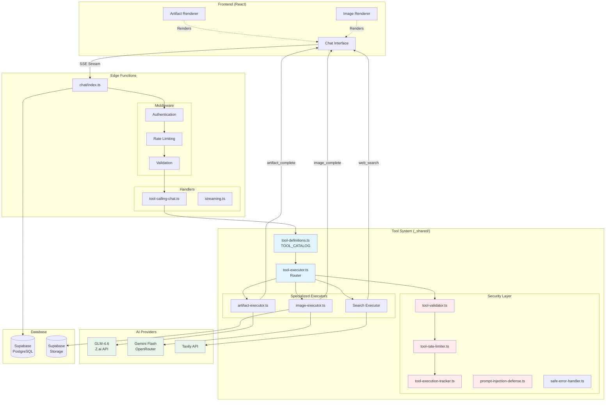
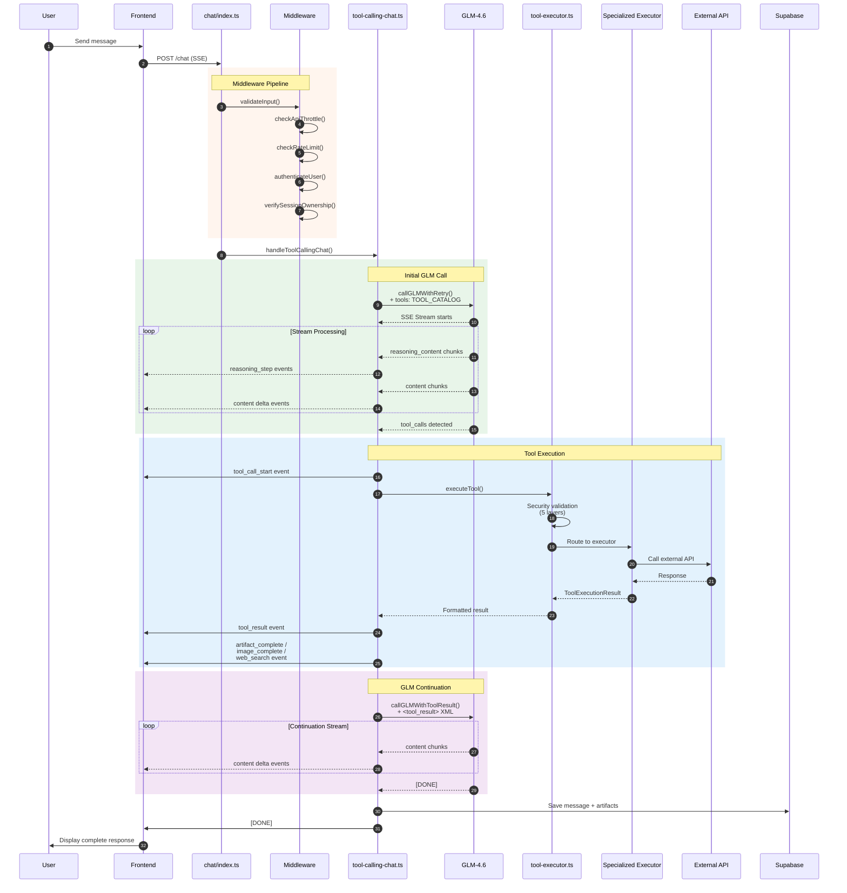
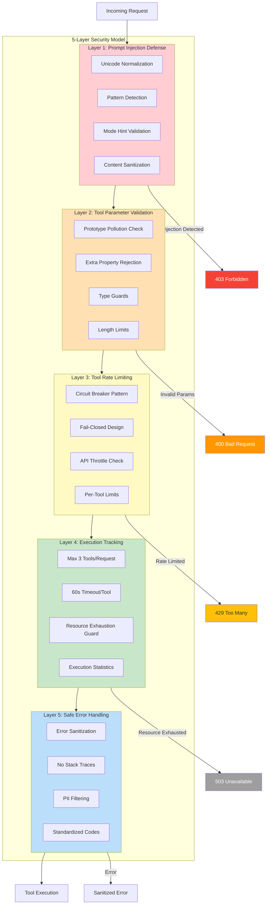
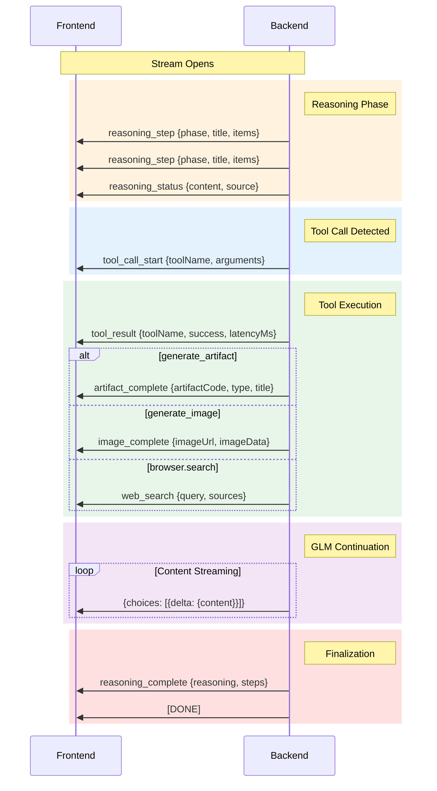
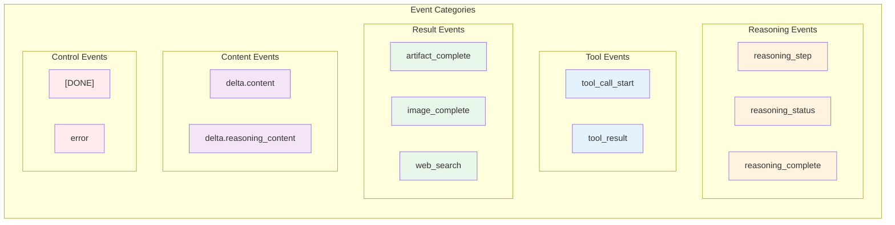
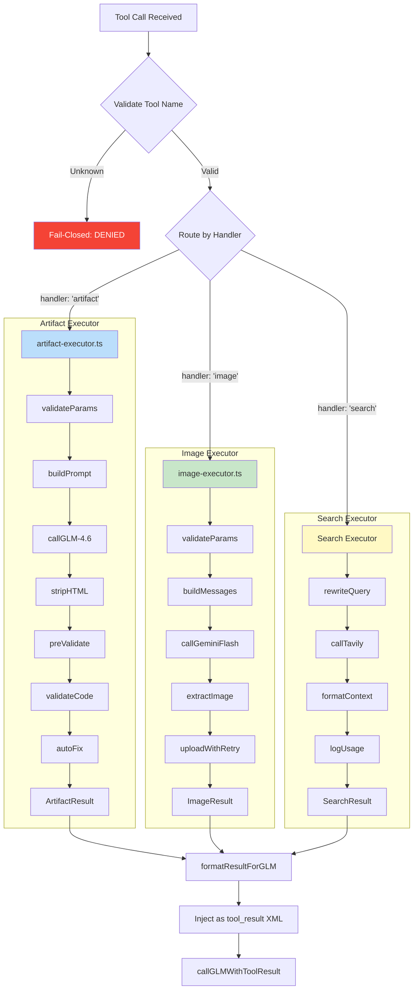
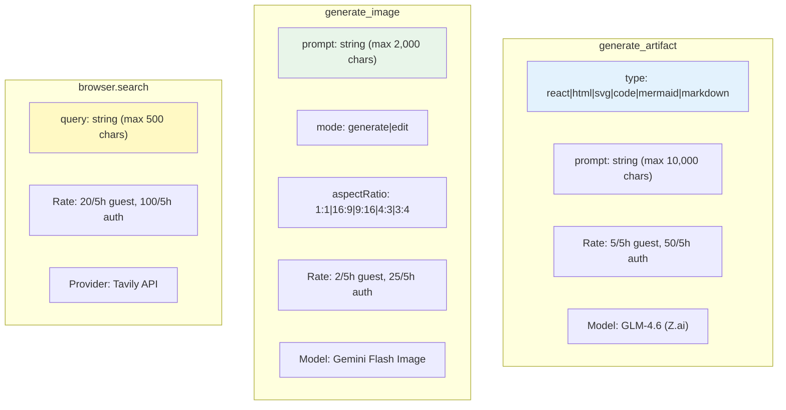
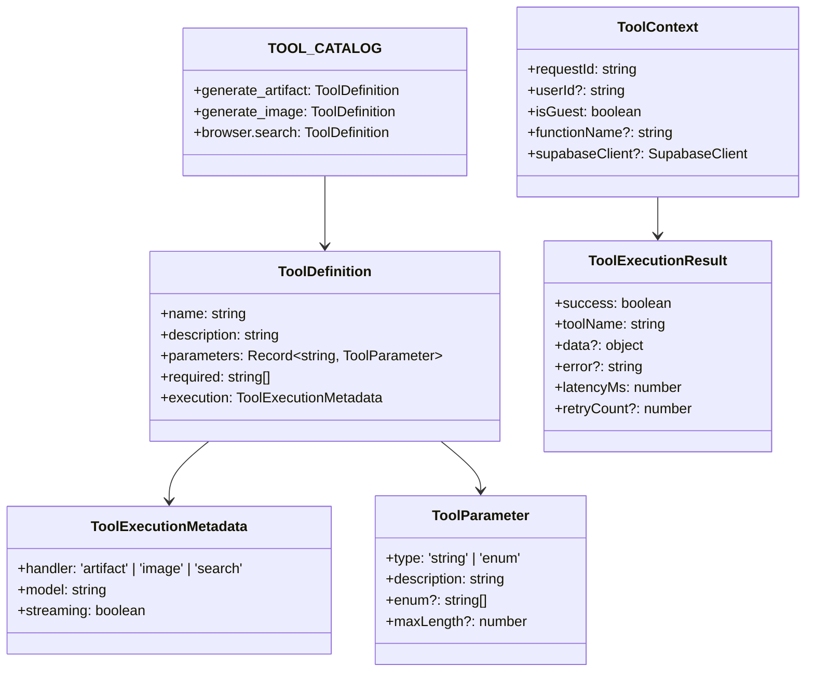

# Unified Tool-Calling Architecture (Issue #340)

> **Last Updated**: 2025-12-19
> **Status**: Production
> **Version**: Phase 0 Complete

This document provides visual documentation of the unified chat + tool system architecture implemented in Issue #340.

---

## Table of Contents

1. [High-Level Architecture](#1-high-level-architecture)
2. [Complete Data Flow](#2-complete-data-flow)
3. [Security Infrastructure](#3-security-infrastructure)
4. [SSE Event Flow](#4-sse-event-flow)
5. [Tool Executor Routing](#5-tool-executor-routing)
6. [Tool Catalog & Definitions](#6-tool-catalog--definitions)

---

## 1. High-Level Architecture



---

## 2. Complete Data Flow



---

## 3. Security Infrastructure



### Security Validation Order

```mermaid
flowchart LR
    subgraph "prompt-injection-defense.ts"
        A1[normalizeUnicode] --> A2[detectDangerousPatterns]
        A2 --> A3[validateModeHint]
        A3 --> A4[sanitizeContent]
    end

    subgraph "tool-validator.ts"
        B1[checkPrototypePollution] --> B2[validateExtraProperties]
        B2 --> B3[validateFieldTypes]
        B3 --> B4[enforeLengthLimits]
        B4 --> B5[freezeObject]
    end

    subgraph "tool-rate-limiter.ts"
        C1[checkCircuitBreaker] --> C2[checkApiThrottle]
        C2 --> C3[checkUserLimit]
        C3 --> C4[checkToolLimit]
    end

    subgraph "tool-execution-tracker.ts"
        D1[checkMaxToolCalls] --> D2[startTimeout]
        D2 --> D3[trackExecution]
        D3 --> D4[recordMetrics]
    end

    A4 --> B1
    B5 --> C1
    C4 --> D1
    D4 --> E[Execute Tool]

    style A1 fill:#ffcdd2
    style B1 fill:#ffe0b2
    style C1 fill:#fff9c4
    style D1 fill:#c8e6c9
    style E fill:#e1f5fe
```



---

## 4. SSE Event Flow



### SSE Event Types Reference



---

## 5. Tool Executor Routing



### Tool Parameters & Limits



---

## 6. Tool Catalog & Definitions



### GLM Tool Call Format

```mermaid
flowchart LR
    subgraph "Request to GLM"
        REQ["tools: GLMToolDefinition[]"]
        REQ --> GDEF["
        {
          type: 'function',
          function: {
            name: 'generate_artifact',
            description: '...',
            parameters: {
              type: 'object',
              properties: {...},
              required: [...]
            }
          }
        }
        "]
    end

    subgraph "Response from GLM"
        RESP["tool_calls array"]
        RESP --> TCALL["
        {
          id: 'call_abc123',
          function: {
            name: 'browser.search',
            arguments: '{\"query\":\"...\"}'
          }
        }
        "]
    end

    subgraph "Tool Result Injection"
        RES["<tool_result> XML"]
        RES --> XML["
        <tool_result>
          <tool_call_id>call_abc123</tool_call_id>
          <name>browser.search</name>
          <status>success</status>
          <result>...</result>
        </tool_result>
        "]
    end

    GDEF --> RESP
    TCALL --> RES
```

---

## File Reference

| File | Purpose |
|------|---------|
| `_shared/tool-definitions.ts` | TOOL_CATALOG, getGLMToolDefinitions() |
| `_shared/tool-executor.ts` | Central router, executeTool() |
| `_shared/artifact-executor.ts` | Artifact generation pipeline |
| `_shared/image-executor.ts` | Image generation + storage |
| `_shared/tool-validator.ts` | Parameter validation, Zod schemas |
| `_shared/tool-rate-limiter.ts` | Per-tool rate limits, circuit breaker |
| `_shared/tool-execution-tracker.ts` | Resource exhaustion protection |
| `_shared/prompt-injection-defense.ts` | Input sanitization |
| `_shared/safe-error-handler.ts` | Error sanitization |
| `chat/handlers/tool-calling-chat.ts` | Main orchestration handler |
| `chat/handlers/streaming.ts` | SSE stream handling |

---

## Performance Characteristics

| Tool | Typical Latency | Model | Notes |
|------|----------------|-------|-------|
| generate_artifact | 2-5s | GLM-4.6 | Thinking mode enabled |
| generate_image | 3-8s | Gemini Flash | +storage upload |
| browser.search | 1-3s | Tavily | +optional query rewrite |

---

*Generated from codebase analysis on 2025-12-19*
