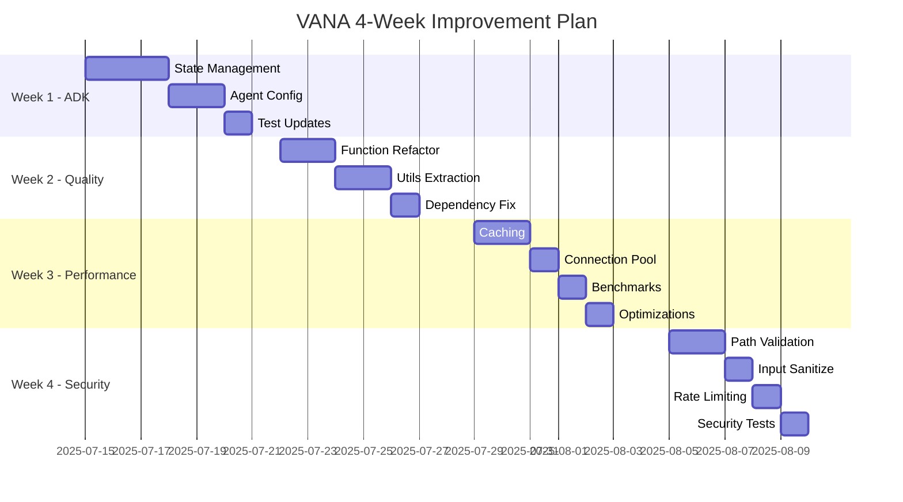

# VANA 4-Week Improvement Implementation Plan

**Created**: July 11, 2025  
**Duration**: 4 weeks  
**Priority**: ADK Compliance → Code Quality → Performance → Security

## Executive Summary

This plan addresses critical improvements identified in the Phase 3-4 analysis, with security improvements strategically moved to Week 4 to allow foundational work to be completed first. The plan follows a sequential approach where each week builds upon the previous week's improvements.

## Week 1: ADK Compliance Sprint 🔧

**Goal**: Achieve 100% Google ADK compliance in all workflow managers and agents

### Tasks

#### 1.1 State Management Refactoring (Days 1-3)
```python
# Current Anti-pattern
task_results = []  # Manual tracking

# Target Implementation
workflow = SequentialAgent(
    name=workflow_name,
    sub_agents=agents,
    state_schema=StateSchema  # ADK-managed
)
```

**Specific Files to Update**:
- `agents/workflows/sequential_workflow_manager.py`
- `agents/workflows/parallel_workflow_manager.py`
- `agents/workflows/loop_workflow_manager.py`

#### 1.2 Agent Configuration Updates (Days 3-4)
- Remove `output_key` manual management
- Implement proper `state_schema` definitions
- Update agent initialization patterns

#### 1.3 Test Suite Updates (Days 4-5)
- Update all workflow tests for new state management
- Add ADK compliance verification tests
- Create integration tests for state propagation

### Success Criteria
- ✅ Zero manual state tracking arrays
- ✅ All workflows use ADK's `state_schema`
- ✅ 100% test pass rate with new implementation
- ✅ No ADK validation errors

### Deliverables
1. Updated workflow managers with ADK state management
2. Comprehensive test suite validating ADK compliance
3. Migration guide for existing workflows

## Week 2: Code Quality Enhancement 📐

**Goal**: Improve maintainability and reduce technical debt

### Tasks

#### 2.1 Function Complexity Reduction (Days 1-2)
**Target Functions** (currently >50 lines):
- `analyze_bug_risk()` - 143 lines → 5 functions @ ~30 lines each
- `analyze_user_flow()` - 108 lines → 4 functions @ ~25 lines each
- `generate_ui_component()` - 220 lines → 6 functions @ ~35 lines each

**Refactoring Pattern**:
```python
# Before: Monolithic function
def analyze_bug_risk(file_path: str):
    # 143 lines of mixed concerns

# After: Separated concerns
def analyze_bug_risk(file_path: str):
    code = _read_and_validate(file_path)
    tree = _parse_ast_safely(code)
    factors = _calculate_risk_factors(tree)
    areas = _identify_high_risk_areas(tree, factors)
    return _compile_risk_report(factors, areas)
```

#### 2.2 Common Utilities Extraction (Days 2-3)
Create `lib/utils/` modules:
- `validation.py` - Common validation patterns
- `error_handling.py` - Standardized error responses
- `ast_helpers.py` - Shared AST analysis utilities
- `metrics.py` - Performance measurement helpers

#### 2.3 Dependency Cleanup (Days 3-4)
- Create clear interfaces between layers
- Remove circular imports
- Implement dependency injection where needed

#### 2.4 Naming Standardization (Days 4-5)
- Convert all to snake_case
- Create naming convention document
- Run automated rename refactoring

### Success Criteria
- ✅ No function exceeds 50 lines
- ✅ 30% reduction in total LOC through DRY
- ✅ Zero circular dependencies
- ✅ Consistent naming throughout codebase

### Deliverables
1. Refactored specialist and workflow code
2. New `lib/utils/` shared utilities module
3. Updated coding standards document

## Week 3: Performance Optimization 🚀

**Goal**: Achieve <100ms p95 latency and 3x throughput improvement

### Tasks

#### 3.1 Distributed Caching Implementation (Days 1-2)
```python
# Redis-backed cache configuration
cache_config = {
    "backend": "redis",
    "host": os.getenv("REDIS_HOST", "localhost"),
    "ttl": 3600,
    "max_size": 10000,
    "compression": True
}

# Implementation in orchestrator
@redis_cache(ttl=300)
def route_request(request: str, context: Dict):
    # Expensive routing logic
```

#### 3.2 Connection Pooling (Days 2-3)
- Implement connection pools for all external services
- Add connection reuse for specialist operations
- Configure pool sizes based on load testing

#### 3.3 Performance Benchmarking Suite (Days 3-4)
Create `tests/benchmarks/`:
- `routing_benchmark.py` - Measure routing latency
- `workflow_benchmark.py` - Test workflow throughput
- `specialist_benchmark.py` - Individual specialist performance
- `load_test.py` - Concurrent request handling

#### 3.4 Optimization Implementation (Days 4-5)
- AST parsing memoization
- Request coalescing for batch operations
- Parallel specialist initialization
- Lazy loading of heavy resources

### Success Criteria
- ✅ <100ms p95 routing latency
- ✅ 3x throughput improvement (baseline: 100 req/s → 300 req/s)
- ✅ <50MB memory overhead per request
- ✅ Zero performance regression in benchmarks

### Deliverables
1. Redis-backed caching system
2. Connection pooling infrastructure
3. Comprehensive benchmark suite
4. Performance optimization report

## Week 4: Security Hardening 🔒

**Goal**: Achieve enterprise-grade security with zero critical vulnerabilities

### Tasks

#### 4.1 Path Validation System (Days 1-2)
```python
# Secure path validation
class PathValidator:
    def __init__(self, allowed_dirs: List[Path]):
        self.allowed_dirs = [d.resolve() for d in allowed_dirs]
    
    def validate(self, path: str) -> Path:
        target = Path(path).resolve()
        if not any(self._is_subpath(target, d) for d in self.allowed_dirs):
            raise SecurityError(f"Path {path} outside allowed directories")
        return target
```

**Implementation locations**:
- All file operations in specialists
- Workflow manager file access
- Orchestrator resource loading

#### 4.2 Input Sanitization (Days 2-3)
- HTML/Script injection prevention
- SQL injection protection (parameterized queries)
- Command injection prevention
- Path traversal protection

#### 4.3 Rate Limiting (Days 3-4)
```python
# Rate limiter configuration
rate_limits = {
    "orchestrator": "100/minute",
    "specialist": "50/minute/specialist",
    "workflow": "20/minute"
}
```

#### 4.4 Security Testing Suite (Days 4-5)
Create `tests/security/`:
- OWASP Top 10 test coverage
- Fuzzing tests for all inputs
- Penetration testing scenarios
- Security regression tests

#### 4.5 Audit & Monitoring (Day 5)
- Implement audit logging for sensitive operations
- Add security event monitoring
- Create security dashboard
- Set up automated vulnerability scanning

### Success Criteria
- ✅ Zero path traversal vulnerabilities
- ✅ 100% input validation coverage
- ✅ Rate limiting on all endpoints
- ✅ Passing security audit (OWASP compliance)
- ✅ Comprehensive audit trail

### Deliverables
1. Secure file operation framework
2. Input validation middleware
3. Rate limiting implementation
4. Security test suite
5. Audit logging system

## Implementation Schedule



## Risk Mitigation

### Technical Risks
1. **ADK Breaking Changes**: Maintain compatibility layer during migration
2. **Performance Regression**: Run benchmarks after each change
3. **Security Vulnerabilities**: Incremental security improvements with testing

### Mitigation Strategies
- Feature flags for gradual rollout
- Comprehensive test coverage before deployment
- Rollback plans for each week's changes
- Daily progress tracking and adjustments

## Success Metrics

### Overall Project Success
- **Code Quality**: From B+ to A+ (>95/100 score)
- **Performance**: 3x throughput improvement
- **Security**: Zero critical vulnerabilities
- **Maintainability**: 30% reduction in complexity

### Weekly Checkpoints
- Week 1: ADK compliance tests green
- Week 2: Code complexity metrics improved
- Week 3: Performance benchmarks passing
- Week 4: Security audit passed

## Resource Requirements

### Team
- 2 Senior Engineers (full-time)
- 1 Security Specialist (Week 4)
- 1 DevOps Engineer (Week 3-4)

### Infrastructure
- Redis cluster for caching (Week 3)
- Security scanning tools (Week 4)
- Load testing infrastructure (Week 3)

## Post-Implementation

### Documentation Updates
- Architecture documentation
- Security best practices guide
- Performance tuning guide
- ADK compliance checklist

### Training
- Team training on new patterns
- Security awareness session
- Performance optimization workshop

This plan ensures systematic improvement of VANA while maintaining stability and allowing security hardening to benefit from the foundational improvements made in earlier weeks.