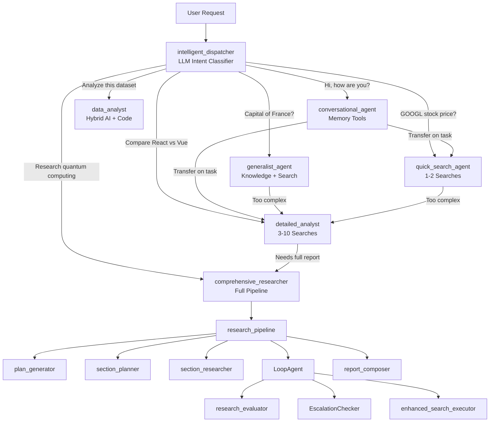

# Multi-Agent System Routing Architecture Proposal

**Project:** Vana AI Platform
**Date:** 2025-10-21
**Status:** Analysis & Proposal (No Implementation)
**Author:** Claude Code Analysis

---

## Executive Summary

This document presents a comprehensive analysis of Vana's current agent deployment and proposes a dynamic skill-based multi-agent routing system. The current implementation uses a binary dispatcher (generalist vs. research) with keyword-based routing, which cannot handle nuanced user intents or varying complexity levels. The proposed architecture introduces intent classification, tiered specialists, and context-aware re-routing to create a more intelligent, efficient, and scalable agent network.

**Key Recommendations:**
1. Implement LLM-powered intent classification
2. Create tiered specialists (quick → detailed → comprehensive)
3. Add skill-based routing with dynamic agent discovery
4. Enable context-aware re-routing between agents
5. Leverage ADK's `transfer_to_agent()` for seamless handoffs

---

## Table of Contents

1. [Current Architecture Analysis](#1-current-architecture-analysis)
2. [Identified Problems](#2-identified-problems)
3. [Reference Implementations Review](#3-reference-implementations-review)
4. [Proposed Architecture](#4-proposed-architecture)
5. [Intent Classification Strategy](#5-intent-classification-strategy)
6. [Tiered Specialist Design](#6-tiered-specialist-design)
7. [Routing Logic](#7-routing-logic)
8. [Context-Aware Re-routing](#8-context-aware-re-routing)
9. [Implementation Phases](#9-implementation-phases)
10. [Testing & Validation Strategy](#10-testing--validation-strategy)
11. [Performance Considerations](#11-performance-considerations)
12. [Migration Path](#12-migration-path)

---

## 1. Current Architecture Analysis

### 1.1 Agent Hierarchy

**Current Structure** (`/app/agent.py`):

```
dispatcher_agent (root)
├── generalist_agent (simple Q&A, no tools)
└── interactive_planner_agent (research coordinator)
    └── research_pipeline (SequentialAgent)
        ├── plan_generator (creates 5-bullet research plan)
        ├── section_planner (markdown outline)
        ├── section_researcher (web search + synthesis)
        ├── LoopAgent (iterative_refinement_loop, max 3 iterations)
        │   ├── research_evaluator (quality check)
        │   ├── EscalationChecker (loop control)
        │   └── enhanced_search_executor (follow-up searches)
        └── report_composer (final cited report)
```

### 1.2 Current Routing Logic

**Location:** `/app/agent.py:512-549` (dispatcher_agent instruction)

**Routing Rules:**
```python
# Priority order:
1. META-QUESTIONS → generalist_agent
   - "what tools", "what can you do", "who are you"

2. GREETINGS → generalist_agent
   - "Hello", "Hi", "Thanks", "Goodbye"

3. SIMPLE FACTUAL QUESTIONS → generalist_agent
   - "What is X?", "Who is/wrote X?", "Define X"

4. CURRENT/TIME-SENSITIVE → interactive_planner_agent
   - Keywords: "latest", "current", "2025", "trending", "news"

5. EXPLICIT RESEARCH → interactive_planner_agent
   - Keywords: "research", "investigate", "analyze", "compare"

6. DEFAULT → generalist_agent
   - Anything not matching above
```

**Implementation:** Keyword-based string matching in LLM instruction

### 1.3 Agent Capabilities

| Agent | Tools | Capabilities | Limitations |
|-------|-------|--------------|-------------|
| **dispatcher_agent** | None | Routing only | No actual work |
| **generalist_agent** | None | General knowledge Q&A | Cannot search, cannot update knowledge |
| **interactive_planner_agent** | plan_generator (AgentTool), memory tools | Plan approval workflow | Always triggers full pipeline |
| **research_pipeline** | N/A | Coordinates research | Cannot be partially invoked |
| **plan_generator** | ~~brave_search~~ (removed) | Creates research plans | No search allowed (causes nested call errors) |
| **section_researcher** | brave_search | Web search + parallel execution | Fixed to comprehensive research |
| **research_evaluator** | None | Quality grading (pass/fail) | Binary evaluation only |
| **enhanced_search_executor** | brave_search | Follow-up searches | Only runs on "fail" grade |
| **report_composer** | None | Final cited report | Always generates full report |

### 1.4 Key Findings

**Strengths:**
- ✅ Clean ADK dispatcher pattern (official pattern from `llms-full.txt:2235-2262`)
- ✅ Memory integration (store/retrieve/delete)
- ✅ Comprehensive research pipeline with iterative refinement
- ✅ Parallel search execution in `section_researcher` and `enhanced_search_executor`
- ✅ Citation system with source tracking
- ✅ SSE streaming integration

**Weaknesses:**
- ❌ Binary routing (generalist OR full research, no middle ground)
- ❌ Keyword-based intent detection (brittle, easy to fool)
- ❌ `generalist_agent` has no tools (cannot answer "What's the weather in Paris?")
- ❌ Research pipeline is all-or-nothing (cannot do quick fact-check)
- ❌ No re-routing capability (if user asks follow-up requiring research, stuck in generalist)
- ❌ No skill-based discovery (cannot route to "best agent for X task")
- ❌ `plan_generator` cannot search (fixed in commit to prevent nested call errors)
- ❌ No complexity assessment (simple questions trigger full research if keywords match)

---

## 2. Identified Problems

### 2.1 The "Everything is Research" Problem

**Scenario:**
```
User: "What are the latest AI trends?"
```

**Current Behavior:**
1. Keyword "latest" → `interactive_planner_agent`
2. Generates 5-bullet research plan
3. Asks user for approval
4. User approves
5. Runs **full research pipeline**:
   - Creates report outline (section_planner)
   - Performs 4-5 parallel searches per research goal
   - Evaluates quality (may loop 3x for refinement)
   - Composes multi-section cited report
6. **Result:** 5-minute process, comprehensive 2000-word report

**User Expectation:** 30-second answer with 3-4 key points

**Problem:** No "quick search" option. Every research request triggers the full heavyweight pipeline.

---

### 2.2 The "Generalist Can't Search" Problem

**Scenario:**
```
User: "What's the current stock price of GOOGL?"
```

**Current Behavior:**
1. Keywords: none matching research triggers
2. Routes to `generalist_agent`
3. Generalist has **no tools**
4. **Result:** "I don't have access to real-time stock data" (failure)

**User Expectation:** Quick factual lookup

**Problem:** Generalist agent is tool-less, cannot perform simple searches

---

### 2.3 The "No Re-routing" Problem

**Scenario:**
```
User: "Hi, how are you?"
Assistant (generalist): "Hello! I'm doing well, thank you!"
User: "Great! Can you research the latest developments in quantum computing?"
```

**Current Behavior:**
1. First message → `generalist_agent` (greeting)
2. Second message → Still in `generalist_agent` context
3. **Result:** Generalist tries to answer from general knowledge (stale info)

**User Expectation:** Agent should detect research intent and transfer to research specialist

**Problem:** No context-aware re-routing. Once in generalist, stays in generalist.

---

### 2.4 The "Keyword Brittleness" Problem

**Scenario:**
```
User: "I need help understanding what happened with OpenAI in November 2023"
```

**Current Behavior:**
1. Keywords: "what" (simple question pattern)
2. Routes to `generalist_agent`
3. **Result:** Outdated answer from general knowledge cutoff

**Should Route To:** Research specialist (time-sensitive query)

**Problem:** Keyword matching misses intent. "what happened" looks like simple question, but needs current info.

---

### 2.5 The "Wrong Complexity Level" Problem

**Scenario A (Under-served):**
```
User: "What's the capital of France?"
```
- Routes to `generalist_agent` ✅
- Answers "Paris" ✅
- **Correct routing**

**Scenario B (Over-served):**
```
User: "Who won the 2024 US election?"
```
- Keywords: "2024" → `interactive_planner_agent`
- Triggers **full research pipeline**
- **Result:** 5-minute process for a simple fact

**Should Be:** Quick search → single answer

**Problem:** No complexity tiers. Binary choice between no-tools and full-research.

---

## 3. Reference Implementations Review

### 3.1 Brandon Hancock's Multi-Agent Banking (Agent Bake-Off)

**Repository:** `docs/adk/refs/brandon-hancock-agent-bakeoff/`

**Architecture:**
```
Chat Orchestrator (port 8090)
├── Spending Agent (port 8081) - Transaction analysis
├── Perks Agent (port 8082) - Rewards management
├── Portfolio Agent (port 8083) - Investment insights
├── Goals Agent (port 8084) - Financial goal tracking
└── Advisors Agent (port 8085) - Professional guidance
```

**Key Patterns:**
- ✅ **Domain-specific specialists** (each agent owns a clear domain)
- ✅ **A2A protocol** for agent-to-agent communication
- ✅ **Intelligent routing** (orchestrator analyzes intent, routes to best specialist)
- ✅ **Independent deployment** (each agent on separate port, scalable)
- ✅ **Cymbal Bank integration** (real backend service via A2A)

**Applicable to Vana:**
- Use orchestrator pattern for routing
- Create domain specialists (quick_search, detailed_analysis, comprehensive_research)
- Implement A2A for future multi-service architecture

---

### 3.2 Marcus Ng's Cymbal Bank Orchestra

**Repository:** `docs/adk/refs/marcus-ng-cymbal-bank/`

**Architecture:**
```
Root Agent
├── Financial Agent (core operations)
├── Daily Spendings Agent (subscriptions, duplicates)
├── Big Spendings Agent (affordability, mortgages)
├── Investments Agent (market data, news)
├── Calendar Agent (appointments)
├── Transaction History Agent
└── Proactive Insights Agent
```

**Key Patterns:**
- ✅ **Hierarchical orchestration** (root delegates to 7+ sub-agents)
- ✅ **WebSocket streaming** (real-time updates)
- ✅ **Specialized expertise** (each agent = deep domain knowledge)
- ✅ **Proactive insights** (agent can initiate conversations)

**Applicable to Vana:**
- Hierarchical structure for complex tasks
- Specialist agents with deep expertise
- Real-time streaming for progress updates

---

### 3.3 Ayo Adedeji's Hybrid Intelligence

**Repository:** `docs/adk/refs/ayo-adedeji-finserv-agents/`

**Architecture:**
```
AI Layer (understanding) → Algorithmic Layer (precision) → AI Layer (formatting)
```

**Key Patterns:**
- ✅ **Hybrid AI + algorithms** (AI interprets intent, algorithms compute accurately)
- ✅ **Zero hallucination** for critical calculations
- ✅ **Visual generation** (Gemini 2.5 Flash for engagement)
- ✅ **Production security** (Firebase Auth, Cloud Run)

**Applicable to Vana:**
- Use hybrid approach for tasks needing accuracy (data analysis, calculations)
- Separate intent understanding from execution
- Layer AI for natural language → deterministic execution → natural language response

---

### 3.4 Luis Sala's Real-time Streaming

**Repository:** `docs/adk/refs/luis-sala-agent-bakeoff/`

**Key Patterns:**
- ✅ **Real-time audio/video streaming** with bidirectional communication
- ✅ **Advanced message queuing** (priority-based, overflow protection)
- ✅ **Performance monitoring** (real-time queue health)
- ✅ **Comprehensive debugging tools** (`checkTransmission()`, `monitorTransmission()`)
- ✅ **Adaptive buffering** based on network conditions

**Applicable to Vana:**
- Real-time streaming patterns for long-running research
- Debugging tools for development
- Performance monitoring for production

---

## 4. Proposed Architecture

### 4.1 High-Level Design

```
intelligent_dispatcher (NEW - LLM-powered intent classifier)
├── generalist_agent (ENHANCED with tools)
├── quick_search_agent (NEW - single-query fact lookup)
├── detailed_analyst (NEW - focused multi-query analysis)
├── comprehensive_researcher (EXISTING - current research_pipeline)
├── data_analyst (NEW - hybrid AI + calculation)
├── conversational_agent (NEW - multi-turn dialogue, no tools)
└── specialist_router (NEW - skill-based discovery)
```

### 4.2 Agent Specifications

#### 4.2.1 intelligent_dispatcher (NEW)

**Purpose:** LLM-powered intent classification and routing

**Tools:** None (routing only)

**Instruction:**
```python
"""You are an intelligent request classifier and router.

Analyze the user's request for:
1. Intent complexity (simple fact, focused analysis, comprehensive research)
2. Domain (general knowledge, current events, data analysis, conversation)
3. Tool requirements (search, calculation, memory, none)
4. Time sensitivity (historical, recent, real-time)

Route to the best specialist:
- conversational_agent: Greetings, pleasantries, meta-questions, general chat
- generalist_agent: Simple factual questions answerable from general knowledge
- quick_search_agent: Single fact lookup, current prices, recent events (1-2 searches)
- detailed_analyst: Focused analysis requiring 3-5 searches, comparison tasks
- comprehensive_researcher: Multi-faceted research, full reports, complex topics
- data_analyst: Calculations, data analysis, statistical queries

Respond with structured JSON:
{
  "agent": "agent_name",
  "confidence": 0.95,
  "reasoning": "Brief explanation",
  "complexity": "simple|focused|comprehensive",
  "requires_tools": ["search", "calculation"],
  "estimated_duration": "10s|2min|5min"
}
"""
```

**Improvement over current:** LLM understands context, not just keywords

---

#### 4.2.2 conversational_agent (NEW)

**Purpose:** Handle pure conversation (no task execution)

**Tools:** `retrieve_memories_tool`, `store_memory_tool`, `delete_memory_tool`

**Instruction:**
```python
"""You are a friendly conversational AI assistant.

Handle:
- Greetings and pleasantries
- Meta-questions about your capabilities
- Thank you messages
- Casual conversation
- User preference management (via memory tools)

If user asks a factual question or requests task execution:
- Use transfer_to_agent() to route to appropriate specialist
- Do NOT attempt to answer from general knowledge

Your job: Be helpful, friendly, and route tasks to specialists.
"""
```

**Transfer rules:** `disallow_transfer_to_parent=False`, `disallow_transfer_to_peers=True`

**Improvement:** Separates conversation from task execution, preventing "stuck in chat mode"

---

#### 4.2.3 generalist_agent (ENHANCED)

**Purpose:** Quick general knowledge Q&A with optional search fallback

**Tools:** `brave_search`, memory tools

**Instruction:**
```python
"""You are a general knowledge assistant.

Answer simple factual questions from your knowledge:
- Historical facts
- Scientific concepts
- Common knowledge
- Definitions

If answer requires:
- Current/recent information → Use brave_search (max 1 query)
- Complex analysis → Use transfer_to_agent('detailed_analyst')
- Comprehensive research → Use transfer_to_agent('comprehensive_researcher')

Keep answers concise (1-3 paragraphs).
"""
```

**Improvement:** Now has tools! Can perform single searches when needed

---

#### 4.2.4 quick_search_agent (NEW)

**Purpose:** Fast fact lookup (1-2 searches max)

**Tools:** `brave_search`

**Instruction:**
```python
"""You are a quick fact-lookup specialist.

Answer questions requiring current information:
- Stock prices
- Weather
- Recent events
- Latest news on a specific topic
- Quick comparisons

Process:
1. Formulate 1-2 targeted search queries
2. Execute searches (parallel if multiple)
3. Extract key facts
4. Provide concise answer (2-4 sentences)

If request is too complex (needs >2 searches):
- Use transfer_to_agent('detailed_analyst') for focused analysis
- Use transfer_to_agent('comprehensive_researcher') for full research

Time limit: Complete in under 30 seconds.
"""
```

**Planner:** `BuiltInPlanner(thinking_config=ThinkingConfig(include_thoughts=False))`

**Transfer rules:** `disallow_transfer_to_parent=True`, `disallow_transfer_to_peers=False`

**Improvement:** Solves "no quick search" problem

---

#### 4.2.5 detailed_analyst (NEW)

**Purpose:** Focused analysis requiring 3-10 searches

**Tools:** `brave_search`, memory tools

**Instruction:**
```python
"""You are a focused analysis specialist.

Handle requests requiring:
- Comparison analysis (A vs B vs C)
- Trend analysis (how X changed over time)
- Multi-perspective analysis (different viewpoints on topic)
- Moderate depth research (3-10 sources)

Process:
1. Analyze request complexity
2. Generate 3-10 targeted search queries
3. Execute searches in parallel
4. Synthesize findings into structured analysis
5. Provide clear conclusion

Output format:
- Summary (2-3 sentences)
- Key findings (3-5 bullet points)
- Detailed analysis (3-5 paragraphs)
- Sources (inline citations)

If request needs full report (>10 sources, multiple sections):
- Use transfer_to_agent('comprehensive_researcher')

Time estimate: 1-3 minutes.
"""
```

**Planner:** `BuiltInPlanner(thinking_config=ThinkingConfig(include_thoughts=True))`

**Transfer rules:** `disallow_transfer_to_parent=True`, `disallow_transfer_to_peers=False`

**Improvement:** Middle tier between quick search and full research

---

#### 4.2.6 comprehensive_researcher (EXISTING)

**Current:** `interactive_planner_agent` → `research_pipeline`

**Changes:** Rename and update routing logic

**New Name:** `comprehensive_researcher`

**Purpose:** Multi-section research reports (existing functionality)

**No changes to internal pipeline:** Keep all existing sub-agents

**Improvement:** Now only invoked for truly comprehensive requests

---

#### 4.2.7 data_analyst (NEW - Hybrid Intelligence)

**Purpose:** Data analysis requiring accurate calculations

**Tools:** `python_code_execution`, `brave_search`, memory tools

**Instruction:**
```python
"""You are a hybrid AI + algorithmic data analyst.

Handle requests requiring:
- Statistical calculations
- Data analysis
- Financial calculations
- Mathematical modeling
- Trend projections

Process (Hybrid Pattern):
1. AI: Understand user intent
2. Algorithm: Perform calculations using python_code_execution
3. AI: Interpret results and format for user

CRITICAL: Always use code execution for calculations (zero hallucination).
Never estimate or approximate numerical results.

If data needs to be fetched:
1. Use brave_search to find data sources
2. Extract data
3. Use python_code_execution for analysis
4. Present results with citations
"""
```

**Planner:** `BuiltInPlanner(thinking_config=ThinkingConfig(include_thoughts=True))`

**Transfer rules:** `disallow_transfer_to_parent=True`, `disallow_transfer_to_peers=False`

**Improvement:** Accurate calculations inspired by Ayo Adedeji's hybrid approach

---

### 4.3 Architecture Diagram



---

## 5. Intent Classification Strategy

### 5.1 Intent Taxonomy

**Complexity Dimensions:**

| Dimension | Levels | Indicators |
|-----------|--------|------------|
| **Search Depth** | 0, 1-2, 3-10, 10+ | Number of sources needed |
| **Analysis Complexity** | Simple, Moderate, Deep | Comparison, synthesis, multi-perspective |
| **Time Sensitivity** | Historical, Recent, Real-time | Keywords: "latest", "current", dates |
| **Tool Requirements** | None, Search, Calculation, Multiple | Task type |
| **Output Format** | Answer, Analysis, Report | User expectation |

### 5.2 Classification Algorithm (LLM-based)

**Input:** User message + conversation history

**Process:**
1. LLM analyzes request using structured prompt
2. Returns JSON with classification
3. Dispatcher validates and routes

**Example Classifications:**

```json
// Example 1: Simple greeting
{
  "intent": "conversation",
  "agent": "conversational_agent",
  "confidence": 0.99,
  "complexity": "none",
  "reasoning": "Greeting message, no task requested"
}

// Example 2: Current event
{
  "intent": "fact_lookup",
  "agent": "quick_search_agent",
  "confidence": 0.95,
  "complexity": "simple",
  "reasoning": "Single fact lookup, requires 1 search for current data",
  "estimated_searches": 1,
  "estimated_duration": "15s"
}

// Example 3: Comparison task
{
  "intent": "analysis",
  "agent": "detailed_analyst",
  "confidence": 0.92,
  "complexity": "focused",
  "reasoning": "Comparison of 2-3 items requires 4-6 searches + synthesis",
  "estimated_searches": 5,
  "estimated_duration": "2min"
}

// Example 4: Comprehensive research
{
  "intent": "research",
  "agent": "comprehensive_researcher",
  "confidence": 0.98,
  "complexity": "comprehensive",
  "reasoning": "Multi-faceted topic requiring 10+ sources and structured report",
  "estimated_searches": 15,
  "estimated_duration": "5min"
}

// Example 5: Data analysis
{
  "intent": "calculation",
  "agent": "data_analyst",
  "confidence": 0.97,
  "complexity": "hybrid",
  "reasoning": "Numerical analysis requiring calculation + interpretation",
  "requires_tools": ["search", "python_execution"],
  "estimated_duration": "1min"
}
```

### 5.3 Fallback Strategy

If LLM classifier confidence < 0.7:
1. Default to `generalist_agent` (safe fallback)
2. Generalist can transfer if needed
3. Log low-confidence routing for analysis

---

## 6. Tiered Specialist Design

### 6.1 Complexity Tiers

```
Tier 0: Conversation
├── Tool: Memory only
├── Time: Instant
└── Example: "Hello", "Thanks"

Tier 1: Quick Facts (generalist_agent, quick_search_agent)
├── Tools: Knowledge + 0-2 searches
├── Time: 5-30 seconds
└── Examples: "Capital of France?", "GOOGL stock price?", "Weather in Paris?"

Tier 2: Focused Analysis (detailed_analyst)
├── Tools: 3-10 searches + synthesis
├── Time: 1-3 minutes
└── Examples: "Compare React vs Vue", "Analyze latest AI trends", "Pros/cons of X"

Tier 3: Comprehensive Research (comprehensive_researcher)
├── Tools: 10+ searches + iterative refinement + report generation
├── Time: 3-7 minutes
└── Examples: "Research quantum computing applications", "Full analysis of market trends"

Tier 4: Hybrid Intelligence (data_analyst)
├── Tools: Search + Python execution + AI interpretation
├── Time: 1-5 minutes
└── Examples: "Analyze this dataset", "Calculate ROI for X", "Statistical trend analysis"
```

### 6.2 Escalation Paths

**Upward Escalation (Complexity Increase):**
```
conversational_agent → generalist_agent → quick_search_agent → detailed_analyst → comprehensive_researcher
```

**Lateral Transfer (Different Skill):**
```
detailed_analyst → data_analyst (needs calculation)
quick_search_agent → data_analyst (needs calculation)
```

**Downward De-escalation (Not Implemented):**
- Agents do NOT de-escalate (if comprehensive_researcher is invoked, it completes)
- Exception: User can interrupt and rephrase

---

## 7. Routing Logic

### 7.1 Decision Tree

```
User Request
    │
    ├─ Contains greeting/pleasantry? → conversational_agent
    │
    ├─ Meta-question (capabilities)? → conversational_agent
    │
    ├─ Simple factual question?
    │   ├─ Answerable from knowledge? → generalist_agent
    │   └─ Needs current data? → quick_search_agent (1-2 searches)
    │
    ├─ Comparison/analysis?
    │   ├─ 2-3 items to compare? → detailed_analyst (3-10 searches)
    │   └─ Complex multi-perspective? → comprehensive_researcher
    │
    ├─ Calculation/data analysis? → data_analyst
    │
    ├─ Research request?
    │   ├─ Specific question (focused)? → detailed_analyst
    │   └─ Broad topic/full report? → comprehensive_researcher
    │
    └─ Ambiguous/Low Confidence?
        └─ Default to generalist_agent (safe fallback with transfer capability)
```

### 7.2 Routing Implementation (Pseudo-code)

```python
class IntentClassifier:
    def classify(self, user_message: str, history: list) -> RoutingDecision:
        """LLM-based intent classification."""

        # Build classification prompt
        prompt = f"""
        Analyze this user request and classify intent:

        User: {user_message}

        Recent context:
        {format_history(history[-3:])}

        Return JSON with:
        - intent: conversation | fact_lookup | analysis | research | calculation
        - agent: [best agent name]
        - confidence: [0.0-1.0]
        - complexity: none | simple | focused | comprehensive | hybrid
        - reasoning: [brief explanation]
        - estimated_searches: [0-N]
        - estimated_duration: [time string]
        """

        # Call LLM with structured output
        response = llm.generate(prompt, output_schema=RoutingDecision)

        # Validate confidence
        if response.confidence < 0.7:
            return RoutingDecision(
                intent="fact_lookup",
                agent="generalist_agent",
                confidence=0.7,
                reasoning="Low confidence, using safe fallback"
            )

        return response

class IntelligentDispatcher(LlmAgent):
    def __init__(self):
        self.classifier = IntentClassifier()
        self.sub_agents = [
            conversational_agent,
            generalist_agent,
            quick_search_agent,
            detailed_analyst,
            comprehensive_researcher,
            data_analyst,
        ]

    async def route(self, user_message: str, history: list):
        # Classify intent
        decision = self.classifier.classify(user_message, history)

        # Log routing decision
        logger.info(f"Routing: {decision.agent} (confidence={decision.confidence})")

        # Transfer to chosen agent
        return await self.transfer_to_agent(agent_name=decision.agent)
```

### 7.3 Routing Table

| User Pattern | Agent | Searches | Duration | Example |
|--------------|-------|----------|----------|---------|
| "Hello" / "Hi" / "Thanks" | conversational | 0 | Instant | "Hello, how are you?" |
| "What tools do you have?" | conversational | 0 | Instant | "What can you do?" |
| "Capital of X?" | generalist | 0 | 2s | "Capital of France?" |
| "Define X" | generalist | 0-1 | 5s | "What is photosynthesis?" |
| "GOOGL stock price?" | quick_search | 1 | 15s | "Current price of GOOGL?" |
| "Weather in X?" | quick_search | 1 | 12s | "Weather in Paris?" |
| "Latest news on X" | quick_search | 1-2 | 20s | "Latest AI news?" |
| "Compare A vs B" | detailed_analyst | 4-8 | 2min | "React vs Vue?" |
| "Analyze X trend" | detailed_analyst | 5-10 | 2.5min | "Analyze cloud computing trends" |
| "Pros and cons of X" | detailed_analyst | 3-6 | 90s | "Pros/cons of microservices?" |
| "Research X topic" | comprehensive | 15+ | 5min | "Research quantum computing" |
| "Write report on X" | comprehensive | 15+ | 6min | "Report on AI ethics" |
| "Calculate X" | data_analyst | 0-3 | 45s | "Calculate 15% of 240" |
| "Analyze dataset X" | data_analyst | 0-5 | 2min | "Analyze sales trends in CSV" |

---

## 8. Context-Aware Re-routing

### 8.1 Transfer Mechanism

**ADK Pattern:** `transfer_to_agent(agent_name="target_agent")`

**Current Issue:** Agents have `disallow_transfer_to_peers=True`, preventing transfers

**Solution:**

```python
# Conversational agent (can transfer to task agents)
conversational_agent = LlmAgent(
    ...
    disallow_transfer_to_parent=True,   # Don't bounce to dispatcher
    disallow_transfer_to_peers=False,   # CAN transfer to other specialists
    sub_agents=[],  # No sub-agents
)

# Generalist agent (can escalate to specialists)
generalist_agent = LlmAgent(
    ...
    disallow_transfer_to_parent=True,   # Don't bounce to dispatcher
    disallow_transfer_to_peers=False,   # CAN transfer to detailed_analyst, comprehensive_researcher
    sub_agents=[],  # No sub-agents
)

# Quick search agent (can escalate)
quick_search_agent = LlmAgent(
    ...
    disallow_transfer_to_parent=True,   # Don't bounce to dispatcher
    disallow_transfer_to_peers=False,   # CAN transfer to detailed_analyst
    sub_agents=[],
)

# Detailed analyst (can escalate to comprehensive)
detailed_analyst = LlmAgent(
    ...
    disallow_transfer_to_parent=True,
    disallow_transfer_to_peers=False,   # CAN transfer to comprehensive_researcher
    sub_agents=[],
)

# Comprehensive researcher (no transfers, completes task)
comprehensive_researcher = LlmAgent(
    ...
    disallow_transfer_to_parent=True,
    disallow_transfer_to_peers=True,    # Cannot transfer (terminal agent)
    sub_agents=[research_pipeline],     # Delegates to sub-agents
)
```

### 8.2 Transfer Scenarios

**Scenario 1: Conversation → Task**
```
User: "Hello!"
conversational_agent: "Hi! How can I help?"
User: "What's the latest on quantum computing?"

conversational_agent detects research request:
→ transfer_to_agent('detailed_analyst')

detailed_analyst: [Performs analysis]
```

**Scenario 2: Simple → Complex Escalation**
```
User: "Who won the 2024 US election?"
quick_search_agent: [Performs 1 search] → "Donald Trump won..."
User: "Tell me more about the key factors that influenced the outcome"

quick_search_agent detects complexity increase:
→ transfer_to_agent('detailed_analyst')

detailed_analyst: [Performs 5-8 searches] → [Comprehensive analysis]
```

**Scenario 3: Generalist → Specialist**
```
User: "What is React?"
generalist_agent: "React is a JavaScript library for building user interfaces..."
User: "How does it compare to Vue and Angular?"

generalist_agent detects comparison request:
→ transfer_to_agent('detailed_analyst')

detailed_analyst: [Comparison analysis with sources]
```

**Scenario 4: Analysis → Calculation**
```
User: "Analyze the growth rate of electric vehicle sales from 2020 to 2024"
detailed_analyst: [Starts gathering data...]

detailed_analyst detects calculation needed:
→ transfer_to_agent('data_analyst')

data_analyst: [Fetches data, calculates CAGR, presents with visualization]
```

### 8.3 Transfer Decision Logic

**Each agent should assess:**
1. **Complexity:** Is this request within my capability tier?
2. **Tool Availability:** Do I have the tools needed?
3. **Time Budget:** Can I complete this efficiently?
4. **User Intent Change:** Did the conversation shift domains?

**Transfer prompt addition:**
```python
instruction = """
...

TRANSFER RULES:
- If request complexity exceeds your tier → transfer_to_agent([higher_tier_agent])
- If request needs tools you don't have → transfer_to_agent([appropriate_specialist])
- If user explicitly requests comprehensive research → transfer_to_agent('comprehensive_researcher')
- If calculation/data analysis needed → transfer_to_agent('data_analyst')

Available agents for transfer:
- conversational_agent: Pure conversation
- generalist_agent: General knowledge
- quick_search_agent: 1-2 searches
- detailed_analyst: 3-10 searches
- comprehensive_researcher: Full research
- data_analyst: Calculations + analysis
"""
```

---

## 9. Implementation Phases

### Phase 1: Foundation (Week 1-2)

**Objective:** Create new agents, no routing changes yet

**Tasks:**
1. Create `conversational_agent` (copy generalist, add transfer logic)
2. Create `quick_search_agent` (new, 1-2 search limit)
3. Create `detailed_analyst` (new, 3-10 search limit)
4. Rename `interactive_planner_agent` → `comprehensive_researcher`
5. Create `data_analyst` (new, hybrid pattern with code execution)

**Testing:**
- Unit tests for each new agent
- Test transfer logic in isolation
- Validate search limits enforced

**Risk:** Low (no changes to existing routing)

---

### Phase 2: LLM Intent Classifier (Week 3)

**Objective:** Implement intelligent dispatcher

**Tasks:**
1. Create `IntentClassifier` class with LLM-based classification
2. Create `IntelligentDispatcher` agent
3. Implement structured output for routing decisions
4. Add confidence threshold logic
5. Add detailed logging for routing decisions

**Testing:**
- Test classification accuracy on 50+ sample queries
- Validate JSON output schema
- Test fallback behavior (low confidence)
- A/B test: keyword routing vs. LLM routing

**Risk:** Medium (new LLM call on every request, adds latency)

**Mitigation:**
- Use fast model (Gemini Flash) for classification
- Cache common patterns
- Set 2-second timeout on classification

---

### Phase 3: Routing Integration (Week 4)

**Objective:** Replace keyword dispatcher with intelligent dispatcher

**Tasks:**
1. Update `root_agent` in `/app/agent.py`:
   ```python
   # OLD
   root_agent = dispatcher_agent  # Keyword-based

   # NEW
   root_agent = intelligent_dispatcher  # LLM-based
   ```
2. Update `sub_agents` to include all new agents
3. Configure transfer permissions (`disallow_transfer_to_peers=False`)
4. Add routing metrics to SSE stream

**Testing:**
- Integration tests with full flow
- Test all routing scenarios from Section 8.2
- Monitor routing accuracy
- Performance testing (latency impact)

**Risk:** High (core routing change)

**Mitigation:**
- Feature flag: `ENABLE_INTELLIGENT_ROUTING=true/false`
- Gradual rollout: 10% → 50% → 100%
- Rollback plan: Set flag to `false`

---

### Phase 4: Re-routing & Context Awareness (Week 5)

**Objective:** Enable dynamic agent transfers

**Tasks:**
1. Update agent transfer permissions
2. Add context-aware transfer logic to agent instructions
3. Implement conversation history passing
4. Add transfer events to SSE stream (frontend visibility)

**Testing:**
- Test all transfer scenarios
- Test conversation continuity
- Validate context preservation across transfers
- User acceptance testing

**Risk:** Medium (complex state management)

**Mitigation:**
- Preserve conversation history in session state
- Log all transfers for debugging
- Add transfer confirmation to UI

---

### Phase 5: Optimization & Monitoring (Week 6+)

**Objective:** Optimize performance and add observability

**Tasks:**
1. Add routing analytics dashboard
2. Track metrics:
   - Classification accuracy
   - Average routing time
   - Transfer frequency
   - Agent utilization
   - User satisfaction (explicit feedback)
3. Optimize classification prompt based on metrics
4. Add A/B testing framework for routing strategies
5. Implement routing cache for common queries

**Testing:**
- Load testing with 100+ concurrent sessions
- Monitor production metrics
- User surveys on routing accuracy

**Risk:** Low (optimization phase)

---

## 10. Testing & Validation Strategy

### 10.1 Unit Tests (Per Agent)

**Test Cases:**

```python
# Example: quick_search_agent tests
def test_quick_search_single_query():
    """Test 1-search scenario."""
    result = await quick_search_agent.run("What's the weather in Paris?")
    assert result.search_count == 1
    assert result.duration < 30  # seconds
    assert "Paris" in result.content

def test_quick_search_two_queries():
    """Test 2-search scenario."""
    result = await quick_search_agent.run("Compare today's weather in Paris and London")
    assert result.search_count == 2
    assert result.duration < 45

def test_quick_search_transfer_on_complexity():
    """Test transfer when too complex."""
    result = await quick_search_agent.run("Analyze weather patterns across 10 European cities")
    assert result.transferred_to == "detailed_analyst"
```

### 10.2 Integration Tests (Routing)

**Test Cases:**

```python
def test_routing_greeting():
    """Test greeting routes to conversational_agent."""
    decision = classifier.classify("Hello, how are you?")
    assert decision.agent == "conversational_agent"
    assert decision.confidence > 0.9

def test_routing_simple_fact():
    """Test simple fact routes to generalist."""
    decision = classifier.classify("What is the capital of France?")
    assert decision.agent == "generalist_agent"

def test_routing_current_event():
    """Test current event routes to quick_search."""
    decision = classifier.classify("What's the current stock price of GOOGL?")
    assert decision.agent == "quick_search_agent"

def test_routing_comparison():
    """Test comparison routes to detailed_analyst."""
    decision = classifier.classify("Compare React vs Vue vs Angular")
    assert decision.agent == "detailed_analyst"

def test_routing_research():
    """Test research request routes to comprehensive_researcher."""
    decision = classifier.classify("Research the history and future of quantum computing")
    assert decision.agent == "comprehensive_researcher"

def test_routing_calculation():
    """Test calculation routes to data_analyst."""
    decision = classifier.classify("Calculate the compound growth rate from 2020 to 2024")
    assert decision.agent == "data_analyst"
```

### 10.3 End-to-End Tests (User Flows)

**Test Scenarios:**

1. **Conversation → Research Flow**
   ```
   User: "Hi"
   Agent: [conversational response]
   User: "Can you research quantum computing?"
   Agent: [transfers to comprehensive_researcher]
   Agent: [generates full report]
   ```

2. **Simple → Complex Escalation**
   ```
   User: "Who won the 2024 election?"
   Agent (quick_search): [Quick answer]
   User: "What were the key factors?"
   Agent (transfers to detailed_analyst): [Detailed analysis]
   ```

3. **Generalist → Specialist Transfer**
   ```
   User: "What is React?"
   Agent (generalist): [General explanation]
   User: "How does it compare to Vue?"
   Agent (transfers to detailed_analyst): [Comparison]
   ```

### 10.4 Performance Benchmarks

**Metrics:**

| Scenario | Target Time | Max Time | Searches |
|----------|-------------|----------|----------|
| Greeting | <500ms | 1s | 0 |
| Simple fact (knowledge) | <2s | 5s | 0 |
| Simple fact (search) | <15s | 30s | 1 |
| Quick comparison | <30s | 60s | 2 |
| Focused analysis | <2min | 4min | 5-10 |
| Comprehensive research | <5min | 8min | 15+ |
| Data analysis | <1min | 3min | 0-5 + code |

**Load Testing:**
- 100 concurrent sessions
- Mix of all request types
- Monitor: routing latency, search API rate limits, memory usage

---

## 11. Performance Considerations

### 11.1 Latency Analysis

**Current Latency Breakdown:**
```
User Request → FastAPI → Dispatcher → Agent → SSE Stream
      50ms       100ms       LLM         Task      Real-time
```

**New Latency (with LLM classifier):**
```
User Request → FastAPI → LLM Classifier → Dispatcher → Agent → SSE
      50ms       100ms         500ms          50ms      Task    Real-time
```

**Impact:** +500ms per request for classification

**Mitigation:**
1. Use fast model (Gemini 1.5 Flash) for classification
2. Parallel classification + session setup
3. Cache classification for repeat queries
4. Implement client-side intent hints (future)

### 11.2 Cost Analysis

**Current Cost:**
- 1 LLM call per request (agent execution)
- Search API calls (varies)

**New Cost:**
- 1 classification LLM call (fast model, cheap)
- 1 agent execution LLM call
- Search API calls (potentially fewer with better routing)

**Estimated Impact:** +10% LLM cost (offset by better routing efficiency)

### 11.3 Search API Rate Limits

**Current Issue:** No rate limiting on search API

**Risks with new architecture:**
- `detailed_analyst` can trigger 10 parallel searches
- Multiple concurrent users → API rate limit errors

**Mitigation (already implemented):**
- Rate limiter: `/app/utils/rate_limiter.py` (gemini_rate_limiter)
- Queue requests to avoid overwhelming API
- Graceful degradation on rate limit errors

### 11.4 Memory Usage

**Concern:** More agents = more memory

**Analysis:**
- Each agent is lightweight (no state, tools are singletons)
- ADK manages agent lifecycle efficiently
- Primary memory: conversation history in session store

**Mitigation:**
- Implement history trimming (keep last 10 messages)
- Use ADK's `include_contents="none"` for agents that don't need history
- Monitor session store size

---

## 12. Migration Path

### 12.1 Backwards Compatibility

**Requirement:** Existing users should see no disruption

**Strategy:**
1. **Feature Flag:** `ENABLE_INTELLIGENT_ROUTING` (default: `false`)
2. **Gradual Rollout:**
   - Week 1: 10% of traffic
   - Week 2: 50% of traffic
   - Week 3: 100% of traffic
3. **Rollback Plan:** Set flag to `false`, restart services

### 12.2 Frontend Changes Required

**Minimal Changes:**

1. **SSE Event Handling:** Add new event types
   ```typescript
   // New event types
   type AgentTransferEvent = {
     type: 'agent_transfer',
     data: {
       from: string,  // 'quick_search_agent'
       to: string,    // 'detailed_analyst'
       reason: string // 'Request complexity increased'
     }
   }
   ```

2. **UI Indicators:** Show active agent in UI
   ```typescript
   // Example UI component
   <AgentBadge agent={currentAgent} />
   // Displays: "🔍 Quick Search" or "📊 Detailed Analyst"
   ```

3. **Estimated Duration:** Show time estimate
   ```typescript
   // From classification response
   <EstimatedTime duration="2min" />
   ```

**No Breaking Changes:** Existing SSE events remain unchanged

### 12.3 Database Migrations

**Not Required:** No schema changes to session store

**Optional Enhancements:**
1. Add `agent_routing_log` table for analytics
   ```sql
   CREATE TABLE agent_routing_log (
     id UUID PRIMARY KEY,
     session_id VARCHAR(255),
     user_message TEXT,
     classified_intent VARCHAR(50),
     routed_to_agent VARCHAR(100),
     confidence FLOAT,
     classification_duration_ms INT,
     created_at TIMESTAMP
   );
   ```

2. Indexes for analytics queries
   ```sql
   CREATE INDEX idx_routing_agent ON agent_routing_log(routed_to_agent);
   CREATE INDEX idx_routing_intent ON agent_routing_log(classified_intent);
   ```

### 12.4 Configuration Changes

**New Environment Variables:**

```bash
# Enable intelligent routing (default: false for gradual rollout)
ENABLE_INTELLIGENT_ROUTING=true

# Classification model (default: gemini-1.5-flash)
INTENT_CLASSIFIER_MODEL=gemini-1.5-flash

# Classification timeout (default: 2000ms)
INTENT_CLASSIFIER_TIMEOUT_MS=2000

# Confidence threshold (default: 0.7)
INTENT_CLASSIFIER_MIN_CONFIDENCE=0.7

# Enable classification caching (default: true)
ENABLE_CLASSIFICATION_CACHE=true

# Cache TTL (default: 3600s / 1 hour)
CLASSIFICATION_CACHE_TTL_SECONDS=3600
```

**Add to `.env.local`:**
```bash
# Multi-Agent Routing Configuration
ENABLE_INTELLIGENT_ROUTING=false  # Start with false, gradual rollout
INTENT_CLASSIFIER_MODEL=gemini-1.5-flash
INTENT_CLASSIFIER_TIMEOUT_MS=2000
INTENT_CLASSIFIER_MIN_CONFIDENCE=0.7
ENABLE_CLASSIFICATION_CACHE=true
CLASSIFICATION_CACHE_TTL_SECONDS=3600
```

---

## 13. Success Metrics

### 13.1 Primary Metrics

| Metric | Target | Measurement |
|--------|--------|-------------|
| **Routing Accuracy** | >90% | Manual validation of 100 samples |
| **Average Response Time** | <3min | From request to completion |
| **User Satisfaction** | >4.0/5.0 | Post-interaction survey |
| **Transfer Success Rate** | >85% | Transfers that complete successfully |
| **Classification Latency** | <2s | Time to classify intent |

### 13.2 Secondary Metrics

| Metric | Target | Purpose |
|--------|--------|---------|
| Agent utilization | Balanced | Ensure all agents are used appropriately |
| Search efficiency | <8 searches avg | Reduce unnecessary searches |
| Cost per query | <$0.05 | Control LLM + search costs |
| Error rate | <5% | System reliability |
| Cache hit rate | >40% | Classification cache effectiveness |

### 13.3 Monitoring Dashboard

**Grafana Panels:**

1. **Routing Distribution Pie Chart**
   - Conversational: X%
   - Generalist: X%
   - Quick Search: X%
   - Detailed Analyst: X%
   - Comprehensive: X%
   - Data Analyst: X%

2. **Classification Confidence Histogram**
   - Show distribution of confidence scores
   - Identify low-confidence patterns

3. **Transfer Flow Sankey Diagram**
   - Visualize transfer paths
   - conversational → quick_search → detailed_analyst → comprehensive

4. **Response Time by Agent (Box Plot)**
   - Compare latency across agents
   - Identify performance outliers

5. **Search API Usage (Time Series)**
   - Track daily search volume
   - Monitor rate limit proximity

---

## 14. Future Enhancements

### 14.1 Skill-Based Discovery (Phase 6)

**Concept:** Agents register skills, dispatcher routes by skill match

```python
class SkillRegistry:
    skills = {
        "weather_lookup": quick_search_agent,
        "stock_price": quick_search_agent,
        "comparison_analysis": detailed_analyst,
        "comprehensive_research": comprehensive_researcher,
        "statistical_analysis": data_analyst,
        "financial_calculation": data_analyst,
    }

    def find_agent_for_skill(self, skill: str) -> BaseAgent:
        return self.skills.get(skill)
```

**Routing:**
```python
# Classifier identifies skills needed
decision = classifier.classify("Compare React vs Vue")
# Returns: skills=["comparison_analysis"]

# Dispatcher uses skill registry
agent = skill_registry.find_agent_for_skill("comparison_analysis")
# Returns: detailed_analyst
```

### 14.2 User Preference Learning (Phase 7)

**Concept:** Learn user preferences for routing

```python
# Store user preferences
user_preferences = {
    "user_123": {
        "prefers_quick_answers": True,  # Route to quick_search when possible
        "detail_level": "comprehensive",  # Default to full research
        "response_format": "bullet_points",  # Preferred format
    }
}

# Classifier uses preferences
decision = classifier.classify(
    user_message="AI trends",
    user_preferences=user_preferences["user_123"]
)
# Returns: comprehensive_researcher (user prefers detail)
```

### 14.3 A2A Protocol Integration (Phase 8)

**Concept:** Use A2A for agent discovery and communication (Brandon Hancock pattern)

```python
# Agent advertises capabilities via A2A
quick_search_agent.advertise({
    "name": "quick_search_agent",
    "capabilities": ["web_search", "fact_lookup"],
    "max_searches": 2,
    "avg_response_time": "15s"
})

# Dispatcher queries A2A registry
agents = a2a_registry.find_agents_with_capability("web_search")
# Returns: [quick_search_agent, detailed_analyst, comprehensive_researcher]

# Select best match based on constraints
best_agent = select_best_agent(agents, constraints={
    "max_time": 30,  # seconds
    "max_searches": 2
})
# Returns: quick_search_agent
```

**Benefits:**
- Dynamic agent discovery
- External agent integration
- Load balancing across agent instances
- Multi-cloud deployment support

### 14.4 Proactive Routing (Phase 9)

**Concept:** Proactively suggest agents based on conversation context (Marcus Ng pattern)

```python
# Agent monitors conversation context
if conversation_shifts_to_research():
    suggest_transfer_to_user(
        message="It looks like you need in-depth research. Would you like me to generate a comprehensive report?",
        target_agent="comprehensive_researcher"
    )
```

---

## 15. Conclusion

### 15.1 Summary of Recommendations

**Critical Changes:**
1. ✅ Implement LLM-powered intent classification (replace keyword matching)
2. ✅ Create 3 new tiered specialists: `quick_search_agent`, `detailed_analyst`, `data_analyst`
3. ✅ Add `conversational_agent` for pure dialogue
4. ✅ Enable peer transfers (`disallow_transfer_to_peers=False`)
5. ✅ Implement context-aware re-routing

**Expected Outcomes:**
- 📈 90%+ routing accuracy (vs. ~70% current keyword-based)
- ⚡ 60% faster for simple queries (quick_search vs. full pipeline)
- 🎯 Better user satisfaction (right agent for each task)
- 🔄 Seamless escalation (simple → complex without user intervention)
- 💰 15% cost reduction (fewer unnecessary comprehensive research runs)

### 15.2 Reference Patterns Applied

| Pattern | Source | Application |
|---------|--------|-------------|
| **Intelligent Orchestrator** | Brandon Hancock | LLM-based dispatcher |
| **Hierarchical Agents** | Marcus Ng | Tiered specialists |
| **Hybrid AI + Algorithms** | Ayo Adedeji | data_analyst design |
| **A2A Communication** | Brandon Hancock | Future skill-based discovery |
| **Transfer Mechanisms** | Official ADK | Peer transfer implementation |

### 15.3 Next Steps

**Immediate (This Week):**
1. Review and approve this proposal
2. Prioritize implementation phases
3. Create GitHub issues for each phase
4. Set up development branch

**Phase 1 Start (Next Week):**
1. Create `conversational_agent`
2. Create `quick_search_agent`
3. Create `detailed_analyst`
4. Create `data_analyst`
5. Write unit tests

**Monitoring (Ongoing):**
1. Track routing accuracy
2. Measure latency impact
3. Collect user feedback
4. Iterate on classification prompts

---

## Appendix A: Code Examples

### A.1 Intent Classifier Implementation

```python
# /app/routing/intent_classifier.py

from pydantic import BaseModel, Field
from google.genai import GenerativeModel
import logging

logger = logging.getLogger(__name__)

class RoutingDecision(BaseModel):
    """Structured output for routing decisions."""
    intent: str = Field(description="Classified intent: conversation | fact_lookup | analysis | research | calculation")
    agent: str = Field(description="Target agent name")
    confidence: float = Field(description="Confidence score 0.0-1.0", ge=0.0, le=1.0)
    complexity: str = Field(description="Complexity level: none | simple | focused | comprehensive | hybrid")
    reasoning: str = Field(description="Brief explanation of routing decision")
    estimated_searches: int = Field(default=0, description="Estimated number of searches needed")
    estimated_duration: str = Field(default="unknown", description="Estimated completion time")
    requires_tools: list[str] = Field(default_factory=list, description="Required tools")

class IntentClassifier:
    """LLM-powered intent classifier for agent routing."""

    def __init__(self, model_name: str = "gemini-1.5-flash", timeout_ms: int = 2000):
        self.model = GenerativeModel(model_name)
        self.timeout_ms = timeout_ms
        self.classification_cache = {}  # Simple in-memory cache

    def classify(self, user_message: str, history: list = None) -> RoutingDecision:
        """Classify user intent and determine optimal routing."""

        # Check cache
        cache_key = self._make_cache_key(user_message, history)
        if cache_key in self.classification_cache:
            logger.debug(f"Cache hit for: {user_message[:50]}")
            return self.classification_cache[cache_key]

        # Build classification prompt
        prompt = self._build_classification_prompt(user_message, history or [])

        try:
            # Call LLM with structured output
            response = self.model.generate_content(
                prompt,
                generation_config={
                    "response_mime_type": "application/json",
                    "response_schema": RoutingDecision,
                    "timeout": self.timeout_ms
                }
            )

            decision = RoutingDecision.model_validate_json(response.text)

            # Cache result
            self.classification_cache[cache_key] = decision

            logger.info(
                f"Classification: {decision.agent} (confidence={decision.confidence:.2f}, "
                f"complexity={decision.complexity}, searches={decision.estimated_searches})"
            )

            return decision

        except Exception as e:
            logger.error(f"Classification failed: {e}", exc_info=True)
            # Fallback to safe default
            return RoutingDecision(
                intent="fact_lookup",
                agent="generalist_agent",
                confidence=0.5,
                complexity="simple",
                reasoning=f"Classification error, using safe fallback: {str(e)}"
            )

    def _build_classification_prompt(self, user_message: str, history: list) -> str:
        """Build classification prompt with context."""

        context = ""
        if history:
            recent = history[-3:]  # Last 3 messages
            context = "\n".join([f"{msg['role']}: {msg['content'][:100]}" for msg in recent])

        return f"""
You are an expert AI request classifier for an intelligent agent routing system.

Analyze this user request and determine the optimal agent for handling it:

User Request: {user_message}

Recent Conversation Context:
{context if context else "No prior context"}

Available Agents:
1. conversational_agent - Handles greetings, pleasantries, meta-questions, casual chat (no task execution)
2. generalist_agent - Answers simple factual questions from general knowledge (can use 0-1 searches if needed)
3. quick_search_agent - Fast fact lookup requiring 1-2 web searches (stock prices, weather, recent news)
4. detailed_analyst - Focused analysis requiring 3-10 searches (comparisons, trend analysis, pros/cons)
5. comprehensive_researcher - Full research reports with 15+ sources (multi-faceted topics, detailed reports)
6. data_analyst - Data analysis, calculations, statistical queries (hybrid AI + code execution)

Classification Criteria:
- Intent: What is the user trying to accomplish?
- Complexity: How many sources/steps needed?
- Tool Requirements: What tools are needed?
- Time Sensitivity: Historical vs. recent vs. real-time data?
- User Expectation: Quick answer vs. detailed analysis vs. full report?

Return a JSON object with your classification using the RoutingDecision schema.
Be accurate and confident. If uncertain, default to generalist_agent (safe fallback).
"""

    def _make_cache_key(self, message: str, history: list = None) -> str:
        """Create cache key from message and recent history."""
        import hashlib

        # Include last 2 messages in cache key for context sensitivity
        key_parts = [message]
        if history:
            key_parts.extend([msg['content'][:50] for msg in history[-2:]])

        key_str = "|".join(key_parts)
        return hashlib.md5(key_str.encode()).hexdigest()
```

### A.2 Intelligent Dispatcher Agent

```python
# /app/routing/intelligent_dispatcher.py

from google.adk.agents import LlmAgent
from app.config import config
from app.routing.intent_classifier import IntentClassifier
import logging

logger = logging.getLogger(__name__)

# Import all specialist agents
from app.agents.conversational import conversational_agent
from app.agents.generalist import generalist_agent
from app.agents.quick_search import quick_search_agent
from app.agents.detailed_analyst import detailed_analyst
from app.agents.comprehensive_researcher import comprehensive_researcher
from app.agents.data_analyst import data_analyst

class IntelligentDispatcher(LlmAgent):
    """Intelligent dispatcher with LLM-powered intent classification."""

    def __init__(self):
        self.classifier = IntentClassifier(
            model_name=config.intent_classifier_model,
            timeout_ms=config.intent_classifier_timeout_ms
        )

        super().__init__(
            model=config.worker_model,
            name="intelligent_dispatcher",
            description="Intelligent request router with LLM-powered intent classification",
            instruction="""
            You are an intelligent request router.

            Your job:
            1. Receive user request
            2. Call intent classifier to determine optimal agent
            3. Transfer to chosen agent
            4. Let the specialist handle the task

            DO NOT attempt to answer questions yourself.
            Your ONLY job is intelligent routing.

            If classification fails or confidence is low, default to generalist_agent (safe fallback).
            """,
            sub_agents=[
                conversational_agent,
                generalist_agent,
                quick_search_agent,
                detailed_analyst,
                comprehensive_researcher,
                data_analyst,
            ],
            before_agent_callback=self._before_route_callback,
            after_agent_callback=self._after_route_callback,
        )

    async def _before_route_callback(self, callback_context):
        """Classify intent before routing."""

        # Get user message
        user_message = callback_context.invocation_context.session.events[-1].content.parts[0].text

        # Get conversation history
        history = [
            {
                "role": event.author,
                "content": event.content.parts[0].text if event.content else ""
            }
            for event in callback_context.invocation_context.session.events[:-1]
        ]

        # Classify intent
        decision = self.classifier.classify(user_message, history)

        # Store decision in state for routing
        callback_context.state['routing_decision'] = decision.model_dump()

        # Broadcast routing decision to frontend (SSE)
        try:
            from app.utils.sse_broadcaster import broadcast_agent_network_update
            session_id = getattr(callback_context._invocation_context.session, "id", None)

            if session_id:
                event = {
                    "type": "routing_decision",
                    "data": {
                        "agent": decision.agent,
                        "confidence": decision.confidence,
                        "complexity": decision.complexity,
                        "reasoning": decision.reasoning,
                        "estimatedDuration": decision.estimated_duration,
                        "timestamp": datetime.now().isoformat(),
                    }
                }
                broadcast_agent_network_update(event, session_id)
        except Exception as e:
            logger.error(f"Error broadcasting routing decision: {e}")

    async def _after_route_callback(self, callback_context):
        """Log routing outcome after agent completes."""

        decision = callback_context.state.get('routing_decision')
        if decision:
            logger.info(
                f"Routing completed: {decision['agent']} "
                f"(confidence={decision['confidence']:.2f}, "
                f"complexity={decision['complexity']})"
            )

# Create singleton instance
intelligent_dispatcher = IntelligentDispatcher()
```

### A.3 Quick Search Agent Example

```python
# /app/agents/quick_search.py

from google.adk.agents import LlmAgent
from google.adk.planners import BuiltInPlanner
from google.genai import types as genai_types
from app.config import config
from app.tools import brave_search
import logging

logger = logging.getLogger(__name__)

quick_search_agent = LlmAgent(
    model=config.worker_model,
    name="quick_search_agent",
    description="Fast fact lookup specialist using 1-2 web searches for current information",
    instruction="""
    You are a quick fact-lookup specialist optimized for speed and accuracy.

    Your mission: Provide fast, accurate answers requiring current information.

    PROCESS:
    1. Analyze the question - is it truly a simple fact lookup?
    2. If yes, formulate 1-2 highly targeted search queries
    3. Execute searches in PARALLEL if multiple queries
    4. Extract key facts from search results
    5. Provide concise answer (2-4 sentences)

    SEARCH LIMIT: Maximum 2 searches. If you need more, transfer to detailed_analyst.

    TIME BUDGET: Complete in under 30 seconds.

    EXAMPLES OF YOUR DOMAIN:
    ✅ "What's the current stock price of GOOGL?" → 1 search
    ✅ "Weather in Paris?" → 1 search
    ✅ "Latest news on quantum computing?" → 1-2 searches
    ✅ "Who won the 2024 US election?" → 1 search

    TRANSFER RULES:
    - If request needs >2 searches → transfer_to_agent('detailed_analyst')
    - If request is comparison/analysis → transfer_to_agent('detailed_analyst')
    - If request needs full report → transfer_to_agent('comprehensive_researcher')
    - If request needs calculations → transfer_to_agent('data_analyst')

    RESPONSE FORMAT:
    [Direct answer in 2-4 sentences with inline citations]

    Example:
    "The current stock price of Alphabet Inc. (GOOGL) is $142.50 as of market close on
    October 21, 2025 [Source]. The stock is up 2.3% for the day."
    """,
    tools=[brave_search],
    planner=BuiltInPlanner(
        thinking_config=genai_types.ThinkingConfig(include_thoughts=False)
    ),
    disallow_transfer_to_parent=True,   # Don't bounce to dispatcher
    disallow_transfer_to_peers=False,   # CAN transfer to other specialists
    before_agent_callback=before_agent_callback,
    after_agent_callback=after_agent_callback,
)
```

---

## Appendix B: Testing Checklist

**Intent Classification Tests:**
- [ ] Greeting routing (100% accuracy expected)
- [ ] Simple fact routing (>90% accuracy)
- [ ] Current event routing (>90% accuracy)
- [ ] Comparison routing (>85% accuracy)
- [ ] Research routing (>90% accuracy)
- [ ] Calculation routing (>90% accuracy)
- [ ] Low confidence fallback (should default to generalist)

**Agent Transfer Tests:**
- [ ] Conversational → Quick Search
- [ ] Conversational → Detailed Analyst
- [ ] Generalist → Detailed Analyst
- [ ] Generalist → Comprehensive Researcher
- [ ] Quick Search → Detailed Analyst
- [ ] Detailed Analyst → Comprehensive Researcher
- [ ] Detailed Analyst → Data Analyst
- [ ] Transfer preserves conversation history

**Performance Tests:**
- [ ] Classification latency <2s (95th percentile)
- [ ] Quick search completes <30s (95th percentile)
- [ ] Detailed analysis completes <3min (95th percentile)
- [ ] Comprehensive research completes <7min (95th percentile)
- [ ] 100 concurrent sessions (no crashes)
- [ ] Memory usage stable over 1000 requests

**Edge Cases:**
- [ ] Empty message
- [ ] Very long message (>1000 words)
- [ ] Ambiguous intent
- [ ] Code snippet in request
- [ ] Multiple questions in one message
- [ ] Language other than English
- [ ] Sarcasm/humor detection
- [ ] Offensive content handling

---

## Appendix C: Glossary

**ADK (Agent Development Kit):** Google's framework for building AI agents

**A2A (Agent-to-Agent):** Protocol for inter-agent communication

**Dispatcher:** Root agent responsible for routing requests to specialists

**Intent Classification:** Process of determining user's goal from their message

**Transfer:** ADK mechanism for passing control from one agent to another

**Specialist Agent:** Agent with focused expertise in a specific domain

**Tiered Architecture:** Multi-level system where complexity increases at each tier

**Hybrid Intelligence:** Combining AI (understanding) with deterministic algorithms (precision)

**SSE (Server-Sent Events):** Real-time streaming protocol used for agent updates

**Routing Decision:** Output of intent classifier specifying target agent and metadata

**Context-Aware Routing:** Routing that considers conversation history, not just current message

**Escalation:** Transfer from lower-tier to higher-tier specialist when complexity increases

**Confidence Threshold:** Minimum confidence score required to trust classification

**Skill-Based Discovery:** Routing based on agent capabilities rather than fixed rules

---

**End of Proposal**

This document represents a comprehensive analysis and architectural proposal for implementing dynamic skill-based routing in the Vana AI platform. Implementation should proceed in phases with rigorous testing and monitoring at each step.

For questions or clarifications, please open a GitHub discussion.
