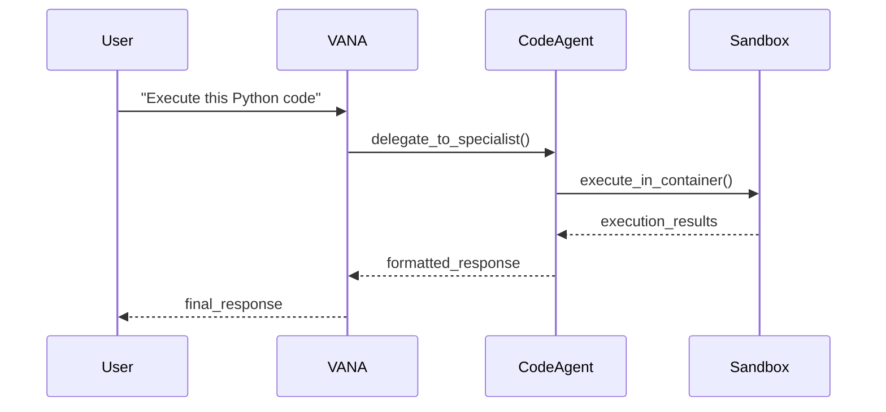
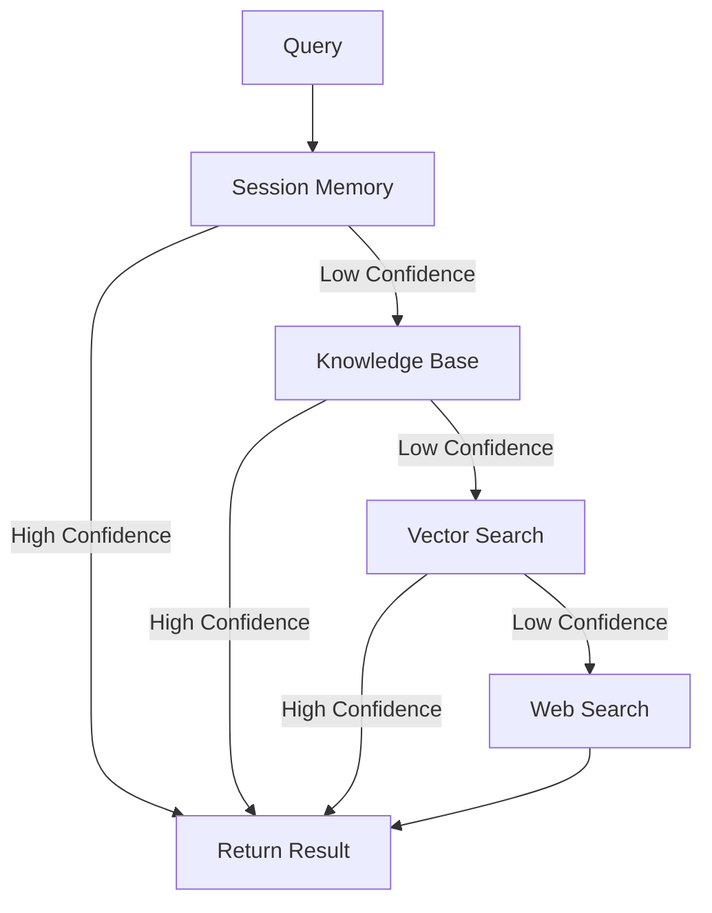

# Agent Interaction Patterns

## Agent-as-Tool Pattern
VANA implements a sophisticated agent-as-tool pattern where agents can call other agents as tools, enabling complex workflow orchestration and specialist delegation.

### Pattern Implementation
```python
# Example: VANA delegating to Code Execution Specialist
async def handle_code_request(self, code: str, language: str):
    """VANA orchestrator delegating to specialist agent."""
    result = await self.call_agent_tool(
        agent_name="code_execution",
        tool_name="execute_code",
        parameters={
            "code": code,
            "language": language,
            "security_level": "high"
        }
    )
    return result
```

### Delegation Flow


### Benefits
- **Specialization**: Each agent focuses on specific domain expertise
- **Reusability**: Agents can be called by multiple orchestrators
- **Scalability**: Independent scaling of specialist agents
- **Maintainability**: Clear separation of concerns and responsibilities

## Memory-First Hierarchy
VANA implements a memory-first approach with a structured hierarchy for information retrieval and context management.

### Hierarchy Levels
1. **Session Memory** (immediate context)
2. **Knowledge Base** (structured information)
3. **Vector Search** (semantic retrieval)
4. **Web Search** (external information)

### Implementation Pattern
```python
async def memory_first_search(self, query: str):
    """Implement memory-first hierarchy for information retrieval."""
    
    # Level 1: Session Memory
    session_result = await self.search_session_memory(query)
    if session_result.confidence > 0.8:
        return session_result
    
    # Level 2: Knowledge Base
    knowledge_result = await self.search_knowledge_base(query)
    if knowledge_result.confidence > 0.7:
        return knowledge_result
    
    # Level 3: Vector Search
    vector_result = await self.search_vector_database(query)
    if vector_result.confidence > 0.6:
        return vector_result
    
    # Level 4: Web Search (fallback)
    web_result = await self.search_web(query)
    return web_result
```

### Memory Flow Diagram


## Delegation Patterns

### Task Delegation
Orchestrator agents delegate tasks to specialist agents based on task type and agent capabilities.

```python
class TaskDelegationPattern:
    def __init__(self):
        self.specialist_mapping = {
            "code_execution": ["python", "javascript", "shell", "programming"],
            "data_science": ["analysis", "visualization", "machine_learning"],
            "architecture": ["design", "microservices", "system_architecture"],
            "memory": ["storage", "retrieval", "context_management"]
        }
    
    async def delegate_task(self, task_description: str):
        """Intelligent task delegation to appropriate specialist."""
        task_type = await self.analyze_task_type(task_description)
        specialist = self.select_specialist(task_type)
        
        return await self.call_specialist(
            specialist=specialist,
            task=task_description,
            context=self.get_current_context()
        )
```

### Tool Delegation
Agents delegate specific operations to tools while maintaining context and error handling.

```python
async def tool_delegation_pattern(self, operation: str, parameters: dict):
    """Delegate operations to appropriate tools with error handling."""
    try:
        # Select optimal tool for operation
        tool = await self.select_tool(operation)
        
        # Execute with context preservation
        result = await tool.execute(
            parameters=parameters,
            context=self.current_context
        )
        
        # Update context with results
        await self.update_context(result)
        
        return result
        
    except ToolExecutionError as e:
        # Graceful degradation
        return await self.handle_tool_failure(e, operation, parameters)
```

### Memory Delegation
Agents delegate memory operations to specialized memory services for optimal performance.

```python
async def memory_delegation_pattern(self, operation: str, data: any):
    """Delegate memory operations to appropriate memory services."""
    
    if operation == "store":
        # Delegate to appropriate storage service
        if self.is_session_data(data):
            return await self.session_memory.store(data)
        elif self.is_knowledge_data(data):
            return await self.knowledge_base.store(data)
        else:
            return await self.vector_search.store(data)
    
    elif operation == "retrieve":
        # Use memory-first hierarchy
        return await self.memory_first_search(data)
```

## Error Handling Patterns

### Graceful Degradation
When primary services fail, VANA implements graceful degradation to maintain functionality.

```python
class GracefulDegradationPattern:
    async def execute_with_fallback(self, primary_action, fallback_action):
        """Execute primary action with fallback on failure."""
        try:
            return await primary_action()
        except ServiceUnavailableError:
            logger.warning("Primary service unavailable, using fallback")
            return await fallback_action()
        except Exception as e:
            logger.error(f"Unexpected error: {e}")
            return await self.emergency_fallback()
```

### Circuit Breaker
Prevent cascade failures by implementing circuit breaker patterns for external services.

```python
class CircuitBreakerPattern:
    def __init__(self, failure_threshold=5, timeout=60):
        self.failure_count = 0
        self.failure_threshold = failure_threshold
        self.timeout = timeout
        self.last_failure_time = None
        self.state = "CLOSED"  # CLOSED, OPEN, HALF_OPEN
    
    async def call_with_circuit_breaker(self, service_call):
        """Execute service call with circuit breaker protection."""
        if self.state == "OPEN":
            if time.time() - self.last_failure_time > self.timeout:
                self.state = "HALF_OPEN"
            else:
                raise CircuitBreakerOpenError("Service temporarily unavailable")
        
        try:
            result = await service_call()
            if self.state == "HALF_OPEN":
                self.state = "CLOSED"
                self.failure_count = 0
            return result
            
        except Exception as e:
            self.failure_count += 1
            self.last_failure_time = time.time()
            
            if self.failure_count >= self.failure_threshold:
                self.state = "OPEN"
            
            raise e
```

### Retry with Backoff
Handle transient failures with intelligent retry mechanisms.

```python
import asyncio
from typing import Callable, Any

async def retry_with_backoff(
    operation: Callable,
    max_retries: int = 3,
    base_delay: float = 1.0,
    backoff_factor: float = 2.0
) -> Any:
    """Retry operation with exponential backoff."""
    
    for attempt in range(max_retries + 1):
        try:
            return await operation()
        except TransientError as e:
            if attempt == max_retries:
                raise e
            
            delay = base_delay * (backoff_factor ** attempt)
            logger.warning(f"Attempt {attempt + 1} failed, retrying in {delay}s")
            await asyncio.sleep(delay)
```

## Performance Patterns

### Lazy Loading
Load resources on demand to optimize startup time and memory usage.

```python
class LazyLoadingPattern:
    def __init__(self):
        self._agents = {}
        self._tools = {}
    
    async def get_agent(self, agent_name: str):
        """Lazy load agents on first access."""
        if agent_name not in self._agents:
            self._agents[agent_name] = await self.load_agent(agent_name)
        return self._agents[agent_name]
    
    async def get_tool(self, tool_name: str):
        """Lazy load tools on first access."""
        if tool_name not in self._tools:
            self._tools[tool_name] = await self.load_tool(tool_name)
        return self._tools[tool_name]
```

### Caching
Cache frequently accessed data to improve response times.

```python
from functools import wraps
import time

def cache_with_ttl(ttl_seconds: int = 300):
    """Cache function results with time-to-live."""
    def decorator(func):
        cache = {}
        
        @wraps(func)
        async def wrapper(*args, **kwargs):
            cache_key = str(args) + str(sorted(kwargs.items()))
            current_time = time.time()
            
            if cache_key in cache:
                result, timestamp = cache[cache_key]
                if current_time - timestamp < ttl_seconds:
                    return result
            
            result = await func(*args, **kwargs)
            cache[cache_key] = (result, current_time)
            return result
        
        return wrapper
    return decorator
```

### Parallel Execution
Execute independent tasks concurrently for improved performance.

```python
import asyncio

async def parallel_execution_pattern(tasks: list):
    """Execute multiple independent tasks in parallel."""
    
    # Group tasks by dependency
    independent_tasks = [task for task in tasks if not task.dependencies]
    dependent_tasks = [task for task in tasks if task.dependencies]
    
    # Execute independent tasks in parallel
    independent_results = await asyncio.gather(
        *[task.execute() for task in independent_tasks],
        return_exceptions=True
    )
    
    # Execute dependent tasks after dependencies complete
    for task in dependent_tasks:
        await task.wait_for_dependencies()
        await task.execute()
    
    return independent_results
```
