# 🏗️ Architecture Overview

VANA is built on a sophisticated multi-agent architecture that leverages Google's Agent Development Kit (ADK) for enterprise-grade AI orchestration. This document provides a comprehensive overview of the system's design and components.

## 🎯 Design Principles

### 1. **Hierarchical Agent Organization**
- **Master Orchestrator** coordinates all activities
- **Domain Orchestrators** manage specialized workflows
- **Specialist Agents** handle specific tasks
- **Intelligence Agents** provide system optimization
- **Utility Agents** ensure system health and coordination

### 2. **Tool Standardization**
- **Consistent Interfaces** across all 59+ tools
- **Standardized Response Format** for predictable outputs
- **Input Validation** with comprehensive security checks
- **Performance Monitoring** for all tool executions
- **Error Handling** with graceful degradation
- **MCP Integration** for enhanced capabilities and extensibility

### 3. **Cloud-Native Design**
- **Google Cloud Integration** with Vertex AI and Cloud Run
- **Auto-scaling** based on demand
- **Resilient Architecture** with circuit breakers and fallbacks
- **Observability** with comprehensive monitoring and logging

## 🏛️ System Architecture

```mermaid
graph TB
    subgraph "Client Layer"
        WUI[🎨 WebUI - React Frontend]
        AUTH[🔐 Authentication System]
        CHAT[💬 Real-time Chat]
        API[REST API]
        CLI[Command Line]
    end

    subgraph "VANA Core System"
        subgraph "Orchestration Layer"
            VANA[🎯 VANA Master Orchestrator]
            TO[🧳 Travel Orchestrator]
            DO[💻 Development Orchestrator]
            RO[🔍 Research Orchestrator]
        end

        subgraph "Agent Layer"
            subgraph "Travel Specialists"
                HA[🏨 Hotel Agent]
                FA[✈️ Flight Agent]
                PA[💳 Payment Agent]
                IA[📋 Itinerary Agent]
            end

            subgraph "Development Specialists"
                CG[⚙️ Code Generator]
                TA[🧪 Testing Agent]
                DA[📚 Documentation Agent]
                SA[🔒 Security Agent]
            end

            subgraph "Research Specialists"
                WR[🌐 Web Research]
                DAN[📊 Data Analysis]
                CI[🔍 Competitive Intelligence]
            end

            subgraph "Intelligence Layer"
                MM[🧠 Memory Management]
                DE[🎯 Decision Engine]
                LS[📈 Learning Systems]
            end

            subgraph "Utility Layer"
                MON[📊 Monitoring Agent]
                COORD[🔧 Coordination Agent]
            end
        end

        subgraph "Tool Layer"
            subgraph "Core Tools"
                FS[📁 File System]
                SEARCH[🔍 Search Tools]
                SYS[⚙️ System Tools]
                COOR[🤝 Coordination]
            end

            subgraph "Advanced Tools"
                LR[⏳ Long Running]
                TP[🔧 Third Party]
                AT[🎯 Agent Tools]
                MCP[🔗 MCP Tools]
            end
        end

        subgraph "Infrastructure Layer"
            MEM[💾 Memory System]
            CACHE[⚡ Caching Layer]
            LOG[📝 Logging System]
            SEC[🔒 Security Layer]
        end
    end

    subgraph "Google Cloud Services"
        VAI[🤖 Vertex AI]
        VR[🔍 Vector Search]
        CR[☁️ Cloud Run]
        LOG_GCP[📊 Cloud Logging]
        MON_GCP[📈 Cloud Monitoring]
    end

    subgraph "External Services"
        BRAVE[🔍 Brave Search]
        LANG[🔗 LangChain]
        CREW[👥 CrewAI]
        CTX7[🧠 Context7]
    end

    WUI --> AUTH
    WUI --> CHAT
    CHAT --> API
    CLI --> API
    API --> VANA

    VANA --> TO
    VANA --> DO
    VANA --> RO

    TO --> HA
    TO --> FA
    TO --> PA
    TO --> IA

    DO --> CG
    DO --> TA
    DO --> DA
    DO --> SA

    RO --> WR
    RO --> DAN
    RO --> CI

    VANA --> MM
    VANA --> DE
    VANA --> LS
    VANA --> MON
    VANA --> COORD

    HA --> FS
    FA --> SEARCH
    PA --> SYS
    IA --> COOR

    CG --> LR
    TA --> TP
    DA --> AT

    FS --> MEM
    SEARCH --> CACHE
    SYS --> LOG
    COOR --> SEC

    MEM --> VAI
    CACHE --> VR
    LOG --> CR
    SEC --> LOG_GCP

    SEARCH --> BRAVE
    TP --> LANG
    TP --> CREW
    MCP --> CTX7
    MCP --> BRAVE
```

### 🔧 Core Components

- **Client Layer** - WebUI with authentication, real-time chat, and API access
- **Orchestrator Layer** - Central coordination and task routing
- **Agent Layer** - Specialized agents for domain-specific tasks
- **Tool Layer** - 59+ standardized tools with consistent interfaces and MCP integration
- **Infrastructure Layer** - Google Cloud services and monitoring