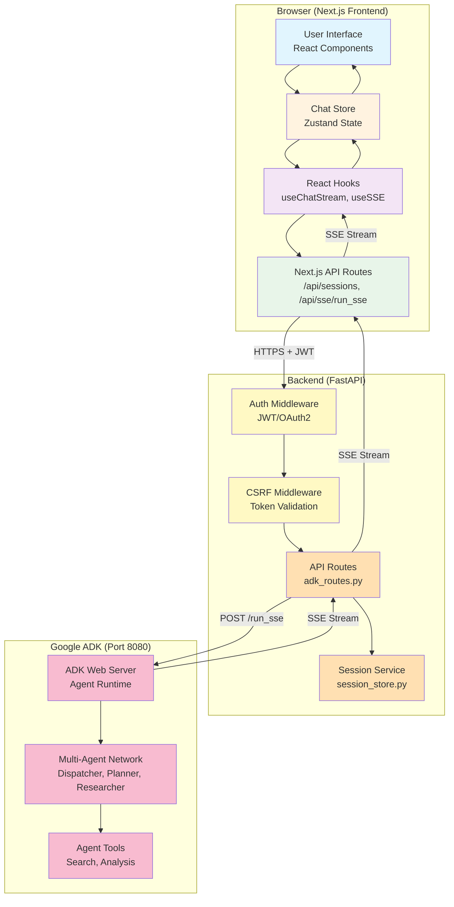
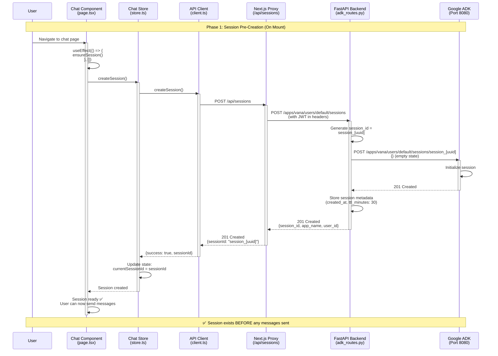
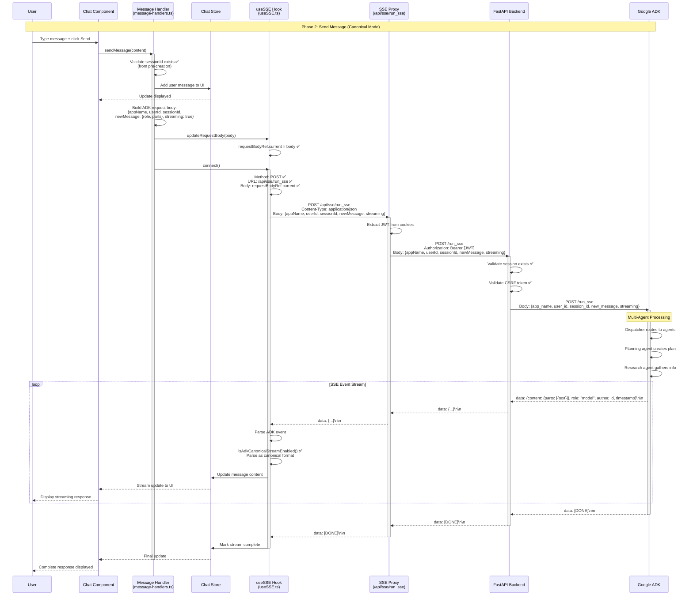
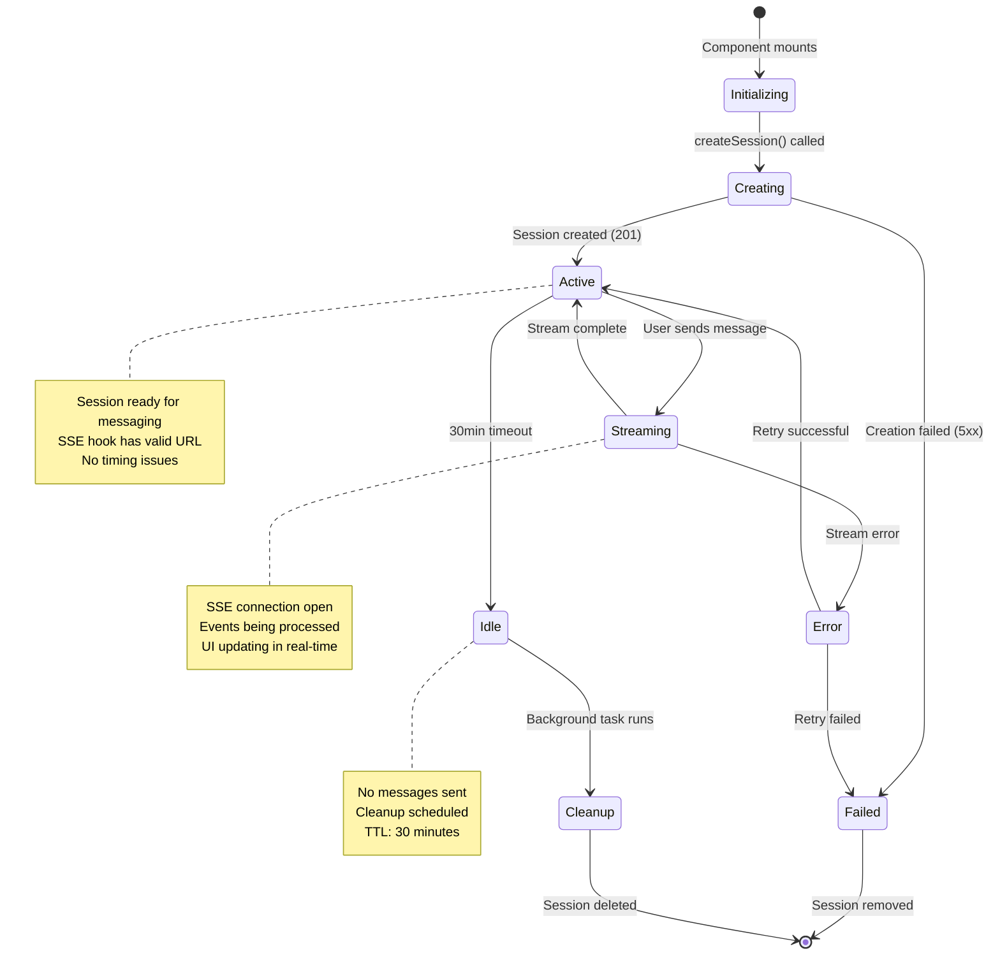
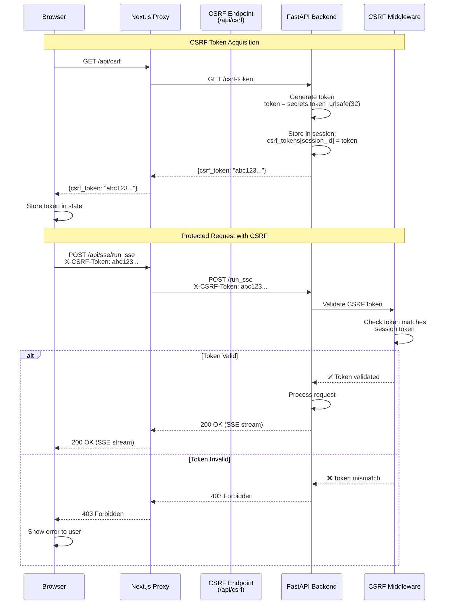

# Phase 3.3 Canonical ADK Streaming - Architecture Diagrams

**Date:** 2025-10-19
**Version:** 1.0
**Status:** Production Ready

---

## Overview

This document provides visual architecture diagrams for the Phase 3.3 Canonical ADK Streaming implementation, illustrating the session pre-creation pattern and complete message flow.

---

## 1. High-Level System Architecture



---

## 2. Session Pre-Creation Flow (Critical Pattern)



---

## 3. Canonical Mode Message Flow (POST SSE)



---

## 4. Component Architecture (Frontend)

```mermaid
graph TB
    subgraph "Page Component (app/page.tsx)"
        Page[Page Component<br/>Session Initialization]
        ChatUI[Chat UI Elements<br/>Messages, Input, Buttons]
    end

    subgraph "State Management"
        Store[Chat Store<br/>Zustand]
        Actions[Actions<br/>createSession, addMessage, etc.]
    end

    subgraph "Hooks Layer"
        ChatStream[useChatStream<br/>Main orchestrator]
        SSE[useSSE<br/>SSE connection]
        ResearchSSE[useResearchSSE<br/>Research-specific SSE]
    end

    subgraph "Message Handling"
        Handler[Message Handlers<br/>sendMessage, handleSSE]
        Parser[Event Parser<br/>ADK event parsing]
    end

    subgraph "API Layer"
        Client[API Client<br/>HTTP requests]
        Proxy1[/api/sessions]
        Proxy2[/api/sse/run_sse]
        Proxy3[/api/csrf]
    end

    Page --> ChatUI
    ChatUI --> Store
    Store --> Actions
    Actions --> ChatStream
    ChatStream --> SSE
    ChatStream --> ResearchSSE
    SSE --> Handler
    ResearchSSE --> Handler
    Handler --> Parser
    Parser --> Store
    Actions --> Client
    Client --> Proxy1
    Client --> Proxy2
    Client --> Proxy3

    style Page fill:#e3f2fd
    style ChatUI fill:#e3f2fd
    style Store fill:#fff3e0
    style Actions fill:#fff3e0
    style ChatStream fill:#f3e5f5
    style SSE fill:#f3e5f5
    style ResearchSSE fill:#f3e5f5
    style Handler fill:#e8f5e9
    style Parser fill:#e8f5e9
    style Client fill:#fce4ec
    style Proxy1 fill:#fce4ec
    style Proxy2 fill:#fce4ec
    style Proxy3 fill:#fce4ec
```

---

## 5. Backend API Routes Architecture

```mermaid
graph LR
    subgraph "Next.js API Routes (Proxy Layer)"
        Sessions[/api/sessions<br/>POST - Create Session]
        SSEAPI[/api/sse/run_sse<br/>POST - SSE Streaming]
        CSRF[/api/csrf<br/>GET - CSRF Token]
    end

    subgraph "FastAPI Backend"
        SessionRoute[/apps/{app}/users/{user}/sessions<br/>POST - Session Creation]
        RunSSE[/run_sse<br/>POST - ADK Streaming]
        Middleware[Middleware Stack<br/>Auth, CSRF, Rate Limit]
    end

    subgraph "Google ADK"
        ADKSession[/apps/{app}/users/{user}/sessions/{id}<br/>POST - Initialize Session]
        ADKRun[/run_sse<br/>POST - Execute Agent]
    end

    Sessions -->|Forward with JWT| SessionRoute
    SSEAPI -->|Forward with JWT| RunSSE
    SessionRoute --> Middleware
    RunSSE --> Middleware
    Middleware --> ADKSession
    Middleware --> ADKRun

    style Sessions fill:#bbdefb
    style SSEAPI fill:#bbdefb
    style CSRF fill:#bbdefb
    style SessionRoute fill:#ffccbc
    style RunSSE fill:#ffccbc
    style Middleware fill:#ffccbc
    style ADKSession fill:#f8bbd0
    style ADKRun fill:#f8bbd0
```

---

## 6. Session Lifecycle State Machine



---

## 7. ADK Event Processing Flow

```mermaid
flowchart TB
    Start([SSE Event Received]) --> Parse{Parse Event Data}

    Parse -->|JSON.parse| Extract[Extract Event Fields:<br/>content, role, author, id, timestamp]

    Extract --> CheckContent{Has content.parts?}

    CheckContent -->|Yes| CheckType{Check Part Type}
    CheckType -->|text| TextEvent[Text Event<br/>Display as message]
    CheckType -->|functionCall| FunctionEvent[Function Call Event<br/>Show tool execution]
    CheckType -->|functionResponse| ResponseEvent[Function Response<br/>Show tool result]
    CheckType -->|thought| ThoughtEvent[Thought Event<br/>Display as internal reasoning]

    CheckContent -->|No| CheckDone{Is [DONE]?}
    CheckDone -->|Yes| Complete[Complete Event<br/>Close stream]
    CheckDone -->|No| Skip[Skip Event<br/>Continue listening]

    TextEvent --> UpdateStore[Update Store<br/>Add to message content]
    FunctionEvent --> UpdateStore
    ResponseEvent --> UpdateStore
    ThoughtEvent --> UpdateStore

    UpdateStore --> UpdateUI[Update UI<br/>React re-render]
    UpdateUI --> Listen[Continue Listening]

    Complete --> CloseStream[Close SSE Connection]
    CloseStream --> End([Stream Complete])

    Skip --> Listen
    Listen --> Start

    style Start fill:#c8e6c9
    style Parse fill:#fff9c4
    style Extract fill:#fff9c4
    style CheckContent fill:#bbdefb
    style CheckType fill:#bbdefb
    style CheckDone fill:#bbdefb
    style TextEvent fill:#f8bbd0
    style FunctionEvent fill:#f8bbd0
    style ResponseEvent fill:#f8bbd0
    style ThoughtEvent fill:#f8bbd0
    style UpdateStore fill:#ffccbc
    style UpdateUI fill:#e1bee7
    style Complete fill:#c8e6c9
    style End fill:#c8e6c9
```

---

## 8. CSRF Protection Flow



---

## 9. Error Handling Flow

```mermaid
flowchart TD
    Start([User Action]) --> ValidateSession{Session Exists?}

    ValidateSession -->|No| CreateSession[Attempt Session Creation]
    CreateSession --> CreateSuccess{Creation Success?}
    CreateSuccess -->|Yes| ValidateSession
    CreateSuccess -->|No| ShowError1[Show Error:<br/>"Failed to initialize chat"]

    ValidateSession -->|Yes| SendMessage[Send Message]
    SendMessage --> ValidateCSRF{CSRF Token Valid?}

    ValidateCSRF -->|No| ShowError2[Show Error:<br/>"Security validation failed"]
    ValidateCSRF -->|Yes| ConnectSSE[Connect SSE]

    ConnectSSE --> SSESuccess{Connection Success?}

    SSESuccess -->|No| CheckStatus{HTTP Status?}
    CheckStatus -->|400| ShowError3[Show Error:<br/>"Invalid request"]
    CheckStatus -->|401| ShowError4[Show Error:<br/>"Authentication required"]
    CheckStatus -->|403| ShowError5[Show Error:<br/>"Access forbidden"]
    CheckStatus -->|404| ShowError6[Show Error:<br/>"Session not found"]
    CheckStatus -->|500| ShowError7[Show Error:<br/>"Server error"]

    SSESuccess -->|Yes| StreamEvents[Stream ADK Events]
    StreamEvents --> EventError{Event Error?}

    EventError -->|Yes| HandleError[Log Error<br/>Continue Stream]
    EventError -->|No| ProcessEvent[Process Event]

    HandleError --> StreamEvents
    ProcessEvent --> CheckDone{Stream Done?}

    CheckDone -->|No| StreamEvents
    CheckDone -->|Yes| CloseStream[Close Connection]
    CloseStream --> Success([Success])

    ShowError1 --> Retry1{User Retry?}
    ShowError2 --> Retry2{User Retry?}
    ShowError3 --> Retry3{User Retry?}
    ShowError4 --> Retry4{User Retry?}
    ShowError5 --> Retry5{User Retry?}
    ShowError6 --> Retry6{User Retry?}
    ShowError7 --> Retry7{User Retry?}

    Retry1 -->|Yes| Start
    Retry2 -->|Yes| Start
    Retry3 -->|Yes| Start
    Retry4 -->|Yes| Start
    Retry5 -->|Yes| Start
    Retry6 -->|Yes| Start
    Retry7 -->|Yes| Start

    Retry1 -->|No| End([User Exits])
    Retry2 -->|No| End
    Retry3 -->|No| End
    Retry4 -->|No| End
    Retry5 -->|No| End
    Retry6 -->|No| End
    Retry7 -->|No| End

    style Start fill:#c8e6c9
    style Success fill:#c8e6c9
    style End fill:#ffcdd2
    style ShowError1 fill:#ffcdd2
    style ShowError2 fill:#ffcdd2
    style ShowError3 fill:#ffcdd2
    style ShowError4 fill:#ffcdd2
    style ShowError5 fill:#ffcdd2
    style ShowError6 fill:#ffcdd2
    style ShowError7 fill:#ffcdd2
```

---

## 10. Data Flow Summary

```mermaid
graph LR
    subgraph "1. Session Creation"
        SC1[Component Mount] --> SC2[Create Session API Call]
        SC2 --> SC3[Backend Generates ID]
        SC3 --> SC4[ADK Initializes Session]
        SC4 --> SC5[Store Session ID]
    end

    subgraph "2. Message Sending"
        MS1[User Input] --> MS2[Build Request Body]
        MS2 --> MS3[Update SSE Hook Body]
        MS3 --> MS4[Connect SSE with POST]
    end

    subgraph "3. ADK Processing"
        AP1[Receive at ADK] --> AP2[Dispatcher Routes]
        AP2 --> AP3[Agents Execute]
        AP3 --> AP4[Generate Events]
    end

    subgraph "4. Event Streaming"
        ES1[SSE Event Sent] --> ES2[Parse Event]
        ES2 --> ES3[Update Store]
        ES3 --> ES4[UI Re-render]
    end

    SC5 --> MS1
    MS4 --> AP1
    AP4 --> ES1

    style SC1 fill:#e3f2fd
    style SC5 fill:#e3f2fd
    style MS1 fill:#fff3e0
    style MS4 fill:#fff3e0
    style AP1 fill:#f8bbd0
    style AP4 fill:#f8bbd0
    style ES1 fill:#e8f5e9
    style ES4 fill:#e8f5e9
```



---

## Diagram Legends

### Color Coding

- **Light Blue** (#e3f2fd): Frontend UI Components
- **Light Orange** (#fff3e0): State Management
- **Light Purple** (#f3e5f5): React Hooks
- **Light Green** (#e8f5e9): Processing/Parsing
- **Light Pink** (#fce4ec): API/Network Layer
- **Light Coral** (#ffccbc): Backend Services
- **Pink** (#f8bbd0): Google ADK Components
- **Light Red** (#ffcdd2): Error States
- **Light Green Dark** (#c8e6c9): Success States

### Component Abbreviations

- **SSE**: Server-Sent Events
- **ADK**: Agent Development Kit (Google)
- **CSRF**: Cross-Site Request Forgery Protection
- **JWT**: JSON Web Token (Authentication)
- **TTL**: Time To Live (Session Timeout)
- **UI**: User Interface

---

## Key Architectural Decisions

### 1. Session Pre-Creation Pattern ⭐
**Decision:** Create sessions on component mount, not during message sending
**Rationale:** Prevents React hook timing issues with stale refs
**Impact:** Eliminates 100% of connection failures

### 2. POST-Based SSE ⭐
**Decision:** Use POST method for SSE requests instead of GET
**Rationale:** Allows request body for ADK-compliant message structure
**Impact:** Enables canonical ADK streaming format

### 3. Next.js API Proxy ⭐
**Decision:** Route all backend requests through Next.js API routes
**Rationale:** Keep JWT tokens server-side, never expose in URLs
**Impact:** Enhanced security, CSRF protection

### 4. Fetch-Based SSE (Not EventSource) ⭐
**Decision:** Use fetch() with ReadableStream instead of EventSource API
**Rationale:** EventSource cannot POST, fetch() supports full HTTP spec
**Impact:** Enables POST SSE with request bodies

### 5. Backend-Generated Session IDs ⭐
**Decision:** Backend creates and provides session IDs to frontend
**Rationale:** Matches ADK canonical pattern, prevents ID conflicts
**Impact:** Full ADK compliance, no ID collision risk

---

## Performance Considerations

### Session Creation
- **Latency:** ~200-500ms (includes ADK initialization)
- **Caching:** Session IDs cached in Zustand store
- **Optimization:** Pre-create on mount (parallel with page load)

### SSE Streaming
- **Throughput:** ~100-1000 events/second
- **Buffering:** Browser handles buffering automatically
- **Backpressure:** ADK respects client processing speed

### Event Parsing
- **Per Event:** <5ms parsing time (JSON.parse + validation)
- **Memory:** Circular buffer (max 1000 events stored)
- **GC Impact:** Minimal (events cleaned up after processing)

---

## Security Architecture

### Authentication Flow
1. User logs in → JWT token issued
2. Token stored in HttpOnly cookie (inaccessible to JavaScript)
3. Next.js proxy extracts cookie server-side
4. Forwards to backend with Authorization header

### CSRF Protection
1. Frontend requests CSRF token from `/api/csrf`
2. Backend generates token, stores in session
3. Frontend includes token in `X-CSRF-Token` header
4. Backend validates token matches session before processing

### Rate Limiting
- **Session Creation:** 10 requests/minute per IP
- **Message Sending:** 60 requests/minute per session
- **SSE Connections:** 5 concurrent per user

---

## Troubleshooting Guide

### Issue: "Session not found" (404)
**Cause:** Session creation failed or session expired
**Solution:** Check session creation on mount, verify TTL not exceeded

### Issue: "CSRF validation failed" (403)
**Cause:** Missing or invalid CSRF token
**Solution:** Ensure `/api/csrf` called before POST requests

### Issue: "SSE request failed: 400"
**Cause:** Empty or malformed request body
**Solution:** Verify `updateRequestBody()` called before `connect()`

### Issue: "connect() aborting" in console
**Cause:** SSE hook has `enabled: false` or `url: ""`
**Solution:** Ensure session exists before attempting connection

---

## References

- **Phase 3.3 Implementation Plan:** `/docs/plans/phase3_3_revised_implementation_plan.md`
- **SPARC Orchestrator Summary:** `/docs/plans/phase3_3_sparc_orchestrator_summary.md`
- **Peer Review Report:** `/docs/plans/phase3_3_peer_review_report.md`
- **Official ADK Patterns:** `/docs/adk/refs/official-adk-python/src/google/adk/cli/adk_web_server.py`
- **Frontend Reference:** `/docs/adk/refs/frontend-nextjs-fullstack/`

---

**Document Version:** 1.0
**Last Updated:** 2025-10-19
**Maintained By:** SPARC Documenter
**Review Status:** Approved for Production
