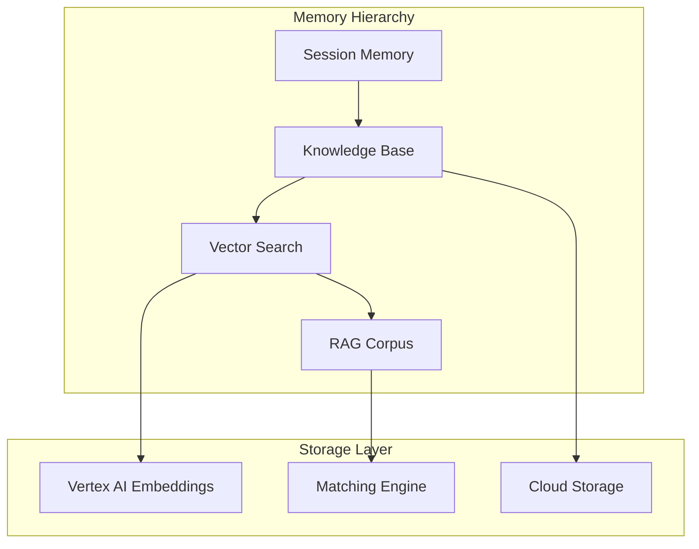
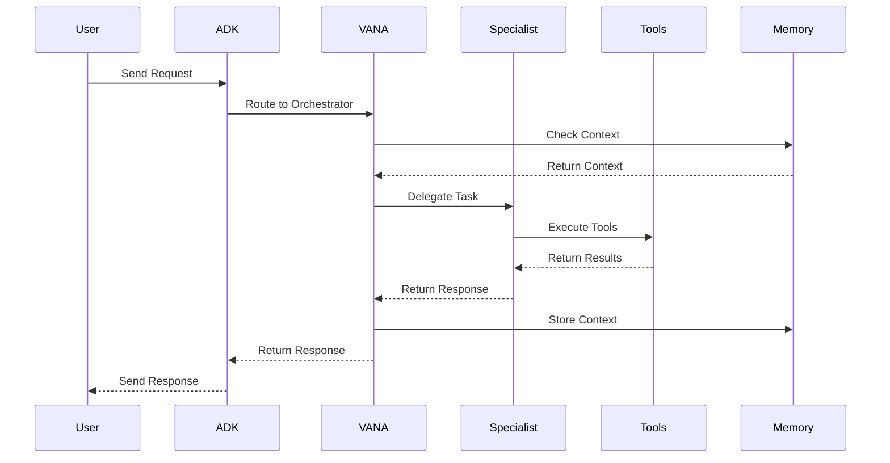
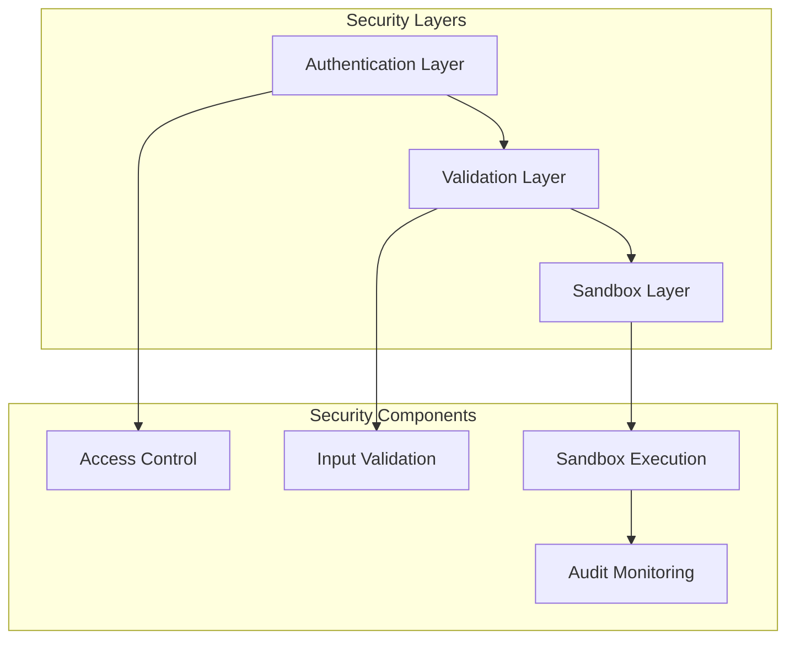

# 🏗️ VANA System Architecture

## 📊 Overview
VANA is an advanced multi-agent AI system built on Google's Agent Development Kit (ADK), featuring a discoverable multi-agent system with core tools plus conditional tools. The system uses a simplified multi-agent architecture with proxy pattern for optimal performance and maintainability.

> **📊 Visual Architecture**: See our [complete system architecture diagram](../assets/diagrams/system-architecture.md) for a visual overview.

## ✅ Verified System Status (2025-06-21)
- **Agents**: Discoverable multi-agent system (real agents + proxy pattern)
- **Tools**: Core tools plus conditional tools
- **Architecture**: Simplified multi-agent with proxy pattern
- **Deployment**: Google Cloud Run (dev & prod environments)
- **Status**: ✅ Operational

## 🔧 Core Components

### 🤖 Agent Architecture

> **🔄 Agent Interactions**: See our [agent interaction flow diagrams](../assets/diagrams/agent-interactions.md) for detailed coordination patterns.

#### Real Agents
1. **VANA Orchestrator** (`agents/vana/team.py`)
   - Central coordinator with core tools plus conditional tools
   - Model: gemini-2.0-flash-exp
   - Capabilities: File operations, search, coordination, task analysis, workflows

2. **Code Execution Specialist** (`agents/code_execution/specialist.py`)
   - Secure multi-language code execution (Python, JavaScript, Shell)
   - Sandbox isolation with resource monitoring and timeouts
   - Coordinates with VANA for complex development tasks

3. **Data Science Specialist** (`agents/data_science/specialist.py`)
   - Data analysis, visualization, and machine learning capabilities
   - Leverages Code Execution Specialist for secure Python execution
   - Statistical computing and data processing workflows

#### Proxy Agents - Discovery Pattern
- **Memory Agent** - Delegates to VANA (`agents/memory/__init__.py`)
- **Orchestration Agent** - Delegates to VANA (`agents/orchestration/__init__.py`)
- **Specialists Agent** - Delegates to VANA (`agents/specialists/__init__.py`)
- **Workflows Agent** - Delegates to VANA (`agents/workflows/__init__.py`)

### 🛠️ Tool Integration Layer

> **🛠️ Tool Organization**: See our [tool organization diagrams](../assets/diagrams/tool-organization.md) for visual breakdown of all tools.

VANA provides core tools always available, plus conditional tools when dependencies are available:

#### Core Tools - Always Available
- **File System Tools**: `adk_read_file`, `adk_write_file`, `adk_list_directory`, `adk_file_exists`
- **Search Tools**: `adk_vector_search`, `adk_web_search`, `adk_search_knowledge`
- **System Tools**: `adk_echo`, `adk_get_health_status`
- **Agent Coordination Tools**: `adk_coordinate_task`, `adk_delegate_to_agent`, `adk_get_agent_status`, `adk_transfer_to_agent`
- **Task Analysis Tools**: `adk_analyze_task`, `adk_match_capabilities`, `adk_classify_task`
- **Workflow Management Tools**: Complete workflow lifecycle management tools

#### Conditional Tools
- **Specialist Tools**: Available when `agents.specialists.agent_tools` imports successfully
- **Orchestration Tools**: Advanced task complexity analysis and specialist routing

#### Tool Architecture
- **Standardized Interface**: All tools follow ADK FunctionTool pattern
- **Error Handling**: Consistent error responses and logging
- **Performance Monitoring**: Built-in execution timing and metrics
- **Security**: Input validation and secure execution patterns

### Memory Systems
VANA implements a sophisticated memory hierarchy:

1. **Session Memory**: Immediate conversation context and state management
2. **Knowledge Base**: Structured information storage with semantic search capabilities
3. **Vector Search**: Semantic retrieval across large knowledge corpora using Vertex AI
4. **RAG Integration**: Real-time augmented generation with Google's RAG Corpus

#### Memory Architecture


### ☁️ Infrastructure Layer

> **🚀 Deployment Architecture**: See our [deployment architecture diagrams](../assets/diagrams/deployment-architecture.md) for complete infrastructure overview.

Built on Google Cloud Platform with enterprise-grade reliability:

#### Google Cloud Services
- **Google ADK**: Agent framework and runtime environment
- **Cloud Run**: Serverless container deployment with auto-scaling
- **Vertex AI**: Vector search, text embeddings, and language models
- **RAG Corpus**: Knowledge storage and semantic search
- **Secret Manager**: Secure credential management (zero hardcoded credentials)

#### Deployment Environments
- **Development**: https://vana-dev-960076421399.us-central1.run.app
- **Production**: https://vana-prod-960076421399.us-central1.run.app

#### Infrastructure Features
- **Auto-scaling**: Dynamic resource allocation (0-10 instances production)
- **Security**: Google Cloud IAM integration and service account authentication
- **Monitoring**: Built-in Cloud Run metrics plus custom monitoring
- **Container Registry**: Google Container Registry for image management

## Data Flow

### Request Processing Flow


### Agent-as-Tool Pattern
VANA implements sophisticated agent delegation:

1. **Task Analysis**: VANA analyzes incoming requests to determine optimal specialist
2. **Agent Selection**: Intelligent routing based on task type and agent capabilities
3. **Tool Execution**: Specialists execute domain-specific tools and operations
4. **Result Aggregation**: VANA consolidates results and provides unified responses
5. **Context Preservation**: Memory systems maintain conversation state across interactions

## Security Architecture

### Multi-Layer Security Model


#### Security Features
- **Input Validation**: Comprehensive validation of all user inputs and tool parameters
- **Sandbox Isolation**: Secure code execution in isolated Docker containers
- **Access Control**: Role-based permissions and resource access management
- **Audit Logging**: Complete audit trail of all system operations and security events

### Threat Mitigation
- **Code Injection Prevention**: AST parsing and pattern matching for malicious code detection
- **Resource Limits**: Memory, CPU, and execution time constraints for all operations
- **Network Isolation**: Restricted network access for sandbox environments
- **Secret Management**: Google Secret Manager integration for credential security

## Scalability Considerations

### Performance Characteristics
- **Response Time**: Sub-5-second response times for most operations
- **Concurrent Users**: Supports multiple simultaneous user sessions
- **Agent Scaling**: Dynamic agent creation and lifecycle management
- **Tool Optimization**: Intelligent caching and rate limit protection

### Scaling Strategies
- **Horizontal Scaling**: Cloud Run auto-scaling based on request volume
- **Agent Pooling**: Efficient agent reuse and resource optimization
- **Caching Layers**: Multi-level caching for frequently accessed data
- **Load Distribution**: Intelligent request routing and load balancing

## Integration Points

### External Service Integration
- **MCP Servers**: GitHub, Brave Search, Fetch, and custom integrations
- **Google Cloud Services**: Vertex AI, Cloud Storage, Secret Manager
- **Third-Party APIs**: Configurable integration with external services
- **Webhook Support**: Real-time event processing and notifications

### Development Integration
- **CI/CD Pipeline**: Automated testing and deployment workflows
- **Monitoring Integration**: Comprehensive observability and alerting
- **API Gateway**: RESTful API access for external applications
- **SDK Support**: Client libraries for common programming languages

## System Health and Monitoring

### Health Check Endpoints
VANA provides comprehensive health monitoring through standardized endpoints:

```http
GET /health
Response: {
  "status": "healthy",
  "agent": "vana",
  "mcp_enabled": true,
  "timestamp": "2025-06-12T15:30:00Z"
}

GET /info
Response: {
  "system_status": "operational",
  "agent_architecture": "multi-agent with proxy pattern",
  "tool_categories": ["file_system", "search", "system", "coordination", "task_analysis", "workflow_management"],
  "conditional_tools": "variable",
  "memory_systems": ["adk_session", "vertex_ai_rag", "vector_search"]
}
```

### Performance Metrics
- **Response Time**: Target <5 seconds for most operations
- **Availability**: 99.9% uptime SLA
- **Throughput**: Supports concurrent multi-user sessions
- **Resource Utilization**: Optimized memory and CPU usage

### Observability Stack
- **Logging**: Structured logging with Cloud Logging integration
- **Metrics**: Custom metrics for agent performance and tool usage
- **Tracing**: Distributed tracing for request flow analysis
- **Alerting**: Proactive monitoring with automated incident response
