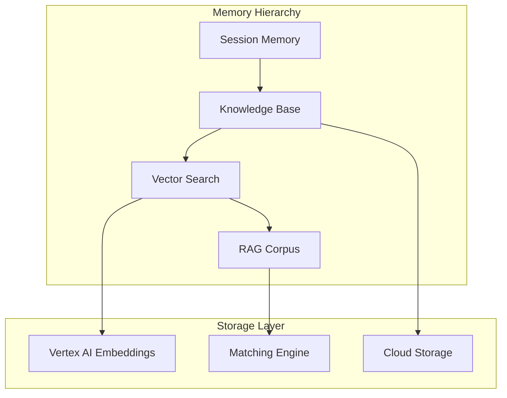
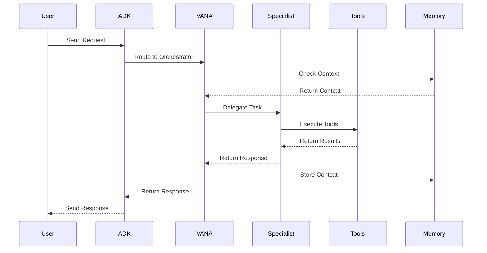
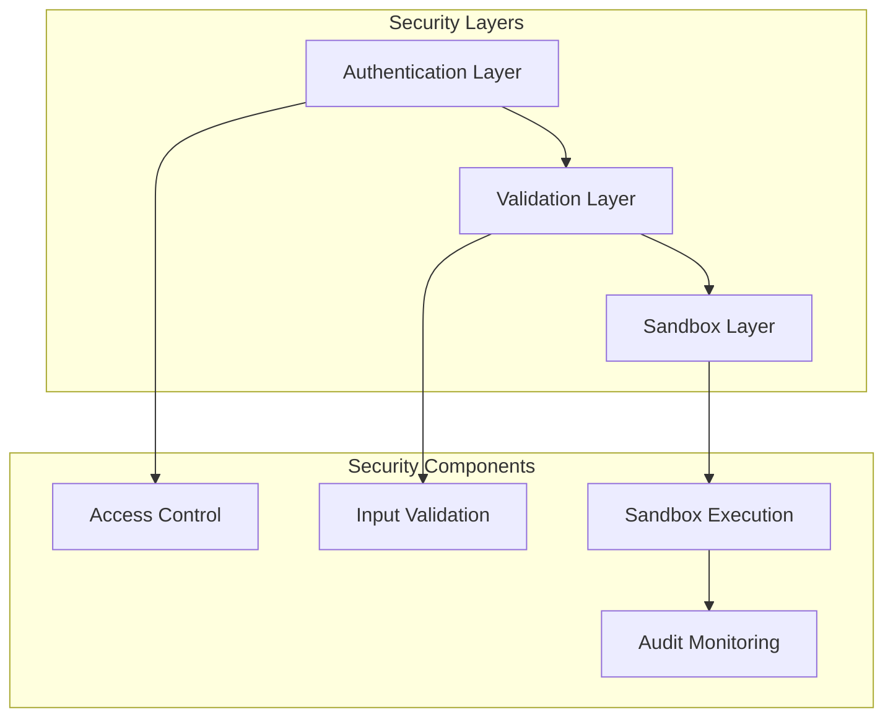

# VANA System Architecture

## Overview
VANA is a multi-agent AI system built on Google ADK with comprehensive tool integration, memory systems, and secure code execution capabilities. The system provides intelligent task coordination, specialist agent delegation, and seamless integration with external services.

## Core Components

### Agent Layer
VANA operates with a sophisticated multi-agent architecture featuring:

- **Orchestration Agents**: Coordinate complex workflows and delegate tasks to appropriate specialists
- **Specialist Agents**: Handle specific domains with deep expertise (code execution, data science, architecture, etc.)
- **Utility Agents**: Provide supporting functionality (memory management, workflow coordination)

#### Agent Types
1. **VANA Master Orchestrator**: Central coordination hub for all system operations
2. **Code Execution Specialist**: Secure multi-language code execution with sandbox isolation
3. **Data Science Specialist**: Advanced data analysis, visualization, and machine learning capabilities
4. **Memory Agent**: Intelligent information storage, retrieval, and context management
5. **Workflow Orchestrator**: Complex multi-step task coordination and execution

### Tool Integration Layer
VANA integrates 59+ tools across multiple categories:

- **Native Tools**: Built-in VANA functionality (echo, search_knowledge, coordinate_task)
- **MCP Tools**: External service integration via Model Context Protocol
- **Sandbox Tools**: Secure code execution with multi-language support (Python, JavaScript, Shell)
- **Memory Tools**: Session management, vector search, and knowledge base operations

#### Tool Categories
- **Core Tools**: File system operations, search capabilities, system utilities
- **Advanced Tools**: Long-running processes, third-party integrations, agent-as-tool patterns
- **Security Tools**: Access control, validation, and security policy enforcement

### Memory Systems
VANA implements a sophisticated memory hierarchy:

1. **Session Memory**: Immediate conversation context and state management
2. **Knowledge Base**: Structured information storage with semantic search capabilities
3. **Vector Search**: Semantic retrieval across large knowledge corpora using Vertex AI
4. **RAG Integration**: Real-time augmented generation with Google's RAG Corpus

#### Memory Architecture


### Infrastructure Layer
Built on Google Cloud Platform with enterprise-grade reliability:

- **Google ADK**: Agent framework and runtime environment
- **Cloud Run**: Containerized deployment with auto-scaling
- **Vertex AI**: LLM services and embedding generation
- **Docker**: Containerization for sandbox environments and deployment

#### Infrastructure Components
- **Container Orchestration**: Docker-based sandbox environments for secure code execution
- **Auto-scaling**: Dynamic resource allocation based on demand
- **Load Balancing**: Intelligent request distribution across agent instances
- **Monitoring**: Comprehensive observability with Cloud Logging and Monitoring

## Data Flow

### Request Processing Flow


### Agent-as-Tool Pattern
VANA implements sophisticated agent delegation:

1. **Task Analysis**: VANA analyzes incoming requests to determine optimal specialist
2. **Agent Selection**: Intelligent routing based on task type and agent capabilities
3. **Tool Execution**: Specialists execute domain-specific tools and operations
4. **Result Aggregation**: VANA consolidates results and provides unified responses
5. **Context Preservation**: Memory systems maintain conversation state across interactions

## Security Architecture

### Multi-Layer Security Model


#### Security Features
- **Input Validation**: Comprehensive validation of all user inputs and tool parameters
- **Sandbox Isolation**: Secure code execution in isolated Docker containers
- **Access Control**: Role-based permissions and resource access management
- **Audit Logging**: Complete audit trail of all system operations and security events

### Threat Mitigation
- **Code Injection Prevention**: AST parsing and pattern matching for malicious code detection
- **Resource Limits**: Memory, CPU, and execution time constraints for all operations
- **Network Isolation**: Restricted network access for sandbox environments
- **Secret Management**: Google Secret Manager integration for credential security

## Scalability Considerations

### Performance Characteristics
- **Response Time**: Sub-5-second response times for most operations
- **Concurrent Users**: Supports multiple simultaneous user sessions
- **Agent Scaling**: Dynamic agent creation and lifecycle management
- **Tool Optimization**: Intelligent caching and rate limit protection

### Scaling Strategies
- **Horizontal Scaling**: Cloud Run auto-scaling based on request volume
- **Agent Pooling**: Efficient agent reuse and resource optimization
- **Caching Layers**: Multi-level caching for frequently accessed data
- **Load Distribution**: Intelligent request routing and load balancing

## Integration Points

### External Service Integration
- **MCP Servers**: GitHub, Brave Search, Fetch, and custom integrations
- **Google Cloud Services**: Vertex AI, Cloud Storage, Secret Manager
- **Third-Party APIs**: Configurable integration with external services
- **Webhook Support**: Real-time event processing and notifications

### Development Integration
- **CI/CD Pipeline**: Automated testing and deployment workflows
- **Monitoring Integration**: Comprehensive observability and alerting
- **API Gateway**: RESTful API access for external applications
- **SDK Support**: Client libraries for common programming languages

## System Health and Monitoring

### Health Check Endpoints
VANA provides comprehensive health monitoring through standardized endpoints:

```http
GET /health
Response: {
  "status": "healthy",
  "agent": "vana",
  "mcp_enabled": true,
  "timestamp": "2025-06-12T15:30:00Z"
}

GET /info
Response: {
  "system_status": "operational",
  "total_agents": 24,
  "active_agents": 7,
  "available_tools": 59,
  "memory_systems": ["session", "knowledge", "vector", "rag"]
}
```

### Performance Metrics
- **Response Time**: Target <5 seconds for most operations
- **Availability**: 99.9% uptime SLA
- **Throughput**: Supports concurrent multi-user sessions
- **Resource Utilization**: Optimized memory and CPU usage

### Observability Stack
- **Logging**: Structured logging with Cloud Logging integration
- **Metrics**: Custom metrics for agent performance and tool usage
- **Tracing**: Distributed tracing for request flow analysis
- **Alerting**: Proactive monitoring with automated incident response
