# Vana Technical Architecture Diagrams

## ⚠️ Implementation Status

**Last Updated**: 2024-10-17

These diagrams represent **aspirational production architecture**. The current implementation is significantly simpler:

### Current State (Development/MVP)
- ✅ **Runtime**: Local development with PM2 process manager
- ✅ **Backend**: FastAPI on port 8000 (single process)
- ✅ **Frontend**: Next.js on port 3000 (development server)
- ✅ **ADK**: Google Agent Development Kit on port 8080
- ✅ **Database**: SQLite for local development (`auth.db`)
- ✅ **Authentication**: JWT with HTTP-only cookies
- ✅ **SSE Streaming**: Real-time agent communication implemented
- ✅ **Session Storage**: SQLite-based with GCS backup support (configured but optional)

### Aspirational Architecture (Shown in Diagrams)
- ❌ **Kubernetes (GKE)**: Not deployed - diagrams show multi-pod architecture
- ❌ **CloudFlare CDN/WAF**: Not configured - diagrams show full CDN stack
- ❌ **Load Balancers**: Not implemented - diagrams show L4/L7 load balancing
- ❌ **Redis Cluster**: Not deployed - diagrams show Redis replication
- ❌ **Cloud SQL (PostgreSQL)**: Not configured - currently using SQLite
- ❌ **Auto-scaling**: Not configured - diagrams show HPA/VPA/CA
- ❌ **Pub/Sub**: Not implemented - diagrams show event-driven architecture
- ❌ **Cloud Monitoring Stack**: Not fully configured - basic logging only

### Gap Summary
The diagrams illustrate **where the system should be for production**, not where it currently is. Think of these as:
- **Architectural targets** for production readiness
- **Design patterns** to follow when scaling
- **Infrastructure blueprints** for future deployment

For **current development setup**, see:
- `pm2 start ecosystem.config.js` for service orchestration
- `CLAUDE.md` for actual service architecture and ports
- `.env.local` for configuration (SQLite, JWT, API keys)

---

## System Architecture Overview

### High-Level System Architecture

```mermaid
graph TB
    User[👤 User] --> Frontend[🌐 Next.js Frontend]
    Frontend --> Nginx[🔀 Nginx Proxy]
    Nginx --> Backend[⚡ FastAPI Backend]

    Backend --> Auth[🔐 Auth Service]
    Backend --> AI[🤖 AI Orchestrator]
    Backend --> Session[💾 Session Store]

    AI --> GoogleAI[🔍 Google AI]
    AI --> OpenRouter[🌐 OpenRouter]
    AI --> BraveSearch[🔎 Brave Search]

    Session --> SQLite[(💽 SQLite)]
    Session --> GCS[☁️ Google Cloud Storage]

    Backend --> Redis[(🏃 Redis Cache)]
    Backend --> Postgres[(🐘 PostgreSQL)]

    subgraph "Security Layer 🛡️"
        MW1[Security Headers]
        MW2[CORS Policy]
        MW3[Circuit Breaker]
        MW4[Rate Limiter]
        MW5[Auth Middleware]
        MW6[Audit Logger]
    end

    Backend --> MW1
    MW1 --> MW2
    MW2 --> MW3
    MW3 --> MW4
    MW4 --> MW5
    MW5 --> MW6

    classDef frontend fill:#e1f5fe
    classDef backend fill:#f3e5f5
    classDef database fill:#e8f5e8
    classDef security fill:#fff3e0
    classDef external fill:#ffebee

    class Frontend frontend
    class Backend,Auth,AI,Session backend
    class SQLite,GCS,Redis,Postgres database
    class MW1,MW2,MW3,MW4,MW5,MW6 security
    class GoogleAI,OpenRouter,BraveSearch external
```



---

## Authentication & Authorization Flow

### JWT Authentication Sequence

```mermaid
sequenceDiagram
    participant Client as 🌐 Client
    participant Frontend as 📱 Frontend
    participant Nginx as 🔀 Nginx
    participant Middleware as 🛡️ Middleware
    participant Auth as 🔐 Auth Service
    participant Backend as ⚡ Backend
    participant DB as 💾 Database

    Note over Client,DB: User Login Flow
    Client->>Frontend: Login Request
    Frontend->>Nginx: POST /auth/login
    Nginx->>Middleware: Route Request
    Middleware->>Auth: Validate Credentials
    Auth->>DB: Check User Credentials
    DB-->>Auth: User Data
    Auth->>Auth: Generate JWT Token
    Auth-->>Middleware: JWT + User Context
    Middleware-->>Nginx: Login Response
    Nginx-->>Frontend: Set HTTP-Only Cookie
    Frontend-->>Client: Login Success

    Note over Client,DB: Authenticated Request Flow
    Client->>Frontend: API Request
    Frontend->>Nginx: Request + JWT Cookie
    Nginx->>Middleware: Forward Request
    Middleware->>Middleware: Rate Limit Check
    Middleware->>Middleware: Circuit Breaker Check
    Middleware->>Auth: Validate JWT
    Auth->>Auth: Token Verification
    Auth-->>Middleware: User Context
    Middleware->>Backend: Authorized Request
    Backend-->>Middleware: Response Data
    Middleware-->>Nginx: Response
    Nginx-->>Frontend: Response
    Frontend-->>Client: UI Update
```



---

## Real-time Communication Architecture

### Server-Sent Events (SSE) Flow

```mermaid
graph TB
    Client[👤 User Input] --> Frontend[🌐 Frontend React]
    Frontend --> PostAPI[📤 POST /api/run_sse]
    Frontend --> SSEConnection[📡 GET /agent_network_sse]

    PostAPI --> Orchestrator[🤖 Research Orchestrator]
    SSEConnection --> Broadcaster[📻 SSE Broadcaster]

    Orchestrator --> Agent1[Agent: Researcher]
    Orchestrator --> Agent2[Agent: Analyzer]
    Orchestrator --> Agent3[Agent: Synthesizer]

    Agent1 --> GoogleAI[🔍 Google AI API]
    Agent2 --> OpenRouter[🌐 OpenRouter API]
    Agent3 --> BraveSearch[🔎 Brave Search API]

    Agent1 --> EventBus[📨 Event Bus]
    Agent2 --> EventBus
    Agent3 --> EventBus

    EventBus --> Broadcaster
    Broadcaster --> SSEConnection
    SSEConnection --> Frontend
    Frontend --> UI[🖥️ Real-time UI Updates]

    subgraph "Session Persistence"
        EventBus --> SessionStore[💾 Session Store]
        SessionStore --> SQLite[(Local SQLite)]
        SessionStore --> GCSBackup[☁️ GCS Backup]
    end

    classDef user fill:#e3f2fd
    classDef frontend fill:#e1f5fe
    classDef backend fill:#f3e5f5
    classDef agents fill:#e8f5e8
    classDef external fill:#ffebee
    classDef storage fill:#fff8e1

    class Client,UI user
    class Frontend frontend
    class PostAPI,SSEConnection,Orchestrator,Broadcaster,EventBus backend
    class Agent1,Agent2,Agent3 agents
    class GoogleAI,OpenRouter,BraveSearch external
    class SessionStore,SQLite,GCSBackup storage
```



---

## Security Architecture Deep Dive

### Multi-Layer Security Model


---

## Data Flow Architecture

### Request/Response Data Flow

```mermaid
flowchart TD
    Start([👤 User Interaction]) --> Input{Input Type?}

    Input -->|Chat Message| ChatFlow[💬 Chat Flow]
    Input -->|Auth Request| AuthFlow[🔐 Auth Flow]
    Input -->|API Request| APIFlow[🔌 API Flow]

    ChatFlow --> ValidateChat[✅ Input Validation]
    ValidateChat --> SessionMgmt[📝 Session Management]
    SessionMgmt --> AIOrchestrator[🤖 AI Orchestration]

    AIOrchestrator --> MultiAgent[🎭 Multi-Agent Research]
    MultiAgent --> Agent1[🔍 Research Agent]
    MultiAgent --> Agent2[📊 Analysis Agent]
    MultiAgent --> Agent3[✍️ Synthesis Agent]

    Agent1 --> GoogleAPI[🔍 Google AI API]
    Agent2 --> OpenRouterAPI[🌐 OpenRouter API]
    Agent3 --> BraveAPI[🔎 Brave Search API]

    GoogleAPI --> EventStream[📡 Event Stream]
    OpenRouterAPI --> EventStream
    BraveAPI --> EventStream

    EventStream --> SSEBroadcast[📻 SSE Broadcast]
    SSEBroadcast --> Frontend[🌐 Frontend Update]

    AuthFlow --> AuthValidation[🔐 Credential Validation]
    AuthValidation --> JWTGeneration[🎫 JWT Generation]
    JWTGeneration --> CookieSet[🍪 Cookie Setting]
    CookieSet --> AuthResponse[✅ Auth Response]

    APIFlow --> RateCheck[🚦 Rate Limiting]
    RateCheck --> AuthCheck[🔐 Authentication]
    AuthCheck --> BusinessLogic[⚙️ Business Logic]
    BusinessLogic --> DataAccess[💾 Data Access]
    DataAccess --> APIResponse[📤 API Response]

    subgraph "Data Persistence Layer"
        direction LR
        LocalDB[(💽 Local SQLite)]
        CloudBackup[(☁️ GCS Backup)]
        RedisCache[(🏃 Redis Cache)]
        PostgresDB[(🐘 PostgreSQL)]

        LocalDB <--> CloudBackup
        RedisCache <--> PostgresDB
    end

    SessionMgmt --> LocalDB
    DataAccess --> PostgresDB
    BusinessLogic --> RedisCache

    Frontend --> End([🎯 User Experience])
    AuthResponse --> End
    APIResponse --> End

    classDef start fill:#e8f5e8
    classDef process fill:#e1f5fe
    classDef decision fill:#fff3e0
    classDef external fill:#ffebee
    classDef storage fill:#f3e5f5
    classDef end fill:#e8f5e8

    class Start,End start
    class ValidateChat,SessionMgmt,AIOrchestrator,MultiAgent,EventStream,SSEBroadcast,AuthValidation,JWTGeneration,CookieSet,RateCheck,AuthCheck,BusinessLogic,DataAccess process
    class Input decision
    class GoogleAPI,OpenRouterAPI,BraveAPI external
    class LocalDB,CloudBackup,RedisCache,PostgresDB storage
```

---

## Infrastructure & Deployment Architecture

### Production Deployment Architecture

```mermaid
graph TB
    subgraph "External Traffic"
        Users[👥 Users]
        Bots[🤖 Search Bots]
    end

    Users --> Internet[🌍 Internet]
    Bots --> Internet

    Internet --> CDN[☁️ CloudFlare CDN]
    CDN --> DDoS[🛡️ DDoS Protection]
    DDoS --> WAF[🔥 Web Application Firewall]

    WAF --> GCP_LB[⚖️ Google Cloud Load Balancer]
    GCP_LB --> SSL[🔒 SSL/TLS Termination]

    subgraph "Google Kubernetes Engine Cluster"
        direction TB

        subgraph "Frontend Tier"
            NextJS1[📱 Next.js Pod 1]
            NextJS2[📱 Next.js Pod 2]
            NextJS3[📱 Next.js Pod 3]
            FrontendSVC[🔄 Frontend Service]
            NextJS1 --> FrontendSVC
            NextJS2 --> FrontendSVC
            NextJS3 --> FrontendSVC
        end

        subgraph "Backend Tier"
            FastAPI1[⚡ FastAPI Pod 1]
            FastAPI2[⚡ FastAPI Pod 2]
            FastAPI3[⚡ FastAPI Pod 3]
            BackendSVC[🔄 Backend Service]
            FastAPI1 --> BackendSVC
            FastAPI2 --> BackendSVC
            FastAPI3 --> BackendSVC
        end

        subgraph "Cache Tier"
            Redis1[🏃 Redis Primary]
            Redis2[🏃 Redis Replica 1]
            Redis3[🏃 Redis Replica 2]
            RedisCluster[🔄 Redis Cluster]
            Redis1 --> RedisCluster
            Redis2 --> RedisCluster
            Redis3 --> RedisCluster
        end

        FrontendSVC --> BackendSVC
        BackendSVC --> RedisCluster
    end

    SSL --> FrontendSVC

    subgraph "Managed Services"
        direction TB
        CloudSQL[(🐘 Cloud SQL PostgreSQL)]
        SecretManager[🔐 Secret Manager]
        CloudStorage[☁️ Cloud Storage]
        PubSub[📨 Pub/Sub]
    end

    BackendSVC --> CloudSQL
    BackendSVC --> SecretManager
    BackendSVC --> CloudStorage
    BackendSVC --> PubSub

    subgraph "External AI Services"
        direction LR
        GoogleAI[🔍 Google AI Platform]
        OpenRouter[🌐 OpenRouter API]
        BraveSearch[🔎 Brave Search API]
    end

    BackendSVC --> GoogleAI
    BackendSVC --> OpenRouter
    BackendSVC --> BraveSearch

    subgraph "Monitoring & Observability"
        direction TB
        CloudLogging[📄 Cloud Logging]
        CloudMonitoring[📊 Cloud Monitoring]
        CloudTrace[🔍 Cloud Trace]
        Alerting[🚨 Alerting]

        CloudLogging --> Alerting
        CloudMonitoring --> Alerting
        CloudTrace --> Alerting
    end

    BackendSVC --> CloudLogging
    BackendSVC --> CloudMonitoring
    BackendSVC --> CloudTrace

    classDef external fill:#ffebee
    classDef network fill:#e3f2fd
    classDef compute fill:#e1f5fe
    classDef storage fill:#e8f5e8
    classDef security fill:#fff3e0
    classDef monitoring fill:#f3e5f5

    class Users,Bots,Internet,GoogleAI,OpenRouter,BraveSearch external
    class CDN,DDoS,WAF,GCP_LB,SSL network
    class NextJS1,NextJS2,NextJS3,FastAPI1,FastAPI2,FastAPI3,Redis1,Redis2,Redis3,FrontendSVC,BackendSVC,RedisCluster compute
    class CloudSQL,SecretManager,CloudStorage,PubSub storage
    class CloudLogging,CloudMonitoring,CloudTrace,Alerting monitoring
```



---

## Component Interaction Patterns

### Frontend Component Architecture

```mermaid
graph TB
    subgraph "Next.js Application"
        direction TB

        subgraph "Pages Layer"
            HomePage[🏠 Home Page]
            AuthPage[🔐 Auth Page]
            ChatPage[💬 Chat Page]
        end

        subgraph "Components Layer"
            direction TB

            subgraph "Layout Components"
                Sidebar[📋 Sidebar]
                Header[🎯 Header]
                Footer[📄 Footer]
            end

            subgraph "Feature Components"
                ChatContainer[💬 Chat Container]
                MessageList[📝 Message List]
                PromptInput[⌨️ Prompt Input]
                AgentStatus[🤖 Agent Status]
                SSEComponent[📡 SSE Component]
            end

            subgraph "UI Components"
                Button[🔘 Button]
                Input[📝 Input]
                Modal[🪟 Modal]
                Toast[🍞 Toast]
                Loading[⏳ Loading]
            end
        end

        subgraph "Hooks & State Management"
            direction TB

            subgraph "Custom Hooks"
                useAuth[🔐 useAuth]
                useSSE[📡 useSSE]
                useChatState[💬 useChatState]
                useChatStream[📊 useChatStream]
            end

            subgraph "State Stores"
                AuthStore[🔐 Auth Store]
                ChatStore[💬 Chat Store]
                UIStore[🎨 UI Store]
            end

            subgraph "API Layer"
                APIClient[🔌 API Client]
                AuthAPI[🔐 Auth API]
                ChatAPI[💬 Chat API]
                SSEAPI[📡 SSE API]
            end
        end

        subgraph "Utilities & Services"
            direction TB
            EnvConfig[⚙️ Environment Config]
            Logger[📄 Logger]
            ErrorBoundary[🚨 Error Boundary]
            PerformanceMonitor[📊 Performance Monitor]
        end
    end

    HomePage --> ChatContainer
    ChatPage --> ChatContainer
    AuthPage --> useAuth

    ChatContainer --> MessageList
    ChatContainer --> PromptInput
    ChatContainer --> AgentStatus
    ChatContainer --> SSEComponent

    SSEComponent --> useSSE
    ChatContainer --> useChatState
    MessageList --> useChatStream

    useAuth --> AuthStore
    useAuth --> AuthAPI
    useChatState --> ChatStore
    useChatState --> ChatAPI
    useSSE --> SSEAPI

    AuthAPI --> APIClient
    ChatAPI --> APIClient
    SSEAPI --> APIClient

    APIClient --> EnvConfig

    classDef page fill:#e3f2fd
    classDef component fill:#e1f5fe
    classDef hook fill:#f3e5f5
    classDef store fill:#e8f5e8
    classDef api fill:#fff3e0
    classDef utility fill:#fce4ec

    class HomePage,AuthPage,ChatPage page
    class Sidebar,Header,Footer,ChatContainer,MessageList,PromptInput,AgentStatus,SSEComponent,Button,Input,Modal,Toast,Loading component
    class useAuth,useSSE,useChatState,useChatStream hook
    class AuthStore,ChatStore,UIStore store
    class APIClient,AuthAPI,ChatAPI,SSEAPI api
    class EnvConfig,Logger,ErrorBoundary,PerformanceMonitor utility
```



---

## Performance & Scalability Architecture

### System Performance Optimization

```mermaid
graph TB
    subgraph "Frontend Performance"
        direction TB

        subgraph "Code Splitting"
            LazyLoading[📦 Lazy Loading]
            RouteChunks[🛤️ Route-based Chunks]
            ComponentChunks[🧩 Component Chunks]
        end

        subgraph "Caching Strategy"
            ServiceWorker[👷 Service Worker]
            BrowserCache[🗄️ Browser Cache]
            CDNCache[☁️ CDN Cache]
        end

        subgraph "Bundle Optimization"
            TreeShaking[🌳 Tree Shaking]
            Minification[📦 Minification]
            Compression[🗜️ Gzip/Brotli]
        end
    end

    subgraph "Backend Performance"
        direction TB

        subgraph "Caching Layers"
            ApplicationCache[🏃 Application Cache]
            RedisCache[🏃 Redis Cache]
            DatabaseCache[💾 Database Query Cache]
        end

        subgraph "Connection Pooling"
            DBPool[🐘 DB Connection Pool]
            HTTPPool[🌐 HTTP Connection Pool]
            AIServicePool[🤖 AI Service Pool]
        end

        subgraph "Async Processing"
            BackgroundTasks[📋 Background Tasks]
            MessageQueues[📨 Message Queues]
            EventStreaming[📡 Event Streaming]
        end
    end

    subgraph "Infrastructure Performance"
        direction TB

        subgraph "Load Balancing"
            L4LoadBalancer[⚖️ Layer 4 LB]
            L7LoadBalancer[🔀 Layer 7 LB]
            ServiceMesh[🕸️ Service Mesh]
        end

        subgraph "Auto Scaling"
            HPAutoscaler[📈 Horizontal Pod Autoscaler]
            VPAutoscaler[📊 Vertical Pod Autoscaler]
            ClusterAutoscaler[🔄 Cluster Autoscaler]
        end

        subgraph "Resource Optimization"
            CPUOptimization[🖥️ CPU Optimization]
            MemoryOptimization[🧠 Memory Optimization]
            NetworkOptimization[🌐 Network Optimization]
        end
    end

    subgraph "Monitoring & Observability"
        direction TB

        subgraph "Performance Metrics"
            ResponseTime[⏱️ Response Time]
            Throughput[📊 Throughput]
            ErrorRate[🚨 Error Rate]
            SaturationMetrics[📈 Saturation]
        end

        subgraph "Real-time Monitoring"
            APMTool[📊 APM Tool]
            LogAggregation[📄 Log Aggregation]
            MetricsDashboard[📈 Metrics Dashboard]
            Alerting[🚨 Alerting System]
        end
    end

    LazyLoading --> ServiceWorker
    RouteChunks --> BrowserCache
    ComponentChunks --> CDNCache

    ApplicationCache --> RedisCache
    RedisCache --> DatabaseCache

    DBPool --> BackgroundTasks
    HTTPPool --> MessageQueues
    AIServicePool --> EventStreaming

    L4LoadBalancer --> HPAutoscaler
    L7LoadBalancer --> VPAutoscaler
    ServiceMesh --> ClusterAutoscaler

    ResponseTime --> APMTool
    Throughput --> LogAggregation
    ErrorRate --> MetricsDashboard
    SaturationMetrics --> Alerting

    classDef frontend fill:#e1f5fe
    classDef backend fill:#f3e5f5
    classDef infrastructure fill:#e8f5e8
    classDef monitoring fill:#fff3e0

    class LazyLoading,RouteChunks,ComponentChunks,ServiceWorker,BrowserCache,CDNCache,TreeShaking,Minification,Compression frontend
    class ApplicationCache,RedisCache,DatabaseCache,DBPool,HTTPPool,AIServicePool,BackgroundTasks,MessageQueues,EventStreaming backend
    class L4LoadBalancer,L7LoadBalancer,ServiceMesh,HPAutoscaler,VPAutoscaler,ClusterAutoscaler,CPUOptimization,MemoryOptimization,NetworkOptimization infrastructure
    class ResponseTime,Throughput,ErrorRate,SaturationMetrics,APMTool,LogAggregation,MetricsDashboard,Alerting monitoring
```



---

## Error Handling & Recovery Architecture

### Comprehensive Error Management System

```mermaid
graph TB
    subgraph "Error Detection Layer"
        direction TB

        FrontendError[🌐 Frontend Errors]
        BackendError[⚡ Backend Errors]
        InfraError[🏗️ Infrastructure Errors]
        ExternalError[🌍 External API Errors]

        FrontendError --> ErrorBoundary[🚨 Error Boundary]
        BackendError --> ExceptionHandler[🔧 Exception Handler]
        InfraError --> HealthCheck[❤️ Health Check]
        ExternalError --> CircuitBreaker[⚡ Circuit Breaker]
    end

    subgraph "Error Classification"
        direction TB

        ErrorBoundary --> Classification{📊 Error Classification}
        ExceptionHandler --> Classification
        HealthCheck --> Classification
        CircuitBreaker --> Classification

        Classification --> UserError[👤 User Errors]
        Classification --> SystemError[🖥️ System Errors]
        Classification --> NetworkError[🌐 Network Errors]
        Classification --> DataError[💾 Data Errors]
    end

    subgraph "Recovery Strategies"
        direction TB

        UserError --> UserFeedback[💬 User Feedback]
        SystemError --> AutoRetry[🔄 Auto Retry]
        NetworkError --> Fallback[🔄 Fallback Strategy]
        DataError --> DataRecovery[🔧 Data Recovery]

        AutoRetry --> ExponentialBackoff[📈 Exponential Backoff]
        Fallback --> CachedResponse[💾 Cached Response]
        DataRecovery --> BackupRestore[☁️ Backup Restore]
    end

    subgraph "Monitoring & Alerting"
        direction TB

        UserFeedback --> ErrorMetrics[📊 Error Metrics]
        ExponentialBackoff --> ErrorMetrics
        CachedResponse --> ErrorMetrics
        BackupRestore --> ErrorMetrics

        ErrorMetrics --> Dashboard[📈 Error Dashboard]
        ErrorMetrics --> Alerting[🚨 Alert Manager]

        Dashboard --> Analysis[🔍 Error Analysis]
        Alerting --> Incident[🚨 Incident Response]
    end

    subgraph "Learning & Prevention"
        direction TB

        Analysis --> PatternRecognition[🧠 Pattern Recognition]
        Incident --> PostMortem[📝 Post-Mortem]

        PatternRecognition --> PreventiveActions[🛡️ Preventive Actions]
        PostMortem --> ProcessImprovement[📈 Process Improvement]

        PreventiveActions --> CodeImprovement[💻 Code Improvement]
        ProcessImprovement --> TrainingUpdate[📚 Training Update]
    end

    classDef detection fill:#ffebee
    classDef classification fill:#fff3e0
    classDef recovery fill:#e8f5e8
    classDef monitoring fill:#e3f2fd
    classDef learning fill:#f3e5f5

    class FrontendError,BackendError,InfraError,ExternalError,ErrorBoundary,ExceptionHandler,HealthCheck,CircuitBreaker detection
    class Classification,UserError,SystemError,NetworkError,DataError classification
    class UserFeedback,AutoRetry,Fallback,DataRecovery,ExponentialBackoff,CachedResponse,BackupRestore recovery
    class ErrorMetrics,Dashboard,Alerting,Analysis,Incident monitoring
    class PatternRecognition,PostMortem,PreventiveActions,ProcessImprovement,CodeImprovement,TrainingUpdate learning
```



---

## Conclusion

These technical architecture diagrams provide a comprehensive view of the Vana platform's system design, from high-level system architecture to detailed component interactions. Key architectural highlights include:

### Strengths
- **Modern, scalable architecture** with clear separation of concerns
- **Comprehensive security model** with multiple defensive layers
- **Real-time communication** via Server-Sent Events for AI streaming
- **Cloud-native design** ready for Kubernetes deployment
- **Performance-optimized** frontend with code splitting and caching
- **Robust error handling** with circuit breakers and fallback strategies

### Areas for Enhancement
- **Secret management** integration with Google Secret Manager
- **Advanced monitoring** with distributed tracing
- **Auto-scaling** configuration for production workloads
- **Disaster recovery** procedures and backup strategies

These diagrams should be updated quarterly or when significant architectural changes are made to the system.

---

*Generated on {{ current_date }} for Vana Platform Architecture Documentation*