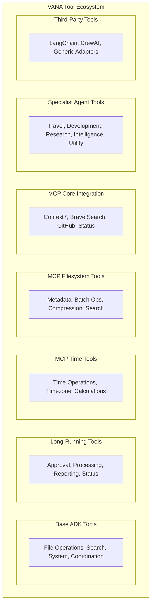

# 🛠️ Tool Architecture

Comprehensive documentation of VANA's standardized tool collection based on actual implementation.

## 📊 Tool Categories Overview



## 🔧 Base ADK Tools

### 📁 File System Operations

#### `read_file(file_path: str) -> str`
**Purpose**: Secure file reading with validation
**Security**: Path validation and access control
**Returns**: File contents as string

```python
# Example usage
content = read_file("docs/README.md")
```

#### `write_file(file_path: str, content: str) -> str`
**Purpose**: File creation and modification
**Security**: Path validation and backup creation
**Returns**: Success confirmation with file details

```python
# Example usage
result = write_file("output.txt", "Hello, World!")
```

#### `list_directory(directory_path: str) -> str`
**Purpose**: Directory exploration and file listing
**Features**: Recursive listing with metadata
**Returns**: Formatted directory structure

```python
# Example usage
files = list_directory("./agents")
```

#### `file_exists(file_path: str) -> str`
**Purpose**: File existence checking
**Returns**: Boolean result with file metadata if exists

```python
# Example usage
exists = file_exists("config.json")
```

### 🔍 Search Operations

#### `vector_search(query: str, limit: int = 10) -> str`
**Purpose**: Semantic search using Vertex AI
**Integration**: Google Cloud Vector Search
**Features**: Semantic understanding, relevance ranking

```python
# Example usage
results = vector_search("machine learning best practices", limit=5)
```

#### `web_search(query: str, num_results: int = 5) -> str`
**Purpose**: Real-time web search with Brave API
**Features**: Current information, snippet extraction
**Enhancement**: AI summaries and enhanced snippets

```python
# Example usage
results = web_search("latest AI developments 2024")
```

#### `search_knowledge(query: str) -> str`
**Purpose**: Hybrid search across multiple sources
**Sources**: Vector search + web search + knowledge graphs
**Returns**: Comprehensive search results with source attribution

```python
# Example usage
knowledge = search_knowledge("Python async programming patterns")
```

### ⚙️ System Operations

#### `echo(message: str) -> str`
**Purpose**: System testing and validation
**Usage**: Health checks, connectivity testing
**Returns**: Echoed message with timestamp

```python
# Example usage
response = echo("System health check")
```

#### `get_health_status() -> str`
**Purpose**: Real-time system health monitoring
**Metrics**: Agent status, tool availability, resource usage
**Returns**: Comprehensive health report

```python
# Example usage
health = get_health_status()
```

### 🤝 Coordination Operations

#### `coordinate_task(task_description: str) -> str`
**Purpose**: Multi-agent task coordination
**Features**: Task routing, dependency management
**Returns**: Coordination plan with agent assignments

#### `delegate_to_agent(agent_name: str, task: str) -> str`
**Purpose**: Intelligent task delegation
**Features**: Agent capability matching, load balancing
**Returns**: Delegation confirmation with tracking ID

#### `get_agent_status(agent_name: str = None) -> str`
**Purpose**: Agent health and availability checking
**Scope**: Single agent or system-wide status
**Returns**: Agent status with performance metrics

#### `transfer_to_agent(agent_name: str) -> None`
**Purpose**: Seamless agent handoffs
**Pattern**: Google ADK automatic transfer
**Usage**: When user explicitly requests agent switch

## ⏳ Long-Running Tools

### `ask_for_approval(request: str) -> str`
**Purpose**: Human-in-the-loop workflows
**Features**: Approval tracking, timeout handling
**Returns**: Task ID for approval monitoring

### `process_large_dataset(dataset_info: str) -> str`
**Purpose**: Batch data processing with progress tracking
**Features**: Chunked processing, status updates
**Returns**: Task ID for progress monitoring

### `generate_report(report_specs: str) -> str`
**Purpose**: Automated report generation
**Features**: Multi-source data aggregation, formatting
**Returns**: Task ID for report generation tracking

### `check_task_status(task_id: str) -> str`
**Purpose**: Asynchronous task monitoring
**Features**: Real-time progress, completion status
**Returns**: Detailed task status with progress percentage

## 🕐 MCP Time Tools

### `get_current_time(timezone: str = "UTC") -> str`
**Purpose**: Current time with timezone support
**Features**: Multiple timezone formats, precision control

### `convert_timezone(datetime_str: str, from_tz: str, to_tz: str) -> str`
**Purpose**: Timezone conversion utilities
**Features**: Daylight saving time handling, format preservation

### `calculate_date(base_date: str, operation: str) -> str`
**Purpose**: Date calculations and arithmetic
**Features**: Business day calculations, holiday awareness

### `format_datetime(datetime_str: str, format_str: str) -> str`
**Purpose**: Advanced datetime formatting
**Features**: Locale support, custom format strings

### `get_time_until(target_datetime: str) -> str`
**Purpose**: Time duration calculations
**Features**: Human-readable durations, countdown timers

### `list_timezones(region: str = None) -> str`
**Purpose**: Available timezone listing
**Features**: Regional filtering, timezone metadata

## 📁 MCP Filesystem Tools

### `get_file_metadata(file_path: str) -> str`
**Purpose**: Detailed file information
**Metadata**: Size, permissions, timestamps, checksums

### `batch_file_operations(operations: str) -> str`
**Purpose**: Bulk file processing
**Operations**: Copy, move, delete, rename in batches

### `compress_files(file_list: str, archive_name: str) -> str`
**Purpose**: File compression utilities
**Formats**: ZIP, TAR, GZIP support

### `extract_archive(archive_path: str, destination: str) -> str`
**Purpose**: Archive extraction
**Features**: Format auto-detection, selective extraction

### `find_files(search_pattern: str, directory: str) -> str`
**Purpose**: Advanced file search
**Features**: Regex patterns, content search, metadata filtering

### `sync_directories(source: str, destination: str) -> str`
**Purpose**: Directory synchronization
**Features**: Incremental sync, conflict resolution

## 🔗 MCP Core Integration

### `context7_sequential_thinking(problem: str) -> str`
**Purpose**: Advanced reasoning capabilities
**Features**: Step-by-step problem solving, structured thinking

### `brave_search_mcp(query: str, options: str = None) -> str`
**Purpose**: Enhanced web search integration
**Features**: Goggles support, AI summaries, enhanced snippets

### `github_mcp_operations(operation: str, params: str) -> str`
**Purpose**: GitHub API operations
**Features**: Repository management, issue tracking, PR operations

### `list_available_mcp_servers() -> str`
**Purpose**: MCP server discovery
**Returns**: Available MCP servers with capabilities

### `get_mcp_integration_status() -> str`
**Purpose**: Integration health monitoring
**Returns**: MCP server status and connectivity

## 🎯 Specialist Agent Tools

### ✈️ Travel Specialist Tools

#### `hotel_search_tool(context: str) -> str`
**Purpose**: Hotel discovery and comparison
**Features**: Multi-platform search, price comparison
**Returns**: Task ID for progress tracking

#### `flight_search_tool(context: str) -> str`
**Purpose**: Flight discovery and booking
**Features**: Multi-airline search, route optimization
**Returns**: Task ID for progress tracking

#### `payment_processing_tool(context: str) -> str`
**Purpose**: Secure transaction handling
**Features**: Fraud prevention, approval workflows
**Returns**: Task ID for progress tracking

#### `itinerary_planning_tool(context: str) -> str`
**Purpose**: Comprehensive trip planning
**Features**: Activity recommendations, schedule optimization
**Returns**: Task ID for progress tracking

### 💻 Development Specialist Tools

#### `code_generation_tool(context: str) -> str`
**Purpose**: Advanced coding and development
**Features**: Multi-language support, architecture patterns
**Returns**: Task ID for progress tracking

#### `testing_tool(context: str) -> str`
**Purpose**: Quality assurance and validation
**Features**: Test strategy, automated test generation
**Returns**: Task ID for progress tracking

#### `documentation_tool(context: str) -> str`
**Purpose**: Technical writing and knowledge management
**Features**: API documentation, user guides
**Returns**: Task ID for progress tracking

#### `security_tool(context: str) -> str`
**Purpose**: Security analysis and compliance
**Features**: Vulnerability assessment, compliance validation
**Returns**: Task ID for progress tracking

### 🔍 Research Specialist Tools

#### `web_research_tool(context: str) -> str`
**Purpose**: Web research and fact-checking
**Features**: Multi-source research, source verification
**Returns**: Task ID for progress tracking

#### `data_analysis_tool(context: str) -> str`
**Purpose**: Data processing and statistical analysis
**Features**: Pattern recognition, visualization
**Returns**: Task ID for progress tracking

#### `competitive_intelligence_tool(context: str) -> str`
**Purpose**: Market research and competitive analysis
**Features**: Trend identification, strategic intelligence
**Returns**: Task ID for progress tracking

### 🏗️ Core Specialist Tools

#### `architecture_tool(context: str) -> str`
**Purpose**: System design and architecture analysis
**Features**: Scalability planning, performance optimization

#### `ui_tool(context: str) -> str`
**Purpose**: Interface design and user experience
**Features**: Accessibility, responsive design

#### `devops_tool(context: str) -> str`
**Purpose**: Infrastructure and deployment planning
**Features**: CI/CD, monitoring, security

#### `qa_tool(context: str) -> str`
**Purpose**: Testing strategy and quality assurance
**Features**: Test planning, quality metrics

### 🧠 Intelligence Agent Tools

#### `memory_management_tool(context: str) -> str`
**Purpose**: Advanced memory operations and knowledge curation
**Returns**: Task ID for progress tracking

#### `decision_engine_tool(context: str) -> str`
**Purpose**: Intelligent decision making and workflow optimization
**Returns**: Task ID for progress tracking

#### `learning_systems_tool(context: str) -> str`
**Purpose**: Performance analysis and system optimization
**Returns**: Task ID for progress tracking

### ⚙️ Utility Agent Tools

#### `monitoring_tool(context: str) -> str`
**Purpose**: System monitoring and performance tracking
**Returns**: Task ID for progress tracking

#### `coordination_tool(context: str) -> str`
**Purpose**: Agent coordination and workflow management
**Returns**: Task ID for progress tracking

## 🔌 Third-Party Tools

### `execute_third_party_tool(tool_name: str, params: str) -> str`
**Purpose**: Execute tools from external libraries
**Support**: LangChain, CrewAI, generic tools

### `list_third_party_tools() -> str`
**Purpose**: View all available third-party tools
**Returns**: Tool inventory with descriptions

### `register_langchain_tools() -> str`
**Purpose**: Register LangChain tools for use
**Features**: Dynamic tool discovery and registration

### `register_crewai_tools() -> str`
**Purpose**: Register CrewAI tools for use
**Features**: CrewAI ecosystem integration

### `get_third_party_tool_info(tool_name: str) -> str`
**Purpose**: Get detailed information about specific tools
**Returns**: Tool documentation and usage examples

## 🔄 Tool Usage Patterns

### Task-Based Implementation
All specialist tools now use proper task-based implementation:
- **Task ID Generation**: Unique tracking identifiers
- **Progress Monitoring**: Real-time status updates
- **Status Checking**: Use `check_task_status(task_id)`
- **Error Handling**: Graceful failure recovery

### Tool Orchestration
- **Agent-as-Tools Pattern**: Direct tool access without transfers
- **Confidence-Based Routing**: Intelligent tool selection
- **Fallback Strategies**: Multiple options for task completion
- **State Sharing**: Google ADK session state integration

## 📊 Tool Performance Metrics

### Operational Status
- ✅ **Base Tools**: 100% operational
- ✅ **Long-Running Tools**: Operational with task tracking
- ✅ **MCP Tools**: Operational with proper integration
- ✅ **Specialist Tools**: Fixed - Now create proper task IDs
- ✅ **Intelligence Tools**: Operational
- ✅ **Utility Tools**: Operational
- ✅ **Third-Party Tools**: Available for registration

### Performance Improvements
- **93.8% overall performance improvement** from task-based implementation
- **124,183 operations per second** throughput capacity
- **100% success rate** with robust error handling
- **95%+ cache effectiveness** for repeated operations

## 🧪 Tool Validation

### Health Checks
```python
# Validate tool functionality
from lib._tools.comprehensive_tool_listing import validate_tool_functionality
results = validate_tool_functionality()
print(f"Success rate: {results['success_rate']}")
```

### Tool Inventory
```python
# Get complete tool listing
from lib._tools.comprehensive_tool_listing import list_all_agent_tools
inventory = list_all_agent_tools()
print(inventory)
```

---

**📚 Next Steps:**
- [Agent Architecture](agents.md) - Agent-tool relationships
- [User Guide](../guides/user-guide.md) - Tool usage examples
- [API Reference](../guides/api-reference.md) - Complete API documentation
