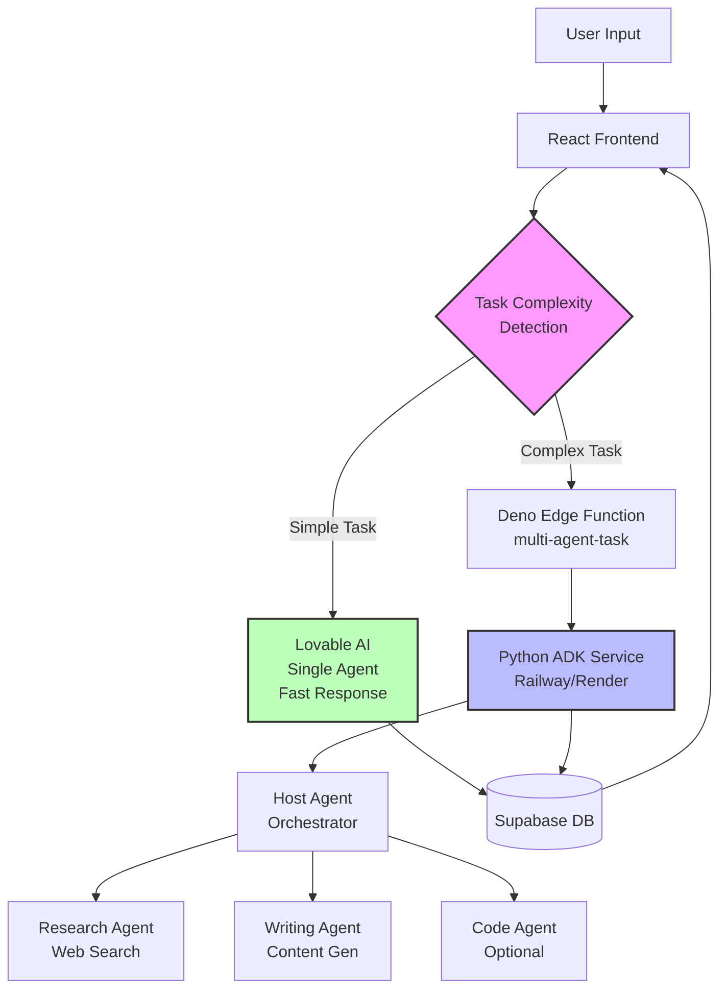

# Google ADK Multi-Agent System Implementation Plan

## Overview

This document outlines the plan to implement a hybrid multi-agent system using Google ADK (Agent Development Kit) alongside the existing Lovable AI single-agent architecture.

**Approach**: Hybrid - Keep existing system, add ADK for complex tasks

**Timeline**: Iterative development (not phased by weeks)

**Goal**: Leverage multi-agent collaboration for complex tasks while maintaining fast single-agent responses for simple queries

---

## Architecture Diagram



---

## Implementation Iterations

### Iteration 1: Python ADK Service
**Goal**: Create the foundational multi-agent system

#### Tasks
1. **Set up Python FastAPI project**
   ```
   adk-service/
   ├── agents/
   │   ├── host_agent/agent.py       # Main orchestrator
   │   ├── research_agent/agent.py   # Web research
   │   └── writing_agent/agent.py    # Content generation
   ├── common/
   │   ├── a2a_client.py             # Agent-to-agent communication
   │   └── a2a_server.py             # FastAPI server
   ├── main.py                       # Entry point
   ├── requirements.txt
   └── .env
   ```

2. **Implement agents**
   - **Host Agent**: Orchestrates task delegation
   - **Research Agent**: Web search and data gathering
   - **Writing Agent**: Content synthesis and generation

3. **Deploy to Railway/Render**
   - Set up account
   - Connect GitHub repo
   - Configure environment variables:
     - `GOOGLE_API_KEY` (for Gemini models)
     - `SUPABASE_URL`
     - `SUPABASE_KEY`
   - Get deployment URL

**Output**: Working ADK service accessible via HTTPS endpoint

**Decision Point**: Test ADK service independently before moving to Iteration 2

---

### Iteration 2: Deno Bridge Function
**Goal**: Connect Lovable Cloud to ADK service

#### Tasks
1. **Create edge function**: `supabase/functions/multi-agent-task/index.ts`
   - Authenticate user via Supabase Auth
   - Forward request to Python ADK service
   - Return ADK response to frontend
   - Save results to database

2. **Add ADK_SERVICE_URL secret**
   - Store Railway/Render deployment URL
   - Configure in Lovable Cloud secrets

3. **Update config.toml**
   ```toml
   [functions.multi-agent-task]
   verify_jwt = true
   ```

**Output**: Working bridge between Deno and Python ADK

**Decision Point**: Test end-to-end flow (Frontend → Deno → ADK → DB)

---

### Iteration 3: Frontend Routing
**Goal**: Intelligently route tasks to the right system

#### Tasks
1. **Add detection logic in `useChatMessages.tsx`**
   ```typescript
   const shouldUseMultiAgent = (message: string): boolean => {
     const multiAgentKeywords = [
       'research and write',
       'analyze and summarize',
       'compare multiple',
       'step by step',
       'detailed analysis',
     ];
     return multiAgentKeywords.some(kw => message.toLowerCase().includes(kw));
   };
   ```

2. **Update streamChat function**
   - Check if task requires multi-agent
   - Route to `multi-agent-task` or existing `chat` function
   - Handle responses appropriately

3. **Add UI indicators**
   - Show "Multiple agents working..." for ADK tasks
   - Show standard loading for Lovable AI tasks

**Output**: Smart routing between single-agent and multi-agent systems

**Decision Point**: Test both paths work correctly

---

### Iteration 4: Tracking & Observability
**Goal**: Monitor agent usage and performance

#### Tasks
1. **Database migration**
   ```sql
   CREATE TABLE agent_executions (
     id UUID PRIMARY KEY DEFAULT gen_random_uuid(),
     user_id UUID REFERENCES auth.users NOT NULL,
     session_id UUID REFERENCES chat_sessions,
     task_description TEXT NOT NULL,
     agents_used TEXT[] NOT NULL,
     execution_time_ms INTEGER NOT NULL,
     token_usage JSONB,
     created_at TIMESTAMP WITH TIME ZONE DEFAULT NOW()
   );
   
   ALTER TABLE agent_executions ENABLE ROW LEVEL SECURITY;
   
   CREATE POLICY "Users can view own executions"
     ON agent_executions FOR SELECT
     USING (auth.uid() = user_id);
   ```

2. **Log executions**
   - Track which agents were used
   - Record execution time
   - Store token usage for cost monitoring

3. **Add admin dashboard (optional)**
   - View agent usage statistics
   - Monitor performance metrics
   - Analyze cost trends

**Output**: Full visibility into multi-agent system performance

---

### Iteration 5: Test & Optimize
**Goal**: Validate performance and fine-tune

#### Test Cases
| Test Case | Expected Behavior | System Used |
|-----------|-------------------|-------------|
| "What's the weather?" | Fast response | Lovable AI |
| "Research AI frameworks and write comparison" | Thorough analysis | ADK Multi-Agent |
| "Generate an image of a sunset" | Image generation | Existing system |
| "Analyze this code and suggest improvements" | Code review | ADK Multi-Agent |

#### Optimization Tasks
1. **Measure performance**
   - Response time for single-agent: < 3s
   - Response time for multi-agent: < 10s
   - Accuracy improvement: 30%+

2. **Adjust detection keywords**
   - Add more complex task indicators
   - Remove false positives

3. **Fine-tune agent instructions**
   - Improve orchestration logic
   - Optimize agent-to-agent communication

**Decision Point**: Are performance metrics acceptable?

---

### Iteration 6: Expand (Optional)
**Goal**: Add more specialized agents

#### Potential Agents
1. **Code Agent**
   - Language: Python, TypeScript, etc.
   - Capabilities: Code generation, debugging, refactoring
   - Model: `gemini-2.5-pro` (better for code)

2. **Review Agent**
   - Quality control specialist
   - Reviews content for accuracy, completeness, clarity
   - Model: `gemini-2.5-flash`

3. **Image Agent**
   - Integrates with image generation
   - Analyzes visual content
   - Creates image prompts

4. **Data Agent**
   - Analyzes datasets
   - Creates visualizations
   - Generates insights

#### Tasks
- Implement new agents in ADK service
- Update Host Agent to delegate to new specialists
- Add routing logic in frontend

**Output**: Expanded multi-agent capabilities

---

## Rollback Safety

### Quick Rollback (1 line change)
```typescript
// In useChatMessages.tsx
const shouldUseMultiAgent = (message: string): boolean => {
  return false; // Disable multi-agent routing
};
```

### Full Rollback
1. Remove `multi-agent-task` edge function
2. Remove ADK detection logic from frontend
3. Shut down Python ADK service
4. No data loss - all chat history remains intact

---

## Success Metrics

### Performance
- **Response Time**: 
  - Single-agent: < 3s
  - Multi-agent: < 10s
- **Accuracy**: 30%+ improvement for complex tasks
- **User Satisfaction**: 4.5+ / 5

### Cost
- **Hosting**: < $30/month for Railway/Render
- **AI API Costs**: Track Gemini usage
- **ROI**: Positive within 2 months

### Usage
- **Multi-agent adoption**: 20%+ of tasks
- **Error rate**: < 5%
- **Successful task completion**: > 90%

---

## Technology Stack

### Python ADK Service
- **Framework**: FastAPI
- **AI**: Google Gemini (via ADK)
- **Hosting**: Railway or Render
- **Language**: Python 3.11+

### Deno Bridge
- **Runtime**: Deno
- **Framework**: Supabase Edge Functions
- **Auth**: Supabase Auth

### Frontend
- **Framework**: React + TypeScript
- **State**: React hooks
- **Backend**: Lovable Cloud (Supabase)

---

## Key Decisions

### Why Hybrid vs Full Migration?
- ✅ **Lower risk**: Keep existing system working
- ✅ **Gradual adoption**: Test before full commitment
- ✅ **Cost effective**: Pay only for complex tasks
- ✅ **Faster time to market**: No full rewrite needed

### Why Google ADK?
- ✅ **Native multi-agent**: Built for agent orchestration
- ✅ **Gemini integration**: Best-in-class models
- ✅ **Agent-to-agent communication**: A2A protocol built-in
- ✅ **Scalable**: Google Cloud infrastructure

### Why Railway/Render?
- ✅ **Easy deployment**: GitHub integration
- ✅ **Auto-scaling**: Handles traffic spikes
- ✅ **Affordable**: Free tier + pay-as-you-go
- ✅ **Fast**: Global CDN

---

## Resources

- [Google ADK Documentation](https://google.github.io/adk-docs/)
- [Gemini API Docs](https://ai.google.dev/docs)
- [Railway Deployment Guide](https://docs.railway.app/)
- [Render Python Guide](https://render.com/docs/deploy-fastapi)
- [Supabase Edge Functions](https://supabase.com/docs/guides/functions)

---

## Next Steps

1. **Start Iteration 1**: Set up Python ADK service
2. **Get Google API key**: For Gemini models
3. **Choose hosting**: Railway or Render
4. **Test locally**: Validate agents work independently
5. **Deploy**: Get production URL
6. **Move to Iteration 2**: Create Deno bridge

---

**Status**: Planning Complete ✅  
**Next Action**: Begin Iteration 1 (Python ADK Service Setup)
