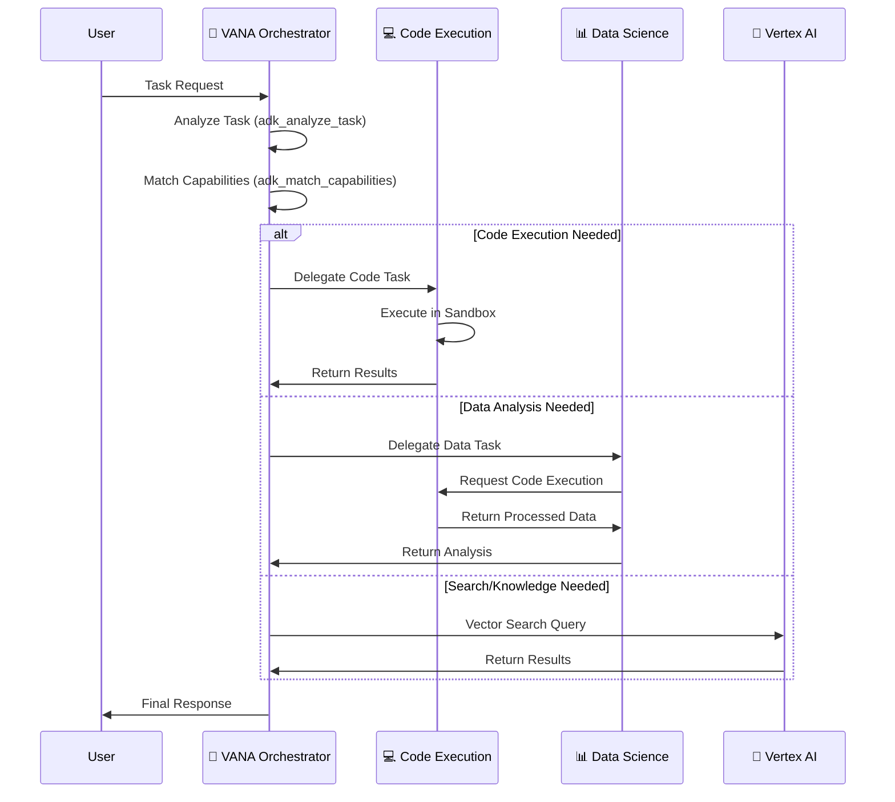
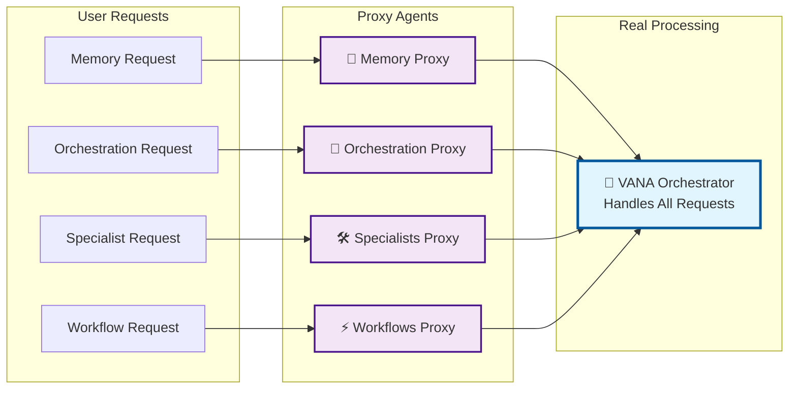
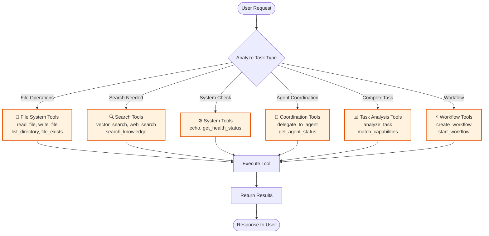
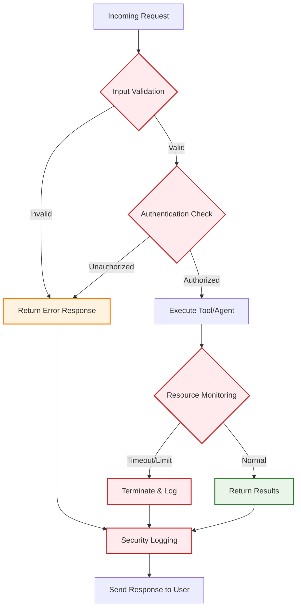
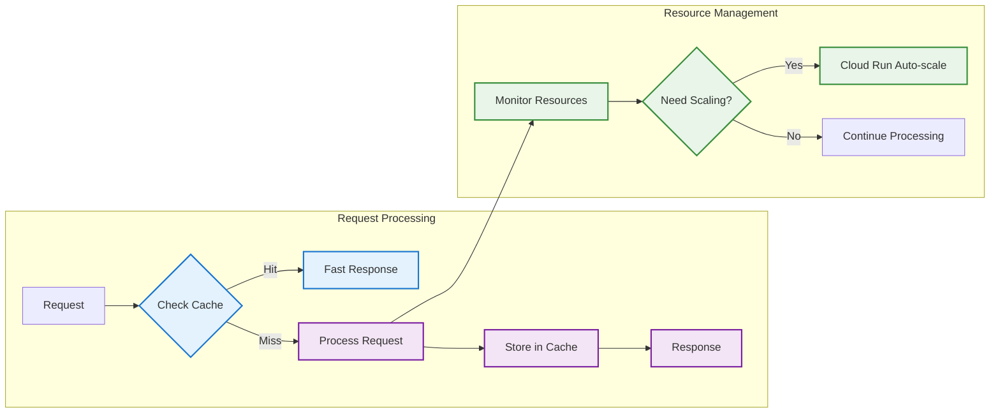

# 🔄 VANA Agent Interaction Flows

This document shows how agents coordinate, delegate tasks, and handle different types of requests in the VANA system.

## 📊 Main Orchestration Flow

## 🔄 Proxy Agent Redirection Pattern

## 🛠️ Tool Execution Flow

## 🔐 Security & Error Handling Flow

## 📊 Performance Optimization Flow

## 🎯 Key Interaction Patterns

### 1. Direct Tool Execution
- User request → VANA → Tool execution → Response
- Used for: File operations, searches, system checks

### 2. Agent Delegation
- User request → VANA → Specialist agent → Response
- Used for: Code execution, data analysis

### 3. Proxy Redirection
- User request → Proxy agent → VANA → Processing → Response
- Used for: Agent discovery compatibility

### 4. Multi-Step Workflows
- User request → VANA → Multiple tools/agents → Coordinated response
- Used for: Complex tasks requiring multiple capabilities

## 📈 Performance Characteristics

- **Direct Tool Execution**: <100ms average
- **Agent Delegation**: <500ms average
- **Proxy Redirection**: <50ms overhead
- **Multi-Step Workflows**: Variable based on complexity
- **Error Handling**: <10ms additional overhead

## 🔗 Related Documentation

- [System Architecture](system-architecture.md) - Overall system design
- [Tool Organization](tool-organization.md) - Tool categorization
- [Agent Reference](../../architecture/agents.md) - Agent specifications
- [Performance Guide](../../guides/monitoring.md) - Performance monitoring
