# 🚀 VANA Deployment Architecture

This document shows the complete deployment architecture for VANA on Google Cloud Platform, including development and production environments.

## ☁️ Google Cloud Infrastructure Overview

```mermaid
graph TB
    subgraph "Google Cloud Platform - Project: analystai-454200"
        subgraph "Development Environment"
            DEV_CR[☁️ Cloud Run Dev<br/>vana-dev-960076421399<br/>us-central1.run.app]
            DEV_BUILD[🔨 Cloud Build Dev<br/>Automated CI/CD<br/>Development Branch]
        end

        subgraph "Production Environment"
            PROD_CR[☁️ Cloud Run Prod<br/>vana-prod-960076421399<br/>us-central1.run.app]
            PROD_BUILD[🔨 Cloud Build Prod<br/>Automated CI/CD<br/>Main Branch]
        end

        subgraph "Shared Services"
            VAI[🤖 Vertex AI<br/>Vector Search<br/>Text Embeddings<br/>Language Models]
            RAG[📚 RAG Corpus<br/>Knowledge Storage<br/>Semantic Search]
            SM[🔐 Secret Manager<br/>API Keys<br/>Service Accounts<br/>Credentials]
            IAM[👤 Identity & Access<br/>Service Accounts<br/>Permissions<br/>Security Policies]
        end

        subgraph "Container Registry"
            GCR[📦 Google Container Registry<br/>Docker Images<br/>Version Management]
        end
    end

    %% Build and deployment flow
    DEV_BUILD --> GCR
    PROD_BUILD --> GCR
    GCR --> DEV_CR
    GCR --> PROD_CR

    %% Service connections
    DEV_CR --> VAI
    DEV_CR --> RAG
    DEV_CR --> SM
    PROD_CR --> VAI
    PROD_CR --> RAG
    PROD_CR --> SM

    %% Security
    IAM --> DEV_CR
    IAM --> PROD_CR
    IAM --> VAI
    IAM --> RAG
    IAM --> SM

    classDef dev fill:#fff3e0,stroke:#f57c00,stroke-width:2px
    classDef prod fill:#e8f5e8,stroke:#2e7d32,stroke-width:2px
    classDef shared fill:#e3f2fd,stroke:#1976d2,stroke-width:2px
    classDef security fill:#ffebee,stroke:#c62828,stroke-width:2px

    class DEV_CR,DEV_BUILD dev
    class PROD_CR,PROD_BUILD prod
    class VAI,RAG,GCR shared
    class SM,IAM security
```

## 🔄 CI/CD Pipeline Flow

```mermaid
sequenceDiagram
    participant Dev as 👨‍💻 Developer
    participant Git as 📚 GitHub Repo
    participant CB_Dev as 🔨 Cloud Build Dev
    participant CB_Prod as 🔨 Cloud Build Prod
    participant CR_Dev as ☁️ Cloud Run Dev
    participant CR_Prod as ☁️ Cloud Run Prod

    Dev->>Git: Push to feature branch
    Git->>CB_Dev: Trigger dev build
    CB_Dev->>CB_Dev: Build Docker image
    CB_Dev->>CR_Dev: Deploy to dev environment
    CR_Dev->>Dev: Dev environment ready

    Note over Dev,CR_Dev: Testing and validation in dev

    Dev->>Git: Merge to main branch
    Git->>CB_Prod: Trigger prod build
    CB_Prod->>CB_Prod: Build Docker image
    CB_Prod->>CR_Prod: Deploy to prod environment
    CR_Prod->>Dev: Production deployment complete
```

## 🏗️ Container Architecture

## 🔧 Environment Configuration

```mermaid
graph LR
    subgraph "Development Environment"
        DEV_ENV[🧪 Development<br/>vana-dev-960076421399]
        DEV_CONFIG[Configuration:<br/>• 1 vCPU, 1 GiB RAM<br/>• Auto-scaling 0-5<br/>• Debug logging<br/>• Test credentials]
    end

    subgraph "Production Environment"
        PROD_ENV[🚀 Production<br/>vana-prod-960076421399]
        PROD_CONFIG[Configuration:<br/>• 2 vCPU, 2 GiB RAM<br/>• Auto-scaling 0-10<br/>• Optimized logging<br/>• Production credentials]
    end

    subgraph "Shared Configuration"
        SHARED[Common Settings:<br/>• Port 8000<br/>• Python 3.13+<br/>• Poetry dependencies<br/>• Google ADK integration<br/>• Zero hardcoded credentials]
    end

    DEV_ENV --> SHARED
    PROD_ENV --> SHARED

    classDef dev fill:#fff3e0,stroke:#f57c00,stroke-width:2px
    classDef prod fill:#e8f5e8,stroke:#2e7d32,stroke-width:2px
    classDef shared fill:#e3f2fd,stroke:#1976d2,stroke-width:2px

    class DEV_ENV,DEV_CONFIG dev
    class PROD_ENV,PROD_CONFIG prod
    class SHARED shared
```

## 🔐 Security Architecture

```mermaid
graph TB
    subgraph "Security Layers"
        subgraph "Network Security"
            HTTPS[🔒 HTTPS Only<br/>TLS 1.3<br/>Certificate Management]
            FIREWALL[🛡️ Cloud Armor<br/>DDoS Protection<br/>Rate Limiting]
        end

        subgraph "Identity & Access"
            SA[🔑 Service Accounts<br/>Least Privilege<br/>Role-Based Access]
            IAM_ROLES[👤 IAM Roles<br/>Custom Permissions<br/>Resource Access]
        end

        subgraph "Data Protection"
            SECRETS[🔐 Secret Manager<br/>API Keys<br/>Credentials<br/>Certificates]
            ENCRYPTION[🔒 Encryption<br/>At Rest<br/>In Transit<br/>In Memory]
        end

        subgraph "Application Security"
            VALIDATION[✅ Input Validation<br/>SQL Injection Prevention<br/>XSS Protection]
            SANDBOX[📦 Code Sandbox<br/>Resource Isolation<br/>Execution Limits]
        end
    end

    HTTPS --> FIREWALL
    FIREWALL --> SA
    SA --> IAM_ROLES
    IAM_ROLES --> SECRETS
    SECRETS --> ENCRYPTION
    ENCRYPTION --> VALIDATION
    VALIDATION --> SANDBOX

    classDef network fill:#e8eaf6,stroke:#3f51b5,stroke-width:2px
    classDef identity fill:#f3e5f5,stroke:#7b1fa2,stroke-width:2px
    classDef data fill:#ffebee,stroke:#c62828,stroke-width:2px
    classDef app fill:#e8f5e8,stroke:#2e7d32,stroke-width:2px

    class HTTPS,FIREWALL network
    class SA,IAM_ROLES identity
    class SECRETS,ENCRYPTION data
    class VALIDATION,SANDBOX app
```

## 📊 Deployment Specifications

### Development Environment
- **URL**: https://vana-dev-960076421399.us-central1.run.app
- **Resources**: 1 vCPU, 1 GiB RAM
- **Scaling**: 0-5 instances
- **Purpose**: Testing, validation, feature development

### Production Environment
- **URL**: https://vana-prod-960076421399.us-central1.run.app
- **Resources**: 2 vCPU, 2 GiB RAM
- **Scaling**: 0-10 instances
- **Purpose**: Live service, production workloads

### Common Specifications
- **Platform**: Google Cloud Run (serverless containers)
- **Runtime**: Python 3.13+ with Poetry
- **Port**: 8000 (required for Cloud Run)
- **Authentication**: Google Cloud service accounts
- **Monitoring**: Built-in Cloud Run metrics + custom monitoring

## 🚀 Deployment Process

### Automated Deployment
1. **Code Push** → GitHub repository
2. **Build Trigger** → Cloud Build automatically triggered
3. **Container Build** → Docker image created and tested
4. **Registry Push** → Image pushed to Google Container Registry
5. **Service Deploy** → Cloud Run service updated
6. **Health Check** → Automatic health verification
7. **Traffic Routing** → Gradual traffic migration (production)

### Manual Deployment Scripts
- `deployment/deploy-dev.sh` - Deploy to development
- `deployment/deploy-prod.sh` - Deploy to production
- `deployment/deploy.sh` - Universal deployment script

## 📈 Performance & Monitoring

- **Response Time**: <100ms average for core operations
- **Availability**: 99.9% SLA (Google Cloud Run)
- **Auto-scaling**: Based on CPU and memory usage
- **Health Checks**: Automatic endpoint monitoring
- **Logging**: Structured logging to Google Cloud Logging
- **Metrics**: Custom metrics for agent and tool performance

## 🔗 Related Documentation

- [System Architecture](system-architecture.md) - Overall system design
- [Cloud Run Deployment](../../deployment/cloud-run.md) - Detailed deployment guide
- [Security Guide](../../deployment/security-guide.md) - Security configuration
- [Local Setup](../../deployment/local-setup.md) - Local development environment
