# 🏗️ VANA System Architecture

This diagram shows the complete VANA multi-agent system architecture with accurate agent counts and relationships.

## 📊 Complete System Overview

```mermaid
graph TB
    subgraph "VANA Multi-Agent System"
        subgraph "Real Agents (3)"
            VANA[🎯 VANA Orchestrator<br/>core tools<br/>gemini-2.0-flash-exp]
            CODE[💻 Code Execution Specialist<br/>Python, JavaScript, Shell<br/>Secure Sandbox]
            DATA[📊 Data Science Specialist<br/>Analysis & ML<br/>Visualization]
        end

        subgraph "Proxy Agents (4) - Discovery Pattern"
            MEM[🧠 Memory Proxy<br/>→ Delegates to VANA]
            ORCH[🔄 Orchestration Proxy<br/>→ Delegates to VANA]
            SPEC[🛠️ Specialists Proxy<br/>→ Delegates to VANA]
            WORK[⚡ Workflows Proxy<br/>→ Delegates to VANA]
        end

        subgraph "Google Cloud Infrastructure"
            VAI[🤖 Vertex AI<br/>Vector Search & Embeddings<br/>Text Models]
            CR[☁️ Cloud Run<br/>Dev & Prod Environments<br/>Auto-scaling]
            RAG[📚 RAG Corpus<br/>Knowledge Storage<br/>Semantic Search]
            SM[🔐 Secret Manager<br/>Secure Credentials<br/>Zero Hardcoded Keys]
        end
    end

    %% Real agent interactions
    VANA -.->|Task Delegation| CODE
    VANA -.->|Data Analysis| DATA
    CODE -.->|Results| VANA
    DATA -.->|Insights| VANA

    %% Proxy redirections (all go to VANA)
    MEM -->|All Requests| VANA
    ORCH -->|All Requests| VANA
    SPEC -->|All Requests| VANA
    WORK -->|All Requests| VANA

    %% Cloud service connections
    VANA -->|Vector Search| VAI
    VANA -->|Knowledge Queries| RAG
    VANA -->|Secure Storage| SM
    CODE -->|Execution Environment| CR
    DATA -->|Compute Resources| CR
    VANA -->|Deployment| CR

    %% Styling
    classDef realAgent fill:#e1f5fe,stroke:#01579b,stroke-width:3px,color:#000
    classDef proxyAgent fill:#f3e5f5,stroke:#4a148c,stroke-width:2px,color:#000
    classDef cloudService fill:#e8f5e8,stroke:#1b5e20,stroke-width:2px,color:#000

    class VANA,CODE,DATA realAgent
    class MEM,ORCH,SPEC,WORK proxyAgent
    class VAI,CR,RAG,SM cloudService
```

## 🔧 Architecture Components

### Real Agents (3)
- **VANA Orchestrator**: Central coordinator with core tools
- **Code Execution Specialist**: Secure multi-language code execution
- **Data Science Specialist**: Data analysis and machine learning

### Proxy Agents (4)
- **Memory Proxy**: Redirects memory requests to VANA
- **Orchestration Proxy**: Redirects orchestration requests to VANA
- **Specialists Proxy**: Redirects specialist requests to VANA
- **Workflows Proxy**: Redirects workflow requests to VANA

### Cloud Infrastructure
- **Vertex AI**: Vector search and language model services
- **Cloud Run**: Serverless container deployment (dev/prod)
- **RAG Corpus**: Knowledge storage and semantic search
- **Secret Manager**: Secure credential management

## 🎯 Key Design Patterns

### Simplified Multi-Agent Pattern
- **Single Main Orchestrator**: VANA handles most coordination
- **Specialized Execution**: Code and data science specialists for specific tasks
- **Proxy Discovery**: multiple discovery aliases for agent discovery compatibility

### Google ADK Integration
- **Native Tools**: All tools follow ADK FunctionTool pattern
- **Session Management**: Built-in ADK session state
- **Memory Integration**: Vertex AI RAG corpus for knowledge

### Security & Reliability
- **Zero Hardcoded Credentials**: All secrets in Google Secret Manager
- **Sandbox Execution**: Secure code execution environment
- **Auto-scaling**: Cloud Run handles traffic spikes automatically

## 📊 System Metrics

- **Core Tools**: available by default
- **Conditional Tools**: Variable count based on dependencies
- **Deployment Environments**: 2 (development + production)
- **Response Time**: Sub-second for most operations
- **Availability**: 99.9% (Google Cloud SLA)

## 🔗 Related Documentation

- [Agent Reference](../../architecture/agents.md) - Detailed agent specifications
- [Tool Reference](../../architecture/tools.md) - Complete tool documentation
- [Deployment Guide](../../deployment/cloud-run.md) - Cloud Run setup
- [Security Guide](../../deployment/security-guide.md) - Security configuration
