# 🛠️ VANA Tool Organization

This document provides visual breakdowns of VANA's 19 core tools plus conditional tools, organized by category and functionality.

## 📊 Core Tools Overview (19 Total)

## 🔧 Tool Categories Breakdown

## 🏗️ Tool Architecture Pattern

```mermaid
graph TB
    subgraph "Tool Execution Layer"
        USER[User Request] --> VANA[VANA Orchestrator]
        VANA --> ROUTER{Tool Router}
    end

    subgraph "Core Tools (Always Available)"
        ROUTER --> FILE[📁 File System Tools]
        ROUTER --> SEARCH[🔍 Search Tools]
        ROUTER --> SYSTEM[⚙️ System Tools]
        ROUTER --> COORD[🤝 Coordination Tools]
        ROUTER --> TASK[📊 Task Analysis Tools]
        ROUTER --> WORKFLOW[⚡ Workflow Tools]
    end

    subgraph "Conditional Tools (When Available)"
        ROUTER -.-> SPECIALIST[🛠️ Specialist Tools]
        ROUTER -.-> ORCHESTRATION[🎯 Orchestration Tools]
    end

    subgraph "Tool Execution Framework"
        FILE --> WRAPPER[ADK FunctionTool Wrapper]
        SEARCH --> WRAPPER
        SYSTEM --> WRAPPER
        COORD --> WRAPPER
        TASK --> WRAPPER
        WORKFLOW --> WRAPPER
        SPECIALIST -.-> WRAPPER
        ORCHESTRATION -.-> WRAPPER

        WRAPPER --> MONITOR[Performance Monitoring]
        WRAPPER --> VALIDATE[Input Validation]
        WRAPPER --> EXECUTE[Secure Execution]

        EXECUTE --> RESULT[Standardized Response]
    end

    classDef coreTools fill:#e1f5fe,stroke:#01579b,stroke-width:2px
    classDef conditionalTools fill:#f3e5f5,stroke:#4a148c,stroke-width:2px,stroke-dasharray: 5 5
    classDef framework fill:#e8f5e8,stroke:#1b5e20,stroke-width:2px

    class FILE,SEARCH,SYSTEM,COORD,TASK,WORKFLOW coreTools
    class SPECIALIST,ORCHESTRATION conditionalTools
    class WRAPPER,MONITOR,VALIDATE,EXECUTE,RESULT framework
```

## 📋 Detailed Tool Reference

### 📁 File System Tools (4)

### 🔍 Search Tools (3)

### ⚡ Workflow Management Tools (8)

## 🔄 Conditional Tools Architecture

## 📊 Tool Performance Metrics

| Category | Tool Count | Avg Response Time | Availability |
|----------|------------|-------------------|--------------|
| File System | 4 | <50ms | 100% |
| Search | 3 | <200ms | 99.9% |
| System | 2 | <10ms | 100% |
| Coordination | 4 | <100ms | 100% |
| Task Analysis | 3 | <150ms | 100% |
| Workflows | 8 | <300ms | 100% |
| **Core Total** | **19** | **<100ms avg** | **99.9%** |
| Conditional | Variable | Variable | Depends on imports |

## 🎯 Tool Usage Patterns

### High Frequency Tools
- `adk_echo` - System testing and validation
- `adk_get_health_status` - Health monitoring
- `adk_vector_search` - Semantic search operations
- `adk_delegate_to_agent` - Agent coordination

### Workflow Tools
- `adk_create_workflow` → `adk_start_workflow` → `adk_get_workflow_status`
- Used for complex multi-step operations

### File Operations
- `adk_file_exists` → `adk_read_file` or `adk_write_file`
- Security validation at each step

### Search Operations
- `adk_search_knowledge` for internal knowledge
- `adk_vector_search` for semantic similarity
- `adk_web_search` for external information

## 🔗 Related Documentation

- [System Architecture](system-architecture.md) - Overall system design
- [Agent Interactions](agent-interactions.md) - How agents use tools
- [Tool Reference](../../architecture/tools.md) - Complete tool documentation
- [API Reference](../../guides/api-reference.md) - Tool API details
