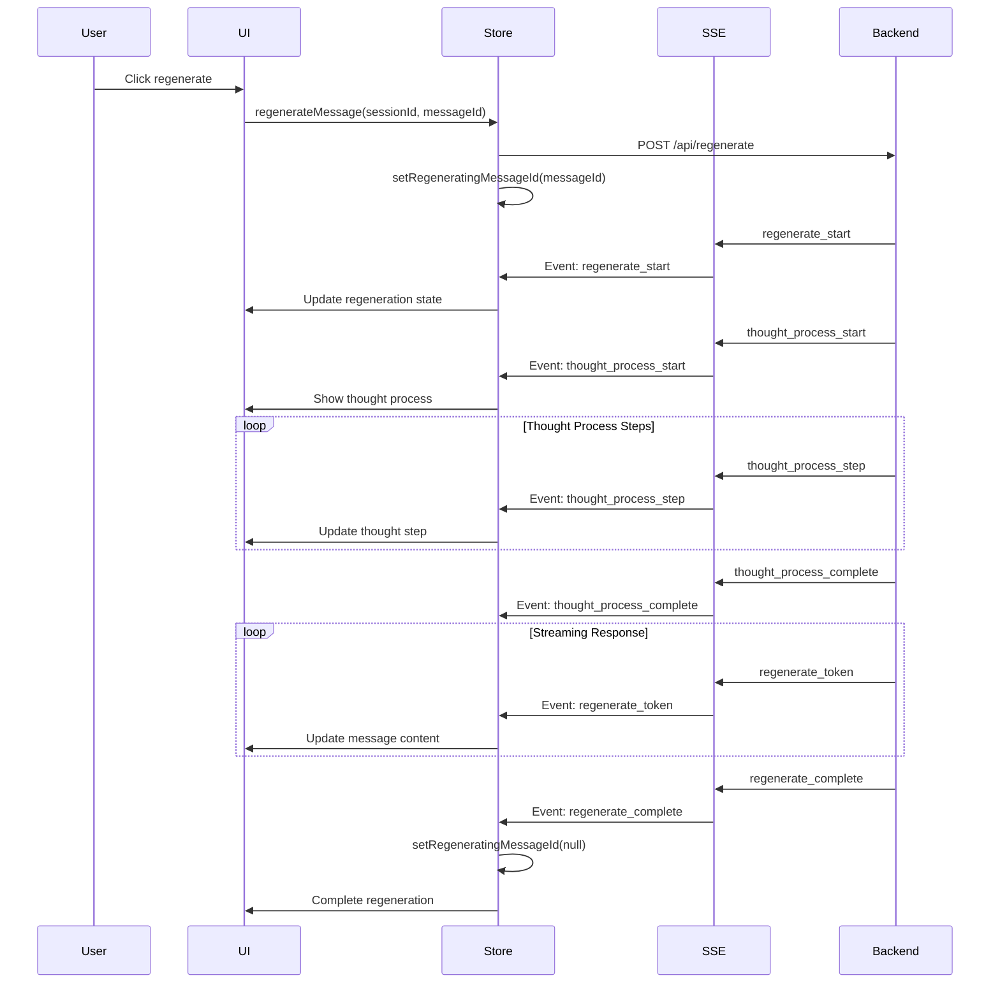
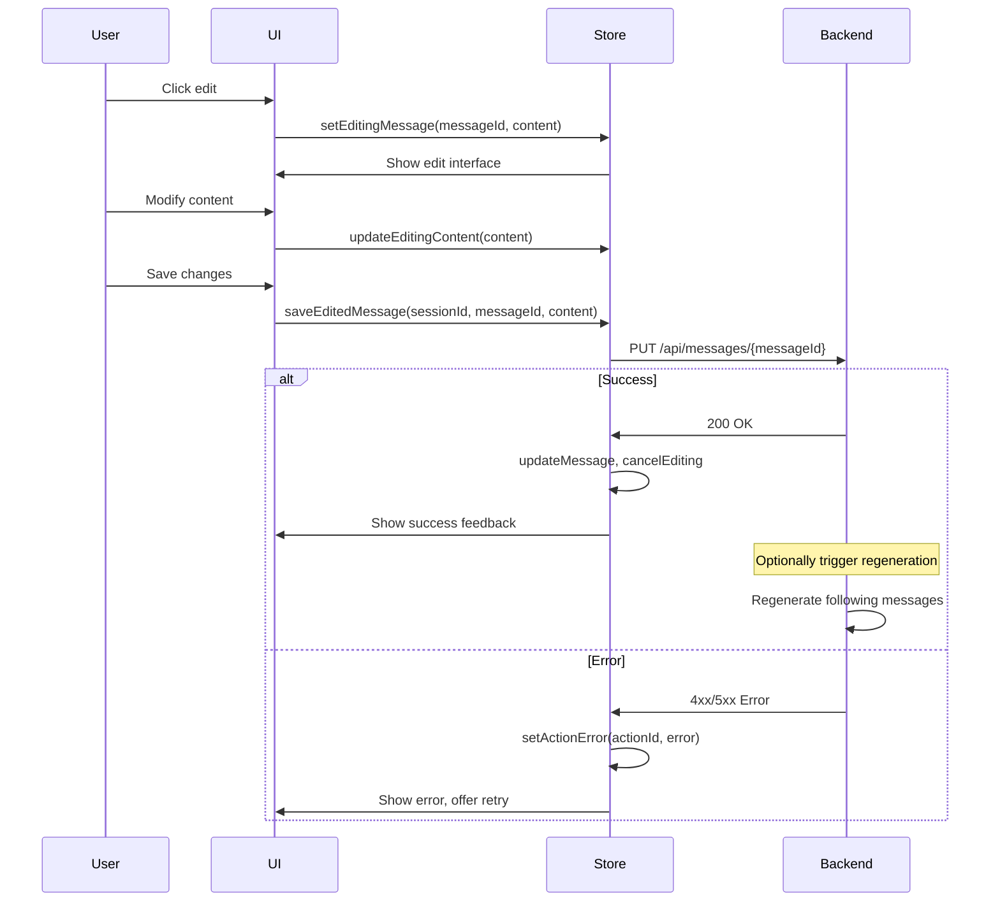
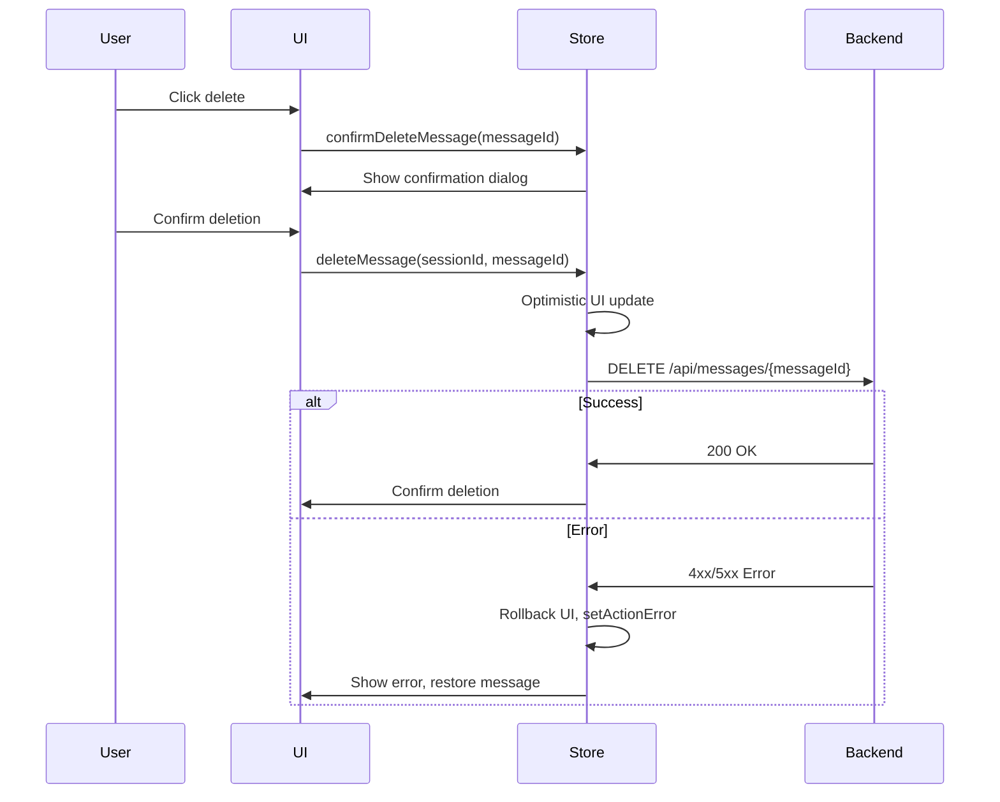

# Chat Actions State Management & SSE Event Flow Architecture

## Overview

This document outlines the comprehensive design for state management and SSE event flow updates needed to implement chat actions (edit, delete, regenerate, feedback, thought process) in the Vana application.

## Current Architecture Analysis

### Existing Components
- **Zustand Store**: `/frontend/src/hooks/useChatStream.ts` - Session and message management
- **SSE Client**: `/frontend/src/hooks/useSSE.ts` - Real-time event handling with security features
- **Backend Broadcaster**: `/app/utils/sse_broadcaster.py` - Memory-optimized event broadcasting

### Key Strengths
- Secure token handling via proxy routes
- Memory-efficient event broadcasting with TTL
- Robust reconnection logic
- Session-based event isolation

## 1. State Management Updates

### Extended ChatStore Interface

```typescript
interface ChatStore extends ChatStreamState {
  // === New Chat Action States ===

  // Message Editing
  editingMessageId: string | null
  editingContent: string | null
  editingSaving: boolean

  // Message Regeneration
  regeneratingMessageId: string | null
  regenerationProgress: number

  // Thought Process Display
  thoughtProcess: ThoughtProcess | null
  showThoughtProcess: boolean

  // Message Feedback
  messageFeedback: Map<string, MessageFeedback>
  feedbackPending: Set<string>

  // UI State
  messageActionsOpen: string | null
  confirmingDelete: string | null

  // Error Recovery
  actionErrors: Map<string, ActionError>
  retryQueue: ActionRetry[]

  // === New Action Methods ===

  // Editing Actions
  setEditingMessage: (messageId: string | null, content?: string) => void
  updateEditingContent: (content: string) => void
  saveEditedMessage: (sessionId: string, messageId: string, content: string) => Promise<void>
  cancelEditing: () => void

  // Regeneration Actions
  regenerateMessage: (sessionId: string, messageId: string) => Promise<void>
  cancelRegeneration: () => void

  // Deletion Actions
  deleteMessage: (sessionId: string, messageId: string) => Promise<void>
  confirmDeleteMessage: (messageId: string) => void
  cancelDeleteConfirmation: () => void

  // Feedback Actions
  setMessageFeedback: (messageId: string, type: 'upvote' | 'downvote' | null) => Promise<void>
  clearMessageFeedback: (messageId: string) => void

  // Thought Process Actions
  setThoughtProcess: (process: ThoughtProcess | null) => void
  toggleThoughtProcessVisibility: (show: boolean) => void

  // UI State Actions
  setMessageActionsOpen: (messageId: string | null) => void

  // Error Recovery Actions
  setActionError: (actionId: string, error: ActionError | null) => void
  retryFailedAction: (actionId: string) => Promise<void>
  clearRetryQueue: () => void
}
```

### New Type Definitions

```typescript
interface ThoughtProcess {
  id: string
  messageId: string
  steps: ThoughtStep[]
  currentStep: number
  isComplete: boolean
  totalSteps: number
  startTime: string
  endTime?: string
}

interface ThoughtStep {
  id: string
  title: string
  description: string
  status: 'pending' | 'active' | 'complete' | 'error'
  startTime: string
  endTime?: string
  details?: string
  artifacts?: ThoughtArtifact[]
}

interface ThoughtArtifact {
  type: 'code' | 'search_query' | 'api_call' | 'analysis'
  content: string
  metadata?: Record<string, any>
}

interface MessageFeedback {
  type: 'upvote' | 'downvote'
  timestamp: string
  synced: boolean
}

interface ActionError {
  type: 'edit' | 'delete' | 'regenerate' | 'feedback'
  message: string
  code?: string
  retryable: boolean
  timestamp: string
}

interface ActionRetry {
  id: string
  type: 'edit' | 'delete' | 'regenerate' | 'feedback'
  payload: any
  attempts: number
  maxAttempts: number
  nextRetryAt: string
}
```

## 2. SSE Event Architecture

### New Event Types

```typescript
type ChatActionSSEEvent =
  // Thought Process Events
  | {
      type: 'thought_process_start'
      data: {
        messageId: string
        totalSteps: number
        sessionId: string
        timestamp: string
      }
    }
  | {
      type: 'thought_process_step'
      data: {
        messageId: string
        step: ThoughtStep
        currentStep: number
        totalSteps: number
        timestamp: string
      }
    }
  | {
      type: 'thought_process_complete'
      data: {
        messageId: string
        finalResult: string
        timestamp: string
      }
    }

  // Regeneration Events
  | {
      type: 'regenerate_start'
      data: {
        messageId: string
        sessionId: string
        timestamp: string
      }
    }
  | {
      type: 'regenerate_token'
      data: {
        messageId: string
        token: string
        partial: string
        timestamp: string
      }
    }
  | {
      type: 'regenerate_complete'
      data: {
        messageId: string
        finalContent: string
        timestamp: string
      }
    }
  | {
      type: 'regenerate_error'
      data: {
        messageId: string
        error: string
        retryable: boolean
        timestamp: string
      }
    }

  // Message Modification Events
  | {
      type: 'message_edited'
      data: {
        messageId: string
        newContent: string
        previousContent: string
        timestamp: string
      }
    }
  | {
      type: 'message_deleted'
      data: {
        messageId: string
        sessionId: string
        timestamp: string
      }
    }

  // Feedback Events
  | {
      type: 'feedback_updated'
      data: {
        messageId: string
        feedback: 'upvote' | 'downvote' | null
        timestamp: string
      }
    }

  // Error Recovery Events
  | {
      type: 'action_error'
      data: {
        actionId: string
        actionType: string
        error: ActionError
        timestamp: string
      }
    }
  | {
      type: 'action_retry'
      data: {
        actionId: string
        attempt: number
        maxAttempts: number
        timestamp: string
      }
    }
```

### Backend Event Dispatcher

```python
# New events in sse_broadcaster.py
async def broadcast_thought_process_event(
    self,
    session_id: str,
    message_id: str,
    event_type: str,
    data: dict
) -> None:
    """Broadcast thought process events."""
    event_data = {
        "type": event_type,
        "data": {
            "messageId": message_id,
            "sessionId": session_id,
            "timestamp": datetime.now().isoformat(),
            **data
        }
    }
    await self.broadcast_event(session_id, event_data)

async def broadcast_regeneration_event(
    self,
    session_id: str,
    message_id: str,
    event_type: str,
    data: dict
) -> None:
    """Broadcast message regeneration events."""
    event_data = {
        "type": event_type,
        "data": {
            "messageId": message_id,
            "timestamp": datetime.now().isoformat(),
            **data
        }
    }
    await self.broadcast_event(session_id, event_data)

async def broadcast_message_action_event(
    self,
    session_id: str,
    message_id: str,
    action: str,
    data: dict
) -> None:
    """Broadcast message action events (edit, delete, feedback)."""
    event_data = {
        "type": f"message_{action}",
        "data": {
            "messageId": message_id,
            "timestamp": datetime.now().isoformat(),
            **data
        }
    }
    await self.broadcast_event(session_id, event_data)
```

## 3. Event Flow Sequences

### Regeneration Flow



### Edit Flow



### Delete Flow



## 4. Error Recovery Strategy

### Connection Recovery

```typescript
class ChatActionErrorRecovery {
  private retryDelays = [1000, 2000, 5000, 10000, 30000] // Exponential backoff

  async handleActionError(
    actionId: string,
    error: ActionError,
    retry: () => Promise<void>
  ): Promise<void> {
    const store = useChatStore.getState()

    if (!error.retryable) {
      store.setActionError(actionId, error)
      return
    }

    // Add to retry queue
    const retryAction: ActionRetry = {
      id: actionId,
      type: error.type,
      payload: retry,
      attempts: 0,
      maxAttempts: 3,
      nextRetryAt: new Date(Date.now() + this.retryDelays[0]).toISOString()
    }

    store.retryQueue.push(retryAction)

    // Start retry process
    this.processRetryQueue()
  }

  private async processRetryQueue(): Promise<void> {
    const store = useChatStore.getState()
    const now = Date.now()

    for (const retry of store.retryQueue) {
      if (new Date(retry.nextRetryAt).getTime() <= now && retry.attempts < retry.maxAttempts) {
        try {
          await retry.payload()
          // Remove successful retry from queue
          store.retryQueue = store.retryQueue.filter(r => r.id !== retry.id)
        } catch (error) {
          retry.attempts++
          if (retry.attempts >= retry.maxAttempts) {
            // Final failure
            store.setActionError(retry.id, {
              type: retry.type,
              message: `Failed after ${retry.maxAttempts} attempts`,
              retryable: false,
              timestamp: new Date().toISOString()
            })
            store.retryQueue = store.retryQueue.filter(r => r.id !== retry.id)
          } else {
            // Schedule next retry
            const delay = this.retryDelays[Math.min(retry.attempts, this.retryDelays.length - 1)]
            retry.nextRetryAt = new Date(Date.now() + delay).toISOString()
          }
        }
      }
    }
  }
}
```

### SSE Connection Recovery

```typescript
// Enhanced SSE event handler with action recovery
const handleChatActionSSE = (event: ChatActionSSEEvent) => {
  const store = useChatStore.getState()

  try {
    switch (event.type) {
      case 'regenerate_start':
        store.setRegeneratingMessageId(event.data.messageId)
        break

      case 'regenerate_token':
        store.updateStreamingMessage(
          event.data.sessionId,
          event.data.messageId,
          event.data.partial
        )
        break

      case 'regenerate_error':
        store.setRegeneratingMessageId(null)
        store.setActionError(event.data.messageId, {
          type: 'regenerate',
          message: event.data.error,
          retryable: event.data.retryable,
          timestamp: event.data.timestamp
        })
        break

      case 'thought_process_step':
        const currentProcess = store.thoughtProcess
        if (currentProcess?.messageId === event.data.messageId) {
          store.setThoughtProcess({
            ...currentProcess,
            steps: currentProcess.steps.map((step, index) =>
              index === event.data.currentStep - 1 ? event.data.step : step
            ),
            currentStep: event.data.currentStep
          })
        }
        break

      // Handle other events...
    }
  } catch (error) {
    console.error('Error processing chat action SSE event:', error)
    // Emit error event for monitoring
    store.setActionError('sse_processing', {
      type: 'system',
      message: 'Failed to process real-time event',
      retryable: false,
      timestamp: new Date().toISOString()
    })
  }
}
```

## 5. Performance Optimizations

### Debounced Operations

```typescript
// Debounced edit saving
const debouncedSaveEdit = debounce(async (
  sessionId: string,
  messageId: string,
  content: string
) => {
  const store = useChatStore.getState()
  try {
    await apiClient.updateMessage(messageId, { content })
    store.updateMessage(sessionId, messageId, msg => ({ ...msg, content }))
    store.cancelEditing()
  } catch (error) {
    store.setActionError(`edit_${messageId}`, {
      type: 'edit',
      message: error.message,
      retryable: true,
      timestamp: new Date().toISOString()
    })
  }
}, 1000)
```

### Optimistic Updates

```typescript
const optimisticUpdateMessage = (
  sessionId: string,
  messageId: string,
  updates: Partial<ChatMessage>
) => {
  const store = useChatStore.getState()

  // Store original for rollback
  const originalMessage = store.sessions[sessionId]?.messages.find(m => m.id === messageId)

  // Apply optimistic update
  store.updateMessage(sessionId, messageId, msg => ({ ...msg, ...updates }))

  return {
    rollback: () => {
      if (originalMessage) {
        store.updateMessage(sessionId, messageId, () => originalMessage)
      }
    }
  }
}
```

### Message Virtualization

```typescript
// For large conversation handling
const useVirtualizedMessages = (messages: ChatMessage[]) => {
  const [visibleRange, setVisibleRange] = useState({ start: 0, end: 50 })

  const visibleMessages = useMemo(() => {
    return messages.slice(visibleRange.start, visibleRange.end)
  }, [messages, visibleRange])

  const handleScroll = useCallback((scrollTop: number, containerHeight: number) => {
    const messageHeight = 100 // Average message height
    const start = Math.floor(scrollTop / messageHeight)
    const end = Math.min(start + Math.ceil(containerHeight / messageHeight) + 5, messages.length)

    setVisibleRange({ start, end })
  }, [messages.length])

  return { visibleMessages, handleScroll }
}
```

## 6. Migration Path

### Phase 1: Core State Updates
1. Extend `ChatStore` interface with new action states
2. Add action methods to store implementation
3. Update existing message handling to support new metadata

### Phase 2: SSE Event Integration
1. Add new event types to SSE client
2. Implement event handlers in chat stream hook
3. Update backend broadcaster with new event methods

### Phase 3: UI Integration
1. Add chat action components (edit, delete, regenerate buttons)
2. Implement thought process visualization
3. Add feedback UI components

### Phase 4: Error Recovery
1. Implement retry mechanisms
2. Add error boundary components
3. Create fallback UI states

### Phase 5: Performance Optimization
1. Add message virtualization for large conversations
2. Implement debouncing for edit operations
3. Add optimistic updates with rollback

## 7. Testing Strategy

### Unit Tests
- State management actions
- Event handler logic
- Error recovery mechanisms
- Optimistic update rollback

### Integration Tests
- SSE event flow end-to-end
- Chat action workflows
- Error recovery scenarios
- Connection recovery

### Performance Tests
- Large conversation handling
- Memory usage with extended history
- SSE connection stability under load

## Implementation Priority

1. **High Priority**: Message regeneration with thought process
2. **Medium Priority**: Message editing and deletion
3. **Low Priority**: Message feedback and advanced error recovery

This architecture provides a robust foundation for implementing chat actions while maintaining the existing security, performance, and reliability characteristics of the current system.