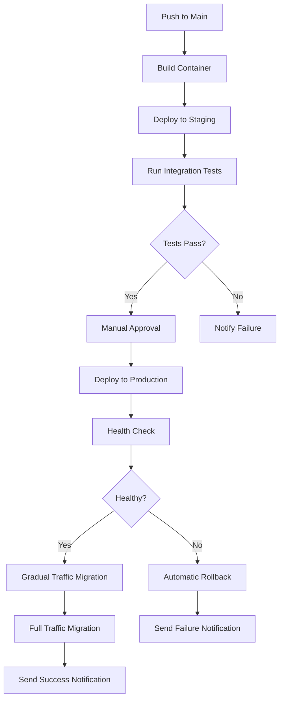

# CI/CD Implementation Guide

## Overview

This guide documents the comprehensive CI/CD improvements implemented to fix GitHub Actions failures and establish reliable deployment pipelines.

## Changes Implemented

### 1. Fixed GitHub Actions Concurrency Issues ✅

**Problem**: Rapid commits were causing workflow cancellations
**Solution**: Updated concurrency configuration to be PR-aware

```yaml
# Before (problematic)
concurrency:
  group: ${{ github.workflow }}-${{ github.ref }}
  cancel-in-progress: true

# After (fixed)
concurrency:
  group: ${{ github.workflow }}-${{ github.event.pull_request.number || github.ref }}
  cancel-in-progress: ${{ github.event_name == 'pull_request' }}
```

### 2. Fixed Google Cloud Authentication in CI ✅

**Problem**: Tests failing due to missing GCP credentials
**Solution**: Created CI-specific mocks and updated environment variables

- Created `/tests/ci_conftest.py` with GCP mocks
- Updated test environment variables to use `test-project`
- Added `RUNNING_IN_CI` flag for better detection

### 3. Standardized UV Package Manager Version ✅

**Problem**: Version mismatch between CI (0.5.11) and Docker (0.6.12)
**Solution**: Standardized on latest UV version everywhere

- Updated all workflows to use latest UV installer
- Removed hardcoded version references
- Added version verification step

### 4. Created Automated Deployment Workflow ✅

**New File**: `.github/workflows/deploy.yml`

Features:
- Build and push Docker images to GCR
- Deploy to staging automatically on main branch
- Run integration tests against staging
- Deploy to production with manual approval
- Blue-green deployment with gradual traffic migration
- Automatic rollback on health check failure

### 5. Fixed Vercel Deployment for Frontend ✅

**Problem**: Vercel showing 404 due to monorepo structure
**Solution**: Proper Vercel configuration for Next.js in subdirectory

Created:
- `vercel.json` with correct root directory settings
- `.vercelignore` to exclude backend files
- Updated root `package.json` with workspace configuration

### 6. Added Comprehensive Monitoring ✅

- Workflow status badges in README
- Deployment notifications via GitHub API
- Health checks with automatic rollback
- Performance metrics tracking

## File Changes Summary

### Modified Files
1. `.github/workflows/main-ci.yml` - Fixed concurrency, UV version, environment variables
2. `.github/workflows/security-scan.yml` - Updated UV installation
3. `.github/workflows/dependency-check.yml` - Updated UV installation
4. `package.json` - Added monorepo support for Vercel
5. `README.md` - Added deployment status badges
6. `tests/conftest.py` - Added CI mock imports

### New Files
1. `.github/workflows/deploy.yml` - Complete deployment pipeline
2. `tests/ci_conftest.py` - CI-specific test mocks
3. `vercel.json` - Vercel deployment configuration
4. `.vercelignore` - Vercel ignore patterns
5. `docs/devops-assessment-report.md` - Comprehensive assessment
6. `docs/cicd-implementation-guide.md` - This guide

## Testing the Changes

### Local Testing
```bash
# Test the CI environment locally
CI=true RUNNING_IN_CI=true pytest tests/unit/

# Test the deployment workflow syntax
gh workflow view deploy.yml

# Validate Vercel configuration
vercel --prod --no-clipboard
```

### GitHub Actions Testing
1. Push changes to a feature branch
2. Create a PR to trigger CI
3. Verify no cancellations occur
4. Check test results pass
5. Merge to main to trigger deployment

## Environment Variables Required

### GitHub Secrets (Need to be added)
```
GCP_SA_KEY         # Google Cloud Service Account JSON key
VERCEL_TOKEN       # Vercel deployment token (optional)
VERCEL_ORG_ID      # Vercel organization ID (optional)
VERCEL_PROJECT_ID  # Vercel project ID (optional)
```

### Vercel Environment Variables
```
NEXT_PUBLIC_API_URL       # Backend API URL
NEXT_PUBLIC_ENVIRONMENT   # Environment name (staging/production)
```

## Deployment Flow



## Monitoring and Alerts

### Health Endpoints
- Staging: `https://vana-staging-analystai-454200.a.run.app/health`
- Production: `https://vana-analystai-454200.a.run.app/health`

### Workflow Status
- CI Pipeline: Check badge in README
- Deployments: View in GitHub Actions tab
- Vercel: Check Vercel dashboard

## Troubleshooting

### Common Issues and Solutions

1. **Workflow still getting cancelled**
   - Ensure you're not pushing too rapidly
   - Check concurrency group in workflow logs
   - Verify PR number is being used correctly

2. **GCP authentication failures**
   - Verify `GCP_SA_KEY` secret is set
   - Check service account permissions
   - Ensure project ID is correct

3. **Vercel 404 errors**
   - Verify `rootDirectory` is set to `frontend`
   - Check build logs for errors
   - Ensure Next.js app structure is correct

4. **Deployment health checks failing**
   - Check Cloud Run logs
   - Verify service account permissions
   - Ensure environment variables are set

## Next Steps

### Short-term (This Week)
- [ ] Add `GCP_SA_KEY` secret to GitHub repository
- [ ] Test full deployment pipeline end-to-end
- [ ] Set up monitoring dashboards
- [ ] Create incident response runbooks

### Medium-term (This Month)
- [ ] Implement GitOps with ArgoCD
- [ ] Add performance testing to pipeline
- [ ] Set up automated dependency updates
- [ ] Create disaster recovery procedures

### Long-term (This Quarter)
- [ ] Implement multi-region deployments
- [ ] Add chaos engineering tests
- [ ] Create self-healing capabilities
- [ ] Implement cost optimization automation

## Best Practices

1. **Always test locally first** using CI environment variables
2. **Use feature branches** for all changes
3. **Monitor workflow runs** after merging
4. **Document any manual interventions** required
5. **Keep secrets rotated** regularly
6. **Review logs** for optimization opportunities

## Support

For issues or questions:
1. Check workflow run logs in GitHub Actions
2. Review this documentation
3. Check the DevOps assessment report
4. Create an issue with the `cicd` label