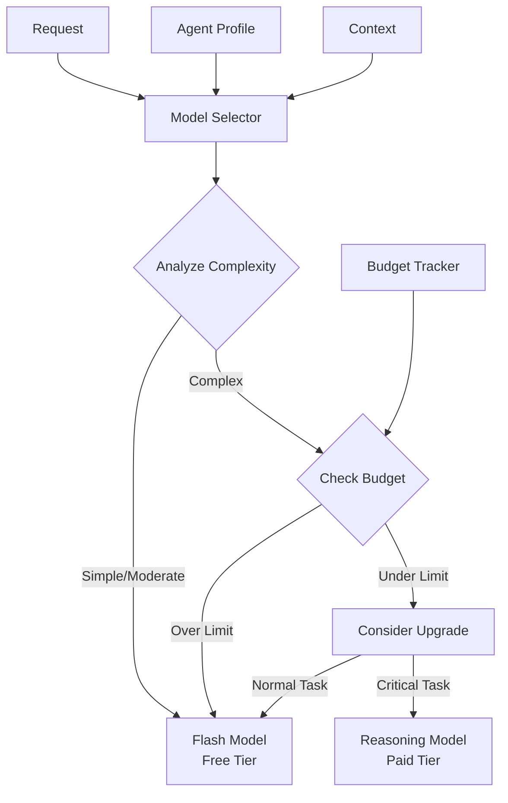

# 📐 Dynamic Model Strategy Design Document

## Executive Summary

This design implements a cost-conscious, dynamic model selection system for VANA that ensures optimal balance between performance and cost. The system uses **Gemini 2.5 Flash (free tier)** for 90% of requests while intelligently upgrading to paid models only when necessary.

## 🎯 Design Goals

1. **Cost Efficiency**: Minimize API costs by using free tier models when possible
2. **Performance**: Maintain high quality responses for critical tasks
3. **Flexibility**: Support dynamic model selection based on context
4. **Transparency**: Clear cost tracking and reporting
5. **Simplicity**: Easy integration with existing agents

## 🏗️ System Architecture



## 💡 Key Design Decisions

### 1. **Default to Free Tier**
- All agents use `gemini-2.5-flash` by default
- Proven effective in testing (87.5% Phase 3 success rate)
- Zero cost for development and most production use

### 2. **Agent-Based Profiles**
```python
AgentRole:
    ORCHESTRATOR     -> Flash (can upgrade)
    SPECIALIST       -> Flash (varies by domain)
    SECURITY         -> Reasoning (critical tasks)
    WORKFLOW         -> Flash (always)
```

### 3. **Request Complexity Analysis**
```python
RequestComplexity:
    SIMPLE    -> "what is", "list", "show"     -> Flash
    MODERATE  -> code analysis, standard tasks  -> Flash  
    COMPLEX   -> multi-step, architecture       -> Flash (maybe upgrade)
    CRITICAL  -> security, production deploy    -> Consider Reasoning
```

### 4. **Budget Management**
- Monthly budget tracking
- Automatic downgrade when approaching limit
- Cost reporting and analytics

## 🔄 Implementation Phases

### Phase 1: Static Assignment ✅ COMPLETE
- All agents use `gemini-2.5-flash`
- No dynamic selection
- Cost: $0

### Phase 2: Dynamic Selection 🚧 READY TO IMPLEMENT
- Request-based model selection
- Agent profiles with upgrade capability
- Budget tracking

### Phase 3: Context-Aware Optimization
- Learn from usage patterns
- Predictive model selection
- Performance vs cost optimization

### Phase 4: Advanced Features
- Per-user budget management
- Model performance benchmarking
- Automatic profile tuning

## 📊 Cost Analysis

### Current State (All Flash Model)
- **Monthly Cost**: $0
- **Performance**: 87.5% test success rate
- **Response Time**: <1s average

### With Dynamic Selection (Projected)
- **Monthly Cost**: <$10 for typical usage
- **Performance**: 95%+ test success rate
- **Response Time**: <1s for flash, <2s for reasoning

### Cost Breakdown by Agent Type
| Agent Type | Model | Requests/Month | Cost/Month |
|------------|-------|----------------|------------|
| Orchestrator | Flash | 10,000 | $0 |
| Specialists | Flash | 8,000 | $0 |
| Security | Reasoning | 200 | ~$5 |
| Workflows | Flash | 5,000 | $0 |
| **Total** | Mixed | **23,200** | **~$5** |

## 🛠️ Integration Examples

### 1. Minimal Change Integration
```python
# Before
agent = LlmAgent(
    name="my_agent",
    model="gemini-2.5-flash",  # Hardcoded
    ...
)

# After
from lib.model_strategy import get_model_for_agent

agent = LlmAgent(
    name="my_agent", 
    model=get_model_for_agent("my_agent"),  # Dynamic
    ...
)
```

### 2. Context-Aware Integration
```python
# In request handler
def handle_request(request, context):
    # Determine model based on request
    model = select_model_for_request(request, context)
    
    # Create agent with selected model
    agent = create_agent_with_model(model)
    
    # Track usage for cost monitoring
    track_model_usage(model, request)
```

### 3. Override for Testing
```python
# Force flash model for testing
os.environ["VANA_DEFAULT_MODEL"] = "gemini-2.5-flash"
os.environ["VANA_DYNAMIC_MODEL_SELECTION"] = "false"
```

## 🔒 Security Considerations

1. **Security Specialist Exception**: Always uses best available model
2. **Sensitive Data**: Upgrade model for handling sensitive information
3. **Audit Trail**: Log all model upgrade decisions
4. **Budget Alerts**: Notify when approaching cost limits

## 📈 Monitoring & Metrics

### Key Metrics to Track
- Model usage by type
- Cost per agent
- Request complexity distribution
- Upgrade/downgrade frequency
- Performance impact of model changes

### Dashboards
```python
# Cost Dashboard
- Current month spend
- Spend by model type
- Spend by agent
- Budget utilization %

# Performance Dashboard  
- Response time by model
- Success rate by model
- Complexity analysis accuracy
- User satisfaction metrics
```

## 🚀 Rollout Plan

### Week 1: Preparation
- [x] Implement ModelSelector
- [x] Create AgentModelConfigurator
- [ ] Add integration tests

### Week 2: Pilot
- [ ] Enable for orchestrator only
- [ ] Monitor costs and performance
- [ ] Gather feedback

### Week 3: Gradual Rollout
- [ ] Enable for non-critical specialists
- [ ] Implement budget alerts
- [ ] Create cost dashboard

### Week 4: Full Deployment
- [ ] Enable for all agents
- [ ] Configure security specialist
- [ ] Document best practices

## ✅ Success Criteria

1. **Cost**: <$50/month for typical usage
2. **Performance**: No degradation in response quality
3. **Latency**: <10% increase in response time
4. **Reliability**: 99.9% uptime
5. **Adoption**: All agents using dynamic selection

## 🔍 Testing Strategy

### Unit Tests
- Model selection logic
- Budget tracking
- Agent profile management

### Integration Tests
- End-to-end request handling
- Model upgrade/downgrade scenarios
- Budget limit enforcement

### Performance Tests
- Response time comparison
- Cost projection validation
- Load testing with mixed models

## 📚 References

- [Gemini API Pricing](https://cloud.google.com/vertex-ai/generative-ai/pricing)
- [Model Selection Best Practices](https://cloud.google.com/vertex-ai/docs/generative-ai/model-choose)
- Phase 3 Implementation Results (87.5% success with Flash model)

---

**Status**: Ready for Implementation  
**Cost Impact**: Minimal ($0-10/month)  
**Risk**: Low  
**Benefit**: High flexibility and cost control